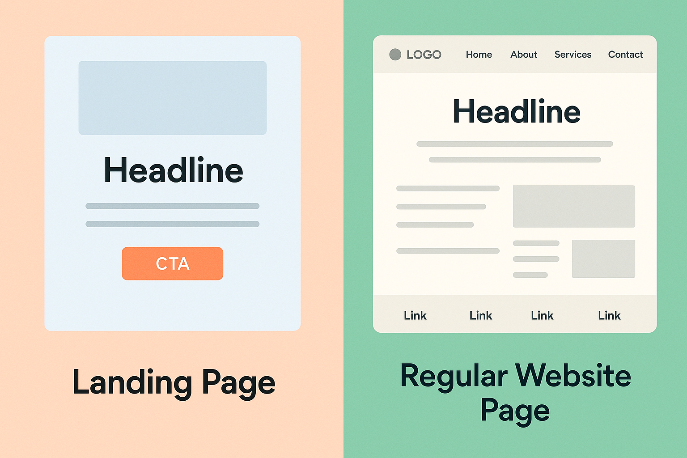
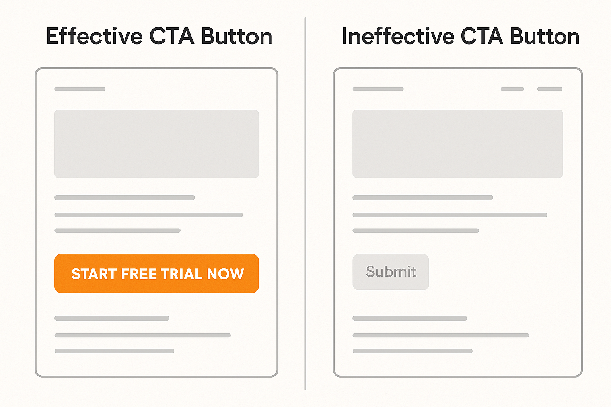
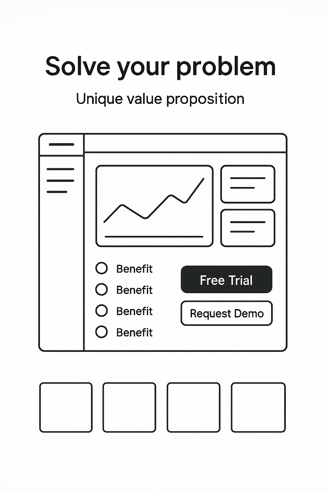
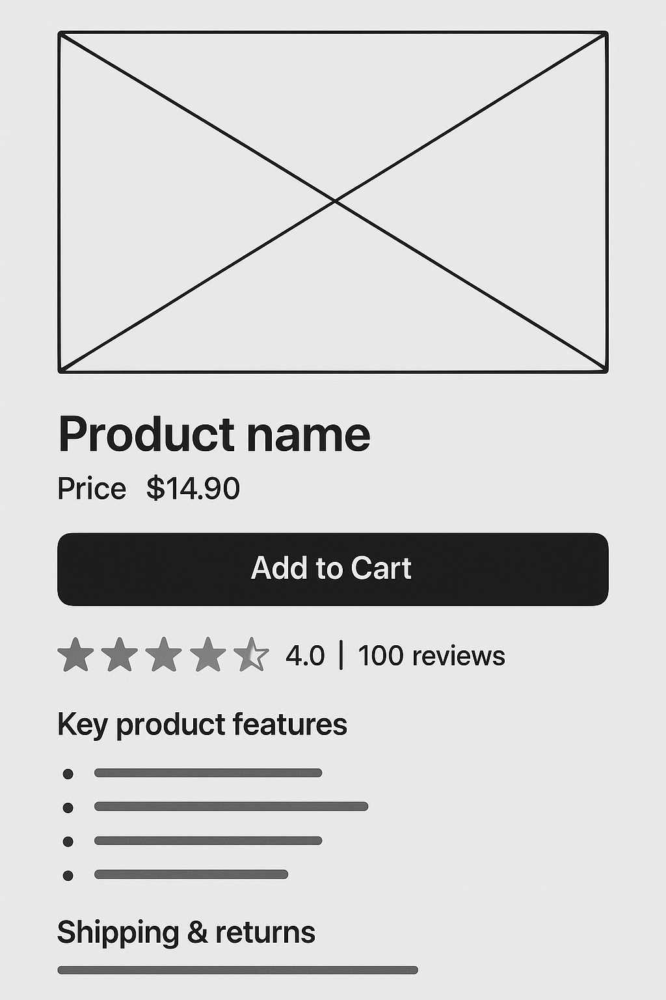

# The Ultimate Guide to Landing Page Optimization

## What's a Landing Page?

When you meticulously plan and launch an SEM ad, successfully attracting user clicks—**where do they go next?** They don't randomly jump to just any page, nor do they land on your website's "About Us" or blog posts. Instead, they're directed to a carefully considered, specially designed digital "gateway"—a **landing page**.

Put simply, **a landing page is a web page created specifically for a particular marketing or advertising campaign. Its sole purpose is to guide visitors to complete a specific action (i.e., a "conversion")**. This action could be signing up for a newsletter, downloading an e-book, requesting a free trial, purchasing a product, or filling out a contact form, among others.

A landing page is typically a **highly focused, purpose-driven, standalone page** that aims to eliminate distractions and guide users swiftly toward a predefined conversion goal. It's the "last mile" of your ad campaign's success, directly determining whether your marketing investment translates into tangible business results.

### Landing Pages vs. Regular Website Pages

Understanding landing pages hinges on distinguishing them from other pages on your website. Imagine this: your website's homepage is like the cover of a magazine, featuring a table of contents and previews of various articles, giving readers a comprehensive overview of your brand and all its offerings. A landing page, however, is more like a **specific advertisement page within that magazine**—it focuses on one thing: promoting a particular product or service and encouraging immediate action from the reader.

| **Feature Dimension** | **Landing Page** | **Regular Website Page (e.g., Homepage/Product Page)** |
| :---------------- | :------------------------------------------- | :------------------------------------------------- |
| **Primary Goal** | **Single and clear**: Conversion (registration, purchase, download, etc.) | **Diverse**: Provide information, brand building, user navigation, content exploration, etc. |
| **Navigation** | **Usually minimal or absent**: Reduces user distraction, focuses on conversion | **Rich and comprehensive**: Helps users explore various parts of the website |
| **Content** | **Highly focused**: Detailed explanation around a specific product, service, or offer | **Broad or multi-faceted**: Introduces the brand, showcases all products/services, publishes blog posts, etc. |
| **URL Source** | Typically drives traffic from paid ads (PPC), email marketing, social media ads, etc. | Primarily gains traffic through organic search, direct access, internal links, etc. |

### Why Some Ads Use the Official Website Directly, While Others Use Standalone Landing Pages?

This is a very common question and an important consideration in advertising strategy. The choice between using a standalone landing page or directly linking to an official website page primarily depends on your **marketing objectives, budget, and user experience expectations**:

1.  **Standalone Landing Page**

      * **Characteristics:** Typically lacks top navigation bars, footer links, or any elements that might distract users. The content is concise, with only one primary CTA.
      * **Advantages:**
          * **Maximize Conversion:** By eliminating distractions, it forces users to focus only on the core message and conversion button, thereby maximizing a single conversion goal.
          * **Highly Customizable:** Can be highly personalized in design and content creation for specific ad copy, keywords, and audience segments.
          * **Easier for A/B Testing:** Its independence allows for quick iteration and testing of different versions to validate the impact of various elements on conversions.
          * **Eliminates Psychological Discrepancy:** Precisely matches ad copy, preventing users from feeling "misled" after clicking through.
      * **Applicable Scenarios:** Specific marketing campaigns, new product launches, short-term promotions, needing to quickly test different ad creative effects, and situations with sufficient budget aiming for high conversions. For example, an ad for "free software trial" would typically lead to a standalone landing page with only a trial registration form.

2.  **Website Page as Landing Page**

      * **Characteristics:** Directly uses an existing page on your official website (such as a product detail page, service introduction page, or blog post) as the target page after an ad click.
      * **Advantages:**
          * **Leverage Brand Trust:** Official website pages usually have full brand identity and navigation, providing richer brand information and trustworthiness.
          * **Information Richness:** For products/services that require users to understand more details or make multi-dimensional comparisons, an official website page can offer more comprehensive content.
          * **Lower Cost:** No need for additional development of independent pages; directly utilizes existing resources.
      * **Disadvantages:**
          * **Distraction:** Navigation, other links, and excessive information on the page might distract users from the core CTA, diluting conversions.
          * **Limited Personalization:** More difficult to deeply customize for each ad campaign.
      * **Applicable Scenarios:** Brands with high recognition, complex product lines (where users might need to browse other related products), limited budget, or situations where you want users to browse more related information before converting. For example, an ad for "buy the latest smartphone" might directly lead to the product detail page on the official website.

**The choice ultimately depends on your specific marketing goals, budget, target audience's purchase stage, and your expectations for user experience.**

### Why Are Landing Pages So Important in Digital Marketing?

A landing page isn't just a page; it's your **digital marketing campaign's "conversion hub,"** acting as a bridge between user intent and business outcomes.

  * **It's Key to Achieving ROI**: You invest significant time and money in **[keyword research](https://chloevolution.com/zh-cn/posts/keyword-research-and-targeting/)**, writing **[high-quality ad copy](https://chloevolution.com/zh-cn/posts/create-sem-copy/)**, and optimizing **[paid search campaigns](https://chloevolution.com/zh-cn/posts/paid-search/)**. The ultimate goal of all these efforts is for users to convert on the landing page. An optimized landing page can convert the same traffic into more sales or leads, directly boosting your return on investment (ROI).

  * **Directly Impacts Ad Performance and Cost**: For instance, with Google Ads, the landing page experience is a **critical component of your Quality Score**. If your landing page is irrelevant to your ad copy, loads slowly, or offers a poor user experience, your Quality Score will decrease. This not only affects your ad's display position but also leads to an **[increase in Cost Per Click (CPC)](https://chloevolution.com/tools/cpc-calculator/)**. Conversely, an excellent landing page can help you achieve better ad rankings at a lower cost.

  * **Provides Valuable Insights and Data**: Landing page data (such as conversion rates, bounce rates, time on page, user behavior flow) is a valuable source for continuous ad campaign optimization and understanding user behavior. Through this data, you can constantly adjust and improve your marketing strategy.

Therefore, optimizing your landing page is not optional; it's one of the core elements that determine the success or failure of your digital marketing efforts.

## Eight Core Elements of a High-Converting Landing Page

A successful landing page isn't accidental; it's the result of careful design and optimization. It doesn't just pile up information; it cleverly guides users, step-by-step, towards conversion. Here are the eight core elements for building high-converting landing pages. Mastering them can help you get the maximum return on your marketing investment.

### 1\. Clear and Compelling Headline

**The headline is the first thing users see on your landing page and is crucial for deciding whether they continue reading.** A good headline must quickly grab user attention and clearly convey your core value proposition.

  * **High Ad-to-Landing Page Congruence:** Users click on your ad with an expectation based on a specific promise in the ad. If the landing page's headline doesn't immediately address that promise, users will feel confused, even misled, leading to a high bounce rate. For example, if the ad says "Get Free SEO Optimization Guide," the landing page headline should be "Get Your Free: 2025 Latest SEO Optimization Guide," not "Welcome to Our Marketing Company."
  * **Highlight a Single, Quantifiable Unique Value Proposition (UVP):** Clearly tell users what problem you can solve for them or what unique benefit you offer. Try to quantify these benefits, such as "Save 2 hours a day" or "Increase conversion rates by 30%."
  * **Use Strong Verbs and User-Oriented Language:** The wording should be active, engaging, and focused on what the user will gain. Avoid industry jargon or vague adjectives.

Your headline should act like a powerful magnet, firmly holding the user's attention and making them feel, "This is exactly what I'm looking for\!"

### 2\. Clear and Unique Call to Action (CTA)

**The CTA is one of the most important elements on a landing page; it clearly tells users what you want them to do next.** A landing page without a clear CTA is like a crossroads without a signpost—users will get lost.

  * **Clear, Specific, and Action-Oriented Text:** The text on the CTA button must be intuitive. For example, "Start Free Trial Now," "Get a Quote," "Download Whitepaper," or "Buy Now" are more effective than "Submit" or "Learn More."
  * **Visually Striking Button Design, Strong Color Contrast, Easy to Click:** The CTA button should visually contrast sharply with other page elements to attract user attention. The button should also be large enough to be easily clickable on all devices, especially mobile.
  * **Placement Strategy:** The CTA button should ideally be **above the fold** so users can see it without scrolling. You can also repeat the CTA further down the page, but the above-the-fold CTA is crucial.
  * **Reduce Friction in the Action Path:** If your CTA is "Register," then the subsequent form should be as simple as possible. **Asking for too much information increases the user's psychological burden, leading to lost conversions.**

Ideally, a landing page should have only one primary CTA to avoid overwhelming users with choices. If you need to offer multiple action options, ensure one is the most prominent and important.

### 3\. Compelling Copy

The headline and CTA grab user attention and point the way, while the **copy is central to persuading users to take action**. It needs to elaborate on value, address user pain points, and build trust.

  * **Focus on User Benefits, Not Product Features:** Users care more about what your product or service can do for them, rather than just its features. Instead of saying, "Our software has 100 integrations," say, "Our software seamlessly connects with your existing tools, eliminating data migration headaches."
  * **Use Clear, Concise Language; Avoid Jargon or Vague Descriptions:** Communicate in language users understand. If a concept is complex, try explaining it with simple examples or analogies.
  * **Use Subheadings, Bullet Points, and Bold Text to Improve Readability:** Users often "scan" landing pages rather than "read" them carefully. A clear structure helps them quickly find key information.
  * **Build Emotional Connection and Evoke Empathy:** Describe the pain points users might face, then show how your solution perfectly addresses their needs, perhaps even exceeding expectations.

Good copy is like an excellent salesperson: it understands the customer's needs and can present the product's value in the most effective way.

### 4\. High-Quality Visuals

The adage "a picture is worth a thousand words" rings true on a landing page. **High-quality images and videos can quickly convey information, enhance appeal, and strengthen brand image.**

  * **Images and videos should be highly relevant to the product/service and professionally produced:** Blurry, low-resolution, or irrelevant images will harm your professional image and reduce user trust.
  * **Showcase product usage scenarios or problem-solving effects through images/demos:** Let users visually see how the product works or what specific changes the service can bring. For example, a time management tool can display its minimalist interface and an animation of automatic calendar syncing.
  * **Optimize image loading speed and format to avoid impacting page performance:** Even the most exquisite images will cause users to lose patience if they load slowly. Using modern image formats (like WebP) and compressing image sizes are key to improving speed.

Visual elements are not just decoration; they are crucial carriers of information and emotional communication.

### 5\. Social Proof for Building Trust

In today's information-saturated age, user trust in advertising is generally low. **Social proof is an effective way to alleviate user doubts and boost their confidence in making a decision.** It leverages the psychological tendency of people to follow the actions of the majority.

  * **Customer Testimonials, Reviews, Case Studies:** These are the most direct and effective forms of social proof. Displaying real customer names, photos, company names, or even video testimonials can significantly increase credibility.
  * **Authority Certifications, Partner Logos:** If your product or service has received industry certifications or partnered with well-known brands, displaying these logos can enhance professionalism and trust.
  * **Highlight Quantifiable Data such as User Count, Download Volume, Media Mentions:** Data like "Trusted by 100k+ users," "App downloads exceed a million," or "Featured in Forbes" can effectively boost brand influence.

Don't be afraid to show positive reviews alongside any negative ones; this can actually increase authenticity.

### 6\. Streamlined Forms

If your landing page's goal is to collect lead information, then **the form is the gateway to conversion.** The more complex the form, the lower the completion rate.

  * **Only ask for necessary information; fewer fields lead to higher completion rates:** Every additional question asked increases the user's abandonment rate. Collect only the information absolutely essential for your current business process. For example, if you're just offering a free trial, you might only need an email address and password.
  * **Clearly state the form's purpose and privacy policy:** Tell users why you need this information and how you will protect their privacy.
  * **For complex information gathering, consider using a multi-step form:** Breaking a long form into several smaller steps can reduce initial psychological pressure on users and increase completion rates. For example, the first step might only ask for name and email, and the second step for company and position.

Each field you remove from a form can lead to a significant increase in conversion rates.

### 7\. Mobile-Friendly Design

As mobile devices become the primary means of internet access, **your landing page's performance on mobile phones directly impacts the experience and conversion of most users.**

  * **Adopt responsive design that automatically adapts to different screen sizes:** Ensure your landing page automatically adjusts layout and element sizes, whether on a phone, tablet, or desktop computer, to provide the optimal viewing experience.
  * **Ensure touch-friendly buttons and forms, easy to operate on small screens:** Buttons and input fields should be large enough and spaced appropriately to prevent accidental taps.
  * **Optimize content layout to avoid excessively long scrolling or zooming on mobile phones:** Keep content concise, paragraphs should not be too long, and images and videos should adapt to mobile screens.

Always view your landing page from a mobile user's perspective, as they are likely the source of most of your traffic.

### 8\. Page Load Speed

**No one likes to wait. Slow page load speed is a primary cause of high user bounce rates.** It not only affects user experience but also negatively impacts your ad performance.

  * **Compress images, videos, and code files to reduce file size:** This is the most direct and effective way to speed things up. Use appropriate image formats (like WebP) and efficient compression tools.
  * **Utilize browser caching and lazy loading:** Browser caching can store content that users have previously visited, so it doesn't need to be re-downloaded on subsequent visits. Lazy loading allows non-above-the-fold content to load only when the user scrolls into view, improving initial load speed.
  * **Reduce unnecessary JavaScript and CSS:** Streamline code, remove unused styles and scripts.
  * **Use a CDN (Content Delivery Network) to accelerate content delivery:** A CDN distributes your content to servers around the globe, allowing users to retrieve content from the server closest to them, thereby speeding up load times.

Regularly use tools like Google PageSpeed Insights or GTmetrix to check your landing page load speed and optimize according to their recommendations. **Remember, every second slower can drop your conversion rate by several percentage points, while also affecting your Ad Quality Score and increasing your Cost Per Click (CPC).**

-----

## Landing Page Optimization Strategies for Different Industries

While the eight core elements of a high-converting landing page are universal guidelines, different industries require varying optimization strategies due to their unique product characteristics, user needs, and conversion paths. Understanding these industry-specific nuances can help you craft highly effective landing pages more precisely.

### SaaS Software Landing Pages

SaaS (Software as a Service) landing pages typically target B2B or efficiency-driven B2C users. The core aim is to demonstrate how the software solves pain points and encourage users to sign up for a free trial or request a demo.

  * **Core Characteristics:** Emphasize functional benefits, value proposition, user experience, scalability, and security.
  * **Optimization Strategies:**
      * **Pain Point-Solution Model:** The top of the landing page should immediately address the target user's pain points and quickly present your SaaS product as the solution.
      * **Product Screenshots/Demo Videos:** Showcase the software's clean interface, core features, or usage workflow, which is more intuitive than purely text-based descriptions.
      * **Highlight Unique Selling Points (USPs):** Clearly state your SaaS's unique advantages over competitors, such as "AI-powered," "seamless integration," or "enterprise-grade security."
      * **Clear Value Proposition:** Quantify the benefits the software brings to users, such as "boost team collaboration efficiency by 30%" or "save 10 hours of management time per month."
      * **CTA Priority:** Usually centered around "Free Trial," "Request a Demo," or "Sign Up Now," with prominent buttons.
      * **Customer Success Stories and Testimonials:** Extensively display logos of well-known companies or users, along with detailed case studies, to build trust.
      * **Pricing Information:** For most SaaS products, the pricing page is one of the key conversion points. The landing page can offer a pricing overview or a clear link to the pricing page.

For a deeper dive into SaaS landing page design, read **[ "Analyzing the Core Structure of SaaS Landing Pages"](https://chloevolution.com/zh-cn/posts/saas-landing-page/)**.

### E-commerce/Retail Landing Pages

The ultimate goal of e-commerce landing pages is to drive sales. They need to quickly present product information, remove purchase barriers, and stimulate user buying desire.

  * **Core Characteristics:** Emphasize product visuals, price, offers, stock, user reviews, and a convenient purchase process.
  * **Optimization Strategies:**
      * **High-Quality Product Images/Videos:** Provide multi-angle, high-definition product images and demo videos, allowing users to feel as if they are physically touching the product.
      * **Prominent Pricing and Offer Information:** Original price, discounted price, limited-time offers, and free shipping policies should be clearly displayed to create urgency.
      * **Clear Add to Cart / Buy Now CTA:** Buttons should be vibrantly colored, appropriately sized, and easy to find both above the fold and after each scroll.
      * **Product Reviews and Ratings:** Authentic user reviews are a powerful driver for e-commerce conversions. Prioritize displaying high-rated reviews.
      * **Stock Status and Urgency:** Phrases like "Limited Stock Remaining" or "Limited-Time Promotion" effectively stimulate immediate purchases.
      * **Clear Shipping and Return Policies:** Alleviate user shopping concerns.
      * **Payment Security Guarantees:** Display payment method logos and security certification badges to increase trust.
      * **Related Product Recommendations:** Increase average order value or offer more choices (but be careful not to overly distract).

For more e-commerce landing page conversion secrets, read **[ "High-Converting E-commerce Landing Page Secrets"](https://chloevolution.com/zh-cn/posts/ecommerce-landing-page/)**.

### Local Service Landing Pages

Landing pages for local services (such as restaurants, repair shops, gyms, law firms) need to particularly emphasize geographical location, convenience, and trustworthiness, encouraging users to call for inquiries or visit in person.

  * **Core Characteristics:** Emphasize geographical location, service area, contact information, booking convenience, and local customer reviews.
  * **Optimization Strategies:**
      * **Prominent Service Area and Address:** Clearly state your service coverage and specific store address.
      * **Phone Number and Online Booking CTA:** The phone number should be directly clickable on mobile devices, and the booking button should be prominent.
      * **Embedded Map:** Google Maps or other mapping tools make it easy for users to find your location and plan routes.
      * **Local Customer Reviews and Case Studies:** Display genuine reviews from local customers to build trust within the local community.
      * **Business Hours and Holiday Schedule:** Inform users when services are available.
      * **Service Features and Professional Qualifications:** Highlight your unique advantages and professional certifications in the local market.
      * **Offer Emergency Service Options:** If your service has emergency response needs (e.g., plumbing repair), this should be clearly communicated.

Learn how to build high-converting local landing pages by checking out **[ "The Secret Weapon of Local Marketing: How to Create High-Converting Location-Specific Landing Pages"](https://chloevolution.com/zh-cn/posts/creating-location-specific-landing-pages/)**.

### Education/Training Landing Pages

Education and training institution landing pages aim to attract students to enroll in courses, download course materials, or book consultations.

  * **Core Characteristics:** Emphasize course value, faculty expertise, learning outcomes, course outline, success stories, and flexibility.
  * **Optimization Strategies:**
      * **Clear Course Value Proposition:** What skills will be gained after studying? What goals will be achieved? (e.g., "Earn XXX Certificate," "Master AI Programming Skills").
      * **Faculty Introduction:** Highlight teachers' professional backgrounds, teaching experience, and achievements.
      * **Learning Outcomes Display:** Student work, employment data, sample certificates, etc.
      * **Course Outline and Modules:** Detailed course content to help prospective students understand the learning path.
      * **Student Testimonials and Success Stories:** Real examples are the most persuasive.
      * **Free Trial/Experience Class CTA:** Lower the decision barrier, encouraging users to take the first step.
      * **Course Discounts and Scholarship Information:** Attract price-sensitive users.
      * **Course Start Dates, Locations, or Online Learning Formats:** Ensure key information is clear.

Regardless of your industry, the core is to **deeply understand your target users, their pain points, needs, and expectations, and build and optimize your landing page around these points.** Continuous testing and data analysis will be your best guide for optimizing landing pages and achieving high conversions.

-----

## Landing Page Testing and Optimization Tools

Creating a great landing page is only half the battle; true high conversion rates come from **continuous testing, data analysis, and optimization**. Like a scientific experiment, you need to constantly hypothesize, experiment, and measure to find the most effective methods. Fortunately, many powerful tools are available to help you with this.

### A/B Testing Tools: Discovering the Best Version

**A/B testing** (also known as **split testing**) involves showing two or more versions of a landing page (or a specific element on the page) simultaneously, randomly distributing traffic to them, and then comparing which version performs better. This is the most direct and scientific method for optimizing landing pages.

  * **Google Optimize (deprecated, but the concept lives on):** In the past, Google Optimize was the preferred free tool for many marketers. Although it ceased operations on September 30, 2023, its core philosophy—**optimization driven by experimentation**—has been integrated into **Google Analytics 4 (GA4)** and **Google Ads' experiment features**.
      * **GA4 Experiments:** You can set up experiment goals in GA4 and then combine it with other tools for A/B testing, tracking experiment results within GA4.
      * **Google Ads Experiments:** The Google Ads platform allows you to directly run experiments on campaigns, ad groups, or even landing page URLs to compare the effectiveness of different strategies.
  * **Optimizely:** This is a powerful, enterprise-grade A/B testing and personalization platform. It offers highly flexible experiment setup, advanced audience targeting, and in-depth data analysis features, suitable for professional teams with high testing demands.
  * **VWO (Visual Website Optimizer):** VWO is another popular A/B testing and CRO (Conversion Rate Optimization) platform. It provides a user-friendly visual editor that allows you to create and run tests without coding, and also includes features like heatmaps and session recordings.

**The Golden Rule of A/B Testing:** Test only one major variable at a time (e.g., headline, CTA button color, image) so you can clearly attribute changes in performance to that specific alteration.

### User Behavior Analysis Tools: Deeply Understanding Visitors

Just looking at conversion numbers isn't enough; you need to understand users' **specific behaviors** on your landing page to pinpoint optimization issues.

  * **Heatmaps:**
      * **Function:** Visually display areas where users click, move their mouse, and scroll on the page using color intensity. Deeper colors indicate more frequent interaction.
      * **Value:** Helps you identify user focus points, ignored areas, and elements that might cause confusion. For example, if a brightly colored CTA button isn't getting clicks, a heatmap can help you determine if it's a copy issue or a placement issue.
  * **Session Recording:**
      * **Function:** Records anonymous users' actual browsing sessions. You can replay how they interact with your landing page, including mouse movements, clicks, scrolling, and form filling processes.
      * **Value:** Provides the most intuitive insights into user experience. You'll discover where users might get stuck, where they feel confused, or even where technical issues arise.
  * **Form Analytics:**
      * **Function:** Specifically analyzes user interactions with landing page forms, such as the time spent on each field, abandonment rates, and commonly problematic fields.
      * **Value:** Helps you optimize form design, reduce user friction in the conversion path, and increase form submission rates.
  * **Recommended Tools:** **Hotjar** and **Crazy Egg** are among the most popular comprehensive user behavior analysis tools on the market, typically integrating heatmaps, session recording, and form analytics features.

### Page Speed Testing Tools: The Foundation of User Experience

We've emphasized repeatedly that **page load speed is a critical factor affecting user experience and conversion rates**. Delays of even a few seconds can lead to significant user abandonment.

  * **Google PageSpeed Insights:**
      * **Function:** A free official Google tool used to analyze web page performance on mobile and desktop devices, providing detailed optimization suggestions. It reports core web vitals like LCP (Largest Contentful Paint), FID (First Input Delay), and CLS (Cumulative Layout Shift).
      * **Value:** Directly obtain Google's optimization recommendations, which are especially important for improving search engine rankings and Ad Quality Score.
  * **GTmetrix:**
      * **Function:** Provides more detailed page load performance reports, including a Waterfall Chart, allowing you to see the loading time of each page element to precisely pinpoint performance bottlenecks.
      * **Value:** Helps developers and marketers delve into technical optimization of page load speed.

**Optimization Advice:** Continuously compress images and videos, streamline code, and leverage browser caching and CDNs (Content Delivery Networks). **Remember, faster load speeds mean a better user experience, higher conversion rates, and, as mentioned in [ "Continuous Optimization and Management of Paid Search Advertising"](https://chloevolution.com/zh-cn/posts/paid-search/), a higher Ad Quality Score and lower Cost Per Click (CPC).**

### Data Analytics Tools: Gaining a Macro Perspective on Performance

While the tools above provide micro-level insights into user behavior and page performance, you still need a powerful data analytics platform to understand the overall performance of your landing pages at a macro level and link it to your marketing objectives.

  * **Google Analytics 4 (GA4):**
      * **Function:** GA4 is Google's next-generation analytics platform, with an event-centric measurement model replacing the traditional session-based model. It can track all user interactions on your landing page, including page views, clicks, scroll depth, form submissions, etc., and link them to the user's entire lifecycle behavior.
      * **Value:** Provides comprehensive traffic source analysis, user behavior path analysis, conversion funnel analysis, and audience insights. You can set up detailed conversion events to precisely measure landing page success.
  * **Adobe Analytics:** Suitable for large enterprises, offering highly customizable reports, advanced segmentation, and machine learning capabilities to address complex data analysis needs.

By effectively utilizing these tools, you can transition from "guessing" to "data-driven" and continuously improve your landing pages, turning them into highly efficient conversion machines.

-----

## How AI Empowers Landing Page Optimization

Artificial intelligence (AI) is transforming every aspect of digital marketing at an unprecedented pace, and landing page optimization is no exception. From copy creation to design layout and user experience personalization, AI is helping marketers more intelligently and efficiently boost landing page conversion rates. It's no longer a futuristic concept; it's a powerful tool you can leverage today.

### 1\. AI-Driven Copy Generation and Optimization

Manually writing multiple copy versions for each landing page or A/B test is time-consuming and labor-intensive. AI tools can significantly improve the efficiency and precision of this process:

  * **Rapid Generation of Copy Variants:** AI can, based on your provided keywords, target audience, and core selling points, **automatically generate multiple headlines, subheadings, and body copy variations with different styles and emphases**. This makes A/B testing a breeze, allowing you to easily test hundreds of combinations to find the best-performing versions.
  * **Personalized Copy:** By combining user data (such as source channel, geographic location, historical behavior), AI can **dynamically adjust the landing page's copy content** to better align with specific visitors' interests and search intent. For example, users coming from a "free trial" ad might see copy emphasizing "free" and "quick start," while users clicking through an "enterprise solutions" ad would see more content about "ROI" and "scallable" solutions.
  * **Semantic Analysis and Optimization:** AI can analyze the **semantic relevance** of the copy, ensuring it highly matches your ad copy and target keywords. This is crucial for improving the **Ad Quality Score** mentioned in **[ "Key Techniques for Writing High-Converting SEM Copy"](https://chloevolution.com/zh-cn/posts/create-sem-copy/)**.

### 2\. Intelligent Layout and Design Suggestions

AI can not only process text but also provide optimization suggestions at a visual and structural level:

  * **Data-Driven Layout Recommendations:** AI can analyze vast amounts of user behavior data (including heatmaps, eye-tracking data) to identify which page elements and information arrangements most effectively guide user gaze and clicks. It can recommend optimal CTA button positions, colors, sizes, and the number and placement of form fields.
  * **Automated A/B Testing:** Some AI-driven optimization platforms can **automatically run and iterate multivariate tests**. They can not only help you test different versions but also automatically adjust traffic distribution based on real-time data, directing more traffic to better-performing versions, and even continuously generating new optimization combinations during the test. This significantly reduces manual intervention and trial-and-error costs.
  * **Element Generation and Adjustment:** Certain advanced AI tools can even directly generate images, video clips consistent with your brand's tone, or suggest adjustments to the size and style of existing visual elements to suit different devices and audiences.

### 3\. Personalized Content and Recommendations

AI's power lies in its personalization capabilities, allowing every user who visits a landing page to receive a "tailored" experience:

  * **Dynamic Content Replacement:** Based on the user's source channel, historical browsing behavior, or even real-time geographic location, AI can **dynamically adjust product recommendations, case studies, or user reviews on the landing page**. For example, if a user clicks from a blog post about "e-commerce operations," the landing page can automatically prioritize showcasing success stories from the e-commerce industry.
  * **Personalized Experience for Everyone:** This level of personalization goes far beyond simple A/B testing. It can provide highly customized content for each segmented user group, greatly enhancing user experience and conversion relevance, making users feel the page content is tailor-made for them.

### 4\. Predictive Analytics and Optimization Suggestions

AI doesn't just analyze the past; it excels at predicting the future:

  * **Predict Conversion Potential:** AI models can analyze existing data to **predict which page elements, copy combinations, or user paths are more likely to lead to conversions**. This allows marketers to focus their efforts on the most promising optimization points.
  * **Automated Identification of "Semantic Drift Points":** AI can analyze user behavior on the landing page and, combined with their search intent, automatically identify areas where users might feel confused, where information might be mismatched, or where "semantic drift" occurs, providing specific optimization suggestions. For example, if many users leave after a particular paragraph, AI might suggest revising the wording of that paragraph or adding supplementary information.
  * **Intelligent Reporting and Insights:** AI can extract easy-to-understand optimization insights from vast amounts of data, helping marketers quickly identify problems and formulate improvement plans, reducing manual analysis time and complexity.

### 5\. Impact of Google Search Generative Experience (SGE) on Landing Pages

With the increasing prevalence of Google Search Generative Experience (SGE), which provides **AI-powered generative search experiences**, users can get richer, more direct answers and summaries on the search results page even before clicking on ads or search results. This presents new challenges and opportunities for landing page optimization:

  * **Increased Pressure for "Content Delivery":** If users have already obtained some answers in the search results, the landing page's primary task will no longer just be to provide information, but to **deliver on the promise more quickly, deeply, and persuasively**. The landing page must excel in its headline, value proposition, and the smoothness of its conversion flow to further drive users to convert. Simply repeating information already available in SGE will no longer be effective.
  * **Highlighting Unique Value:** Landing pages need to emphasize your **unique selling points and competitive advantages** even more, as users may already have a basic understanding of the information. You must provide added value beyond AI summaries, such as exclusive offers, in-depth case studies, personalized services, more attractive visual content, or emotional connections.
  * **Stronger Interactivity and Trust Building:** Future landing pages may require stronger interactive elements (e.g., calculators, configuration tools), more direct trust endorsements (e.g., user reviews, authoritative certifications), and more personalized user experiences, to further impress users and drive conversions, even when their information needs have been partially met.
  * **Data-Driven Continuous Optimization:** In an AI-driven search environment, landing page optimization will rely even more on **real-time data feedback and AI tool assistance** to quickly adapt to changes in user behavior. Understanding changes in user search behavior within the SGE environment is key to optimizing landing pages.

-----

## Frequently Asked Questions (FAQ)

### Q1: What's a typical landing page conversion rate? How do I measure landing page success?

**Landing page conversion rates vary significantly depending on the industry, product, target audience, and marketing campaign, so there's no single "standard" average.**

  * **General Range:** Generally, good conversion rates for most industries are considered to be between **2% and 5%**. However, some exceptionally performing landing pages can reach 10%, 20%, or even higher, while poorly designed ones might be well below 1%.
  * **Influencing Factors:**
      * **Industry and Product:** High-value, high-commitment products (like enterprise software demos) might have lower conversion rates, while free downloads or trial registrations could have higher rates.
      * **Traffic Quality:** Traffic from highly targeted paid search keywords typically converts better than generic social media traffic.
      * **Page Design and Copy:** A clear value proposition, strong CTA, and good user experience are all critical.
      * **Market Competition:** A highly competitive market might require an even better landing page to stand out.

**Measuring landing page success isn't just about conversion rate; you also need to consider the following metrics:**

  * **Conversion Rate:** The percentage of visitors who complete the desired goal. This is the most important metric.
  * **Cost Per Acquisition (CPA):** The average advertising cost to acquire one conversion.
  * **Bounce Rate:** The percentage of users who leave the landing page without interacting further. A high bounce rate often indicates that the page content doesn't match user expectations or that the user experience is poor.
  * **Time on Page:** The average amount of time users spend on the landing page. Longer time on page might indicate user interest (but also needs to be judged in conjunction with other metrics).
  * **User Flow:** User behavior data on the landing page, such as scroll depth and click areas, which can be analyzed with heatmaps and session recording tools.
  * **Return On Ad Spend (ROAS):** The ratio of advertising spend to the sales revenue generated, a key metric for measuring marketing campaign profitability.

### Q2: Can a landing page have multiple CTAs?

**As a rule, a high-converting landing page should strive for only one primary CTA to avoid user choice paralysis (Paradox of Choice).**

  * **Why "One" is Ideal:** The core goal of a landing page is a single conversion. Too many CTAs can distract users, leaving them unsure what to do, which actually lowers the overall conversion rate. You want users to take "the action you most want them to take."
  * **Exceptions (Secondary CTAs):** In some cases, you might consider including a **secondary CTA**, but it must:
      * **Be at a different stage of the user journey than the primary CTA:** For example, the primary CTA is "Start Free Trial," while the secondary CTA might be "Watch Demo Video" or "Download Whitepaper." Secondary CTAs usually aim to provide more information to users who aren't ready to convert yet, helping them learn more.
      * **Be visually less prominent than the primary CTA:** Its color, size, and placement should be less conspicuous, ensuring it doesn't steal attention from the primary CTA.
      * **Typically be placed lower on the page:** After reading more content, if users still have doubts, the secondary CTA can offer a soft conversion opportunity.

### Q3: Should my landing page be on my main website domain or a separate domain?

This depends on your **brand strategy, SEO considerations, and ease of management**. Both have pros and cons:

1.  **Under Your Main Website Domain (Subdomain or Subdirectory):**

      * **Examples:** `landing.yourcompany.com` (subdomain) or `www.yourcompany.com/landing-page` (subdirectory)
      * **Pros:**
          * **SEO Benefits:** Can inherit some of the main domain's authority and trust, which can benefit the landing page's organic search performance (if SEO is desired).
          * **Brand Consistency:** Maintains the same brand image, navigation (if retained), and URL structure as the main site.
          * **Easier Management:** Usually uses the same CMS and analytics tools as the main site.
      * **Cons:**
          * **Potential Distraction:** If main site navigation is kept, it might distract users.
          * **Deployment Limitations:** May be subject to the main site's technical architecture limitations.
      * **Recommended Scenarios:** High brand recognition, need to integrate the landing page as part of website content, or aim to boost main site SEO value through the landing page.

2.  **Separate Domain:**

      * **Examples:** `yourproductoffer.com` or `getyourfreesoftware.com`
      * **Pros:**
          * **Complete Independence:** Brand and content can be entirely independent of the main site, ideal for short-term marketing campaigns or testing new brands.
          * **No Distraction:** Allows for the complete removal of all unnecessary navigation elements, achieving extreme conversion focus.
          * **Technical Flexibility:** Can use any website builder or technology, free from main site restrictions.
      * **Cons:**
          * **SEO Disadvantages:** Needs to build domain authority and trust from scratch.
          * **Brand Fragmentation:** If users are unfamiliar with your brand, it might cause confusion or lack of trust.
          * **Management Costs:** Requires additional domain and hosting management.
      * **Recommended Scenarios:** Specific marketing campaigns, new product line promotions, situations requiring extreme conversion focus and not relying on SEO.

### Q4: Does a landing page need SEO optimization?

**Not necessarily; it depends on your landing page's traffic sources and marketing goals.**

  * **If the primary traffic to your landing page comes from paid advertising (PPC), email marketing, social media ads, etc.:**

      * **Traditional SEO optimization is usually not required.** The reason is that this traffic is "bought" or "pushed," and users arrive directly at the page by clicking an ad, rather than discovering it through search engines. The landing page should focus more on **Conversion Rate Optimization (CRO)** rather than keyword rankings.
      * However, **page load speed**, **mobile-friendliness**, and **content relevance** are still very important because these factors affect Google Ads Quality Score, which in turn impacts ad costs and effectiveness. These factors overlap somewhat with technical SEO optimization.

  * **If the landing page also aims to acquire traffic through organic search:**

      * **Then SEO optimization is necessary.** This might be for long-term product description pages, content marketing landing pages, or specific pages designed to attract organic traffic.
      * In this case, you'll need to consider traditional SEO strategies such as **keyword research, on-page content optimization, meta tags, internal linking, and external link building**.

### Q5: How can I avoid discrepancies between landing page and ad copy?

**The "Ad-to-Landing Page Congruence" is crucial for high conversion rates and is an important metric Google uses to evaluate ad quality.** Inconsistencies lead to poor user experience, high bounce rates, and a decrease in Ad Quality Score.

  * **Ensure Information Match:**

      * **Keyword Match:** Keywords used in the ad should be repeated in the landing page headline and content.
      * **Value Proposition Match:** The unique selling points or offers promised in the ad must be clearly presented and delivered on the landing page. For example, if the ad says "Limited Time 50% Off," the landing page must prominently display the 50% off information.
      * **Tone and Style Match:** The tone of the ad (formal, lively, professional) should be consistent with the landing page copy.

  * **Use Dynamic Text Replacement (DTR):**

      * For PPC ads, you can leverage DTR features in ad platforms to dynamically insert the user's search query into the landing page's headline or content. This maximizes relevance and makes the user feel the page is custom-tailored for them.

  * **Create Specific Landing Pages for Each Ad Group:**

      * If you have multiple ad groups, each potentially targeting different keywords or user intents, then it's best to create separate landing page versions for each ad group or for highly relevant ad groups. While this increases workload, the boost in conversion rates usually compensates for it.

  * **Continuous Monitoring and A/B Testing:**

      * Monitor ad campaign data and landing page performance using tools like Google Analytics. If an ad group's landing page shows a high bounce rate or low conversion rate, it's likely a signal of copy inconsistency.
      * Regularly check the match between ads and landing pages using the analysis methods from **[ "The Complete Guide to SEM Data Analysis"](https://chloevolution.com/zh-cn/posts/sem-analytics/)**.

-----

Please note that while I've translated all the text content, I cannot directly translate text that appears within images. If there are specific phrases or elements within the images you'd like translated, please provide them, and I'd be happy to assist\!
