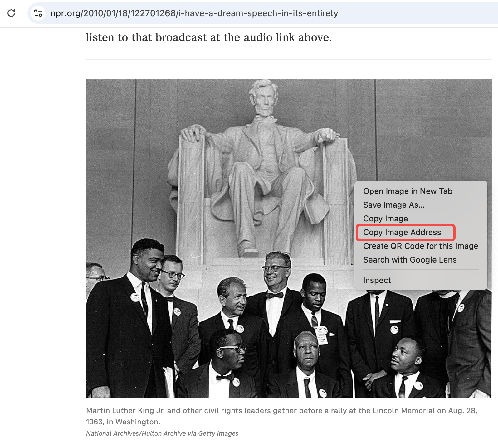
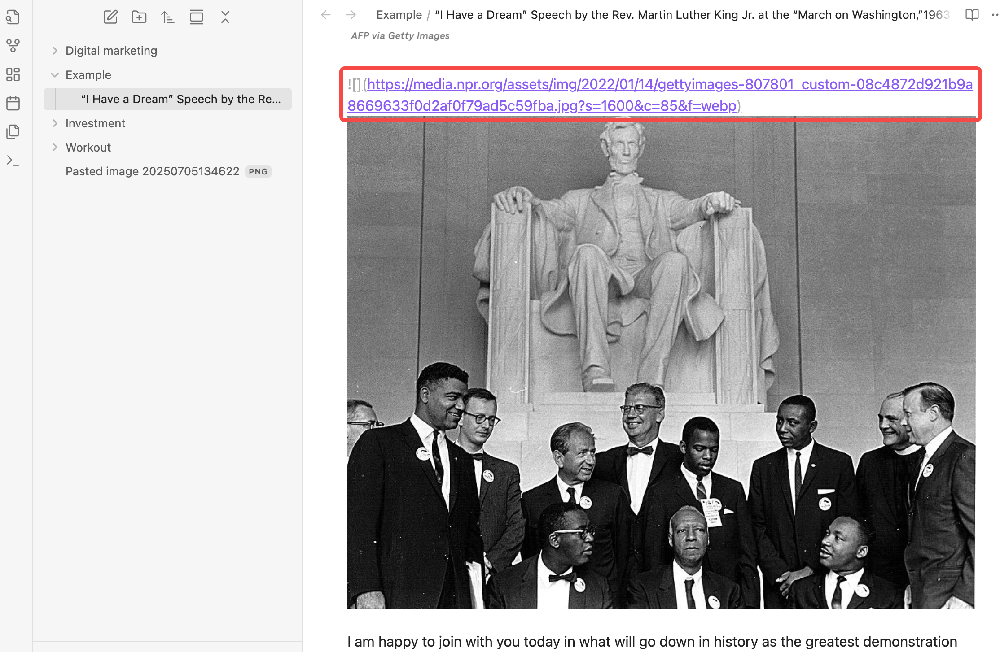
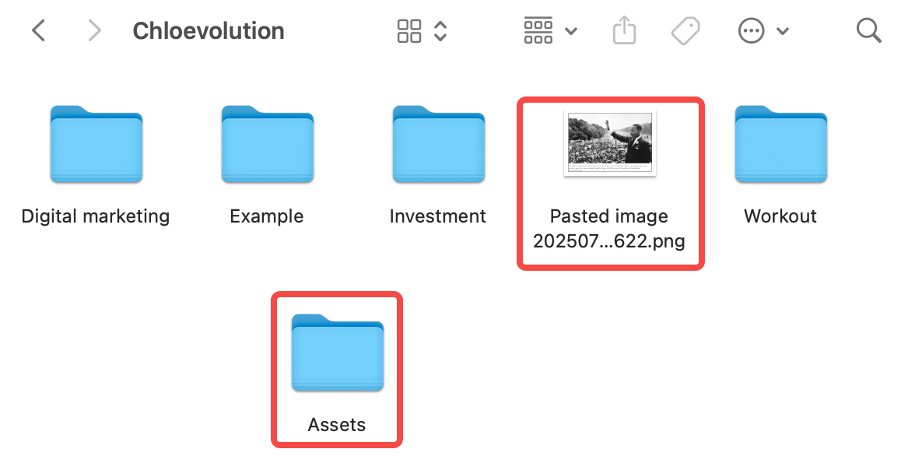
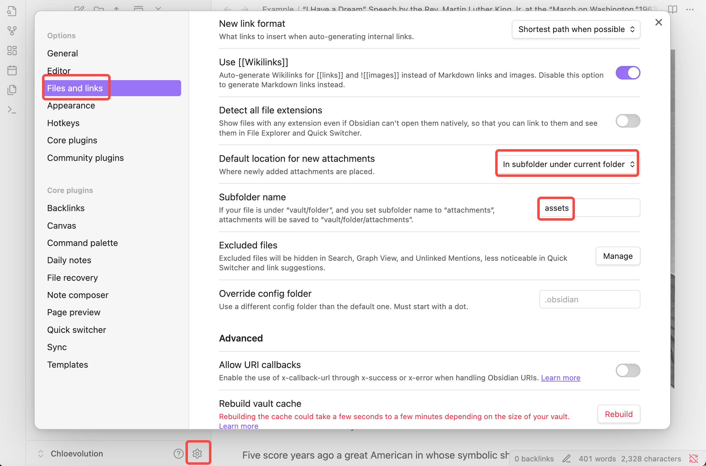
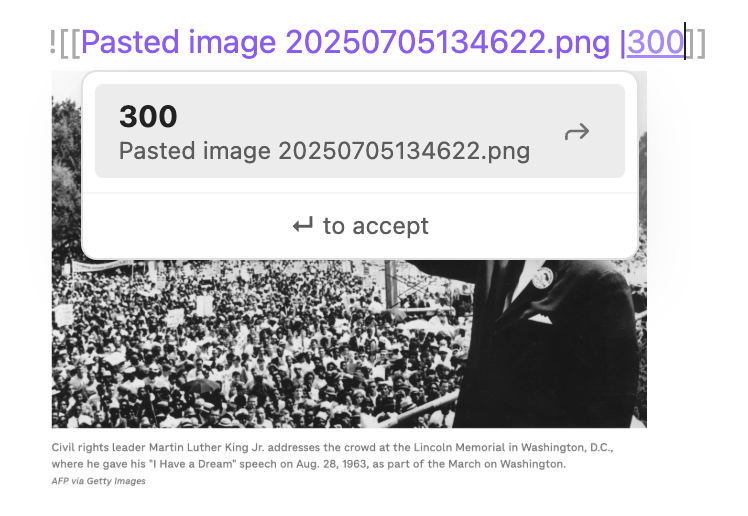

# A Practical Guide to Efficiently Managing Images in Obsidian


When taking notes in Obsidian, using images is almost inevitable. Copying and pasting images directly is indeed convenient, but over time you'll find that the images are chaotically placed, resizing them is troublesome, and centering an image is even more difficult. Another pitfall is that when you delete an image from a note, the file doesn’t actually disappear but remains hidden in the root directory.

## What Exactly Are Images in Obsidian?

When it comes to images, many people’s first thought is that "inserting an image means adding an image directly." However, in Obsidian, images are more like references to "external files." In other words, the images aren’t directly embedded in the note content but are stored in folders on your computer and then displayed in the notes through links or references.

This explains why deleting an image from a note doesn’t remove the image file from the folder—**the note only references it, while the image file itself remains independent**. Understanding this is key to better managing your image resources, such as consolidating them into a dedicated folder to avoid clutter and facilitate future backups and organization.

## How to Insert Images in Obsidian

Inserting images in Obsidian isn’t complicated. Below are several common methods along with their pros and cons:

### 1. Copying and Pasting Images

This is the quickest and easiest method. You can copy an image directly from your computer (such as a screenshot or an image from a webpage) and paste it into Obsidian’s editor. Obsidian will automatically save the image to the default attachments folder (usually `.obsidian/assets` or another folder you’ve specified) and generate a reference code for the image in the note.

> **Pros**: Simple operation, no need to worry about file paths.

> **Cons**: If you’re not careful, images may end up scattered in multiple locations, and the attachments folder can become messy over time, making management difficult.

As shown in the image below, I copied and pasted an image into the editor. Obsidian automatically saved the image in the root directory, separate from other existing folders. The image is named based on the date and is displayed in PNG format. At the same time, the note’s body automatically generated a reference code for the image:


### 2. Manually Inserting Images Using Markdown Syntax

If you already have image files saved somewhere on your computer, it’s better to use Markdown syntax to insert them. The format is:

```markdown
![[image-filename.png]]
```

Here, `[[ ]]` is Obsidian’s unique linking syntax, representing a reference to a file in the vault. If your image is in a subfolder of the vault, such as an `assets` folder, the path would be written as:

```markdown
![[assets/image-filename.png]]
```

Alternatively, you can use standard Markdown syntax:

```markdown

```

> **Pros**: You have full control over where the images are stored, avoiding a cluttered attachments folder.

> **Cons**: You need to ensure the image path is correct before inserting, or the image won’t display.

### 3. Dragging and Dropping Images into the Editor

You can drag an image file from your computer directly into Obsidian’s editing window. The system will automatically copy the image to the default attachments folder and generate the corresponding reference code. This is essentially similar to the first method of "copying and pasting images directly."

> **Pros**: Intuitive and convenient, more stable than copying and pasting.

> **Cons**: Still requires attention to attachments folder management.

### 4. Inserting Web Image Links

Obsidian also supports inserting web images using standard Markdown syntax:

```markdown

```

This method doesn’t save the image locally but loads it directly from the web.

> **Pros**: Doesn’t take up local storage, suitable for temporary references.

> **Cons**: Requires an internet connection; images may not display if the network is unstable.

As shown below, I right-clicked on a webpage to copy the image link and then used Markdown syntax to write it into the note body:


Since this method doesn’t involve local image storage, no corresponding image appears in the directory panel on the left:



## How to Specify a Folder for Image Storage?

### 1. Create a Dedicated Image Folder

Open your Obsidian vault folder.

Create a new folder in the root directory, such as `assets` (you can also name it `images`, `media`, or any other preferred name).

Place all the images you want to insert into this folder.

As shown below, I created an `Assets` folder in the root directory to store images. You can also see that previously pasted images were saved directly in the root directory by default:


### 2. Change the Default Storage Location for Images

By default, Obsidian saves copied-pasted or dragged-and-dropped images to the default attachments folder. If you haven’t changed the settings, this is usually the root directory or a folder under `.obsidian`.

If you want all images to be stored in your newly created `assets` folder, **it’s recommended to modify the default attachments folder path**. This way, copied-pasted or dragged-and-dropped images will automatically be saved to your specified folder, making management easier.

1. Open Obsidian and click the gear icon in the lower-left corner to access Settings.
2. Navigate to the **Files & Links** option.
3. In the "Default location for new attachments" field, enter the name of your new folder, such as `assets`.
4. After saving the settings, all copied-pasted or dragged-and-dropped images will be saved to the `assets` folder.

> **Note**: If you already have images stored in the default location, they won’t be moved automatically. You’ll need to organize them manually.




## Methods for Adjusting Image Sizes

After inserting an image, many people encounter the issue of images being too large or too small, making them look uncoordinated. Unfortunately, Obsidian’s default Markdown syntax offers limited control over image sizing. However, there are still a few practical tricks to help you adjust image sizes flexibly.

### 1. Using HTML Tags to Adjust Image Width

Obsidian supports embedding HTML tags in Markdown, so you can use the `` tag to directly set the width, for example:

```html

```

Here, `width="300"` sets the image width to 300 pixels, and the height will adjust proportionally.

> **Pros**: Straightforward and simple, allows precise control over image width.

> **Cons**: Requires writing a bit of HTML code, which may be slightly inconvenient.

### 2. Using Extended Markdown Syntax (Supported by Some Themes)

Some Obsidian themes or community plugins support syntax like the following to adjust image size:

```markdown
![[assets/image-filename.png|300]]
```

Here, `|300` sets the width to 300 pixels.

**Note**: This isn’t supported by all themes, and default Obsidian may not fully support it. Test it first before relying on it.

As shown below, adding the pixel value after the filename significantly reduces the image size:


### 3. Using CSS Custom Styles (For Advanced Users)

If you’re familiar with CSS, you can add custom styles to your Obsidian theme’s `obsidian.css` file to uniformly control image sizes, for example:

```css
.markdown-preview-section img {
  max-width: 80%;
  height: auto;
}
```

This ensures that images in preview mode don’t exceed 80% of the screen width, making them more suitable for different screen sizes.


## How to Center Images

### 1. Centering Using HTML Tags

The simplest and most compatible method is to nest the image in an HTML tag and specify center alignment:

```html
<p align="center">
  
</p>
```

Alternatively, you can write it like this:

```html
<div style="text-align: center;">
  
</div>
```

You can adjust the `width` value as needed.

### 2. Using CSS for Global Centering (For Frequent Users)

If you want **all images to be centered by default in preview mode**, you can use Obsidian’s CSS snippets feature:

1. Create a `.obsidian/snippets` folder in your vault (if it doesn’t already exist).
2. Create a new `.css` file, such as `center-images.css`, and paste the following content:

```css
.markdown-preview-view img {
  display: block;
  margin: 0 auto;
}
```

3. Return to Obsidian, go to Settings > Appearance > CSS snippets, and enable the `center-images.css` file.
4. All images in preview mode will now be automatically centered.

Both methods are simple and cater to different preferences. Use HTML tags for one-off centering or CSS snippets for a global, one-time solution.
