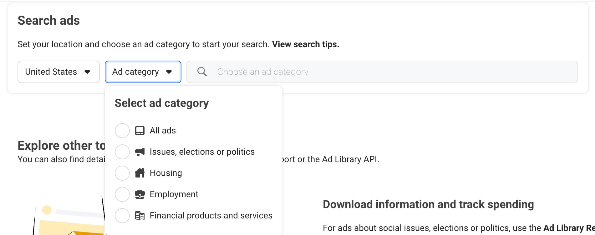
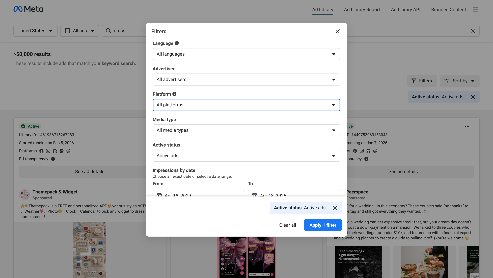
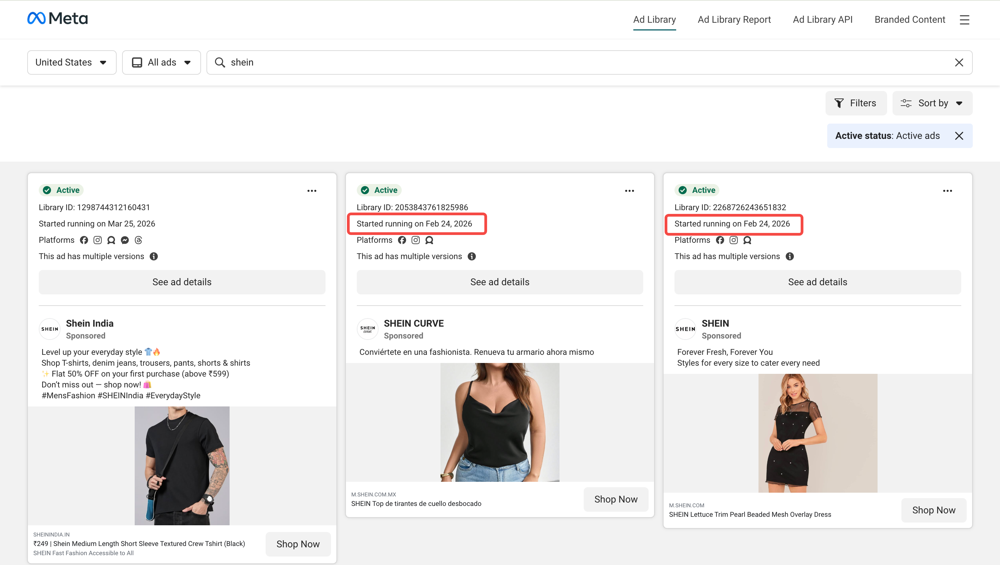
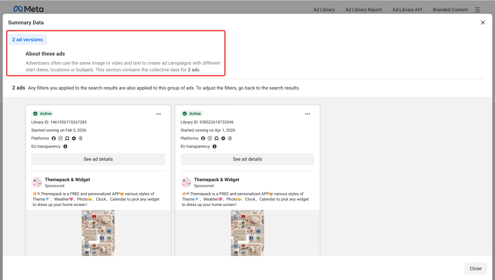
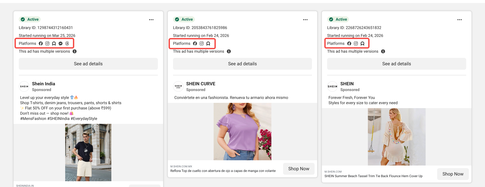
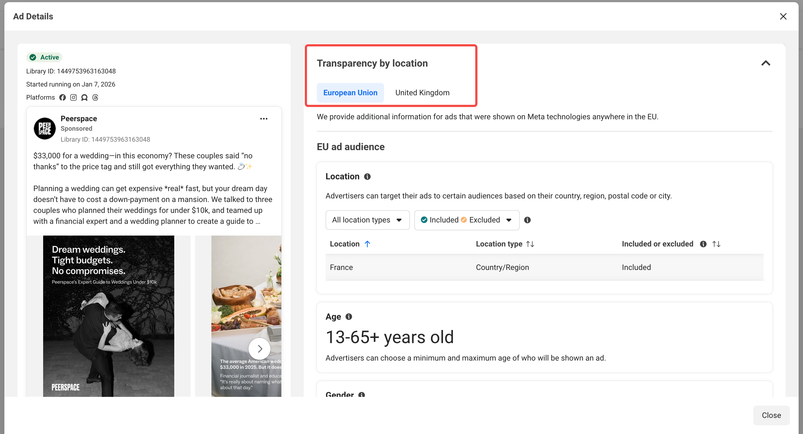

# The Complete Guide to Meta Ads Library Search

In 2021, when I took over a client’s Meta advertising account for an e-commerce business, their ROAS was only 1.8. The budget was limited, the creative team consisted of just one person, and the competitors were brands backed by tens of millions in funding.

The first thing I did was not adjust bids or audiences. Instead, I spent three full days deconstructing 847 ads from 12 competitors in the Meta Ads Library. I recorded each ad’s runtime, creative format, copy structure, and CTA strategy, and even used Python scripts to batch-download all the assets.

Three months later, the account’s ROAS reached 4.2, and the creative click-through rate increased by 67%. I didn’t increase the budget or expand the team—I simply learned how to “reverse-engineer” ad strategies that had already been validated by the market.

That is the true value of Meta Ads Library—it is not just a transparency tool for “seeing what others are doing,” but a strategic intelligence system that enables systematic deconstruction, learning, and even AI-powered large-scale analysis.

After seven years in performance marketing, I’ve seen too many people open Ads Library, browse a few ads, and then close the page. They miss 90% of its value.

## The Hidden Value of Meta Ads Library

**[Meta Ads Library](https://www.facebook.com/ads/library)** is an ad transparency tool launched by Meta in 2018, originally in response to regulatory pressure around political advertising. But from my seven years of experience in performance marketing, its value goes far beyond “transparency”—it is a real-time, continuously updated, and arguably the largest global database of ad creatives.

Anyone can access it for free without logging in. The problem is that most people only see the surface-level data and overlook the hidden signals that can be “reverse-engineered.”

### Explicit Data vs. Hidden Signals

| Explicit Data                                          | Hidden Signals                                       | My Interpretation Method                                                                                                 |
| ------------------------------------------------------ | ---------------------------------------------------- | ------------------------------------------------------------------------------------------------------------------------ |
| **Ad Creative** (images, videos, copy, CTA)         | Creative patterns, visual language, emotional appeal | I break creatives down into a four-layer structure: Hook → Value → Proof → Action, to identify which layer drives clicks |
| **Ad Duration** (start date, number of days active) | Performance validation, budget estimation            | Running >30 days = likely higher conversion rate; >90 days = evergreen ad worth deep analysis                            |
| **Platforms** (Facebook / Instagram / Messenger)    | Audience age range, content strategy differences     | Instagram-only = targeting 18–34; multi-platform = brand awareness or broad audience testing                             |
| **Regions Covered** (country/region list)           | Market priority, localization maturity               | Multi-country without localization = testing phase; single market + localization = deep focus strategy                   |
| **Number of Variants** (ad variations)              | A/B testing hypotheses, optimization focus           | 3–5 variants = normal testing; 10+ = large-scale optimization or strong budget                                           |
| **Page Info** (page name, verification status)      | Brand maturity, compliance level                     | Blue check = established brand; grey = agency or test account                                                            |

Meta Ads Library does not provide budget, audience targeting, or CTR data—but these can be inferred through **signal combinations**.

For example, I once analyzed a DTC skincare brand and found they had 47 ads running simultaneously, each with 5–8 variations. This told me:

1. **Budget scale**: At least $50K/month (since testing that many creatives requires sufficient traffic allocation)
2. **Optimization strategy**: Large-scale creative testing rather than granular audience segmentation
3. **Team structure**: Dedicated creative team and data analysts—not a small operation

From this, I concluded their strategy was **“creative-driven + Advantage+ broad targeting”**, rather than the traditional **“precise targeting + limited creatives.”**

### The Three Hidden Metrics I Value Most

From seven years of hands-on experience, I’ve identified three metrics with the strongest predictive value:

**1. Ad Survival Rate**

I track competitors’ ads and calculate the percentage still running after 30 days.

* < 20% = rapid iteration, possibly heavy testing or intense competition
* > 50% = high-quality creatives or stable audience response

**2. Creative Refresh Frequency**

I observe how often competitors launch new ad batches.

* Weekly updates = high-frequency testing (common in DTC/e-commerce)
* Monthly updates = steady optimization (often B2B or high-ticket products)
* Rare updates = strong evergreen performance or limited resources

**3. Platform Distribution Pattern**

I analyze the distribution between Facebook and Instagram.

* 80% on Instagram = younger audience, visually driven products
* 50/50 split = broad audience or multi-product lines
* Mostly Facebook = 35+ audience or B2B

These metrics are not directly visible in Ads Library, but through systematic tracking, you can reconstruct a competitor’s **“advertising fingerprint.”**

## How to Access and Use Meta Ads Library

Meta Ads Library is completely free and accessible without a Facebook account.

### Access Methods

1. **Web version**: Visit [https://www.facebook.com/ads/library/](https://www.facebook.com/ads/library/)
2. **API**: For developers needing bulk data analysis, use [https://www.facebook.com/ads/library/api/](https://www.facebook.com/ads/library/api/)

### Basic Search Steps

**1. Select Region**

Choose the region you want to view. Note: this refers to the **data source region** of the library, not necessarily the actual targeting location of the ads.

For example, selecting “United States” shows ads visible in the U.S. library, but those ads may target multiple countries globally.

**2. Choose Ad Category**

On entry, select a category:

* **All Ads**: Includes all commercial ads (default choice for most marketers)
* **Issues, Elections or Politics**: Political ads with more detailed data (spend, impressions)
* **Housing**, **Employment**, **Credit**: Special regulated categories

**3. Enter Search Keywords**

You can search by:

* **Brand name**: e.g., “Nike”, “Shopify”
* **Page name**: e.g., “Glossier”, “Airbnb”
* **Keywords**: e.g., “CRM software”, “fitness app” (matches ad copy)

**4. Apply Filters**

The results page offers multiple filters:

* **Platform**: Facebook, Instagram, Audience Network, Messenger
* **Media type**: Image, video, carousel
* **Status**: Active vs. inactive
* **Language**: Ad copy language

## How to Use Meta Ads Library to Optimize Your Ad Strategy

### How to Find Your Competitors’ Best-Performing Ads

On the search results page, check the **“Started running on”** date under each ad. The longer an ad has been running, the better it usually performs—because advertisers don’t keep unprofitable ads live for long.

1. Search for your competitor’s brand name
2. Browse the ad list and focus on ads that have been running for more than 30 days
3. Click into these ads to view the full creative, copy, and CTA

Ads that have been running for more than 90 days are considered **“evergreen ads”** and are worth deep analysis:

* What visual styles work in your industry (e.g., real people, product close-ups, lifestyle scenes)
* What copy structures are more engaging (e.g., problem–solution, storytelling, direct benefits)
* What CTAs convert better (e.g., Learn More, Shop Now, Sign Up)

### What Are Your Competitors Testing?

When you click on an ad, if you see **“See X versions of this ad,”** it means your competitor is running A/B tests.

1. Click the ad to enter the detail page
2. Check if it shows “See ad details” or the number of versions
3. Click to view all versions and compare differences

Compare variations across:

* Headline changes (e.g., “Free Trial” vs. “Buy Now”)
* Opening line changes (e.g., pain point vs. benefit-driven)
* Image/video differences (e.g., product close-up vs. usage scenario)
* CTA button variations

These differences reveal your competitor’s **testing hypotheses**. If they are testing multiple versions, it means they haven’t found the optimal solution yet—which is your opportunity.

### How to Infer Your Competitors’ Target Audience

Although Ads Library doesn’t display audience targeting, you can reverse-engineer it from the ad content.

Check the platforms where the ad is running (Facebook, Instagram, or both) and the language used in the copy.

**Inference logic:**

| Observed Signal                                              | Likely Audience Strategy                    |
| ------------------------------------------------------------ | ------------------------------------------- |
| Only running on Instagram                                    | Younger audience (18–34)                    |
| Running on both Facebook and Instagram                       | Broad audience or brand awareness campaigns |
| Copy includes terms like “new parents,” “busy professionals” | Clearly defined audience segments           |
| Uses casual language and emojis                              | Targeting Gen Z or Millennials              |

For example, if a competitor runs UGC-style short videos only on Instagram and emphasizes “Gen Z” in the copy, you can infer they are specifically targeting a younger audience.

### Where Are Your Competitors Advertising?

1. Click the ad to open the detail page
2. Check the “Countries” or “Regions” list
3. Look for localized versions (different languages or copy)

**Insights you can extract:**

* **Market priority**: If a brand runs ads in 10 countries but 80% are concentrated in the U.S., the U.S. is likely their core market
* **Localization strategy**: If the same brand uses different ad versions across countries (different languages or messaging), they are doing refined localization
* **Expansion signals**: If a competitor suddenly starts advertising in a new market, it may indicate expansion

If you’re planning to enter a new market, switch the Ads Library region setting to explore the advertising landscape in that market.

## Frequently Asked Questions (FAQ)

### How do I access the Facebook Ads Library search feature?

Accessing Meta Ads Library is very straightforward:

1. Go directly to [https://www.facebook.com/ads/library/](https://www.facebook.com/ads/library/) (no login required)
2. Select an ad category (usually choose “All Ads”)
3. Choose a region (e.g., “United States”)
4. Enter a brand name or keyword to search

If you need bulk data or automated monitoring, you can use the Meta Ads Library API ([https://www.facebook.com/ads/library/api/](https://www.facebook.com/ads/library/api/)), but it requires a Facebook developer account.

### What is the Facebook Ads Library search feature?

Meta Ads Library Search is an official ad transparency tool provided by Meta that allows anyone to search and view ads running across platforms such as Facebook, Instagram, Messenger, and Audience Network.

**Core features:**

* Search ads by specific brands or keywords
* View ad creatives (images, videos, copy)
* See ad run time, platforms, and regions
* Compare different versions of the same ad (A/B testing)

**How it differs from other tools:**

* Official and free: Data comes directly from Meta, no payment required
* Real-time updates: Ads typically appear within 24–48 hours after going live
* Global coverage: You can view ads from any country or region

However, it does not provide performance data (such as CTR or conversion rate) or audience targeting details.

### How can I use the Facebook Ads Library to improve my ads?

Based on practical experience, here are the most effective approaches:

**1. Identify high-performing creative patterns**

* Search for 3–5 competitors
* Filter ads that have been running for more than 30 days (these are market-validated)
* Analyze common elements: copy structure, visual style, CTA strategy
* Extract “creative patterns” rather than copying directly

**2. Discover differentiation opportunities**

* If all competitors are using similar creatives, that’s your opportunity
* Look for angles that are missing in the market (e.g., competitors focus on features, you emphasize emotional value)

**3. Use AI to accelerate analysis**

* Collect 50–100 competitor ad copies
* Use Claude or GPT-4 to analyze copy patterns, high-frequency keywords, and emotional appeals
* Generate hypotheses for creative variations

**4. Continuously monitor and iterate**

* Build a competitor monitoring list
* Check newly launched ads weekly
* Test strategies learned from the Ads Library and track results

Don’t just “look at” ads—break down the strategy behind them.

### How does the Facebook Ads Library create value for my business?

Meta Ads Library delivers value for businesses of all sizes:

**Small businesses / startups:**

* Reduce trial-and-error costs: Learn from proven creatives instead of starting from scratch
* Fast learning: Understand industry standards and competitor strategies
* Resource optimization: Use limited budgets to test the most promising creative directions

**Mid-sized companies:**

* Competitor monitoring: Quickly identify new strategies from competitors
* Creative inspiration: Build a creative asset library to improve team efficiency
* Market insights: Spot industry trends (e.g., rise of video ads, growth of UGC content)

**Large enterprises:**

* Strategic intelligence: Build automated monitoring systems to track market dynamics in real time
* Cross-market analysis: Compare ad strategies across regions and optimize localization
* Data-driven decisions: Integrate Ads Library data into BI systems to guide budget allocation

**The biggest value** is not “seeing what competitors are doing,” but “understanding what the market is missing—and filling that gap.”

Meta Ads Library is just the starting point. The real value lies in how you use it to build your own methodology, train your advertising intuition, and ultimately drive tangible business results.

