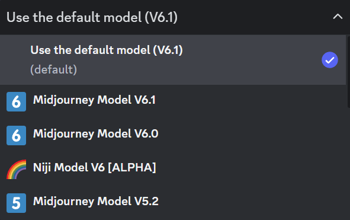
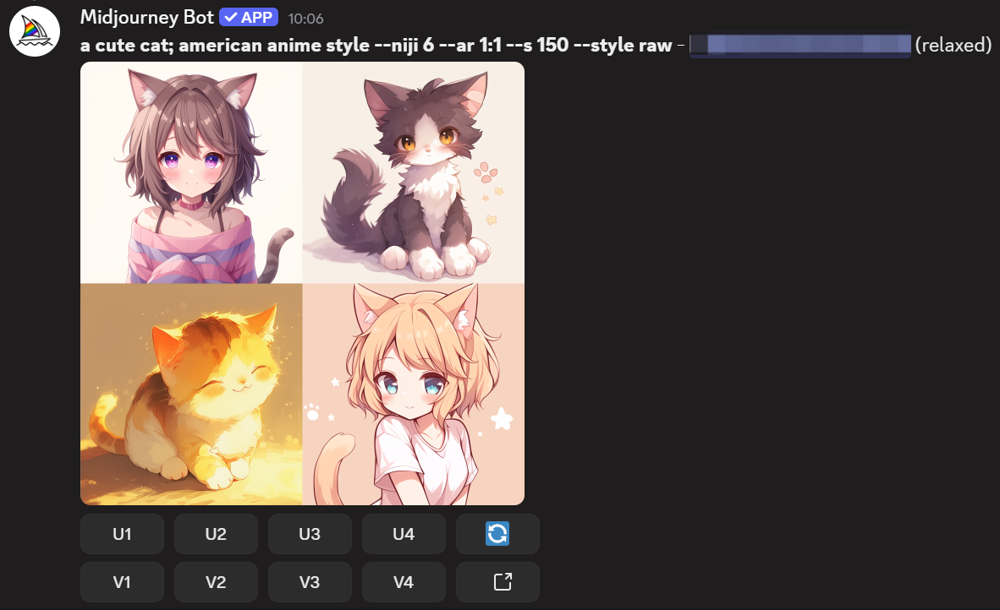
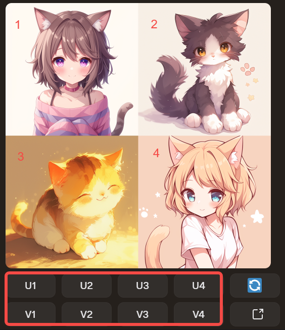
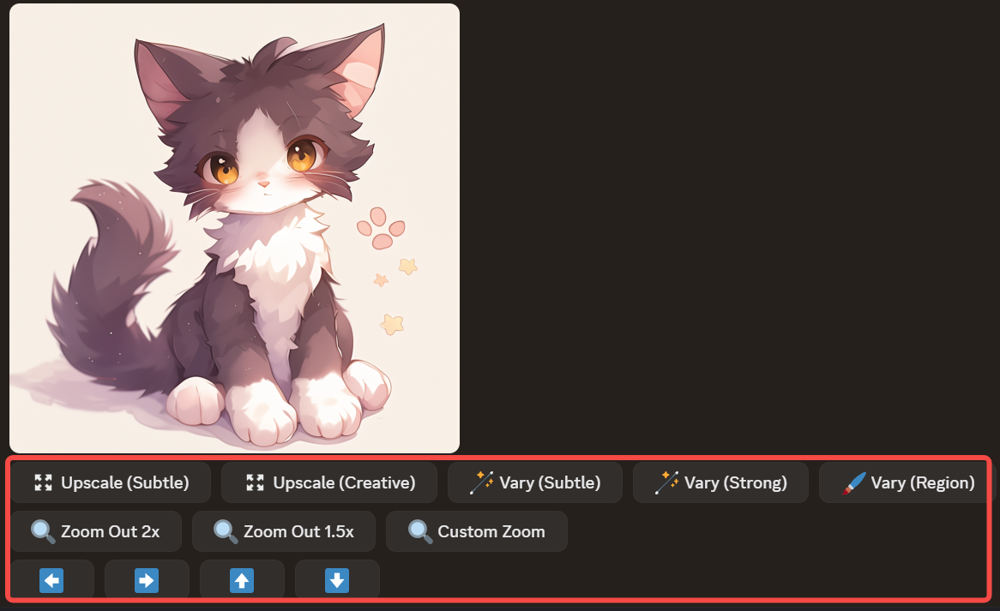

# Midjourney Tutorial for Beginners


## Basic Settings  
Sending the `/settings` command to Midjourney Bot reveals configurable options:  
  

### Model Version Control  
  
The first dropdown menu selects Midjourney’s image generation models, which differ in artistic tendencies and parameter compatibility:  
- **Midjourney Model**: Native model for photorealistic and stylized images. Default version is V6.1.  
- **Niji Model**: Collaborative model with SpellBrush, optimized for anime/illustration styles. Current version: V6.  

### Stylization Control  
  
The second row controls artistic interpretation strength (higher values = more stylized results):  
- **RAW Mode**: Equivalent to `--style raw`. Reduces AI stylization, available only in Midjourney Model V5.1/V5.2.  
- **Stylize low**: Weak stylization, equals `--style 50`  
- **Stylize med**: Med stylization, equals `--style 100` (default)  
- **Stylize high**: Strong stylization, equals `--style 250`  
- **Stylize very high**: Extra strong stylization, equals `--style 750`  

### Personalization  
The Personalization feature allows AI to learn creators’ preferences, reducing repetitive style explanations in prompts.  
**Prerequisite**: Rate at least 200 images on Midjourney’s official website to train your preference profile.  
**Usage**: Append `--p` to prompts after enabling this feature.  

### Privacy Settings  
In **Public mode**, all generated images are publicly visible in Midjourney’s gallery. Only Pro Plan subscribers can disable this mode.  

### Remix Settings  
  
- **Remix mode**: Allows editing prompts during Upscale/Variation/Reroll operations. Disabled by default.  
- **Strong Variation Mode**: Maximizes output diversity (requires Remix mode).  
- **Subtle Variation Mode**: Minimizes output changes (requires Remix mode).  

### GPU Modes  
  
- **Fast mode**: Prioritizes speed (consumes Fast GPU time; ~seconds per image).  
- **Relax mode**: Queued generation (no Fast time cost; ~seconds to minutes).  
- **Turbo mode**: 4x faster than Fast mode but consumes 2x Fast time per task.  


## Command Reference  
### Basic Commands  
- `/settings`: View/update configurations  
- `/help`: Display help documentation  
- `/info`: Show version details  
- `/about`: Midjourney introduction  
- `/quit`: Exit Midjourney  

### Image Generation Commands  
- `/imagine`: Generate images  
- `/prompt`: Set image description  
- `/seed`: Specify random seed  
- `/variations`: Create image variants  
- `/upscale`: Enhance image resolution  
- `/style`: Apply artistic style  
- `/quality`: Adjust rendering quality  
- `/aspect`: Set aspect ratio  
- `/mask`: Use image masks  

### Advanced Commands  
- `/blend`: Merge 2-5 images  
- `/inpaint`: Image restoration  
- `/edit`: Modify existing images  
- `/animate`: Create animations  
- `/loop`: Generate looping animations  
- `/slerp`: Image interpolation  
- `/checkpoint`: Save model state  
- `/restore`: Load model state  

### Miscellaneous Commands  
- `/join`: Enter chat room  
- `/leave`: Exit chat room  
- `/mute`: Silence notifications  
- `/unmute`: Enable notifications  
- `/clear`: Delete chat history  

### Usage Notes  
- Commands are case-sensitive  
- Commands can be combined  
- Effects depend on prompt structure and parameter order  


## Prompt Practice  
### Basic Structure  
  
A complete Midjourney prompt includes:  
1. **Command**: Only `/imagine` accepts prompts  
2. **Prompt**: Text descriptions/image URLs  
3. **Parameters**: Suffixed with `--parameter value`  

**Example**:  
```
a cute cat; american anime style --niji 6 --ar 1:1 --s 150  
```  
Generates four progressively refined images:  
  

### Key Parameters  
**Format**: Add space after prompt + `--parameter value`  

#### General Parameters  
- `--seed`: Random seed (0-4294967295)  
- `--chaos`: Variation intensity (0-100)  
- `--quality`: Detail level (0.25-1)  
- `--aspect`: Aspect ratio (default 1:1)  
- `--style`: Named artistic styles  
- `--no`: Exclude elements (e.g., `--no faces`)  

#### Advanced Parameters  
- `--iw`: Image weight (0-2)  
- `--fast`: Prioritize speed over quality  
- `--repeat`: Batch generation count  
- `--relax`: Quality-focused generation  
- `--stylize`: Style intensity (0-1)  
- `--mask`: Apply image mask  

#### Additional Parameters  
- `--promptw`: Multi-weight text prompts  
- `--v`: Model version selector  
- `--upscaler`: Upsampling algorithm  
- `--prompt_weights`: Text weighting  
- `--cfg_scale`: Style adjustment scale  


## Upscale & Variation Workflow  
After generating four initial images:  
  

**Button Functions**:  
- **U**: Upscale selected image  
- **V**: Generate variants from selected image  
- **Reroll**: Regenerate with original prompt  

**Post-Upscale Options**:  
  
- **Upscale (Subtle/Creative)**: Enhance resolution with minor/major detail adjustments  
- **Vary (Subtle/Strong)**: Generate low/high-variance variants  
- **Vary (Region)**: Edit specific areas  
- **Zoom Out**: Expand canvas (2x, 1.5x, or custom)  
- **Pan Controls**: Adjust composition with arrow keys  

For advanced techniques, see:  [《Midjourney Advanced Guide》](https://chloevolution.com/zh-cn/posts/midjourney-advanced-tutorial/)  


