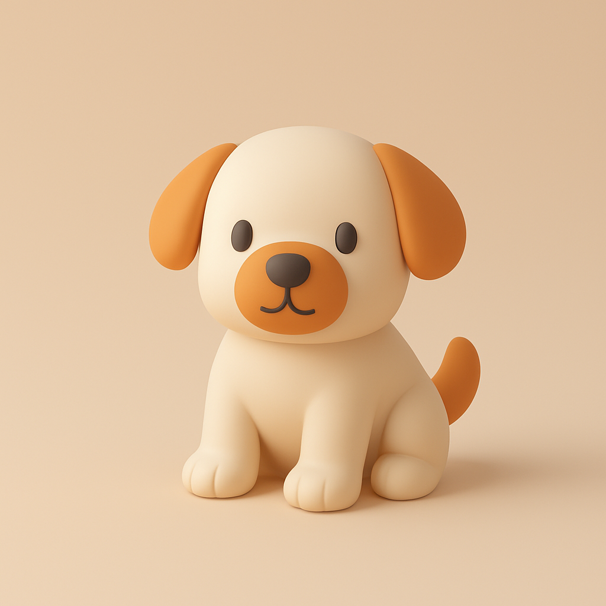

# Minimalist 3D Illustration Style Prompt (With Complete Code)


## Characteristics of Minimalist 3D Illustration Style
- **Basic Geometric Shapes**  
Built upon simple geometric forms (spheres, cubes, cylinders), avoiding complex structures. Visual subjects are formed through combination or deformation.

- **Low Detail Processing**  
Reduce textures and decorative details on model surfaces, retaining only essential contour features to emphasize clean overall forms.

- **Soft Color Schemes**  
Predominantly use low-saturation tones (e.g., Morandi color palette) with gentle light-dark contrasts, avoiding high contrast or fluorescent colors.

- **Highly Simplified Elements**  
Retain only core visual information in compositions, eliminating redundant backgrounds or decorative elements. Use negative space to enhance subject focus.

- **Abstract Representation**  
Weaken realistic object forms through proportional adjustments or symbolic designs, such as using simplified cloud outlines instead of detailed depictions.

- **Lightweight Textures**  
Employ matte or translucent material effects, avoiding complex light reflections. Use basic highlights to suggest metallic/glass elements.

- **Flattened Spatial Sense**  
Minimize perspective depth through parallel viewing angles or mild axonometric projection, reducing scene layering.

- **Function-Oriented Design**  
Serve information delivery or interface interaction needs, emphasizing visual symbols' readability and quick recognition over pure decoration.

## Application Scenarios for Minimalist 3D Illustration Style

Core advantages include:
- **Efficient Communication**: Suitable for scenarios requiring rapid information delivery (advertising, education)
- **Modern Aesthetics**: Ideal for tech, internet, and emerging consumer brands pursuing youthful visuals
- **Lightweight Requirements**: Adaptable to digital media with strict loading speed and multi-device compatibility needs (mobile, web)

Key application fields:

### Digital Interface Design (UI/UX)
- **Interface Icons/Animations**: Enhance modern feel for app/web interfaces while avoiding visual clutter
- **Data Visualization**: Simplify complex information through geometric charts (financial/health app dashboards)

### Branding & Marketing
- **Key Visuals**: Convey youthful brand identity for tech/lifestyle products (electronics campaigns, social media ads)
- **IP Character Design**: Create memorable abstract characters (mascots, emojis)

### Educational Content
- **Instructional Illustrations**: Simplify abstract concepts in teaching materials (human anatomy, mechanical principles)
- **Infographic Design**: Transform processes/data into understandable 3D graphics

### Motion Media & Advertising
- **Short Video Ads**: Lightweight rendering suits fast-spreading platforms (TikTok, Instagram)
- **Animated Posters**: Enhance engagement through subtle animations while maintaining simplicity

### Product Presentation
- **E-commerce Visuals**: Highlight products by simplifying background details (3C products, home goods)
- **Packaging Design**: Convey eco-friendly/minimalist concepts through flat 3D elements

### Publications
- **Book/Magazine Illustrations**: Complement text content without distracting readers
- **Cover Designs**: Communicate themes through geometric layouts (tech/design publications)

### Gaming & Virtual Environments
- **Casual Game Design**: Reduce visual fatigue in puzzle/simulation games
- **VR/AR Interfaces**: Ensure low latency and recognizability in metaverse navigation

## Complete Minimalist 3D Illustration Style Prompt

This JSON-formatted prompt works with ChatGPT 4o and other AI platforms. Replace [xx] with your subject. Example output (3D puppy):


```JSON
Generate a [xx] with the following JSON profile: 

<pre style="caret-color: rgb(0, 0, 0); color: rgb(0, 0, 0); font-style: normal; font-variant-caps: normal; font-weight: 400; letter-spacing: normal; orphans: auto; text-align: start; text-indent: 0px; text-transform: none; widows: auto; word-spacing: 0px; -webkit-tap-highlight-color: rgba(26, 26, 26, 0.3); -webkit-text-size-adjust: auto; -webkit-text-stroke-width: 0px; text-decoration: none; overflow-wrap: break-word; white-space: pre-wrap;">{
  "art_style_profile": {
    "style_name": "Minimalist 3D Illustration",
    "visual_elements": {
      "shape_language": "Rounded edges, smooth and soft forms with simplified geometry",
      "colors": {
        "primary_palette": ["Soft beige, light gray, warm orange"],
        "accent_colors": ["Warm orange for focal elements"],
        "shading": "Soft gradients with smooth transitions, avoiding harsh shadows or highlights"
      },
      "lighting": {
        "type": "Soft, diffused lighting",
        "source_direction": "Above and slightly to the right",
        "shadow_style": "Subtle and diffused, no sharp or high-contrast shadows"
      },
      "materials": {
        "surface_texture": "Matte, smooth surfaces with subtle shading",
        "reflectivity": "Low to none, avoiding glossiness"
      },
      "composition": {
        "object_presentation": "Single, central object displayed in isolation with ample negative space",
        "perspective": "Slightly angled, giving a three-dimensional feel without extreme depth",
        "background": "Solid, muted color that complements the object without distraction"
      },
      "typography": {
        "font_style": "Minimalistic, sans-serif",
        "text_placement": "Bottom-left corner with small, subtle text",
        "color": "Gray, low-contrast against the background"
      },
      "rendering_style": {
        "technique": "3D render with simplified, low-poly aesthetics",
        "detail_level": "Medium detail, focusing on form and color over texture or intricacy"
      }
    },
    "purpose": "To create clean, aesthetically pleasing visuals that emphasize simplicity, approachability, and modernity."
  }
}</pre>
```

## Why Use JSON Format Prompts
**Essence**: A **structured instruction set** converting natural language into **machine-parsable parameter matrices**.  
**Comparison with Traditional Prompts**:  
| Type | Free-Text Prompt | JSON Prompt |  
|------|----------------|-------------|  
| Structure | "Draw a rounded teacup in beige..." | Hierarchical parameter control |  
| Precision | Model-dependent interpretation | Parameter locking |  
| Use Case | Creative exploration | Standardized output |  

**Typical Applications**:  
- Corporate brand guidelines (ensure visual consistency)  
- Cross-platform content generation (adapt prompts for Midjourney/DALL·E/Stable Diffusion)  

## Minimalist 3D Prompt Code Analysis
### Code Structure

#### Framework
**Standard JSON** with three-level nesting:
```
Root
├─ art_style_profile
   ├─ style_name
   ├─ visual_elements
   │   ├─ 7 core visual modules
   │   └─ Multi-layer attributes
   └─ purpose
```

#### Hierarchy
- **Level 1**: `art_style_profile` as root
- **Level 2**: Tripartite structure (`style_name` + `visual_elements` + `purpose`)
- **Level 3**: `visual_elements` contains:
  ```
  shape_language
  colors
  lighting
  materials
  composition
  typography
  rendering_style
  ```

### About `<pre style...>`

#### HTML Wrapper Notes
The initial HTML tag:
```html
<pre style="caret-color:...; color:...; font-style:...;...">
```
serves as **presentation code** with key CSS parameters:
  ```css
  caret-color: rgb(0, 0, 0)    
  white-space: pre-wrap        
  overflow-wrap: break-word    
  color: rgb(0, 0, 0)          
  ```

#### Technical Clarification
- **Non-data content**: Excluded from actual JSON configuration
- **Presentation layer**: Only affects web/editor display
- **Development practice**: Omit HTML tags in real JSON files

### Line-by-Line Prompt Breakdown

```json
{
  "art_style_profile": {  // Overall style configuration
    "style_name": "Minimalist 3D Illustration",  // Style identifier
    "visual_elements": {  // Visual parameters
    
      "shape_language": "Rounded edges...",  // Simplified geometry
      
      "colors": {  
        "primary_palette": ["Soft beige..."],  // Neutral tones
        "accent_colors": ["Warm orange..."],  // Focus elements
        "shading": "Soft gradients..."  // Smooth transitions
      },

      "lighting": {  
        "type": "Soft...",  // Diffused light
        "source_direction": "Above...",  // Top-right source
        "shadow_style": "Subtle..."  // Blurred shadows
      },

      "materials": {  
        "surface_texture": "Matte...",  // Non-reflective
        "reflectivity": "Low..."  
      },

      "composition": {  
        "object_presentation": "Single...",  // Centered subject
        "perspective": "Slightly angled...",  // Mild 3D
        "background": "Solid..."  // Plain backdrop
      },

      "typography": {  
        "font_style": "Sans-serif...",  
        "text_placement": "Bottom-left...",  
        "color": "Gray..."  
      },

      "rendering_style": {  
        "technique": "Low-poly...",  // Stylized rendering
        "detail_level": "Medium..."  
      }
    },
    
    "purpose": "Clean modern visuals..."  // Core objective
  }
}
```

**Key Features Summary**:
1. **Minimalist Foundation**: Simplified geometry + limited palette
2. **3D Softness**: Low-poly modeling with gentle lighting
3. **Visual Focus**: Central composition + accent colors
4. **Material Consistency**: Universal matte surfaces
5. **Functional Typography**: Subtle text integration
