# A PPC Competitor Analysis of Monday.com

## Brand Introduction

[Monday.com](https://www.monday.com/) is a dynamic project management tool designed to simplify the way teams work together. Since its inception in 2012, Monday.com has emerged as a vibrant and innovative player in the SaaS industry, offering solutions that enable businesses to centralize task management, project tracking, and team collaboration in one platform. 

What sets Monday.com apart is its highly customizable interface, which allows users from various industries including tech, finance, and creative sectors, to tailor the platform according to their specific project needs and workflows. 

Note: The data used in this article is only for the desktop side of Google Ads in the US market, and the monthly data is for March 2024. All data are taken from third-party platforms, this site does not guarantee the accuracy of the data.

## Analysis of Paid Traffic Trend

Monday.com began advertising in September 2017, with an expansionary trend, peaking in June 2019. After that, it slowly reduced its investment in advertising and paid traffic leveled off relatively. Paid keywords for both September 2017 and June 2019 time points are analyzed separately next:

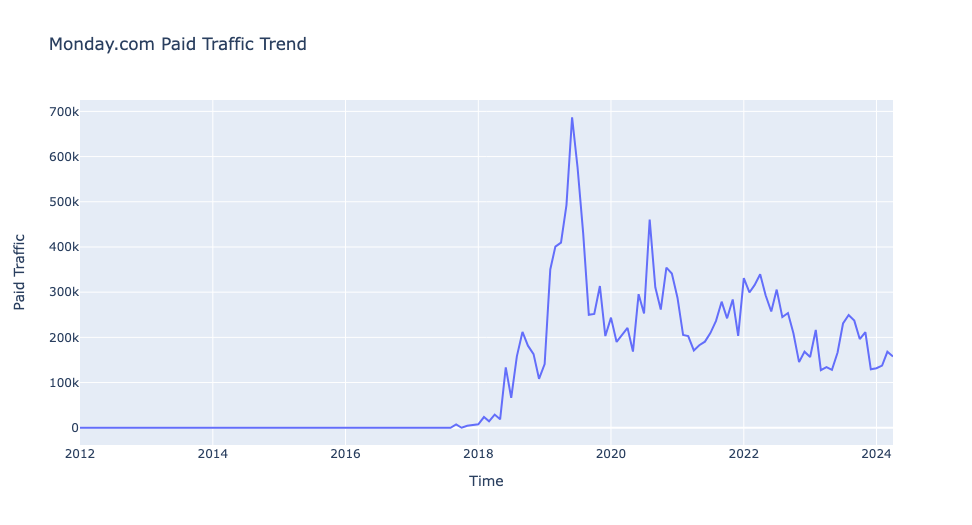

### 2017.9 Paid Keywords Text Cloud

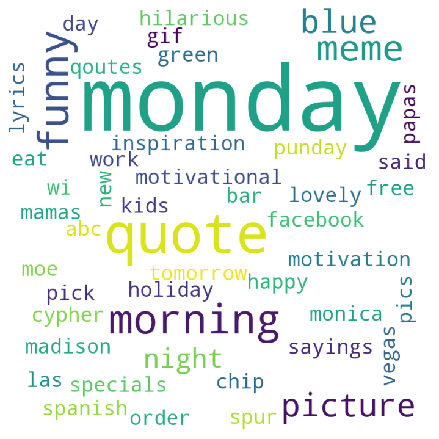

We can see that most of the paid keywords at this time are related to "Monday", hoping to increase brand exposure as soon as possible. However, there are two problems with this:

1. The overly broad keyword targeting obviously broadens the exposure of the ads, but attracts a lot of invalid traffic.
2. The ad landing page uses the official website homepage, which obviously does not match the original intent of many users searching for "Monday", making it difficult to guide them to the next step within the website.

### 2019.6 Paid Keywords Text Cloud

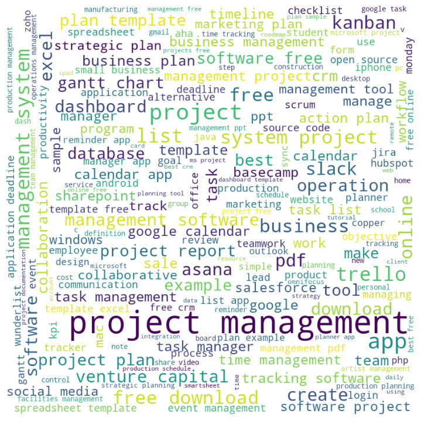

At this time, the keywords are much richer, the most frequent is "project management", but also use some keywords directly related to the function of the product, such as gantt chart, kanban, project plan and so on. In addition, it is not difficult to find a number of competitors' brand words, such as slack, salesforce, google calendar, etc..

## **Current Paid Traffic Strategy Analysis**

Now take a look at Monday.com's paid advertising strategy for March 2024:

### Paid Keywords Text Cloud

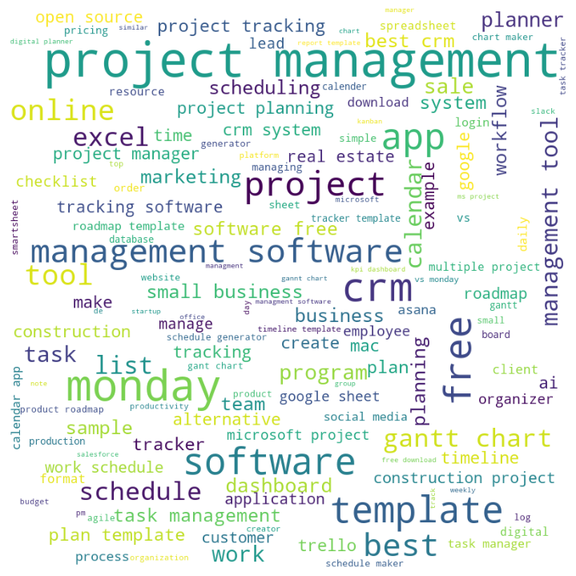

As the ad traffic tends to stabilize, the paid keywords basically revolve around the brand name "Monday" and the product positioning "project management". At the same time, it is easy to see that Monday.com is not limited to a specific industry project management products, but wants to cover CRM, construction, real estate and other project management scenarios.

### Top 10 Paid Keywords

Take a look at Monday.com's current top 10 paid keywords by "relevance":

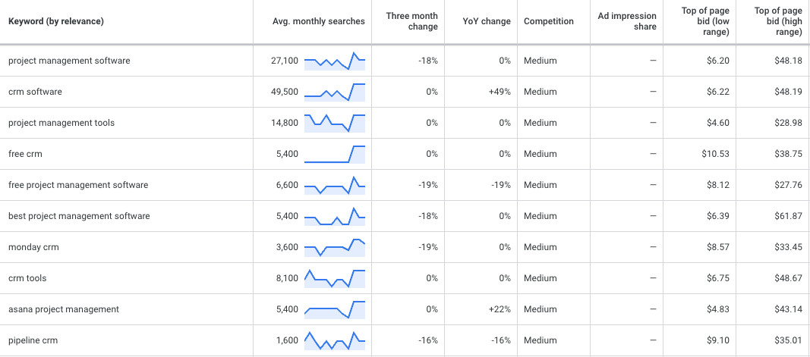

It can be found that Monday.com's current main product positioning is Project Management + CRM, through the "free" to attract more users to try the product.

### Competitor’s Bubble Chart

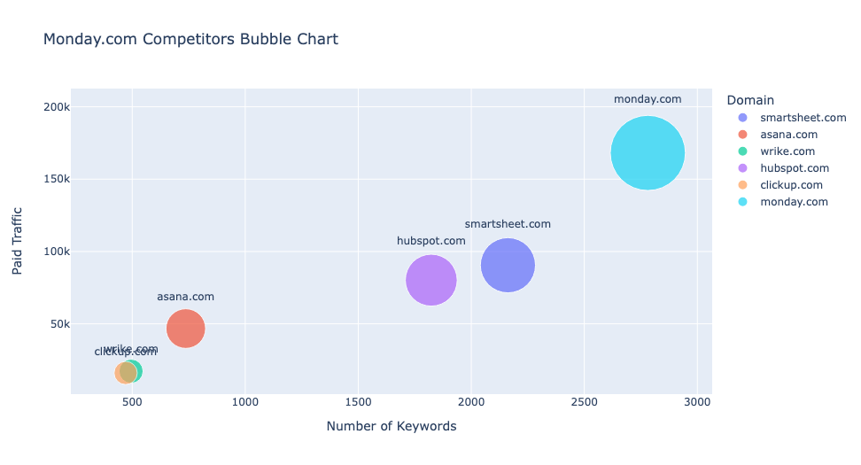

Monday.com is still the leader in terms of the number of paid keywords and the size of paid traffic, with Smartsheet and Hubspot as its main competitors in terms of paid traffic, Asana, [ClickUp](https://chloevolution.com/posts/clickup-sem-strategy-analysis), [Notion](https://chloevolution.com/posts/notion-sem-strategy-analysis), [Atlassian](https://chloevolution.com/posts/atlassian-sem-strategy-analysis) and [Wrike](https://chloevolution.com/posts/wrike-sem-strategy-analysis) are much smaller in terms of paid traffic.

### Ad Examples

[Text ads](https://adstransparency.google.com/advertiser/AR15972262369074085889?origin=ata&region=US&start-date=2024-03-01&end-date=2024-03-30&format=TEXT) styles into three categories:

1. targeting people who have already heard of the Monday.com brand, further attracting them to click on the ads, and then showing the advantages of their own products, such as what makes [monday.com](http://monday.com) better?
2. directly state the product positioning, such as CRM, marketing tool, project management program, etc.
3. Provide out-of-the-box services, such as templates.

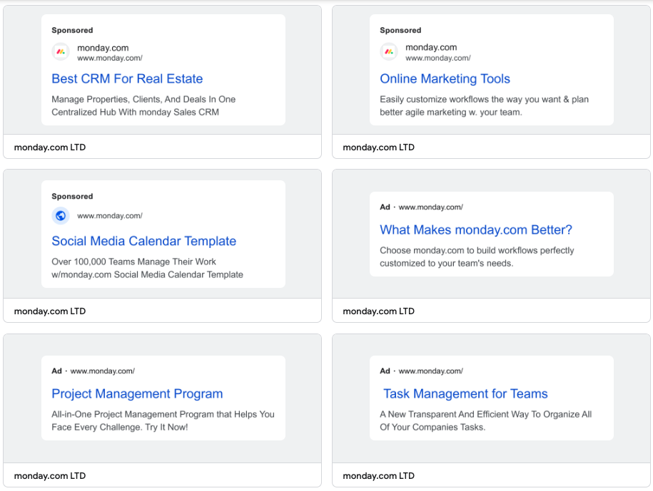

Video ads are diverse and include streamlining of workflows, an all-in-one data tracking platform, and successful customer examples (NASDAQ, Nissan, etc.):

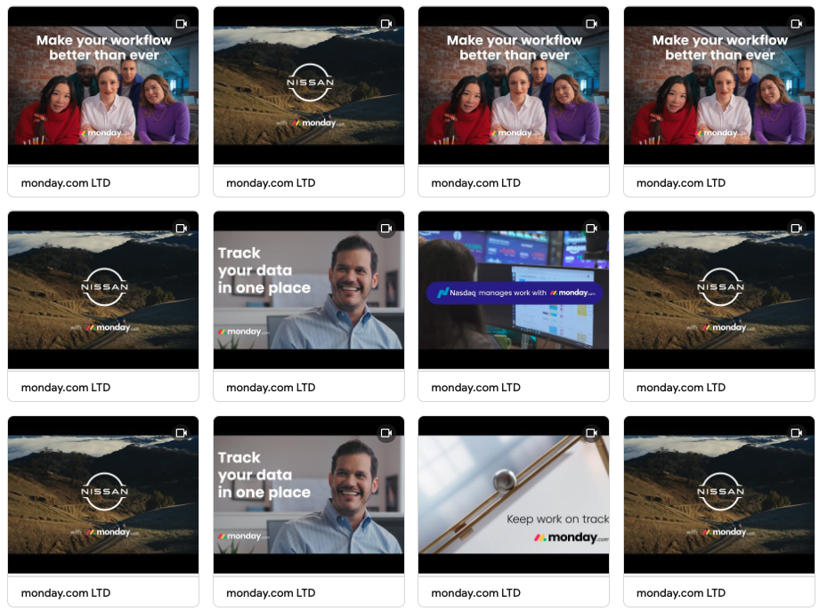

### Ad Landing Page Analysis

Monday.com's main advertising landing pages include the official homepage ([https://monday.com/](https://monday.com/)) and CRM-related landing pages ([https://monday.com/lp/crm](https://monday.com/lp/crm)):

Let's look at the content logic of the home page:

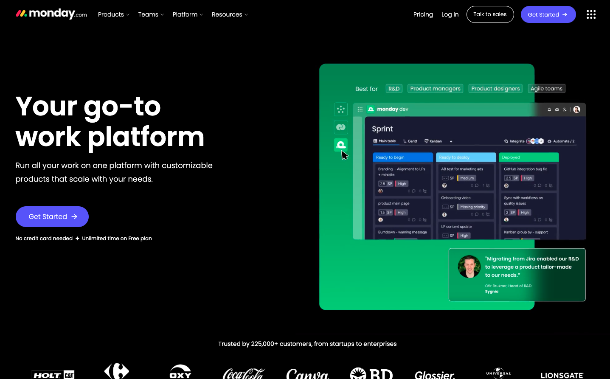

The top navigation bar has the four main sections of the site (Products, Teams, Platform, Resources) on the left side, and the right side includes Pricing and the registration and login portals.

The first screen is a left-right layout. On the left side is the brand slogan, along with a button to sign up for a trial, emphasizing the opportunity to offer an unlimited free trial. On the right side, there is a moving picture, showing the usage scenarios of monday work management, monday sales CRM and monday dev in turn.

The lower part of the image reveals successful customer cases, which attracts users to continue browsing down the page instead of leaving directly.

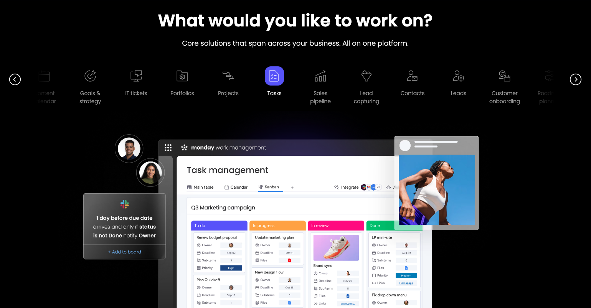

The second screen emphasizes that Monday.com is an all-in-one work platform covering various roles and functions such as projects, tasks, sales pipeline, customer onboarding and so on. Users can click on the icon to view specific product interfaces and features.

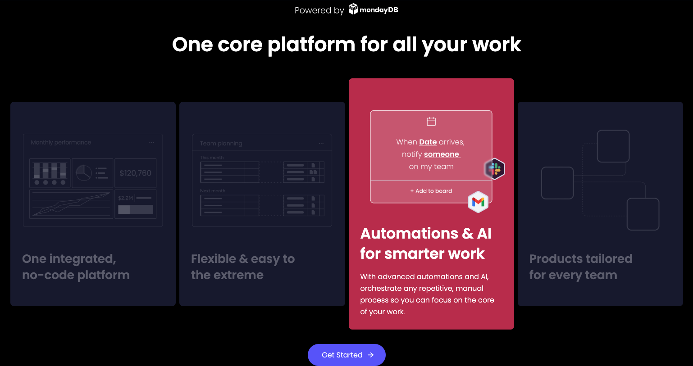

The third screen showcases Monday.com's database capabilities, enabling it to support workflow automation and AI functionality as an integrated, code-free platform.

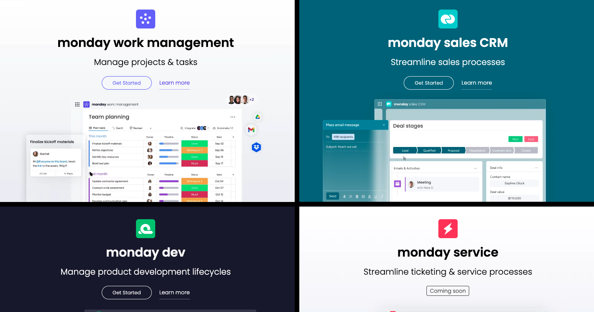

Next is a separate product module that includes products that are already online and those that will be online soon. Users can learn more details about the product in question by clicking on the button under the product name.

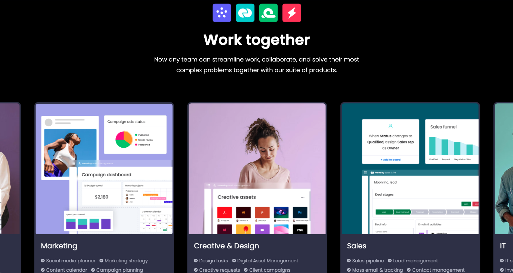

The scrolling playback interaction allows users to more intuitively understand how different roles and teams work and collaborate on the same product.

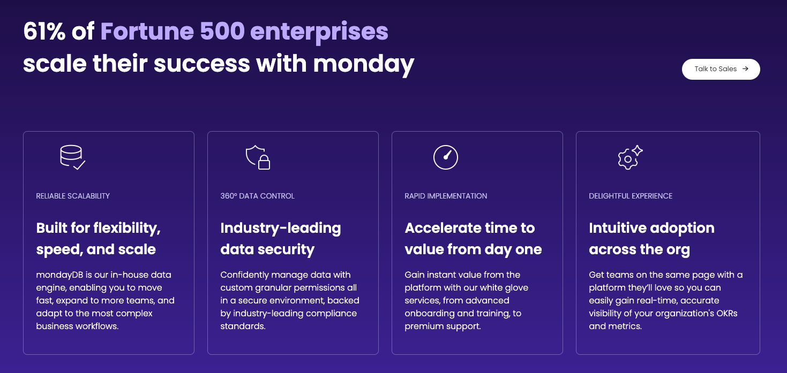

List the reasons why large enterprise customers choose Monday.com: flexibility provided by mondayDB, industry-grade data security system, rapid deployment, and smooth product usage experience.

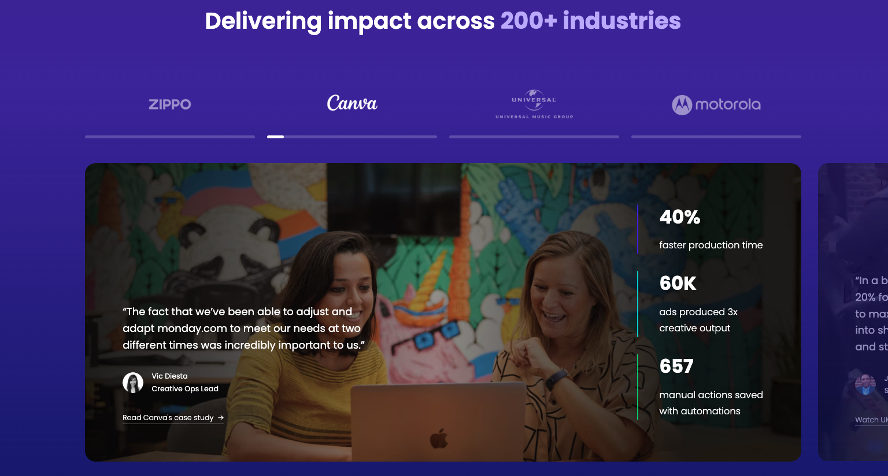

As an added note, Monday.com also puts up specific customer examples on their homepage, while signaling how their products have contributed to their customers' productivity as well as revenue enhancement.

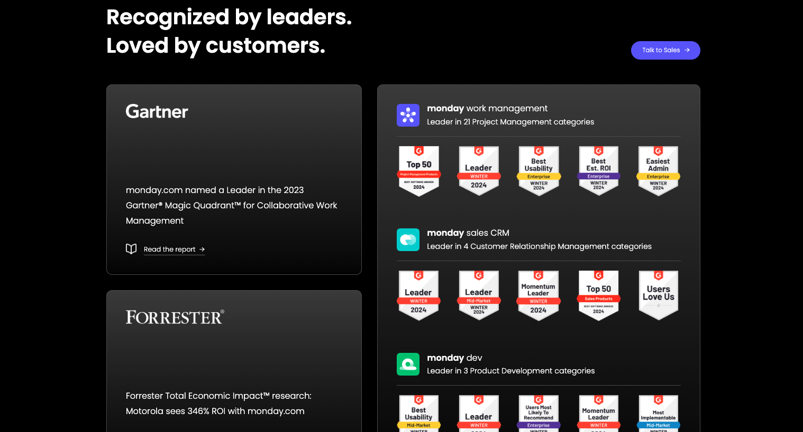

Finally, Monday.com showcased its awards and certifications from various authoritative rating sites and reports, further proving that its products are loved by a wide range of users.

See more about [Monday.com's SEO strategy](https://chloevolution.com/posts/monday-com-seo-strategy-analysis).
