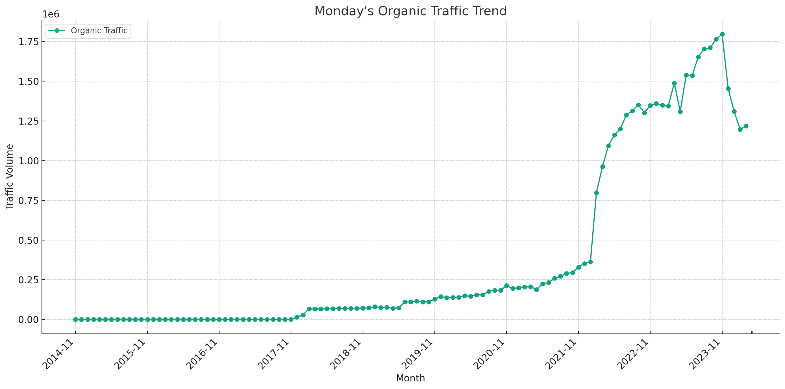

# Monday.com SEO Strategy Analysis (2024)

## Takeaways:

- **SEO Trend:** Organic traffic for Monday.com continued to show robust growth, peaking at an average of 14,774 visits by January 2024.
- **SEO Keyword Strategy:** As of January 2024, a significant 93.19% of traffic was focused on product-related keywords, indicating a strong brand-centric approach.
- **SEO URL Traffic Distribution:** In March 2024, the homepage alone attracted 56.33% of total traffic, underscoring its crucial role in the overall SEO strategy.

Note: The data used in this article is only for the desktop side in the US market. All data are taken from third-party platforms, this site does not guarantee the accuracy of the data.

Analysis of traffic trends for Monday.com's "Organic Traffic" over the specified phases is organized in the table below, showing each phase, the average traffic, and the observed trend:

| Phase                          | Average Traffic | Trend      |
|--------------------------------|-----------------|------------|
| Phase 1 (Nov 2014 to Jan 2022) | 85,010          | Increasing |
| Phase 2 (Jan 2022 to Nov 2023) | 1,336,244       | Increasing |
| Phase 3 (Nov 2023 to Mar 2024) | 1,394,912       | Decreasing |

Details:
- **Phase 1** begins in November 2014, and extends up to January 2022. During this phase, there is an increasing trend in traffic.
- **Phase 2** covers from January 2022 to November 2023, also showing an increasing trend.
- **Phase 3** runs from November 2023 to March 2024, where the trend shifts to decreasing, indicating a drop in organic traffic during this recent period.

## Monday.com's SEO Strategy at January 2022

### Keyword Traffic and Topics Table

| Keyword Topic        | Keyword Example                   | Traffic | Traffic (%) |
|----------------------|-----------------------------------|---------|-------------|
| Product-related      | monday                            | 239,744 | 65.99%      |
| Other                | outlook                           | 72,022  | 19.82%      |
| Tool-related         | gantt chart                       | 49,610  | 13.66%      |
| Educational          | how to get rid of mental blocks   | 1,346   | 0.37%       |
| Competitor-related   | notion vs trello                  | 574     | 0.16%       |

**Rule of Classification:**
- **Product-related:** Keywords that directly mention the product name "monday" or variations thereof, capturing searches specifically looking for the brand.
- **Competitor-related:** Keywords including names of competing brands or products, like [Notion](https://chloevolution.com/posts/notion-seo-strategy-analysis), [ClickUp](https://chloevolution.com/posts/clickup-seo-strategy-analysis), [Wrike](https://chloevolution.com/posts/wrike-seo-strategy-analysis), Asana, to attract users considering alternatives.
- **Tool-related:** Keywords that describe the type of tools or functionalities, such as "crm", "project", "management", "gantt", "chart", "plan", targeting users interested in specific features or use cases.
- **Educational:** Keywords that involve instructional content, like "how to" or "guide", appealing to users seeking knowledge or how-to information.
- **Other:** Keywords that do not neatly fit into the above categories but still bring traffic to the site.

### URL Traffic Distribution

| URL                                                | Traffic | Traffic (%) |
|----------------------------------------------------|---------|-------------|
| https://monday.com/                                | 175,450 | 48.29%      |
| https://monday.com/crm                             | 31,897  | 8.78%       |
| https://monday.com/blog/project-management/kpi...  | 9,709   | 2.67%       |
| https://monday.com/blog/project-management/eve...  | 9,572   | 2.63%       |
| https://monday.com/blog/project-management/how...  | 8,953   | 2.46%       |

### Summary of Monday.com's SEO Strategy at January 2022

- **Focus on Brand-Driven Traffic:** The significant majority of traffic is driven by product-related keywords, particularly the brand name "monday", indicating a strong brand recognition strategy in SEO.
- **Diverse Content Strategy:** URLs leading to blog posts about project management and tools suggest a content strategy aimed at engaging users seeking both broad and specific information about project management and its tools.
- **Leveraging Educational Content:** Despite contributing less traffic overall, the presence of educational content (how-to guides) showcases efforts to capture traffic from users at different stages of the customer journey, potentially aiding in building authority and trust.
- **Competitive Awareness:** Minimal traffic from competitor-related keywords shows some presence in competitive keyword spaces but indicates potential for growth in capturing users from competitors.
- **Major Traffic to Main Site:** The main URL (https://monday.com/) dominates the traffic, suggesting that either direct searches for "Monday" or efficient redirection from other digital marketing channels like paid ads or social media are effectively drawing users to the homepage.

## Monday.com's SEO Strategy at November 2023

### Keyword Traffic and Topics

| Keyword Topic        | Keyword Example              | Traffic  | Traffic (%) |
|----------------------|------------------------------|----------|-------------|
| Product-related      | crm monday                   | 1,625,172 | 90.49%      |
| Other                | outlook                      | 132,554   | 7.38%       |
| Tool-related         | project plan                 | 34,929    | 1.94%       |
| Educational          | how to write a receipt       | 3,333     | 0.19%       |
| Competitor-related   | asana vs clickup             | 52        | <0.01%      |

**Classification Rule:**
- **Product-related:** Keywords including the brand "monday" or variations directly linked to the product, signifying a strong brand-focused search strategy.
- **Competitor-related:** Keywords mentioning competitors, used less frequently, indicating a lesser focus on competitive keywords.
- **Tool-related:** Keywords describing specific functionalities or tools offered by Monday.com.
- **Educational:** Content aiming to inform or educate, possibly enhancing engagement and providing value.
- **Other:** Keywords that do not fit neatly into the other categories but are still relevant.

### URL Traffic Distribution

| URL                                  | Traffic | Traffic (%) |
|--------------------------------------|---------|-------------|
| https://monday.com/crm               | 399,342 | 22.23%      |
| https://monday.com/dev               | 373,023 | 20.77%      |
| https://auth.monday.com/login        | 334,834 | 18.64%      |
| https://monday.com/                  | 239,364 | 13.33%      |
| https://monday.com/work-management/pmo | 75,367 | 4.20%       |

### 3. Summary of Monday.com's SEO Strategy at November 2023

- **Brand and Product Focus:** The overwhelming majority of traffic is driven by product-related keywords (90.49%), showcasing a highly effective brand-centric SEO strategy.
- **Minimal Competitor Focus:** Very little traffic is derived from competitor-related keywords, suggesting either limited efforts in this area or strong brand dominance that negates the need to focus heavily on competitors.
- **Functional Keyword Utilization:** Tool-related keywords and specific functional areas like CRM and project management reflect a strategic focus on capturing users with intent towards specific uses of the platform.
- **Educational Content:** Limited use of educational content in keyword strategies, suggesting a potential area for growth in engaging users seeking how-to guides and tutorials.
- **Dominant URLs:** The top URLs, especially those for CRM and development-related pages, indicate a targeted approach to capture traffic on high-conversion pages, likely contributing to direct engagement and sign-ups.

## Monday.com's SEO Strategy at March 2024

### Keyword Traffic and Topics

| Keyword Topic        | Keyword Example             | Traffic  | Traffic (%) |
|----------------------|-----------------------------|----------|-------------|
| Product-related      | monday                      | 1,048,888| 86.16%      |
| Other                | monda                       | 117,392  | 9.64%       |
| Tool-related         | project management          | 48,147   | 3.95%       |
| Educational          | how to open console         | 2,930    | 0.24%       |
| Competitor-related   | trello vs notion            | 50       | 0.004%      |

**Classification Rule:**
- **Product-related:** Keywords directly referring to the brand or product, such as "monday", showcasing a primary focus on brand identity.
- **Competitor-related:** Keywords that mention competitors, indicating strategic monitoring and positioning against competitors.
- **Tool-related:** Keywords about specific functionalities or tools that Monday.com offers, which are targeted to attract users interested in specific software capabilities.
- **Educational:** Keywords aimed at providing instructional content, likely to engage users seeking knowledge or solutions.
- **Other:** Keywords that do not fit into the other categories but still generate traffic.

### URL Traffic Distribution

| URL                                  | Traffic | Traffic (%) |
|--------------------------------------|---------|-------------|
| https://auth.monday.com/login        | 304,571 | 25.02%      |
| https://monday.com/                  | 277,295 | 22.78%      |
| https://monday.com/dev               | 220,263 | 18.09%      |
| https://monday.com/crm               | 67,653  | 5.56%       |
| https://monday.com/work-management/pmo | 62,073 | 5.10%       |

### Summary of Monday.com's SEO Strategy at March 2024

- **Strong Brand Focus:** The dominant use of product-related keywords (86.16% of traffic) emphasizes a strategy centered around strengthening brand recognition and search dominance.
- **Diverse URL Strategy:** Top URLs include login, development, CRM, and project management pages, indicating a broad approach to attract users to various facets of the platform.
- **Educational and Tool-Focused Content:** Although less prominent, there is a strategic deployment of educational and tool-related content to cater to specific user queries and enhance user engagement.
- **Minimal Competition Focus:** Very limited traffic from competitor-related keywords suggests minimal emphasis on this area, possibly due to strong brand positioning or a strategic choice to focus on brand rather than competitive keyword battles.

## Summary

Monday.com's SEO strategy shows a clear trajectory towards more focused use of brand-centric keywords, with an increasingly successful effort to route traffic not just to the homepage but also to specific functional areas of the website. 

### Similarities:

1. **Brand Focus in Keywords:**
   - In all periods, the majority of the traffic is driven by product-related keywords:
     - January 2022: 65.99% traffic from product-related keywords.
     - November 2023: 90.49% traffic from product-related keywords.
     - March 2024: 86.16% traffic from product-related keywords.
   - This shows a consistent focus on strengthening brand recognition and search dominance.

2. **High Traffic Concentration on Main URLs:**
   - The main homepage URL (`https://monday.com/`) consistently appears among the top traffic-generating URLs across all periods, indicating a successful strategy to draw users directly to the main site.

### Differences:

1. **Keyword Topic Distribution:**
   - **2022**: A more balanced distribution among different keyword topics, with significant traffic also coming from 'Other' and 'Tool-related' keywords.
   - **2023 & 2024**: A heavier concentration on product-related keywords, especially by 2023, reflecting an increased focus or effectiveness in leveraging the brand's own name in SEO.
   
2. **Competitor Keyword Focus:**
   - The focus on competitor-related keywords was minimal in all periods, but it was slightly more noticeable in 2022 (0.16% traffic) than in 2023 and 2024 where it was nearly negligible (0.00% in 2023 and 0.004% in 2024). This indicates a potential de-emphasis on competing directly with competitors through search keywords over time.

3. **Educational Content Utilization:**
   - In 2022, educational content drew 0.37% of traffic, a figure that decreased in subsequent periods (0.19% in 2023, 0.24% in 2024). This slight reduction suggests a shift in strategy or varying effectiveness of educational content in attracting organic traffic.

4. **URL Diversity:**
   - Over time, the traffic distribution across URLs seems to have diversified, with more specific pages like CRM and login pages gaining more focus, particularly in 2024:
     - **2022**: Top URL was the main site.
     - **2023**: Top URLs included CRM and development pages.
     - **2024**: URLs related to login and specific functional areas like CRM and development were prominently featured.

