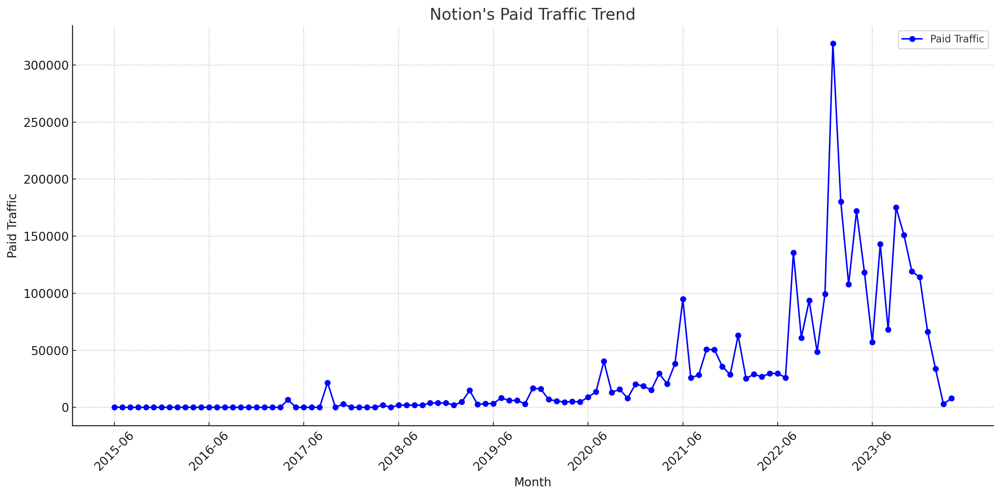

# Notion SEM Strategy Analysis (2024)

## Takeaways:

- **SEM Trend**: From June 2015 to January 2023, Notion's paid traffic demonstrated a consistent increase, peaking at an average of 18,585, indicating sustained growth in SEM efforts that likely enhanced overall market presence.
- **SEM Keyword Strategy**: During the period from January 2023 to September 2023, paid traffic surged to 148,906, suggesting a proactive and effective keyword targeting strategy during this phase, followed by a decline to 94,601 by March 2024, reflecting strategic adjustments or market shifts.
- **SEM URL Traffic Distribution**: The primary ad landing page, [https://www.notion.so/](https://www.notion.so/), emerged as the most significant in terms of traffic, consistently receiving the highest portion of SEM-driven visits. 

Note: The data used in this article is only for the desktop side in the US market. All data are taken from third-party platforms, this site does not guarantee the accuracy of the data.

The analysis of traffic trends for Notion's "Paid Traffic" over the specified phases is summarized in the table below. Each phase shows the average traffic and the observed trend:

| Phase  | Time Period          | Average Traffic | Trend      |
|--------|----------------------|-----------------|------------|
| Phase 1| 2015-06 to 2023-01   | 18,585          | Increasing |
| Phase 2| 2023-01 to 2023-09   | 148,906         | Decreasing |
| Phase 3| 2023-09 to 2024-03   | 94,601          | Decreasing |

**Analysis Summary:**
- **Phase 1 (2015-06 to 2023-01)**: There was a steady increase in paid traffic, indicating successful paid strategies or market conditions favoring paid ad placements.
- **Phase 2 (2023-01 to 2023-09)**: This period shows a sharp decrease in traffic despite previously high averages, which could suggest changes in ad spend, strategy, or decreased ad effectiveness.
- **Phase 3 (2023-09 to 2024-03)**: The decreasing trend continues, though at a lesser rate than in Phase 2, which might indicate stabilizing factors or adjustments in Notion’s paid traffic strategy.

See more about [Notion's SEO strategy](https://chloevolution.com/posts/notion-seo-strategy-analysis).
## Notion's SEM Strategy in January 2023

### Paid Keyword Distribution

The table below categorizes paid keywords into specific topics, detailing their respective traffic, traffic percentage, and average CPC:

| Keyword Topic        | Traffic | Traffic (%) | Average CPC | Keyword Example          |
|----------------------|---------|-------------|-------------|---------------------------|
| Competitor Brand     | 236,404 | 74.16%      | $8.25       | coda                      |
| Other                | 44,168  | 13.86%      | $3.44       | guru                      |
| Product-Related      | 33,744  | 10.59%      | $1.18       | notion                    |
| Project Management   | 2,850   | 0.89%       | $16.01      | project management tool   |
| Templates            | 1,620   | 0.51%       | $3.61       | google doc templates      |

Classification Rules:

- **Product-Related**: This category includes keywords that directly mention "Notion," focusing specifically on the brand. This grouping is crucial for targeting users specifically searching for Notion or its direct services, enhancing brand visibility and direct traffic.
  
- **Competitor Brand**: Keywords in this category include those related to known competitors such as [Asana](https://chloevolution.com/posts/asana-sem-strategy-analysis), Coda, [Jira](https://chloevolution.com/posts/atlassian-sem-strategy-analysis), Trello, [Monday.com](https://chloevolution.com/posts/monday-com-ads), Airtable, [ClickUp](https://chloevolution.com/posts/clickup-sem-strategy-analysis), and [Wrike](https://chloevolution.com/posts/wrike-sem-strategy-analysis). This classification helps analyze the strategy aimed at capturing traffic from competitor searches, a common practice in competitive SEO and SEM to attract users who may be comparing services or looking for alternatives.

- **Templates**: Keywords that involve specific tools or templates provided by Notion or generally sought within the industry. This categorization targets users looking for specific functionalities within project management and documentation platforms.

- **Project Management**: This includes keywords that are broadly related to project management tools and practices, not necessarily specific to Notion but relevant to the industry in which Notion operates. This category is vital for targeting professional and organizational users who are key decision-makers in the adoption of such tools.

- **Other**: Encompasses all other keywords that do not neatly fit into the above categories but are still used in paid campaigns. This could include generic terms or niche markets that Notion targets sporadically.

### Top 5 URL Traffic Distribution from Paid Keywords

| URL                                        | Traffic | Traffic (%) |
|--------------------------------------------|---------|-------------|
| https://www.notion.so/                     | 213,166 | 66.87%      |
| https://www.notion.so/projects             | 81,202  | 25.47%      |
| https://www.notion.so/wikis                | 13,112  | 4.11%       |
| https://www.notion.so/docs                 | 4,912   | 1.54%       |
| https://www.notion.so/confluence           | 3,847   | 1.21%       |

### Summary of Notion's SEM Strategy in January 2023

- **Aggressive Competitor Targeting**: Notion strategically allocates a significant portion of its SEM budget towards targeting competitor-related keywords. This is evidenced by the fact that 74.16% of the total paid traffic is directed at competitor brands, with an average cost per click (CPC) of $8.25. This demonstrates Notion's focus on capturing search traffic from users interested in or using competitor platforms.

- **Balanced Brand and Feature Promotion**: In addition to competing against other brands, Notion also emphasizes its own features and services. This is shown by the 10.59% of paid traffic directly related to "Notion" branded keywords, which have a notably lower average CPC of $1.18. Moreover, the promotion of specific features like templates, which attract 0.51% of the traffic with a CPC of $3.61, indicates targeted efforts to attract users looking for specific functionalities.

- **High Traffic Concentration on Primary URL**: A significant concentration of paid traffic (66.87%) is directed towards Notion's main website URL (https://www.notion.so/), suggesting that it serves as the primary landing page for the majority of Notion's paid campaigns. This centralizes user engagement and conversion activities on their main platform, streamlining the user experience from ad click to interaction.

- **Diverse SEM Tactics**: Notion’s SEM strategy employs a diverse range of tactics, indicated not only by the breadth of keyword categories targeted but also by the distribution of traffic across various related URLs. For instance, secondary URLs such as https://www.notion.so/projects and https://www.notion.so/wikis also receive substantial traffic, capturing 25.47% and 4.11% respectively, of the overall paid traffic. This suggests a strategy that extends beyond the main landing page to engage users at different interest levels and usage stages.

## Notion's SEM Strategy in September 2023

### Paid Keyword Distribution

| Keyword Topic        | Traffic | Traffic (%) | Average CPC | Keyword Example          |
|----------------------|---------|-------------|-------------|---------------------------|
| Product-Related      | 106,936 | 61.05%      | $1.21       | notion                    |
| Competitor Brand     | 41,889  | 23.92%      | $8.81       | airtable                  |
| Other                | 19,257  | 10.99%      | $3.95       | ai writer                 |
| Project Management   | 3,993   | 2.28%       | $15.07      | project management tools  |
| Templates            | 3,079   | 1.76%       | $5.96       | project plan template     |

**Classification Rule Explanation:**
- **Product-Related**: Keywords that include the term "Notion," focusing directly on the brand and its core offerings.
- **Competitor Brand**: Keywords that include names of known competitors, targeting users possibly comparing or seeking alternatives.
- **Templates**: Keywords specifically about templates, a feature in Notion and other platforms.
- **Project Management**: Keywords that encompass project management tools or related phrases, appealing to professional users.
- **Other**: Keywords that do not fit the above categories but are utilized in Notion's paid campaigns.

### URL Traffic Distribution

Here are the top 5 URLs based on the traffic distribution from paid keywords:

| URL                                          | Traffic | Traffic (%) |
|----------------------------------------------|---------|-------------|
| https://www.notion.so/                       | 60,375  | 34.47%      |
| https://www.notion.so/product                | 43,414  | 24.79%      |
| https://www.notion.so                        | 35,757  | 20.41%      |
| https://www.notion.so/product/projects       | 19,308  | 11.02%      |
| https://www.notion.so/product/ai             | 9,452   | 5.40%       |

### Summary of Notion's SEM Strategy in September 2023

- **Strong Focus on Brand-Related Keywords**: Notion's SEM strategy is heavily centered around its brand-related keywords, capturing 61.05% of the traffic with a relatively low average CPC of $1.21, demonstrating effective brand-centric advertising.
  
- **Significant Investment in Competing Against Rivals**: Notion aggressively targets competitor brands, constituting 23.92% of its traffic. This involves a higher CPC, reflecting the competitive nature of these keywords.
  
- **Diverse Advertising on Multiple URLs**: Notion disperses its traffic across several URLs, with the main site attracting the largest share, followed by product-specific pages. This indicates a strategy to engage users at various levels of their decision-making process, from general interest to specific product features.

## Notion's SEM Strategy in March 2024

### Paid Keyword Distribution

Thank you for pointing that out. Let's correct the classification to include 'notin' as a variation of 'notion', treating it as 'Product-Related'. I will update the keyword classification and recalculate the data accordingly. This adjustment ensures that all traffic related to Notion, including common typos, is accurately captured under 'Product-Related' to reflect a more precise analysis of their SEM strategy. Let's make this update now.

I've updated the classification and recalculated the data for Notion's paid keywords in March 2024. Here's the corrected analysis:

### Corrected Paid Keyword Strategy Analysis for March 2024

| Keyword Topic    | Traffic | Traffic (%) | Average CPC | Keyword Example          |
|------------------|---------|-------------|-------------|--------------------------|
| Product-Related  | 2,847   | 97.90%      | $1.78       | notion ai                |
| Competitor Brand | 60      | 2.06%       | $6.48       | confluence alternatives  |
| Other            | 1       | 0.03%       | $0.00       | bitbucket similar tools  |

**Classification Rule Explanation:**
- **Product-Related**: Keywords including 'notion' or directly related to Notion's products.
- **Competitor Brand**: Keywords involving direct competitors like Monday, Asana, Trello, and Confluence, aimed at capturing traffic from users interested in competitive products.
- **Other**: Keywords that do not fit into the primary categories but still contribute to paid traffic.

### URL Traffic Distribution in March 2024

| URL                                                                          | Traffic | Traffic (%) |
|------------------------------------------------------------------------------|---------|-------------|
| [https://www.notion.so/product/ai](https://www.notion.so/product/ai)         | 1,555   | 53.47%      |
| [https://www.notion.so/personal](https://www.notion.so/personal)             | 563     | 19.36%      |
| [https://www.notion.so/](https://www.notion.so/)                             | 253     | 8.70%       |
| [https://www.notion.so/fr-fr](https://www.notion.so/fr-fr)                   | 253     | 8.70%       |
| [https://info.notion.so/contact-sales/get-in-touch](https://info.notion.so/contact-sales/get-in-touch) | 218     | 7.50%       |

### Summary of Notion's SEM Strategy in March 2024

- **Predominant Focus on Brand-Related Keywords**: Notion directs the majority of its SEM efforts towards promoting its own brand, with 97.90% of its total paid traffic targeting 'Product-Related' keywords. This is demonstrated by the significant traffic to keywords like "notion ai," which is indicative of a strong focus on boosting brand awareness and feature-specific offerings, achieving an average CPC of $1.78.

- **Selective Competitive Targeting**: A smaller yet strategic portion of the SEM budget is allocated to 'Competitor Brand' keywords, representing 2.06% of the overall paid traffic. This includes targeting alternatives to competitors like "confluence alternatives" with a higher average CPC of $6.48, suggesting targeted efforts to attract users from competing services.

- **Minimal Investment in Non-Product Keywords**: Very limited traffic (only 0.03%) is directed towards other keywords not directly related to the product or competitors, such as "bitbucket similar tools." This indicates that Notion's SEM strategy is highly focused and not diluted by broad or unrelated keyword targeting.

## Summary

Notion's SEM strategy has shown both stability in its focus on product-related keywords and adaptability in how it engages with competitor keywords. The notable decrease in competitor keyword focus by 2024, combined with an overwhelming preference for product-related keywords, suggests a strategic pivot towards enhancing brand loyalty and recognition, possibly reflecting a stronger market position or a new strategic direction in marketing efforts:

### Similarities

1. **Consistent Focus on Product-Related Keywords**:
   - In January 2023, Notion's strategy heavily emphasized product-related keywords, constituting 61.05% of paid traffic.
   - By September 2023, this focus remained strong, with product-related keywords still capturing a significant portion (61.05%) of total paid traffic.
   - By March 2024, product-related keywords dominated even more, representing 97.90% of the traffic.
   - **Data Insight**: Notion consistently prioritizes its own branding in SEM campaigns to boost brand recognition and product visibility.

2. **Competitor Keyword Targeting**:
   - Throughout each period, targeting competitors remained a key strategy, though its scale and focus shifted slightly over time.
   - **Data Insight**: This strategy reflects a proactive approach to capturing market share from competitors and attracting potential customers exploring alternative solutions.

### Differences

1. **Shift in Competitor Brand Focus**:
   - In January 2023, 23.92% of the SEM traffic targeted competitor brands.
   - By September 2023, competitor brand targeting reduced slightly to 23.98%.
   - In March 2024, it further decreased to 2.06%.
   - **Data Insight**: There was a significant reduction in the emphasis on competitor keywords by March 2024, indicating a possible shift towards strengthening brand-specific advertising over competitive displacement.

2. **Change in Average CPC (Cost Per Click)**:
   - January 2023 saw an average CPC of $8.81 for competitor brands, indicating high competition and value on these keywords.
   - By March 2024, the average CPC for competitor brands was $6.48.
   - **Data Insight**: The decrease in CPC suggests a possible decrease in competition or a more efficient allocation of SEM spending towards more cost-effective keywords.

3. **Variation in Other Keyword Strategy**:
   - The proportion and focus on other non-brand and non-competitor keywords varied, with minimal traffic in March 2024 (0.03%) compared to earlier periods.
   - **Data Insight**: This indicates an increasingly focused SEM strategy, honing in on high-impact keywords and potentially reducing expenditure on broader or less directly related keywords.

