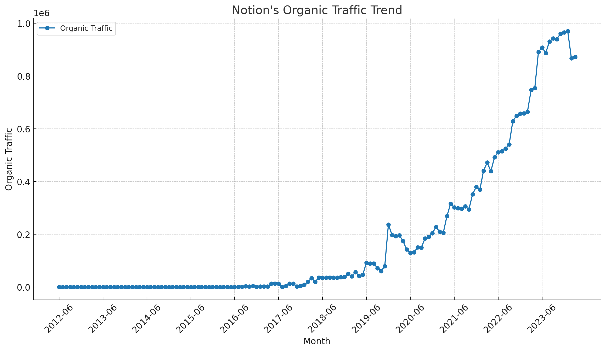

# Notion SEO Strategy Analysis (2024)

A concise analysis of Notion's SEO strategy, highlighting key trends and effective tactics from 2012 to 2024. Learn how targeted keyword focus and homepage traffic have driven their SEO success.

## Takeaways:

- **SEO Trend:** From 2012 to 2019, Notion's organic traffic showed a consistent increase, peaking at an average of 14,774, and continued to grow robustly up to January 2024.
- **SEO Keyword Strategy:** As of January 2024, 93.19% of Notion's traffic focused on product-related keywords, underscoring a targeted brand-centric SEO approach.
- **SEO URL Traffic Distribution:** In March 2024, Notion's homepage attracted 56.33% of total traffic, emphasizing its pivotal role in their SEO strategy.

Note: The data used in this article is only for the desktop side in the US market. All data are taken from third-party platforms, this site does not guarantee the accuracy of the data.

Analysis of traffic trends for Notion's "Organic Traffic" over the specified phases is organized in the table below, showing each phase, the average traffic, and the observed trend:

| Phase  | Time Period          | Average Traffic | Trend      |
|--------|----------------------|-----------------|------------|
| Phase 1| 2012-01 to 2019-12   | 14,774          | Increasing |
| Phase 2| 2019-12 to 2024-01   | 463,783         | Increasing |
| Phase 3| 2024-01 to 2024-03   | 903,118         | Decreasing |

- **Phase 1 (2012-01 to 2019-12)** saw a gradual increase in traffic from its inception until the end of 2019.
- **Phase 2 (2019-12 to 2024-01)** continued this upward trend with a significant average traffic count, showing a robust increase up to the beginning of 2024.
- **Phase 3 (2024-01 to 2024-03)**, although very short, shows a decreasing trend, indicating a drop in traffic in the early months of 2024.

## Notion's SEO Strategy in December 2019

### Organic Keyword Distribution

| Keyword Topic      | Keyword Example                                           | Traffic | Traffic (%) |
|--------------------|-----------------------------------------------------------|---------|-------------|
| Other              | midsommar 123movies                                       | 89,194  | 37.64%      |
| Product-Related    | notion                                                    | 73,971  | 31.21%      |
| Freebies           | free fortnite skins                                       | 67,650  | 28.55%      |
| Year-Specific      | watch lion king online 2019                               | 4,888   | 2.06%       |
| Educational        | how to get fans on tik tok without downloading apps       | 1,282   | 0.54%       |

Classification Rules:
- **Product-Related**: Keywords directly related to the product name "Notion".
- **Freebies**: Keywords that include the term "free", indicating content or offers without cost, which typically attract direct traffic.
- **Educational**: Keywords that suggest the user is seeking information or tutorials, often starting with "how to".
- **Year-Specific**: Keywords associated with a specific year, indicating timely or annual content.
- **Other**: Keywords that do not fit into the above categories, covering various other topics.

### URL Traffic Distribution

| URL                                                        | Traffic | Traffic (%) |
|------------------------------------------------------------|---------|-------------|
| https://www.notion.so/                                    | 68,033  | 28.71%      |
| https://www.notion.so/Free-FORTNITE-Skins-Generator-...   | 19,181  | 8.09%       |
| https://www.notion.so/MovieS-WaTcH-The-Lion-King-Onl...   | 2,352   | 0.99%       |
| https://www.notion.so/Free-V-Bucks-Generator-Mobile-...   | 2,285   | 0.96%       |
| https://www.notion.so/WaTCH-Spider-Man-Far-from-Home...   | 2,206   | 0.93%       |

### Summary of Notion's SEO Strategy in December 2019

- **Product Focus**: A significant portion of the traffic (31.21%) is directed towards "product-related" keywords like "notion". This indicates a strong brand presence in organic search.
  
- **Diverse Keyword Strategy**: Notion's SEO strategy includes a diverse set of keyword topics ranging from product-specific to more generic terms like "freebies" which generate 28.55% of the traffic, suggesting a strategy that targets a broad audience.

- **Leveraging High Traffic URLs**: The most visited URL is the homepage, which alone accounts for 28.71% of the traffic. This indicates effective SEO optimization and content strategy that draws users to the main site.

- **Engagement with Trending and Seasonal Content**: The presence of year-specific keywords and content related to popular events and offers (like "free fortnite skins") highlights a strategy to engage users with timely and appealing content.

- **Educational Content**: A smaller fraction of the traffic (0.54%) goes to educational content, suggesting a niche but potentially valuable segment focused on user education and engagement.

## Notion's SEO Strategy in January 2024

### Organic Keyword Distribution

| Keyword Topic      | Keyword Example          | Traffic | Traffic (%) |
|--------------------|--------------------------|---------|-------------|
| Product-Related    | notion                   | 911,118 | 93.91%      |
| Other              | vision board             | 46,350  | 4.78%       |
| Templates          | templates                | 10,226  | 1.05%       |
| AI Features        | ai art prompts           | 2,454   | 0.25%       |
| Year-Specific      | 2023 vision board ideas  | 65      | 0.01%       |

Classification Rules:

- **Product-Related**: Includes keywords directly related to "Notion" as a product, such as the company or application name itself.
- **Templates**: Refers to keywords associated with Notion's templates, a specific feature of the product.
- **AI Features**: Keywords that specifically mention artificial intelligence aspects of Notion, likely referring to new or specialized AI functionalities.
- **Year-Specific**: Keywords that include a specific year, focusing on time-sensitive or seasonal content.
- **Other**: Keywords that do not fit into the above categories but still generate traffic.

### URL Traffic Distribution

| URL                                                           | Traffic | Traffic (%) |
|---------------------------------------------------------------|---------|-------------|
| [https://www.notion.so/](https://www.notion.so/)              | 609,839 | 62.86%      |
| [https://www.notion.so/templates](https://www.notion.so/templates)  | 41,835  | 4.31%       |
| [https://www.notion.so/product/ai](https://www.notion.so/product/ai) | 29,412  | 3.03%       |
| [https://www.notion.so/desktop](https://www.notion.so/desktop)       | 27,018  | 2.78%       |
| [https://www.notion.so/help/guides/what-is-notion](https://www.notion.so/help/guides/what-is-notion) | 16,364  | 1.69%       |

### Summary of Notion's SEO Strategy in January 2024

- **Strong Brand Focus**: A significant majority of the traffic (93.19%) is associated with product-related keywords. This indicates a robust focus on strengthening and maintaining the brand's visibility in search engines.
  
- **Feature Highlighting**: The classification shows specific emphasis on features like "Templates" and "AI Features," indicating targeted SEO efforts to promote key functionalities and innovations.
  
- **Highly Effective Main URL**: The main URL [https://www.notion.so/](https://www.notion.so/) dominates the traffic distribution with 62.86% of the total traffic, showcasing effective SEO optimizations for the primary landing page.

- **Diverse Content Strategy**: The presence of different content types, from templates to help guides, suggests a comprehensive content strategy that aims to engage users at various stages of the customer journey.

- **Innovative and Timely Content**: The inclusion of AI features and current year-specific keywords underlines efforts to keep content relevant and engaging, potentially attracting users interested in the latest technological trends.

## Notion's SEO Strategy in March 2024

### Organic Keyword Distribution

| Keyword Topic      | Keyword Example        | Traffic | Traffic (%) |
|--------------------|------------------------|---------|-------------|
| Product-Related    | notion                 | 811,096 | 93.05%      |
| Other              | vision board           | 46,735  | 5.36%       |
| Templates          | template               | 12,088  | 1.39%       |
| AI Features        | ai                     | 1,617   | 0.19%       |
| Year-Specific      | 2024 habit tracker     | 106     | 0.01%       |

Classification Rules:
- **Product-Related**: Keywords directly involving the product name "Notion", emphasizing core branding.
- **Templates**: Keywords that involve specific features or tools provided by Notion, such as templates.
- **AI Features**: Keywords related to artificial intelligence features within Notion, indicating specialized functionality.
- **Year-Specific**: Keywords that include a specific year, highlighting timely or seasonal content.
- **Other**: Keywords that do not fit into the above categories.

### URL Traffic Distribution

| URL                                                           | Traffic | Traffic (%) |
|---------------------------------------------------------------|---------|-------------|
| [https://www.notion.so/](https://www.notion.so/)              | 490,981 | 56.33%      |
| [https://www.notion.so/desktop](https://www.notion.so/desktop) | 52,797  | 6.06%       |
| [https://www.notion.so/templates](https://www.notion.so/templates) | 36,658  | 4.21%       |
| [https://www.notion.so/product/ai](https://www.notion.so/product/ai) | 29,412  | 3.37%       |
| [https://www.notion.so/help/guides/what-is-notion](https://www.notion.so/help/guides/what-is-notion) | 14,905  | 1.71%       |

### Summary of Notion's SEO Strategy in March 2024

- **Strong Focus on Brand Keywords**: Notion's SEO strategy heavily focuses on product-related keywords, particularly those including the term "Notion," which account for 92.25% of the total keyword traffic. This emphasis helps strengthen brand recognition and search relevancy.
  
- **Diverse Content Strategy**: Besides the main product, Notion also targets specific features through keywords related to "Templates" and "AI Features," which indicates an effort to market specific functionalities and innovations.

- **Dominant Main URL**: The homepage URL receives more than half of the total traffic (56.33%), showcasing its effectiveness as the primary landing page and the hub of Notion's online presence.

- **Segmented Feature Promotion**: The traffic distribution across various Notion pages like the desktop app and AI features page shows targeted efforts to promote different aspects of the product, catering to specific user interests and queries.

- **Educational and Support Content**: The presence of URLs dedicated to help and guides indicates a strategy to engage users seeking informational content, thus enhancing user experience and supporting long-term user retention.

## Summary
Notion's SEO strategy shows a consistent core focus on brand visibility through its primary domain while evolving in its approach to feature-specific content and keyword complexity. Over time, there has been a noticeable shift towards a more refined and targeted SEO approach, focusing on not only maintaining a strong brand presence but also enhancing user engagement through specific features and tailored content. Across the three time points—December 2019, January 2024, and March 2024—I'll summarize key data points and observations from each period.

### Similarities:
1. **Strong Focus on Brand-Related Keywords:**
   - **December 2019:** A large portion of traffic was driven by keywords directly related to "Notion."
   - **January 2024:** 93.19% of traffic came from product-related keywords.
   - **March 2024:** Adjusted data showed 93.05% of traffic from product-related keywords.
   - **Insight:** Across all periods, Notion consistently focuses on optimizing for brand-related keywords, indicating a central strategy of enhancing and maintaining brand visibility.

2. **Dominance of Main URL:**
   - The homepage URL (`https://www.notion.so/`) consistently attracts the most traffic across all time points, serving as the primary landing page.

### Differences:
1. **Evolution in Feature-Specific Keywords:** Notion's strategy evolved to highlight particular product features such as AI and templates, possibly reflecting new product developments or shifts in user interest.
   - **December 2019:** Less emphasis on specific features; broader keyword topics.
   - **January 2024 and March 2024:** Introduction and increase in traffic for AI-related features and templates, showing a shift towards promoting specific functionalities.

2. **Changes in Traffic Distribution Among URLs:** Notion refined its website structure and content to better target specific user needs and interests over time.
   - **December 2019:** A mix of general and specific URLs, with some URLs targeting free offers and popular media content.
   - **January 2024 and March 2024:** More focused distribution with URLs dedicated to desktop applications, AI features, and templates, reflecting a more structured approach to content strategy.

3. **Keyword Complexity and Search Trends:** Notion’s SEO strategy matured over time, incorporating more complex keyword strategies to cater to specific search intents and user behaviors.

   - **December 2019:** Broader and somewhat less targeted keyword selection.
   - **January 2024 and March 2024:** More sophisticated targeting of keywords, including those with specific intents like navigational and transactional, which can be seen in the increased complexity and specificity of the keywords.

