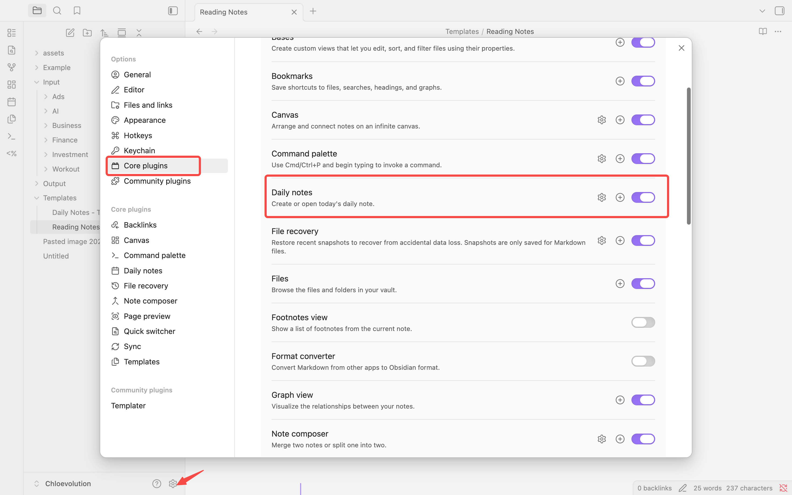

# How to Use Obsidian Daily Notes: Complete Beginner's Guide


Opening a blank note, staring at the blinking cursor, not knowing what to write—does this sound familiar?

That's exactly how I felt when I first started using Obsidian. Every day I'd think "I should write something down," but when I actually opened a note, I had no idea where to start. Sometimes I didn't know what to record, other times I felt like "this little thing isn't worth creating a dedicated note for." The result? Ideas would spin around in my head for a while, then disappear.

That all changed when I started using Daily Notes.

The core concept of Daily Notes is simple: every day has its own dedicated note, automatically created, ready to open anytime. You don't need to wonder "is this idea worth recording," and you don't need to stress about "which note should this go in." Just open today's Daily Note and write it down.

In this guide, I'll share:
- How to set up Daily Notes in 5 minutes
- 5 templates I actually use (you can use them directly)
- How to go from "not knowing what to write" to "wanting to record something every day"
- A few plugins that make Daily Notes even better
- Solutions to 20 common questions

Whether you're just starting with Obsidian or have been using it for a while but haven't gotten Daily Notes working, this article will help you.


## What Are Daily Notes?

Simply put, Daily Notes are notes that are automatically created each day.

Sounds pretty ordinary, right? But this "automatic creation" actually solves a big problem: **it lowers the barrier to recording**.

You don't need to think "is this idea worth creating a new note for," and you don't need to stress about "which folder should this note go in." Every morning when you open Obsidian, today's Daily Note is already there waiting for you. Click it, write it down—it's that simple.

**What's the difference between Daily Notes and regular notes?**

Regular notes are usually centered around a topic or project—like "Project A meeting notes" or "Book notes: Principles." They're permanent and require you to actively create and organize them.

Daily Notes, on the other hand, are anchored by **time**. They don't care about topics, only about "what happened today." You can record anything in them:
- Morning to-do list
- Afternoon meeting notes
- Evening random thoughts
- Even just "feeling good today"

This "anything goes" characteristic actually makes it easier to start recording. Because there's no pressure, no burden of "this note must be perfect."

**Why are Daily Notes so useful?**

Because they establish a **timeline**.

Three months later, when you wonder "when did I have that idea?", you can go back to that day's Daily Note and see the context—what project you were working on, what problems you encountered, who you talked to. This information helps you reconnect with your thinking from that time.

More importantly, Daily Notes make note-taking a **low-friction habit**. You don't need to think too much—open today's note, write it down, close it. Day after day, you'll find you've accumulated a wealth of valuable information—information that, without Daily Notes, would likely have been forgotten long ago.


## Quick Start: 5-Minute Daily Notes Setup

Alright, enough theory. Now let's get hands-on and set up Daily Notes in 5 minutes.

**Prerequisites**: Make sure you've already [installed Obsidian](https://chloevolution.com/posts/how-to-install-obsidian/) and created a vault. If you haven't, go complete the installation first, then come back and continue.

The entire process takes just 3 steps—follow along.

### Step 1: Enable the Daily Notes Plugin

Obsidian's Daily Notes feature is actually a built-in plugin that's disabled by default. We need to turn it on first. You can learn more about this plugin in the [official Obsidian documentation](https://help.obsidian.md/Plugins/Daily+notes).

1. Open Obsidian and click the **Settings icon** (gear) in the bottom left
2. Find **Core plugins** in the left menu
3. Scroll down and find **Daily notes**
4. Click the toggle on the right to turn it on

That's it. You'll see the toggle turn blue, indicating Daily Notes is now enabled.



### Step 2: Configure Daily Notes Settings

After enabling the plugin, we need to do some basic configuration.

1. In the left menu of the settings page, find **Daily notes** (it will appear under Core plugins)
2. Click to enter, and you'll see several settings

Here are the 3 most important settings:

**Date format**
- Default is `YYYY-MM-DD`, like `2026-05-25`
- I recommend keeping the default—this format is clearest and easy to sort
- If you prefer other formats (like `May 25, 2026`), you can change it

**New file location**
- This is the folder where Daily Notes are stored
- Default is the root directory, but I recommend creating a dedicated folder, like `Daily Notes` or `Journal`
- Click the folder icon to select or create a folder

**Template file location**
- You can leave this blank for now—we'll cover templates later
- If you already have a template file, you can specify it here


After configuring, click anywhere outside the settings page—settings will auto-save.

### Step 3: Create Your First Daily Note

Now for the exciting moment—creating your first Daily Note!

There are two methods:

**Method 1: Click the button**
- Look at the left sidebar—you'll notice a new **calendar icon** (📅)
- Click it, and today's Daily Note will automatically be created and opened

**Method 2: Use the command**
- Press `Ctrl/Cmd + P` to open the command palette
- Type `daily`, and you'll see `Open today's daily note`
- Press Enter, done

The first time you open it, you'll see a blank note with today's date as the title (like `2026-05-25`).


Now, try writing your first sentence. It can be anything:
- "Started using Daily Notes today"
- "To-do: Reply to emails"
- "Idea: Go hiking this weekend"

After writing, close the note. Tomorrow when you open Obsidian again, click that calendar icon, and you'll find Obsidian has automatically created tomorrow's Daily Note. It's that smart.

💡 **Pro tip**: Want faster access to Daily Notes? You can set up a keyboard shortcut. Go to Settings → Hotkeys, search for `Open today's daily note`, and set it to `Ctrl/Cmd + D`. From then on, one shortcut opens today's note.

### Advanced Setup: Open Daily Note on Startup

If the first thing you do every day when opening Obsidian is check your Daily Note, you can set it to open automatically on startup. This eliminates the manual clicking step—open Obsidian and you can start recording right away.

**Why do you need this feature?**

In the morning, you open your computer, launch Obsidian, then have to click the calendar icon or press a hotkey to open today's note. Although it's just one extra step, over time, this small friction might make you less inclined to open your Daily Note.

But if today's Daily Note is already there waiting for you when Obsidian starts, the barrier to recording becomes even lower.

**Method 1: Use Workspace Feature (Recommended)**

Obsidian's Workspace feature can save your window layout and open notes. This is the simplest method.

1. First open today's Daily Note
2. If you want to display other panels at the same time (like the Calendar plugin), open them too
3. Press `Ctrl/Cmd + P` to open the command palette
4. Type `Manage workspace layouts` and press Enter
5. Click `Save current layout`
6. Give it a name, like "Daily Note Workspace"
7. Open the command palette again and type `Manage workspace layouts`
8. Find the workspace you just saved in the list, click the three dots on the right
9. Select `Load on startup`

Done! Next time you open Obsidian, it will automatically load this workspace and today's Daily Note will open automatically.

**Method 2: Use Commander Plugin (More Flexible)**

If you want more control, you can use the Commander plugin. This plugin lets you customize commands that execute when Obsidian starts.

1. Install the Commander plugin (Settings → Community plugins → Browse → Search "Commander")
2. After enabling the plugin, go to Commander settings
3. Find the "Startup commands" section
4. Click "Add command"
5. Search for and add `Open today's daily note`
6. Save settings

Now every time you start Obsidian, it will automatically execute the "open today's daily note" command.

**Method 3: Combine with Templater for Smarter Startup**

If you have the Templater plugin installed, you can do more advanced things. For example:
- Not only open Daily Note on startup, but also automatically insert the template
- Automatically open different notes based on time of day (open Daily Note in morning, review note in evening)

This requires some coding knowledge. If you're familiar with Templater, you can run custom scripts on startup.

**Important Considerations**

1. **Don't make it too complex**: Auto-opening one note on startup is enough. If you set up too many automatic actions, Obsidian startup will slow down.

2. **Consider your use case**: If you use Obsidian for more than just Daily Notes and frequently check project notes or knowledge notes, having Daily Note open every time might actually be inconvenient. This feature is best for people who use Daily Note as their "work hub."

3. **Mobile differences**: Mobile Obsidian startup behavior isn't exactly the same as desktop. If you primarily use it on your phone, you may need to manually open Daily Note or use specific mobile plugins.

**Alternative Solution: Use Homepage Plugin**

Another approach is to install the Homepage plugin and set Daily Note as Obsidian's "home page." This way, every time you open Obsidian or click the "go to home page" button, you'll jump to today's Daily Note.

The benefit of this method is more flexibility—it's not forcing Daily Note to open every startup, but giving you a quick way to return to Daily Note.

**My Recommendation**

When you're just starting with Daily Notes, don't rush to set up auto-startup. Use it for a while first, confirm that Daily Note really is a note you open every day, then set up this feature.

For most people, **Method 1 (Workspace feature)** is the simplest and most practical. Set it once, then forget about it.


## Practical Workflows: Actually Using Daily Notes

You've set it up, now what?

This is where many people get stuck. The Daily Notes feature is enabled, but they still don't know what to write each day, and after a few days, they give up.

I was the same way at first. Later I gradually figured out a workflow, and now Daily Notes has become a note I open every single day.

I'll share it with you, hoping it helps you build this habit too.

### Morning Routine: Start Your Day in 10 Minutes

My habit is to open today's Daily Note first thing in the morning (even before checking email).

This 10-minute morning routine helps me clear my thoughts and know what I need to do today.

**Step 1: Brain Dump (5 minutes)**

Open the Daily Note and write down all the thoughts in your head. No need to organize, no need to be perfect—write whatever comes to mind.

For example:
```
- Yesterday's meeting mentioned changing the plan, need to follow up today
- Remember to reply to Zhang San's email
- Want to go hiking this weekend
- That bug still isn't fixed, a bit worried
- Need to buy groceries tonight
```

This process is magical. Once you write thoughts down, your mind clears, and you stop running these "to-dos" in the background.

**Step 2: Identify Today's 3 Priorities (3 minutes)**

From the brain dump, pick out the 3 most important things.

Why 3? Because if you list 10 priorities, that's the same as having no priorities. 3 is just right—focused but not overwhelming.

```
## Today's Priorities
1. Revise project plan and send to team
2. Fix that login bug
3. Reply to Zhang San about the collaboration
```

**Step 3: Quick Schedule Review (2 minutes)**

If you have meetings or appointments today, note them in the Daily Note too. This gives you a full view of your day.

```
## Today's Schedule
- 10:00 Team weekly meeting
- 14:00 Client phone call
- 18:00 Gym
```

That's it—in 10 minutes, you're ready for the day.

### Daytime Use: Capture Ideas Anytime

The biggest value of Daily Notes is that it's always there, ready to record.

**Quick Notes**

A sudden idea pops up during work? Press `Ctrl/Cmd + D`, open today's Daily Note, write it down.

```
## Random Notes
- Idea: Could use this method to optimize database queries
- Reminder: Need to prepare quarterly summary next week
- Inspiration: Could write an article about XX this weekend
```

No need to think "which note should this idea go in"—just record it first. If the idea turns out to be important later, extract it into a separate note.

**Meeting Notes**

During meetings, I also take notes directly in the Daily Note.

```
## 14:00 Client Communication Meeting
- Client very satisfied with new feature
- Suggested 3 improvements:
  1. Would like export functionality
  2. Can interface colors be adjusted
  3. Need mobile support
- Next step: Organize requirements document, send to them by next Monday
```

After the meeting, if the content is important, I'll extract these notes into the project note. But for most meetings, leaving them in the Daily Note is enough.

**Using Wikilinks to Build Connections**

When you mention a project or person, link them with `[[double brackets]]`.

```
Today discussed [[Project A]] progress with [[Zhang San]], he mentioned a good idea.
```

The benefit of doing this is that later when you open the "Project A" note, you can see all the Daily Notes that mention it. The timeline is established this way.

### Evening Review: 5-Minute Wrap-Up

Before the day ends, spend 5 minutes reviewing today's Daily Note.

**Step 1: Check Off Completed Tasks (1 minute)**

Check off what you completed today. This action feels very rewarding.

```
## Today's Priorities
- [x] Revise project plan and send to team
- [x] Fix that login bug
- [ ] Reply to Zhang San about collaboration (didn't get to it)
```

**Step 2: Handle Incomplete Tasks (2 minutes)**

What about tasks you didn't finish?

- If you need to do it tomorrow, copy it to tomorrow's Daily Note
- If it's not urgent, move it to the project note's to-do list
- If it's no longer important, just delete it

Don't let incomplete tasks pile up—it creates mental burden.

**Step 3: Write a Sentence or Two of Reflection (2 minutes)**

Finally, write a sentence or two about today's feelings or learnings. No need for a long essay.

```
## Today's Reflection
Pretty efficient today, completed all morning priorities. That bug was simpler to fix than expected—turned out to be a configuration issue. Remember to reply to Zhang San tomorrow.
```

This habit seems small, but after sticking with it for a while, you'll find these reflections very valuable. They record your growth trajectory.

### How to Build the Daily Notes Habit

Honestly, when I first started using Daily Notes, I was on and off. Later I summarized a few methods that helped the habit stick:

**Start Super Simple**

The first week, don't put too much pressure on yourself. Even writing just one sentence a day is fine.

"Started using Daily Notes today."—That's enough.

Once the habit forms, gradually add more content.

**Fixed Time Trigger**

Tie Daily Notes to a fixed time. For example:
- Open Daily Note while drinking morning coffee
- Spend 5 minutes after lunch writing about the morning
- Do evening review before bed

With a fixed time anchor, habits are easier to maintain.

**Allow Yourself to Be "Imperfect"**

Some days you'll forget to write, some days you'll only write a sentence or two, some days you'll write a ton.

That's all okay.

Daily Notes isn't a check-in task—you don't need to pursue "XX consecutive days without missing." What matters is that when you need to record, it's there.

**30-Day Challenge**

If you want to seriously build this habit, try a 30-day challenge:

- Days 1-7: Write at least one sentence daily
- Days 8-14: Try the morning routine (3 priorities)
- Days 15-21: Add evening review
- Days 22-30: Complete workflow

After 30 days, Daily Notes will become your natural habit.


## 5 Daily Notes Templates: Find Your Style

The workflow I described earlier might be too complex for you, or maybe too simple.

Everyone's needs are different. Some prefer minimalism, others prefer detailed recording.

Here are 5 different styles of Daily Notes templates—you can use them directly or adjust them to your needs.

### Template 1: Minimalist (For Beginners)

If you're just starting with Daily Notes or don't like complex structures, this template is perfect for you.

```markdown
# {{date}}

## 3 Things to Do Today
-
-
-

## Random Notes

```

That's it. 3 things + a random notes area. Good enough.

### Template 2: Working Professional (For Office Workers)

If your work involves many meetings, tasks, and projects, this template helps you stay organized.

```markdown
# {{date}}

## 🎯 Today's Priorities
- [ ]
- [ ]
- [ ]

## 📅 Schedule
-

## 💼 Meeting Notes

### [Meeting Name] - [Time]
-

## 💡 Ideas & Inspiration

## 📝 Daily Summary
- What I completed:
- Problems encountered:
- To do tomorrow:
```

The benefit of this template is that all work-related content is in one place, nothing gets missed.

### Template 3: Student (For Learning and Exams)

If you're a student or learning new skills, this template helps you track learning progress.

```markdown
# {{date}}

## 📚 Today's Learning Goals
- [ ]
- [ ]

## 📖 Study Notes

### [Subject/Topic]
-

## ❓ Questions & To Resolve
-

## ✅ Today's Learnings
-

## 📌 Review Reminders
-
```

This template focuses on "questions" and "learnings." Write down what you don't understand and what you've learned—your learning will be more effective.

### Template 4: Project Manager (For Multiple Parallel Projects)

If you're working on multiple projects simultaneously and need to clearly track each project's progress, try this.

```markdown
# {{date}}

## Project Progress

### [[Project A]]
- Today's progress:
- To-do items:
- Blocking issues:

### [[Project B]]
- Today's progress:
- To-do items:
- Blocking issues:

## 🔥 Urgent Matters
-

## 📞 Communication Log
-

## 💭 Reflection
```

Use wikilinks `[[Project Name]]` to link to project notes, so in the project note you can see all related Daily Notes.

### Template 5: Life Journal (For Comprehensive Recording)

If you want to record not just work but also life, emotions, and health, this comprehensive template is for you.

```markdown
# {{date}}

## 🌅 Morning
- Wake up time:
- Breakfast:
- Mood:

## 💼 Work & Study
-

## 🏃 Health & Exercise
-

## 🎨 Hobbies & Interests
-

## 👥 Social & Relationships
-

## 🌙 Evening Reflection
- Happiest moment today:
- What I learned today:
- What I want to do tomorrow:
```

This template is quite detailed, suitable for people who want to comprehensively record their lives.

### How to Use Templates?

In the "Quick Start" section earlier, we mentioned template file settings. Now you can:

1. Choose any template above (or mix elements from several templates)
2. Create a template file in your vault, like `Templates/Daily Note Template.md`
3. Copy the template content into it
4. In Daily Notes settings, point "Template file location" to this file
5. From now on, every time you create a Daily Note, it will automatically use this template

💡 **Pro tip**: `{{date}}` is an Obsidian variable that automatically gets replaced with the current date. If you want a different date format, you can use formats like `{{date:YYYY-MM-DD}}`.

Remember, templates aren't set in stone. After using one for a while, you'll discover which parts are useful and which aren't. Adjust anytime to find the version that works best for you.


## Essential Plugin Recommendations: Make Daily Notes More Powerful

Obsidian's Daily Notes feature is already quite useful, but if you want more powerful functionality, try these plugins.

### Calendar Plugin: Visualize Your Daily Notes

**Necessity: ⭐⭐⭐⭐⭐**

This is the most essential plugin in my opinion. Once installed, you'll see a calendar in the right sidebar—click any date to open the corresponding Daily Note.

**Why do you need it?**
- Visualize which days have notes (dates with notes are marked)
- Quickly jump to past or future Daily Notes
- See your recording habits at a glance

**How to install?**
1. Open Settings → Community plugins
2. Click "Browse," search for "Calendar"
3. Install and enable

After installation, a calendar will appear in the right sidebar. Try clicking different dates—you'll find navigation becomes super convenient.


### Templater Plugin: Make Templates Smarter

**Necessity: ⭐⭐⭐⭐**

If you want more advanced template functionality, Templater is a must-install.

Obsidian's built-in template feature is fairly basic—it can only insert fixed text. Templater can:
- Automatically insert yesterday/tomorrow date links
- Display different content based on day of the week
- Automatically calculate dates (like "what's the date 7 days from now")

**Practical example:**

Add this code to your template to automatically generate "yesterday-today-tomorrow" navigation links:

```
[[<% tp.date.now("YYYY-MM-DD", -1) %>|← Yesterday]] | [[<% tp.date.now("YYYY-MM-DD", 1) %>|Tomorrow →]]
```

Every time you create a Daily Note, these links are automatically generated, making it easy to jump between different dates.

### Periodic Notes Plugin: Weekly Notes, Monthly Notes

**Necessity: ⭐⭐⭐**

If you want more systematic time management, Periodic Notes can help you create weekly notes, monthly notes, even yearly notes.

**Why do you need it?**
- Weekly review: Summarize what you did this week
- Monthly planning: Set goals for next month
- Multi-level time management: Day-week-month-year, forming a complete system

**How to use?**

After installation, you can set up:
- Weekly note template (like "3 big things completed this week")
- Monthly note template (like "monthly goal achievement status")

Then link to this week's/this month's note in your Daily Note, forming a hierarchical structure.

### Natural Language Dates Plugin: Create Notes with Natural Language

**Necessity: ⭐⭐⭐**

This plugin lets you quickly create future or past Daily Notes using natural language.

**Why do you need it?**
- Want to write tomorrow's to-do list in advance
- Need to plan arrangements for a specific day next week
- Want to review what happened on a certain day last week

After installation, you can input natural language like "tomorrow," "next Monday," or "3 days from now," and the plugin will automatically convert it to the corresponding date.

**How to use?**
1. Install the Natural Language Dates plugin
2. Press `Ctrl/Cmd + P` to open the command palette
3. Type `Natural Language Dates: Date`
4. Enter "tomorrow" or "next Monday"
5. The plugin will automatically create the Daily Note for that date

### Optional Plugins: Advanced User Choices

If you're already proficient with Daily Notes, consider these advanced plugins:

**Tasks Plugin**
- Function: Powerful task management
- Suitable for: People who need to track tasks across notes
- Difficulty: ⭐⭐⭐

**Dataview Plugin**
- Function: Query and aggregate data from all Daily Notes
- Suitable for: People who want statistical analysis (like "how many tasks completed this month")
- Difficulty: ⭐⭐⭐⭐

**Day Planner Plugin**
- Function: Time block planning, turn Daily Note into a schedule
- Suitable for: People who need precise time management
- Difficulty: ⭐⭐⭐

### My Recommendation

Don't install too many plugins at once.

Start with Calendar, use it for a while, get comfortable, then consider Templater. When you really feel "I need weekly notes," then install Periodic Notes.

Installing too many plugins actually increases complexity and makes you feel Daily Notes is "too much trouble."

Remember: Tools are meant to make life simpler, not more complex.

## Advanced Tips: Use Daily Notes to the Fullest

If you're already proficient with Daily Notes, here are some advanced tips to make your note system more powerful.

### Tip 1: Create Daily Notes for Future Dates

Sometimes you need to plan ahead—like tomorrow's to-do list or meeting prep for next Monday. But Daily Notes by default only creates "today's" note, so what do you do?

**Method 1: Use Calendar Plugin (Easiest)**

If you've already installed the Calendar plugin, this is super simple.

1. Look at the calendar in the right sidebar
2. Click on the date you want to create a note for (like tomorrow, next Wednesday)
3. Obsidian will automatically create the Daily Note for that day
4. Start writing content

This is the most intuitive method. Want to create a note for a specific day? Just click that date on the calendar.

**Method 2: Use Command Palette**

Don't want to install plugins? You can use the command palette.

1. Press `Ctrl/Cmd + P` to open the command palette
2. Type `Open daily note`, and you'll see a command called `Daily notes: Open daily note`
3. Select it, then a date picker will appear
4. Enter the date you want, like `2026-08-25`
5. Press Enter, and the Daily Note for that date is created

**Method 3: Use Natural Language Dates Plugin**

Want a more natural way? Try the Natural Language Dates plugin.

After installing this plugin, you can:
1. Press `Ctrl/Cmd + P` to open the command palette
2. Type `NLD: Date` (Natural Language Dates abbreviation)
3. In the input box that appears, enter natural language:
   - "tomorrow" → Creates tomorrow's note
   - "next Monday" → Creates next Monday's note
   - "in 3 days" → Creates note for 3 days from now
   - "next Friday" → Creates next Friday's note

The plugin will automatically recognize the date and create the corresponding Daily Note.

**Method 4: Manual Creation (Not Recommended but Works)**

If you don't want to install any plugins, you can create manually:

1. In your Daily Notes folder, create a new note
2. Name the file according to your date format, like `2026-08-25.md`
3. If you have a template, manually insert the template content

This method is clunky, but doesn't require any plugins.

**Real-World Use Cases**

When do you need to create future Daily Notes?

**Scenario 1: Weekend Planning for Next Week**
On Sunday evening, I create Daily Notes for Monday through Friday of next week and write key tasks for each day. This way when Monday morning arrives, I know exactly what to do.

```markdown
# 2026-08-25 (Monday)

## Today's Priorities
- [ ] Complete first draft of project proposal
- [ ] Phone call with client about requirements
- [ ] Prepare materials for team meeting

## Schedule
- 10:00 Team weekly meeting
- 14:00 Client phone call
```

**Scenario 2: Preparing for Important Meetings**
I have an important presentation in three days, so I create that day's Daily Note in advance and list out preparation items:

```markdown
# 2026-08-28 (Thursday)

## Presentation Prep
- [ ] Review PPT one last time
- [ ] Practice complete flow once
- [ ] Prepare backup examples

## Reminders
- Arrive 30 minutes early
- Bring USB backup
- Fully charge laptop
```

**Scenario 3: Recording Future Appointments**
A friend scheduled to meet next Saturday, so I note it in that day's Daily Note:

```markdown
# 2026-08-30 (Saturday)

## Appointments
- 15:00 Meet Li Si at coffee shop
- Discuss collaboration project
- Remember to bring that document
```

**Important Considerations**

1. **Don't create too many in advance**
   
   I've seen people create a whole month of Daily Notes at once. That's unnecessary. Usually creating 1 week ahead is enough—things too far out will likely change.

2. **Notes created in advance might stay empty**
   
   Sometimes plans don't keep up with changes, and the Daily Note you created in advance might not get used when that day comes. That's fine—empty is empty, it doesn't affect anything.

3. **Distinguish clearly from today's Daily Note**
   
   Creating in advance is for "planning," while today's Daily Note is for "execution." Don't stuff all ideas into future notes—things happening today should be recorded today.

**Combining with Templater: Automated Creation**

If you use the Templater plugin, you can set up a custom command to create Daily Notes for the remaining days of the week with one click:

```javascript
<%*
const today = tp.date.now("YYYY-MM-DD");
const daysToCreate = 7; // Create notes for next 7 days

for (let i = 1; i <= daysToCreate; i++) {
    const futureDate = tp.date.now("YYYY-MM-DD", i);
    // Note creation logic
}
%>
```

This is more advanced—if you're familiar with Templater, you can explore this.

**My Recommendation**

If you only occasionally need to create notes for tomorrow or the day after, the **Calendar plugin** is completely sufficient—just click the calendar.

If you frequently need to plan a week's content in advance, try the **Natural Language Dates plugin**—typing "next Monday" is even faster than clicking the calendar.

Don't learn complex tools specifically for the "create future notes" feature. Keep it simple, use what works.

### Tip 2: Use Tags to Categorize Content

In Daily Notes, use tags to mark different types of content.

```markdown
## Random Notes
- #idea Could use this method to optimize database queries
- #reminder Need to prepare quarterly summary next week
- #inspiration Could write an article about XX this weekend
```

The benefit of doing this is that later you can search for `#idea` to find all content marked as "idea," no matter which day's Daily Note they're scattered across.

### Tip 3: Build an MOC (Map of Content)

If your Daily Notes have accumulated for several months, there will be a lot of content. At this point you can create a "Daily Notes Index" note, linking important Daily Notes together.

```markdown
# Daily Notes Index

## Important Decisions
- [[2026-03-15]] - Decided to change jobs
- [[2026-04-20]] - Confirmed new project direction

## Important Ideas
- [[2026-02-10]] - Idea about product improvement
- [[2026-05-01]] - New writing topic

## Milestones
- [[2026-01-01]] - New Year goal setting
- [[2026-06-15]] - Project launch
```

This index is like a table of contents, helping you quickly find important Daily Notes.

### Tip 3: Auto-Aggregate with Dataview

If you've installed the Dataview plugin, you can automatically display all Daily Notes that mention a project in the project note.

Add this code to your project note:

```dataview
LIST
FROM "Daily Notes"
WHERE contains(file.content, "[[Project A]]")
SORT file.name DESC
LIMIT 10
```

This way you can see the most recent 10 Daily Notes that mention "Project A," automatically tracking project progress.

### Tip 4: Create a "Weekly Review" Process

Every Sunday evening, spend 15 minutes reviewing this week's Daily Notes:

1. Open this week's 7 Daily Notes
2. Extract important content to the weekly note
3. Organize incomplete tasks for next week
4. Write a weekly summary

This habit helps you be more aware of time passing and discover your growth trajectory.

### Tip 5: Integrate with Other Note Systems

Daily Notes aren't isolated—they should connect with your entire note system.

**Project Notes ← Daily Notes**
When mentioning projects in Daily Notes, use `[[Project Name]]` to link. This way in the project note you can see all related Daily Notes.

**People Notes ← Daily Notes**
When mentioning someone, also use wikilinks. Like `Today discussed collaboration plan with [[Zhang San]]`. Later when you open "Zhang San's" note, you can see all interaction records related to him.

**Knowledge Notes ← Daily Notes**
When learning new knowledge, first record it in the Daily Note. When it accumulates to a certain point, extract it into an independent knowledge note.

This way, Daily Notes become the "entry point" for your entire knowledge system—all ideas are first recorded here, then gradually organized into appropriate places.

## Common Questions FAQ

When using Daily Notes, you might encounter these questions.

### Q1: Won't Daily Notes accumulate and become hard to manage?

No. The advantage of Daily Notes is "automatic organization by time."

You don't need to actively manage them. Want to find a certain day's note? Just use the Calendar plugin to click the date. Want to search content? Use Obsidian's global search.

If you're really worried about too many files, you can create subfolders by year or month:
```
Daily Notes/
  2026/
    01/
    02/
  2025/
```

In Daily Notes settings, set "New file location" to `Daily Notes/{{date:YYYY}}/{{date:MM}}` to automatically categorize by year and month.

### Q2: I sometimes forget to write, what should I do?

Completely normal. I often forget too.

Daily Notes isn't a check-in task—you don't need to force yourself to write every day. What matters is that when you need to record, it's there.

If you want to build the habit, try this method: Don't pursue "writing every day," pursue "writing 3 times a week." Much less pressure, easier to maintain.

### Q3: What's the difference between Daily Notes and a diary?

Daily Notes are more like a "work log," while a diary is more like "emotional recording."

Daily Notes focus on:
- Recording facts (what I did today)
- Capturing ideas (sudden thoughts)
- Tracking tasks (to-do items)

Diaries focus on:
- Emotional expression (today's feelings)
- Self-reflection (why did this happen)
- Life recording (meaningful moments)

Of course, you can also combine the two. In Daily Notes, record both work and life and emotions. There are no fixed rules—whatever works for you is best.

### Q4: I want one long file for all my days instead of one file per day—is that possible?

Yes! While Obsidian's Daily Notes is designed for "one file per day," some people prefer the traditional journal feel—all content in one long file, writing down by date.

Both approaches have pros and cons. Let me break it down.

**Why do some people want a single long file?**

This need is quite common, especially for:

1. **Used to traditional journals**: Paper journals are flipped and written down page by page; one file feels more intuitive
2. **Don't like too many files**: Seeing hundreds of Daily Notes files in a folder feels messy
3. **Want to quickly browse all records**: One file lets you scroll through everything without clicking around
4. **Easier to export and share**: One Markdown file is a complete journal, simpler to export

**Single Long File vs Multiple Daily Notes: Comparison**

| Feature | Single Long File | Multiple Daily Notes (Default) |
|---------|------------------|-------------------------------|
| **File Management** | Simple, only one file | Needs folder organization |
| **Find Specific Date** | Need to scroll or search | Directly open corresponding file |
| **Loading Speed** | Slows down when file gets large | Each file is small, loads fast |
| **Backup & Sync** | One big file, higher conflict risk | Multiple small files, fewer conflicts |
| **Link to Other Notes** | Can only link to file, not specific day | Can precisely link to a specific day |
| **Review Experience** | Good continuous reading experience | Need to switch between files |
| **Plugin Compatibility** | Calendar and other plugins don't support | Fully compatible |

**How to Implement "Single Long File" Journal?**

Obsidian's Daily Notes plugin doesn't support this mode, but you can achieve it other ways.

**Method 1: Manually Manage One Journal File**

The simplest method is to not use the Daily Notes plugin and maintain your own journal file.

1. Create a note, like `My Journal.md` or `2026 Journal.md`
2. Manually add new date headers each day
3. Write your day's content under the header

```markdown
# My Journal

## 2026-08-20 Wednesday

Completed first draft of project proposal today. Meeting with client this afternoon—they're very satisfied with the new features.
Remember to reply to Zhang San's email tomorrow.

---

## 2026-08-21 Thursday

Revised a few details in the proposal this morning. Finally fixed that login bug—turned out to be a configuration issue.

---

## 2026-08-22 Friday

Weekly summary: Completed 3 priorities, overall progress is good. Planning to go hiking this weekend to relax.
```

**Pros**:
- Super simple, no plugins needed
- Complete control over format
- One file contains everything

**Cons**:
- Need to manually input dates
- File will grow increasingly large
- Can't use Calendar plugin and other tools

**Method 2: Use Templater to Auto-Append Content**

If you have the Templater plugin installed, you can set up a hotkey to automatically append today's date at the end of the file.

1. Create a Templater template file, like `Templates/Append Daily.md`:

```markdown
---

## <% tp.date.now("YYYY-MM-DD dddd") %>

<% tp.file.cursor() %>
```

2. In Templater settings, set this template as an "append template"
3. Set a hotkey for the "append to current file" command, like `Ctrl/Cmd + Shift + D`
4. Each day, press the hotkey to automatically add today's date header at the end of the file

**Pros**:
- Auto-inserts date, saves manual typing
- Maintains single-file simplicity
- Can customize template format

**Cons**:
- Need to learn Templater
- Still need to manually trigger
- Large files load slowly

**Method 3: Create Long Files by Year**

Compromise: Not "all days in one file," but "one file per year."

```
Journal/
  2025 Journal.md
  2026 Journal.md
  2027 Journal.md
```

Create a new file each year and write down by date inside it. This maintains the continuous feel of a long file without the file becoming too large.

**Method 4: Use Periodic Notes Plugin for Monthly Notes**

Further compromise: one file per month.

After installing the Periodic Notes plugin, set up monthly note templates. Each month's records go in one file. Not too large, but maintains some continuity.

**My Recommendation**

Honestly, I once tried the "single long file" mode but eventually returned to "one file per day."

**Why?**

1. **Obsidian's strength is linking**: When you link a specific day's note to a project note, a link like `[[2026-08-20]]` is very clear. With a long file, you can only link to the entire file, losing precision.

2. **Large files really do lag**: I've seen people's journal files exceed 1MB, taking several seconds to open—terrible experience.

3. **Calendar plugin is too useful**: Clicking the calendar to jump to that day's note is an experience long files can't replace.

4. **Backup and sync are safer**: Multiple small files spread the risk—you won't lose all records if one file gets corrupted.

**If you really want the long file feel**, I recommend the **create by year** approach. One file per year has continuity without being too large.

But if you're just starting with Obsidian, I suggest trying the default "one file per day" mode first. Use it for a month, see if you really can't get used to it, then consider switching to a long file. You might find the multi-file mode actually works quite well.

### Q5: How much content should I write in Daily Notes?

There's no standard answer.

Some days you might only write one sentence, other days you might write thousands of words. Both are fine.

My suggestion is: Don't pressure yourself. The purpose of Daily Notes is to make recording simple, not to become a burden.

If there's really nothing to write on a certain day, then don't write. Or just write "nothing special today." That's also a form of recording.

### Q6: Does content in Daily Notes need to be organized?

Depends.

Most content doesn't need organizing—leaving it in Daily Notes is fine. Their value is "recording the state at that time."

But if some content is important and worth preserving long-term, then extract it:
- Important ideas → Extract to dedicated idea notes
- Project progress → Extract to project notes
- Learning content → Extract to knowledge notes

My habit is to do one extraction during weekly review. Otherwise, let Daily Notes grow freely.

### Q7: Can I put images in Daily Notes?

Of course.

Drag images directly into the Daily Note, or insert with `![[image-name.png]]`. To learn more about managing images in Obsidian, check out the [complete image management guide](https://chloevolution.com/posts/managing-images-in-obsidian/).

Some people record in Daily Notes:
- Today's work screenshots
- Hand-drawn sketches of inspiration
- Interesting webpage screenshots

Images are also part of recording.

### Q8: How do I use Daily Notes on mobile?

Obsidian has mobile apps (both iOS and Android).

After installing, sync your vault (you can use iCloud, Dropbox, or Obsidian Sync), and you can open Daily Notes on your phone.

Mobile use cases:
- Record ideas during commute
- Quick notes during meetings
- Evening reflection before bed

Although typing on mobile isn't as fast as on computer, recording is better than not recording.

### Q9: Will Daily Notes get mixed up with other notes?

No, as long as you put Daily Notes in a dedicated folder.

My recommendation is:
```
vault/
  Daily Notes/        ← All Daily Notes
  Projects/           ← Project notes
  Knowledge/          ← Knowledge notes
  People/             ← People notes
  Templates/          ← Templates
```

This way categorization is clear and won't get messy.

---

Daily Notes is the simplest and most practical feature in Obsidian.

It doesn't require complex setup or learning advanced techniques. You just need to:
1. Open Obsidian
2. Click the calendar icon
3. Start writing

That's it.

Many people think "note-taking" is a very formal thing—it needs complete structure, needs to be written beautifully. But Daily Notes tells us: notes can be casual.

Today's ideas, today's tasks, today's mood—all can be recorded. No need for perfection, no need for organization, just record.

Three months later, when you look back at these Daily Notes, you'll discover:
- Oh, I was thinking about this problem back then
- Oh, this is how this project started
- Oh, I've grown so much

That's the value of Daily Notes. It's not about making you more organized, it's about letting you see your own trajectory.

So, start today.

Open Obsidian, create today's Daily Note, write the first sentence. It can be today's plan, a recent thought, or just "Started using Daily Notes today."

Don't overthink it, just start. Habits will gradually form, systems will gradually improve.

Your story begins with today's page.

