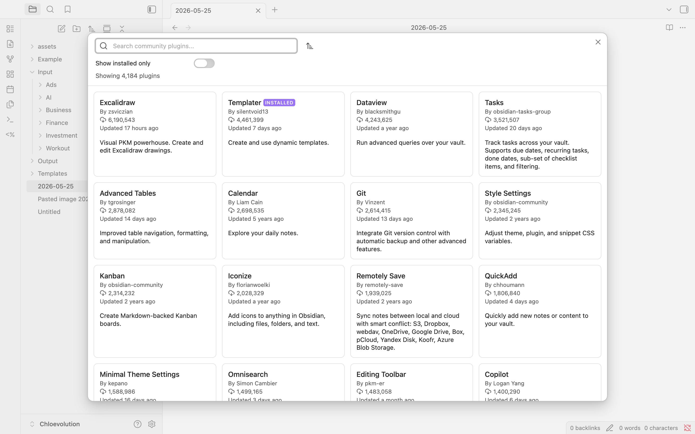

# The Complete Guide to Obsidian Plugins


When I first used Obsidian, I thought "it's okay, just a note-taking app."

The interface was clean, the features were adequate, but nothing special. After a few days, I was even a bit disappointed—is this the "most powerful note-taking tool" everyone talks about?

Until I started installing plugins.

After installing the Calendar plugin, my Daily Notes suddenly had a calendar view. After installing Templater, my templates became intelligent. After installing Dataview, my notes became a queryable database.

Now, with over 15 plugins running, Obsidian has transformed from "okay" to "can't live without it."

**Plugins are the soul of Obsidian**. If Obsidian itself is a powerful engine, then they are the fuel that makes this engine truly take off.

In this guide, I'll share:
- What Obsidian plugins are and why they're so important
- The difference between core plugins and community plugins
- How to discover, evaluate, and choose plugins that suit you
- Essential plugins recommended by category
- Best practices for plugin management
- Answers to the 10 most common questions

Whether you're a newcomer who just [installed Obsidian](https://chloevolution.com/posts/how-to-install-obsidian/) or an experienced user looking to optimize your plugin configuration, this article can help you.


## What Are Obsidian Plugins?

### The Power of Extensibility

Simply put, plugins are small programs that extend Obsidian's functionality.

Obsidian's design philosophy is interesting: **keep the core simple, extend functionality through plugins**. This means Obsidian itself only provides the most basic note-taking features, while all advanced features are implemented through plugins.

Why this design?

**1. Keep the Core Simple**
If all features were crammed into the core, Obsidian would become bloated, slow, and difficult to maintain. Through the plugin system, the core can remain lightweight and stable.

**2. User Customization**
Everyone's needs are different. Some need task management, some need drawing tools, some need code highlighting. Plugins let you install only the features you need.

**3. Community-Driven Innovation**
The Obsidian team has only a few people, but thousands of developers worldwide are creating plugins for it. This community-driven model brings amazing innovation speed.

The result: Obsidian can become whatever you want—a task management tool, knowledge base, writing platform, project management system, or even a code editor.

### Two Types of Plugins

Obsidian has two types of plugins: **core plugins** and **community plugins**.

#### Core Plugins

Core plugins are developed and maintained by the official Obsidian team. They:

- ✅ **Included by default**: Already present when you install Obsidian
- ✅ **Official support**: Maintained by the Obsidian team
- ✅ **Thoroughly tested**: Stability and security guaranteed
- ✅ **Ready to use**: No additional installation needed

However, most core plugins are **disabled** by default. You need to manually enable them.

**Common core plugins**:
- Daily Notes - Daily notes
- Templates - Template functionality
- Graph View - Knowledge graph
- Backlinks - Backlinks
- Quick Switcher - Quick switcher

#### Community Plugins

Community plugins are created by developers in the Obsidian community. They:

- 🌟 **Vast quantity**: Over 1,000 plugins available
- 🌟 **Rich innovation**: Cover various creative features
- 🌟 **Continuous updates**: Active developer community
- ⚠️ **Need evaluation**: Quality varies, requires your own judgment

Community plugins need to be manually installed, and before installation, Obsidian will remind you: **Community plugins may pose security risks**.

This doesn't mean community plugins are unsafe, but reminds you: these plugins are not officially developed, and you need to assess the risks yourself.

**Comparison table**:

| Feature | Core Plugins | Community Plugins |
|------|---------|---------|
| Developer | Official Obsidian | Community developers |
| Quantity | ~20 | 1,000+ |
| Installation | Included by default, manually enabled | Manual installation |
| Security | Officially guaranteed | Need self-assessment |
| Update frequency | Updates with Obsidian | Each plugin updates independently |
| Stability | Very stable | Depends on developer |
| Innovation | Conservative | Very innovative |


## Understanding the Obsidian Plugin Ecosystem

### Scale of the Ecosystem

How large is Obsidian's plugin ecosystem?

As of 2026, the number of community plugins has exceeded **1,000**, and new plugins are released every week. This number continues to grow.

More importantly, this ecosystem is very **active**:
- Dozens of plugins are updated daily
- Popular plugins have over 4 million downloads
- An active developer community continuously contributes new features

What does this mean?

**Good news**: Whatever your needs, someone has likely already created a corresponding plugin. Want Kanban-style task management? There's the Kanban plugin. Want hand-drawn diagrams? There's the Excalidraw plugin. Want code highlighting? There's the Editor Syntax Highlight plugin.

**Challenge**: There are too many plugins, how do you find the right ones? This is the problem this article aims to solve.

### How to Discover Plugins

There are three main channels to discover Obsidian plugins:

#### 1. Official Plugin Marketplace (Most Recommended)

This is the most direct way. Within Obsidian:
1. Open Settings
2. Click "Community plugins" on the left
3. Click the "Browse" button

You'll see all available community plugins, and you can:
- Search by name
- Sort by downloads
- Sort by recent updates
- View plugin descriptions and ratings

**Pros**:
- Convenient and quick, no need to leave Obsidian
- All plugins have undergone basic review
- Can install directly

**Cons**:
- Search functionality is fairly basic
- No detailed ratings and reviews
- Difficult to discover niche but quality plugins



#### 2. Obsidian Stats (Third-Party Tool)

[Obsidian Stats](https://obsidianstats.com) is a third-party website that provides more powerful plugin browsing features.

It offers:
- **Unified search**: Search plugins, themes, tags
- **Beta plugins**: Discover plugins not yet officially released
- **Star ratings**: Community ratings and reviews
- **Trend analysis**: See which plugins are trending
- **Weekly updates**: Subscribe to plugin update notifications

**My usage habits**:
- Discover and research on Obsidian Stats
- Check ratings, reviews, and download counts
- After deciding to install, return to Obsidian to install


#### 3. Community Recommendations

Obsidian has a very active community where you can find plugin recommendations:

- **Official Obsidian Forum**: [forum.obsidian.md](https://forum.obsidian.md)
- **Reddit**: r/ObsidianMD
- **Discord**: Official Obsidian Discord server
- **Personal blogs**: Many users share their plugin configurations

**Pros**:
- Real user experiences
- Can see actual use cases for plugins
- Can ask questions and discuss

**Cons**:
- Information is scattered, requires time to search
- May have subjective bias

### Plugin Security and Safety Considerations

Before installing community plugins, you need to understand plugin security.

Obsidian will display a warning when you first enable community plugins:

> ⚠️ **Security Notice**
>
> Community plugins are created by third-party developers, not officially developed by Obsidian. These plugins can access your file system and network.
>
> Please only install plugins you trust.

This warning is important. While the vast majority of plugins are safe, theoretically, malicious plugins could:
- Read your note content
- Modify or delete files
- Send data to external servers

**So, how do you assess plugin security?**

**Core principle**: Only install plugins you trust.

**Security assessment points**:

1. **Prioritize popular plugins**
   - Plugins with over 10,000 downloads are usually reliable
   - If there are obvious security issues, the community will quickly discover and warn

2. **Check if the plugin is open source**
   - Most community plugins are open source
   - Open source means the code can be reviewed
   - View source code on GitHub

3. **Pay attention to permission requirements**
   - Does the plugin need network access?
   - Does it need to access sensitive files?
   - Be cautious if permission requirements are unreasonable

4. **Try in a test vault first**
   - For unfamiliar plugins, use them in a test environment first
   - Observe for any abnormal behavior
   - Use in your main vault only after confirming safety


## How to Evaluate and Choose Plugins

### Plugin Evaluation Framework

Facing over 1,000 plugins, how do you choose the right ones?

I've summarized an evaluation framework with two dimensions: **quality indicators** and **compatibility indicators**.

#### Quality Indicators (Is this plugin good?)

**1. Active Maintenance**
- When was the last update?
- If not updated for over 6 months, it may have been abandoned
- Check GitHub commit history

**2. User Base**
- How many downloads?
- Over 10,000 downloads is usually a good sign
- But niche plugins can also be excellent

**3. Ratings and Reviews**
- Check ratings on Obsidian Stats
- Read user reviews, especially negative ones
- See what problems others have encountered

**4. Documentation Quality**
- Does the plugin have detailed documentation?
- Are there usage examples?
- Is there an FAQ or troubleshooting guide?

**5. GitHub Stars**
- Star count reflects community recognition
- Over 100 stars is usually a quality guarantee

#### Compatibility Indicators (Is this plugin right for me?)

**1. Does it solve your actual needs**
- Don't install just because it "looks cool"
- Ask yourself: Do I really need this feature?
- If the answer is "might be useful," don't install it yet

**2. Does it conflict with existing plugins**
- Is the functionality duplicated?
- Will it affect other plugins' work?
- Try in a test vault first

**3. Performance Impact**
- Will this plugin slow down Obsidian?
- Check reviews for performance complaints
- Pay special attention to plugins that need real-time processing

**4. Mobile Support**
- If you use Obsidian on phone/tablet, check mobile compatibility
- Not all plugins support mobile
- Plugin descriptions usually indicate this

### Avoid "Plugin Hoarding"

I've seen many people install 50+ plugins, resulting in:
- Obsidian startup becomes slow
- Plugins conflict with each other
- Can't remember what's installed
- Most plugins are never used

This is "plugin hoarding"—installing interesting plugins but never cleaning up.

**How to avoid it?**

**1. Minimization Principle**
Only install plugins you **truly need**. What does "truly need" mean?
- Use at least once a week
- Significantly improves your workflow
- Feel inconvenienced without it

**2. Use Core Features First**
Often, Obsidian's core features are sufficient. Don't install a bunch of plugins right away.

Use it for a while, discover pain points, then find plugins to solve them.

**3. Install One at a Time**
After installing a new plugin, use it for 2 weeks before deciding whether to keep it.

This way you'll clearly know what each plugin does and can discover problems in time.

**4. Regular Review**
Spend 10 minutes each month reviewing your plugin list:
- Which plugins haven't been used this month?
- Which plugins have duplicate functionality?
- Which plugins can be replaced with core features?

Delete the unused ones without hesitation.

**5. Record Plugin Purposes**
I have a note specifically for recording each plugin's purpose:
```markdown
# My Plugin List

## Templater
- Purpose: Create dynamic templates
- Usage frequency: Daily
- Reason to keep: Part of core workflow

## Kanban
- Purpose: Task management
- Usage frequency: Daily
- Reason to keep: Visualize task status

## Excalidraw
- Purpose: Drawing
- Usage frequency: 1-2 times per week
- Reason to keep: Very convenient when needing to draw flowcharts
```

This makes it easy to decide what to keep and what to delete during regular reviews.


## Essential Core Plugins Introduction

Before introducing community plugins, let's look at core plugins.

Many people overlook core plugins and go straight to installing community plugins. But actually, core plugins are already quite powerful, and they're officially maintained with guaranteed stability and security.

Let me introduce several of the most important core plugins.

### Daily Notes

**Function**: Automatically creates a note each day, named with the date.

**Suitable for**:
- Writing diary
- Daily task management
- Recording timeline
- Capturing temporary ideas

**Why it's important**:
Daily Notes is the core workflow for many Obsidian users. It lowers the barrier to recording—no need to think "is this idea worth creating a note for," just open today's Daily Note and write it down.

**How to enable**:
Settings → Core plugins → Enable Daily notes

**Detailed tutorial**: If you want to learn more about using Daily Notes, check out our [complete guide](https://chloevolution.com/posts/obsidian-daily-notes/).

### Templates

**Function**: Create reusable note templates.

**Suitable for**:
- Standardizing note formats
- Quickly creating specific types of notes
- Including commonly used structures and content

**Why it's important**:
Templates keep your notes consistent. For example, you can create different templates for meeting notes, reading notes, and project notes, and apply them directly when creating new notes.

**How to enable**:
Settings → Core plugins → Enable Templates

**Tip**: Templates is the basic template feature. If you need more advanced features (like dynamic content, JavaScript support), consider the community plugin Templater.

**Detailed tutorial**: Check out our [Complete Guide to Obsidian Templates](https://chloevolution.com/posts/obsidian-templates/).

### Graph View

**Function**: Visualizes connections between notes.

**Suitable for**:
- Discovering hidden connections between notes
- Viewing the overall structure of your knowledge network
- Finding isolated notes

**Why it's important**:
Graph View lets you see your entire knowledge base from a "god's eye view." You'll discover unexpected connections and see which notes are isolated and need more links.

**How to enable**:
Settings → Core plugins → Enable Graph view

**Usage tips**:
- Use colors to distinguish different types of notes
- Use filters to focus on specific topics
- Check regularly to discover knowledge blind spots

### Backlinks

**Function**: Shows which notes link to the current note.

**Suitable for**:
- Discovering citation relationships between notes
- Tracking the evolution of ideas
- Building bidirectional link networks

**Why it's important**:
Backlinks are one of Obsidian's core features. They let you see "who's citing me," helping you understand a note's position in your entire knowledge network.

**How to enable**:
Settings → Core plugins → Enable Backlinks

### Quick Switcher

**Function**: Quickly search and open notes.

**Suitable for**:
- Quickly navigate to any note
- No need to click through folders with mouse
- Improve work efficiency

**Why it's important**:
This is one of my most frequently used features. Press `Ctrl/Cmd + O`, type a few letters of the note name, press Enter, done. Much faster than searching through folders.

**How to enable**:
Settings → Core plugins → Enable Quick switcher (usually enabled by default)

### Other Core Plugins Worth Knowing

**File Explorer** - File tree in the left sidebar, usually enabled by default

**Search** - Global search functionality, supports regular expressions

**Outgoing Links** - Shows which notes the current note links to, complements Backlinks

**Tag Pane** - Shows all tags, quickly filter notes

**My suggestion**: First enable Daily Notes, Templates, and Quick Switcher, use them for a while, then enable other core plugins as needed.


## Community Plugin Category Recommendations

Now for the main event: community plugins.

Facing over 1,000 plugins, I've organized the most noteworthy plugins by **functional category**. For each category, I'll recommend 2-3 representative plugins and briefly explain their uses.

### Note Enhancement

These plugins make your notes more powerful and intelligent.

#### Templater (Essential)

**Function**: Advanced template features, supports JavaScript and dynamic content.

**Why recommended**: Enhanced version of the core Templates plugin, can insert dynamic dates, run JavaScript code, create interactive templates.

**Use cases**: Create meeting notes with current date, auto-generate filenames, display different content based on conditions.

#### Linter

**Function**: Automatically format notes, maintain consistency.

**Why recommended**: Automatically fix formatting issues, unify heading formats, clean up extra blank lines, correct spelling errors.

**Use cases**: Keep all notes consistently formatted, automatically organize imported notes, unify format during team collaboration.

#### Editor Syntax Highlight

**Function**: Code block syntax highlighting.

**Why recommended**: Improves code readability, supports multiple programming languages, lightweight without affecting performance.

**Use cases**: Recording code in notes, technical documentation, taking notes while learning programming.

### Task Management

These plugins help you manage tasks and projects in Obsidian.

#### Kanban

**Function**: Kanban-style task management.

**Why recommended**: Visualize task status, intuitive drag-and-drop operation, can archive completed tasks, supports tags and dates.

**Use cases**: Project management, personal task tracking, content creation workflow.

**My experience**: I use Kanban to manage my writing workflow: Ideas → Drafting → Editing → Published. Each article is a card, dragged to different lists to indicate different states.

#### Tasks

**Function**: Advanced task management and querying.

**Why recommended**: Powerful task query functionality, supports due dates and priorities, can create tasks in any note, automatically aggregates all tasks.

**Use cases**: GTD workflow, project task tracking, cross-note task management.

#### Calendar

**Function**: Calendar view, integrates with Daily Notes.

**Why recommended**: Visualize your Daily Notes, quickly jump to any date, see which days have notes, create weekly reviews.

**Use cases**: Journaling habit, timeline review, project time management.

### Visualization

These plugins let you express ideas graphically.

#### Excalidraw

**Function**: Hand-drawn style diagram tool.

**Why recommended**: Draw directly in Obsidian, hand-drawn style is visually friendly, supports export and embedding, can link to notes.

**Use cases**: Draw flowcharts, mind maps, architecture diagrams, quick sketches.

#### Dataview

**Function**: Turn notes into a queryable database.

**Why recommended**: Query notes with SQL-like language, dynamically generate lists and tables, supports JavaScript queries, extremely powerful functionality.

**Use cases**: Create dynamic indexes, aggregate notes with specific tags, generate reading lists, project dashboards.

### Search and Navigation

These plugins help you find and access notes faster.

#### Omnisearch

**Function**: Enhanced search, supports PDFs and images.

**Why recommended**: More powerful than built-in search, can search PDF content, more relevant search results.

**Use cases**: Searching in large knowledge bases, searching imported PDFs, fuzzy search.

#### Quick Switcher++

**Function**: Enhanced quick switcher.

**Why recommended**: Supports symbol search (headings, tags, etc.), smarter search algorithm, supports command mode.

**Use cases**: Quickly jump to specific parts of notes, search headings, advanced navigation.

### Sync and Backup

These plugins help you protect and sync notes.

#### Obsidian Git

**Function**: Sync notes to GitHub/GitLab using Git.

**Why recommended**: Free sync solution, complete version history, can roll back to any point in time, suitable for technical users.

**Use cases**: Backup notes, version control, multi-device sync (requires configuration).

**Note**: Requires some Git knowledge, not suitable for users completely unfamiliar with technology.

#### Obsidian Sync (Official Paid)

**Function**: Official sync service.

**Why recommended**: Simplest sync solution, supports all platforms (including mobile), end-to-end encryption, official support.

**Price**: $4/month or $48/year

**Use cases**: Multi-device sync, don't want to deal with technology, need mobile sync.

### Editor Enhancement

These plugins improve the editing experience.

#### Advanced Tables

**Function**: Table editing enhancement.

**Why recommended**: Keyboard shortcuts for table operations, auto-alignment, quickly add rows and columns, table navigation.

**Use cases**: Frequently editing tables, need complex tables, improve table editing efficiency.

#### Paste URL into Selection

**Function**: Smart link pasting.

**Why recommended**: Select text, paste URL, automatically creates link, saves time, intuitive.

**Use cases**: Adding external links, organizing web bookmarks, citing sources.

#### Various Complements

**Function**: Auto-completion.

**Why recommended**: IDE-like auto-completion, completes note names and tags, improves typing speed.

**Use cases**: Fast input, reduce spelling errors, improve efficiency.

## Frequently Asked Questions

### Q1: Are Obsidian plugins free?

Most plugins are free. Community plugins are almost entirely free, voluntarily maintained by developers. Only two official paid services: Obsidian Sync ($4/month) and Obsidian Publish ($8/month). Core plugins are completely free.

### Q2: Are community plugins safe?

Most are safe, but need self-assessment. The Obsidian community is very security-conscious, and no serious security incidents have occurred so far.

**Suggestions**: Only install plugins with high downloads and good reviews; check GitHub repository activity; read user reviews; prioritize open-source plugins.

### Q3: How many plugins should I install?

No fixed number, but 10-20 is recommended. Only install what you truly need, keep only those used at least once a week, regularly review and delete unused ones. I have 15 plugins installed, each with a clear purpose.

### Q4: Will plugins slow down Obsidian?

Possibly, depends on plugin quantity and type. Factors include plugin quantity, plugin type (real-time processing is more resource-intensive), vault size.

**Optimization suggestions**: Disable infrequently used plugins, avoid installing plugins with duplicate functionality, regularly check startup time.

### Q5: Do plugins work on mobile?

Partial support. Not all plugins support mobile, check plugin description before installing to see if mobile support is indicated.

**Mobile-friendly plugins**: Calendar, Templater, Kanban, Advanced Tables

**Plugins not supporting mobile**: Obsidian Git (technical limitations), some plugins dependent on desktop features

### Q6: How to update plugins?

Obsidian automatically checks for updates. Go to Settings → Community plugins → click "Check for updates", or click the update button next to each plugin. Recommend checking for updates regularly (once a week), read update logs to learn about new features.

### Q7: Can plugins be used offline?

Yes. Installed plugins work completely offline, network is only needed when installing or updating plugins. Exceptions: some plugins need network functionality (like Obsidian Sync) or need to access external APIs.

### Q8: What if a plugin is abandoned?

Find alternatives or continue using. Judgment criteria: no updates for over 6 months, no GitHub repository activity, no response to issues. Solutions: find alternative plugins in the community, continue using if plugin still works normally, technical users can fork and maintain themselves.

### Q9: Can I develop my own plugins?

Yes, but requires programming knowledge. Required skills: TypeScript/JavaScript, Node.js, understanding of Obsidian API.

**Learning resources**: [Obsidian Plugin Development Documentation](https://docs.obsidian.md/Plugins/Getting+started/Build+a+plugin), official example plugins, development channel on community Discord. Recommend starting with simple plugins, studying existing plugin code, seeking help in the community.


---


If Obsidian itself is a blank canvas, then plugins are the brushes in your hand. You can paint it into anything you want—a task management tool, knowledge base, writing platform, project management system.

Now, open Obsidian, enter the plugin marketplace, and start your exploration journey.

Start with one plugin and gradually build your own Obsidian.

