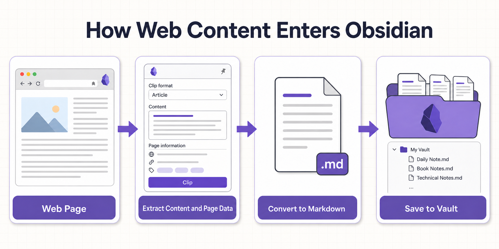
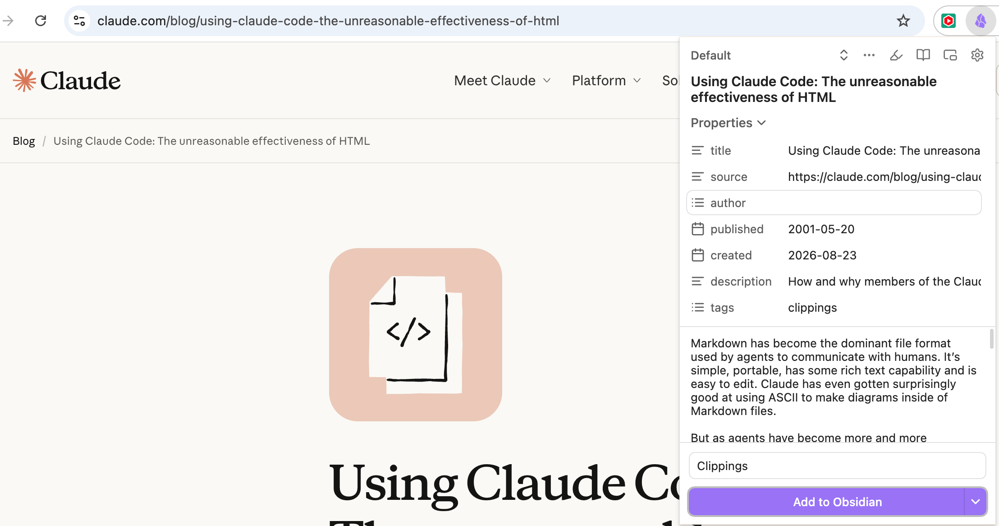
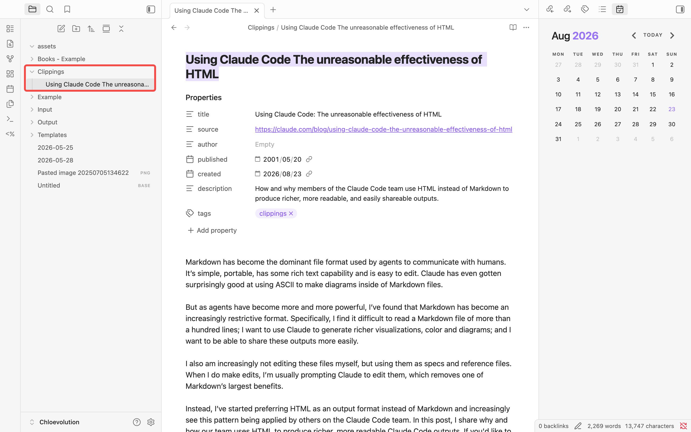
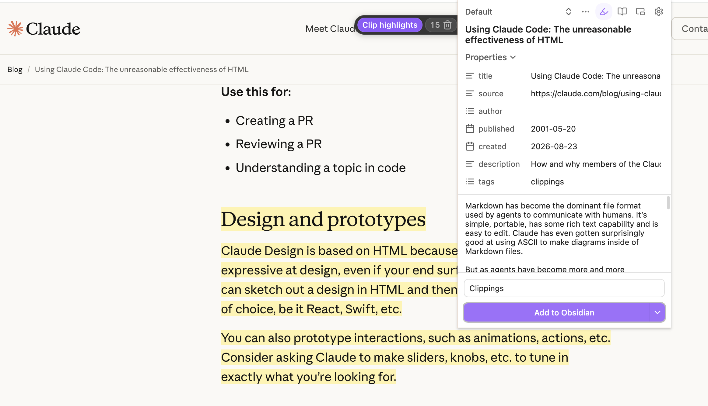
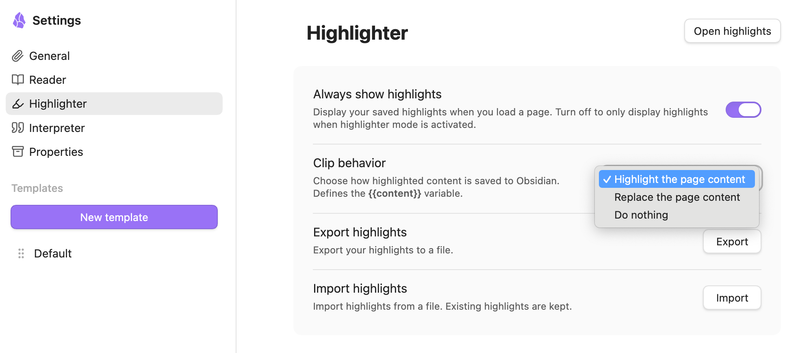
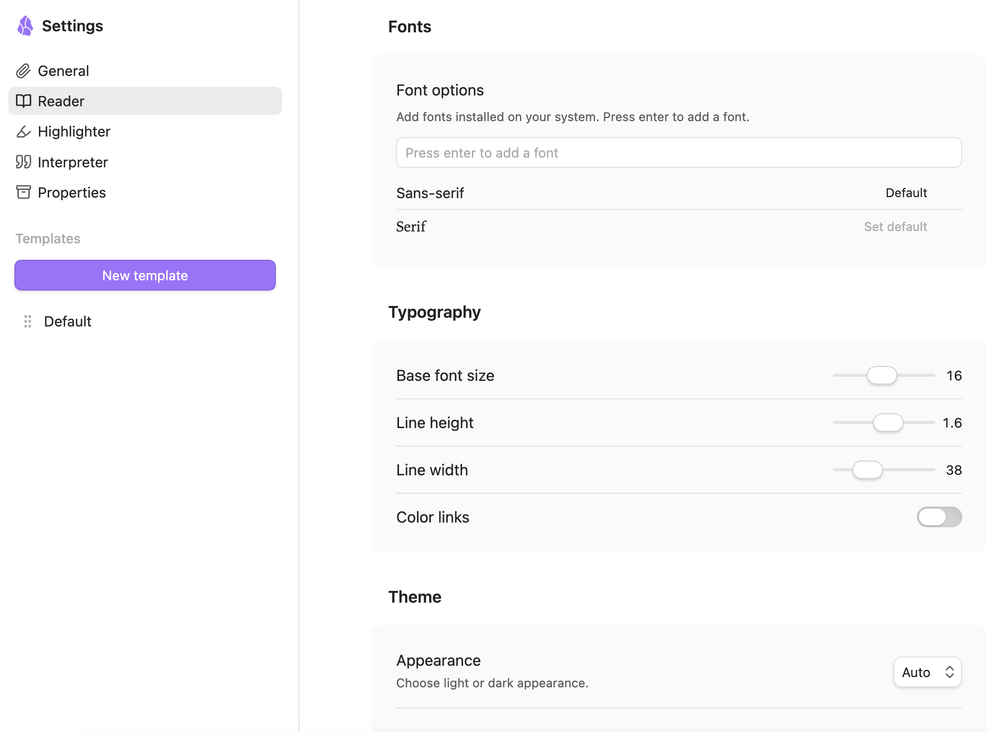

# Obsidian Web Clipper Guide: Installation, Web Clipping, and Highlights


Have you ever found a genuinely useful article, quickly added it to your bookmarks, and then failed to find it months later because you could not remember the title or which bookmark folder you used?

I used to send every interesting article straight to my bookmarks. The collection kept growing, but I rarely opened anything again. I then tried copying articles into Obsidian, only to find myself removing ads and navigation menus and manually adding the title, author, and source link every time.

Obsidian Web Clipper solves this problem. When you find a web page worth keeping, click the browser extension to extract its main content and page information, convert everything to a Markdown note, and save it to your vault.

The page is no longer just a URL buried in your bookmarks. It becomes an Obsidian note that you can search, link, and continue organizing.


## What Is Obsidian Web Clipper?

[Obsidian Web Clipper](https://obsidian.md/help/web-clipper) is a free, official browser extension from Obsidian. Put simply, it **turns web pages into Markdown notes in Obsidian**.

Suppose you are reading a long article and find a section that you may need later. You can save the entire article, select only the paragraphs you need, or highlight key passages as you read. Web Clipper organizes that content together with details such as the title, author, and source URL, then sends it to Obsidian.

A basic clipping workflow looks like this:

```text
Web page → Web Clipper extracts content and page data → Converts it to Markdown → Saves it to an Obsidian vault
```



The result is a regular Markdown note rather than a record that can only be viewed inside a particular read-it-later service. You can add Properties, tags, backlinks, and your own thoughts, then organize the clippings with search, [Obsidian Bases](https://chloevolution.com/posts/obsidian-bases/), or Dataview.

### What Can Web Clipper Save?

Web Clipper does more than copy an entire page exactly as it appears. You can choose different methods depending on the content you are viewing:

- **Save the main article content**: Automatically identifies the main content and tries to exclude menus, footers, and other irrelevant elements.
- **Save selected text**: Keeps only the paragraphs you actually need instead of clipping the entire article.
- **Highlight text, images, or content blocks**: Lets you mark important material while reading and save all highlights together in Obsidian.
- **Extract page information**: Automatically retrieves the title, author, website, URL, description, publication date, and other metadata.
- **Read with Reader mode**: Hides distracting elements so you can read and highlight the article in a cleaner view.
- **Standardize notes with templates**: Lets you define the filename, destination folder, Properties, and note structure in advance.
- **Process content with Interpreter**: Uses a language model to extract information, generate summaries, translate text, or transform its format.

Websites do not all provide the same information. Some pages do not correctly identify the author or publication date, so those fields may be empty. When clipping from a particular type of website for the first time, check the preview instead of assuming that every detail has been detected accurately.

### How Does Web Clipper Differ from Bookmarks and Copying and Pasting?

All three approaches can “save a web page,” but they suit different needs:

| Method | What it saves | Advantages | Limitations |
|---|---|---|---|
| Browser bookmark | Page title and URL | Fast and useful when you plan to revisit the original page | Depends on the original page and cannot search its full text directly |
| Copy and paste | Content you select manually | Flexible and requires no additional tool | Often requires formatting cleanup and manually adding source information |
| Web Clipper | Main content, selections, highlights, and page information | Automatically converts content to Markdown and supports reusable templates | Complex page layouts may require manual selection or template adjustments |

If you only want to reopen a page in a few days, a bookmark is enough. If you want to keep the content for the long term, search it later, annotate it, and connect it to other notes, Web Clipper is a better fit.

### Web Clipper Is Installed in Your Browser

Despite its name, Web Clipper is not installed from Obsidian's Community plugins marketplace. It is a browser extension available for Chrome, Edge, Firefox, and Safari.

Before you begin, you need two things:

1. Obsidian installed on your computer or mobile device, with at least one vault already created.
2. Web Clipper installed in the browser you normally use.

It is also different from Obsidian's Web viewer. Web viewer lets you open web pages inside Obsidian, while Web Clipper saves web content as notes. One is primarily for browsing; the other is for collecting.

### Where Are Clippings Saved?

Clipped notes go into the Obsidian vault you select and are fundamentally the same as Markdown notes you create yourself. Depending on your template settings, Web Clipper can:

- Create a new note.
- Add content to the top or bottom of an existing note.
- Add content to the current Daily Note.

Web Clipper is open source, and Obsidian states that it does not collect usage data. If you later enable Interpreter and connect it to an external language model, however, that data is handled according to the selected provider's policies. Ordinary web clipping does not require Interpreter, so you can ignore it when getting started.

One easily overlooked detail is that images on a web page are not downloaded to your vault by default. The note generally retains links to the images on the original website, which means they may not appear offline and will disappear if the source images are removed. To preserve them, run `Download attachments for current file` in Obsidian. See [How to Manage Images in Obsidian](https://chloevolution.com/posts/manage-images-in-obsidian/#download-web-images-as-local-attachments) for detailed instructions.

### When Is Web Clipper Useful?

Web Clipper is particularly useful when you regularly bring online material into Obsidian for further work. For example, you can use it to:

- Read and collect articles, blog posts, and news sources.
- Save papers, technical documentation, and research sources.
- Capture recipes together with their ingredients and instructions.
- Organize information about books, films, podcasts, or videos.
- Gather writing references and content ideas.
- Highlight important passages on a page and add your own notes.

Installing Web Clipper does not mean that everything you encounter needs to be saved. It simply makes the collection step easier; your clippings still need to be read and organized. Otherwise, the `Clippings` folder will quickly become another ever-growing archive.


## Install Obsidian Web Clipper

Installing Web Clipper is straightforward and usually takes only a few minutes. It supports Chrome, Edge, Firefox, and Safari, as well as Firefox Mobile and Safari on iPhone and iPad.

To avoid installing a similarly named third-party extension, start from the [official Obsidian Web Clipper page](https://obsidian.md/clipper), choose your browser, and then open the corresponding extension store.

### What Do You Need Before Installation?

Before installing the extension, confirm that:

- Obsidian is installed on the device.
- You have created and opened at least one vault.
- You know the exact name of that vault.
- Your browser allows extensions to be installed.

The vault name is not the same as its file path. If a vault is stored at `/Users/name/Documents/Obsidian/My Notes`, for example, its name is normally `My Notes`, not the entire path. If Web Clipper cannot save a note later, this is one of the first things to check.

### Which Version Should You Install?

| Browser or device | Installation source | Notes |
|---|---|---|
| Chrome | Chrome Web Store | Also works with Chromium-based browsers such as Brave, Arc, Orion, and Vivaldi |
| Microsoft Edge | Microsoft Edge Add-ons | The version from Edge's official extension store is recommended |
| Firefox | Firefox Add-ons | Supports desktop Firefox and Firefox Mobile |
| Safari | Apple App Store | Supports macOS, iOS, and iPadOS |

Browsers such as Brave, Arc, Orion, and Vivaldi can install the Chrome Web Store version. Their menu labels and the location of the pin button may differ slightly.

### Install in Chrome, Brave, or Another Chromium Browser

1. Open the [official Web Clipper page](https://obsidian.md/clipper).
2. Click “Add to Chrome” to open the Chrome Web Store.
3. Confirm that the extension is named “Obsidian Web Clipper” and that its developer information matches the official page.
4. Click “Add to Chrome.”
5. Approve the permissions shown by the browser.

After installation, click the extensions button beside the address bar, find Obsidian Web Clipper in the list, and click the pin icon. You can then open it directly from the toolbar whenever you find a page worth saving.


### Install in Microsoft Edge

1. Select the Edge version from the [official Web Clipper page](https://obsidian.md/clipper).
2. Open the Microsoft Edge Add-ons store.
3. Click “Get.”
4. Approve the browser's permission request.
5. After installation, use the Extensions menu to show Web Clipper on the toolbar.

Edge can install some extensions from the Chrome Web Store, but because Obsidian provides an Edge version, using it directly is simpler.

### Install in Firefox

1. Select the Firefox version from the [official Web Clipper page](https://obsidian.md/clipper).
2. Click “Add to Firefox” on the Firefox Add-ons page.
3. Read the permission information and confirm the installation.
4. Allow the extension to run in private windows if needed.
5. Pin its icon to the Firefox toolbar.

Web Clipper also supports Firefox Mobile. Open the extensions menu in the mobile browser, find Obsidian Web Clipper, and install it. The exact location of the option varies by operating system and Firefox version; update Firefox first if the install button is not available.

### Install in Safari on Mac

The Safari version is distributed through the Apple App Store:

1. Open the Safari App Store page from the [official Web Clipper page](https://obsidian.md/clipper).
2. Download and install Obsidian Web Clipper.
3. In Safari, go to “Settings → Extensions.”
4. Enable Obsidian Web Clipper in the extensions list.
5. Allow it to access the current website or all websites when prompted.

If you only grant access to individual websites, Web Clipper may be unable to read other pages. If you expect to use it regularly, you can allow access to all websites according to your privacy preferences.

### Install in Safari on iPhone or iPad

1. Install Obsidian Web Clipper from the App Store.
2. Open Safari, then tap the page menu button on the left side of the address bar.
3. Select “Manage Extensions” and enable Obsidian Web Clipper.
4. Go to “Settings → Apps → Safari → Extensions.”
5. Open Obsidian Web Clipper and allow it to access all websites if needed.
6. Go to “Settings → Apps → Obsidian.”
7. Set “Paste from Other Apps” to allow so that Obsidian can receive clipped content.

To use it, open a page, tap the extensions or puzzle button in Safari's address bar, and select Obsidian Web Clipper.

### Why Does Web Clipper Need Access to Web Pages?

During installation, you may see a permission request such as “Read and change website data.” Web Clipper needs to read the current page to identify its title, author, main content, and images, and to provide Highlighter and Reader mode on the page.

If you do not want it to have continuous access to every website, you can grant access only when clicking the extension or allow it on specific sites. You may then need to approve access manually whenever you visit a site that has not been authorized.

### How Do You Confirm That It Is Installed Correctly?

Open the Claude article used throughout the rest of this guide, [Using Claude Code: The unreasonable effectiveness of HTML](https://claude.com/blog/using-claude-code-the-unreasonable-effectiveness-of-html), and check the installation:

1. Open the article.
2. Click the Obsidian Web Clipper icon in the browser toolbar.
3. Confirm that the popup displays the article title, Properties, and a preview of the content.
4. Check that you can select a vault and destination folder at the bottom of the popup.

If the popup contains the page title and a content preview, the extension is working. Do not worry about templates yet. In the next section, we will save the first page with the default settings and then inspect the result in Obsidian.


## Save Your First Web Page to Obsidian

When using Web Clipper for the first time, resist the urge to customize its templates immediately. Start with one task: save a real article with the default settings and confirm that the web page, Web Clipper, and Obsidian can communicate correctly.

The examples below all use the Claude blog post [Using Claude Code: The unreasonable effectiveness of HTML](https://claude.com/blog/using-claude-code-the-unreasonable-effectiveness-of-html). It explains why the Claude Code team uses HTML to produce richer content that is easier to read and share.

This page is useful for testing Web Clipper because it has a clearly identified author and publication date, along with nested headings, lists, images, and a substantial amount of text. We will keep using it to demonstrate full-page clipping, selected text, and Highlighter.

### Step 1: Open Web Clipper

Open the example article in your browser, then click the Obsidian Web Clipper icon in the toolbar.



Web Clipper reads the current page automatically. After a second or two, the popup will display three main areas:

- At the top, you can switch templates, open Highlighter and Reader, or enter the settings.
- In the middle, you can see the Properties extracted from the page and a preview of the note body.
- At the bottom, you can select a vault and destination folder and send the content to Obsidian.

Both the Properties and note body can be edited before saving. If the title contains an unnecessary website name or the extracted description is inaccurate, change it directly in the preview. This will not affect the original page.

### Step 2: Review the Clipped Content

Start with the content preview. By default, Web Clipper tries to retain the main article while removing the top menu, sidebar, footer, and other unrelated elements.

For the Claude article, Web Clipper should identify the following information:

| Item | Expected content |
|---|---|
| Title | `Using Claude Code: The unreasonable effectiveness of HTML` |
| Author | `Thariq Shihipar` |
| Publication date | `May 20, 2026` |
| Source | Official Claude blog |
| Original URL | The full URL of the current article |

The Properties you actually see depend on the active template. If the default template does not add the author or publication date to Properties, that does not necessarily mean extraction failed; the template may simply not use those fields. A later guide to Web Clipper templates will show how to add them explicitly.

You do not need to inspect every word, but check that:

- The title is correct.
- The beginning and end of the article are complete.
- The author and publication date contain no obvious errors.
- The original URL has been retained.
- Special formatting such as code blocks, tables, and blockquotes appears correctly.

If a large portion of the article is missing, do not save it yet. Later sections show how to specify the required content with a text selection or Highlighter.

### Step 3: Choose a Vault and Destination Folder

Find the Vault option at the bottom of the popup and select the vault that should receive the note. Then enter or select a folder in the Folder field, such as:

```text
Clippings
```

I recommend using a separate folder for web clippings. Let new content land in `Clippings` first. After reading and organizing it, you can decide whether to connect it to a project note, move it elsewhere, or delete it. This is easier to maintain than designing many folders for different types of web pages from the beginning.

If you use multiple vaults, pay close attention to the selected one. Web Clipper remembers related settings and may not automatically switch to the vault currently open in Obsidian.


### Step 4: Click Add to Obsidian

After confirming the preview and destination, click “Add to Obsidian.”

The first time you do this, your browser may ask for permission to open Obsidian, or your operating system may ask you to confirm the app handoff. Allow it, and Obsidian will open the appropriate vault and create the note.

If the browser asks again later, you can choose to always allow the handoff according to your preference. Do not approve app-opening requests from unfamiliar pages; the request here should have been triggered by the Web Clipper button you just clicked.

### Step 5: Inspect the Markdown Note

Return to Obsidian and open the `Clippings` folder. You should see a new note named after the article:

```text
Using Claude Code The unreasonable effectiveness of HTML.md
```

The exact filename may differ because of the default template or the way your operating system handles characters such as colons, but the article should be easy to recognize from its title.

Open the note and check whether:

- The top of the note contains page Properties.
- The article body has been converted to Markdown.
- Headings, lists, links, and images display correctly.
- The original URL opens when clicked.

You can now edit this content like any other note. Deleting a paragraph, adding your own summary, or creating backlinks will not affect the original web page.




## Clip a Full Page, Selected Text, or Highlights

Once you have saved your first article successfully, the next question is no longer whether clipping works. It is how much content you actually want to keep.

Using the Claude article as an example, you could preserve the entire article in your vault, save only a paragraph explaining the advantages of HTML, or highlight separate sections such as “Information density,” “Visual clarity and ease of reading,” and “Ease of sharing” as you read. Web Clipper supports each of these workflows with full-page extraction, selected text, and Highlighter.

### Save the Full Article

To save the complete example article, do not select text or add highlights first. Return to the beginning of the article and open Web Clipper. It will automatically identify the main content and show it in the preview.

“Full article” does not mean every piece of HTML on the page. Web Clipper tries to exclude navigation menus, advertisements, comment areas, and footers, retaining only what it considers the article body. The resulting note is usually much cleaner than copying the entire web page manually.

This method is useful when you:

- Want to read the article without returning to the source website.
- Need the surrounding context rather than a handful of excerpts.
- Are saving a tutorial, research source, or long article that you may revisit several times.

Automatic extraction is not always perfect. Pages with complex layouts, content split across several regions, or text loaded through scripts may be incomplete in the preview. If that happens, select the necessary range manually or use Highlighter to mark individual sections.

For this example, scroll through the preview and confirm that the main sections from “Why use HTML?” through “Staying in the loop with Claude” are present, while the site navigation, related posts, and footer have been excluded.

### Save Only Selected Text

Suppose you do not want the entire article and only care about the explanation of HTML's advantages under “Why use HTML?” Select those paragraphs on the page before opening Web Clipper:

1. Use your mouse to select the paragraphs you want to save.
2. Keep the selection active and click the Web Clipper icon.
3. Confirm that the content preview includes only the selected passage.
4. Retain the original URL and other Properties.
5. Click “Add to Obsidian.”

Selecting text changes the body of the current clipping, but page information such as the article title, author, and source URL can still be saved. You retain the source without adding the entire long article to your vault.

To select the entire page, you can press `Ctrl/Cmd + A` before opening Web Clipper. This may also capture menus, buttons, and the footer. For a clean article, let Web Clipper extract the main content first and consider Select All only when its automatic extraction omits something important.


Selected text works well for one continuous passage. When useful paragraphs are scattered across an article, repeatedly copying them becomes cumbersome; Highlighter is more convenient in that situation.

### Mark Multiple Passages with Highlighter

Highlighter can mark several pieces of text, images, and content blocks on the same page. You can finish reading and highlighting first, then save all the important material to Obsidian at once.

In the Claude article, try highlighting three separate ideas:

1. Under “Information density,” highlight the passage explaining how HTML can contain tables, CSS, SVG, interactivity, and other rich information.
2. Under “Visual clarity and ease of reading,” highlight the author's comments on the readability of long Markdown documents.
3. Under “Staying in the loop with Claude,” highlight the closing explanation of how HTML helps the author remain involved in Claude's work.

Because these passages appear in different parts of the article, a normal selection cannot capture them conveniently in one step. Highlighter is designed for this read-and-extract workflow.

To use it:

1. Open Web Clipper and click the Highlighter icon at the top.
2. Return to the page and select the text you want to keep, or click an image or content block that can be highlighted.
3. Continue reading and add the other important passages.
4. Open Web Clipper again and review the highlighted content.
5. Click “Add to Obsidian” to save it.

You can also enable Highlighter from the context menu or with a keyboard shortcut. The default shortcuts are:

- macOS: `Option + Shift + H`
- Windows and Linux: `Alt + Shift + H`

You can change the shortcut in the General section of Web Clipper Settings. Safari currently does not support changing Web Clipper shortcuts.



The main difference between Highlighter and a normal selection is that a selection is best for quickly saving one continuous passage, while Highlighter lets you collect several separate points as you read. Web Clipper also remembers the highlights, so they remain visible when you return to the same page later.

### How Are Highlights Written to the Note?

In the Highlighter section of Web Clipper Settings, you can choose how highlighted content is written to the note:

- **Highlight the page content**: Retains the article body and marks selected passages with `==highlighted text==`.
- **Replace the page content**: Omits the full article and turns the highlights into a list.
- **Do nothing**: Saves the original article body without adding highlight markup.

Choose “Highlight the page content” when you want to preserve context and see the important passages inside Obsidian. Choose “Replace the page content” when you only want excerpts and prefer a shorter note.



The `{{content}}` variable becomes important when you create Web Clipper templates later. It does not always mean the entire article: without a selection or highlights, it normally contains the automatically extracted body; when a selection or highlights exist, its result depends on the current clipping and Highlighter settings.

### Which Clipping Method Should You Use?

| Need | Recommended method | Why |
|---|---|---|
| Save the complete article with its context | Full article | Automatically removes most irrelevant page elements |
| Keep only one continuous passage | Selected text | Fastest method with the shortest resulting note |
| Capture several separate ideas from a long article | Highlighter | Mark passages while reading, then save them together |
| Preserve the full article and emphasize key passages | Highlighter + Highlight the page content | Keeps the context and highlights in the same note |
| Create only a page index without saving the body | A custom template later | Retains only the title, URL, and page information |

You do not need elaborate rules for every website when getting started. Use full-article clipping for ordinary articles, a selection when you need one passage, and Highlighter when reading a long article closely. Those three habits cover most web-collection needs.


## Read with Reader Mode

The example Claude article is long and its original page also contains top navigation, product links, related articles, and a footer. If you want to finish reading before deciding what to keep, open the Reader built into Web Clipper.

Reader temporarily hides elements unrelated to reading and displays the title, author, publication date, main content, and images. It neither changes the source page nor saves anything to Obsidian automatically. Close Reader, and the page returns to its original appearance.

### How Do You Open Reader?

Open the example Claude article, then use any of these methods:

- Open Web Clipper and click the book icon at the top.
- Right-click the web page and open Reader from the context menu.
- Use the Reader shortcut: `Option + Shift + R` on macOS or `Alt + Shift + R` on Windows and Linux.

Reader replaces the original page layout with a cleaner reading interface. On a long article with several headings, it also creates a table of contents on the left. You can jump directly to sections such as “Why use HTML?,” “Getting started,” or “Frequently asked questions” instead of scrolling to find them.

Reader preserves images and basic formatting in the article and provides syntax highlighting for code blocks. If the article contains footnotes, you can open them without leaving the current page.


### Use Highlighter in Reader

Reader is more than a clean reading interface; it also works with Highlighter.

For example, open “Information density” from the table of contents, select an important passage, and highlight it. Then jump to “Visual clarity and ease of reading” and “Staying in the loop with Claude” to mark other key ideas.

When you finish, open Web Clipper and save those highlights to Obsidian just as you would on the original page. For a long article with many surrounding page elements, I prefer reading and highlighting in Reader because the boundaries of the article are clearer and there is less risk of selecting a menu or other irrelevant content.

### Adjust Reader's Appearance

Click the text settings icon in Reader's toolbar to change the font, font size, line height, line width, light or dark appearance, and color theme. You can also open Web Clipper Settings for additional options:

| Setting | What it changes |
|---|---|
| Font | Uses a font already installed on your system |
| Font size | Changes the body text size |
| Line height | Changes the distance between lines |
| Line width | Limits the width of the text so lines do not become too long |
| Appearance | Switches between light and dark appearance |
| Theme | Changes Reader's color scheme |
| Custom CSS | Provides further control over Reader's appearance with CSS |

You do not need to customize every setting at first. If each line feels too long, reduce Line width. If the text feels crowded, increase Line height slightly. These two changes often improve long-form reading more than switching themes.




---

The most useful thing about Obsidian Web Clipper is not that it helps you save more pages. It shortens the distance between finding something useful and bringing it into Obsidian for further thought and organization.

If you find yourself repeatedly editing filenames, Properties, and note structures, you are ready for the next step: creating Web Clipper templates. Templates, Variables, Filters, automatic website matching, and Interpreter will be covered in a separate advanced guide.

Start with one article you genuinely want to read. Choose the appropriate clipping method, save it to Obsidian, and add a sentence or two of your own. This simple workflow is more likely to become a lasting habit than building an enormous web-collection system from the start.

