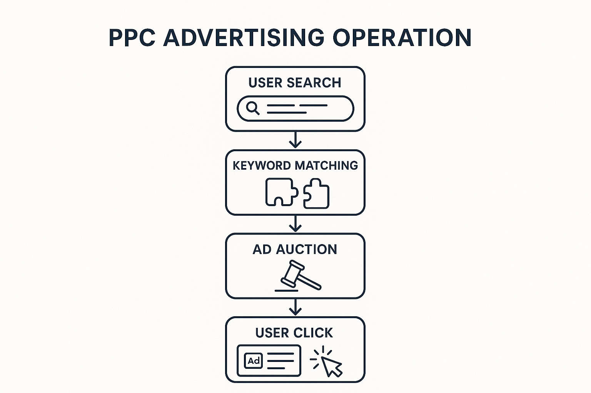
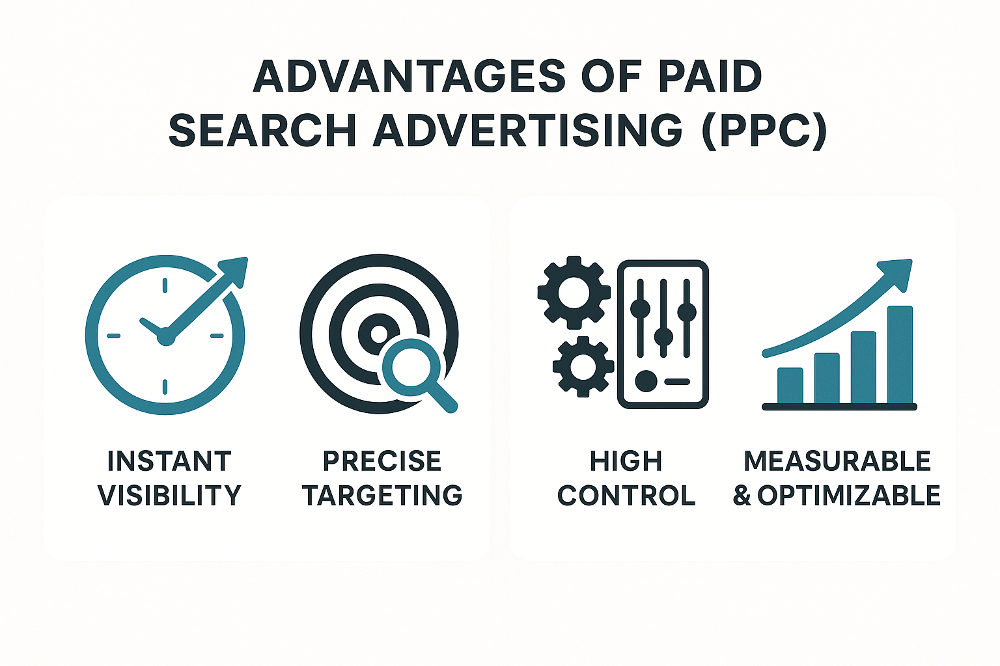
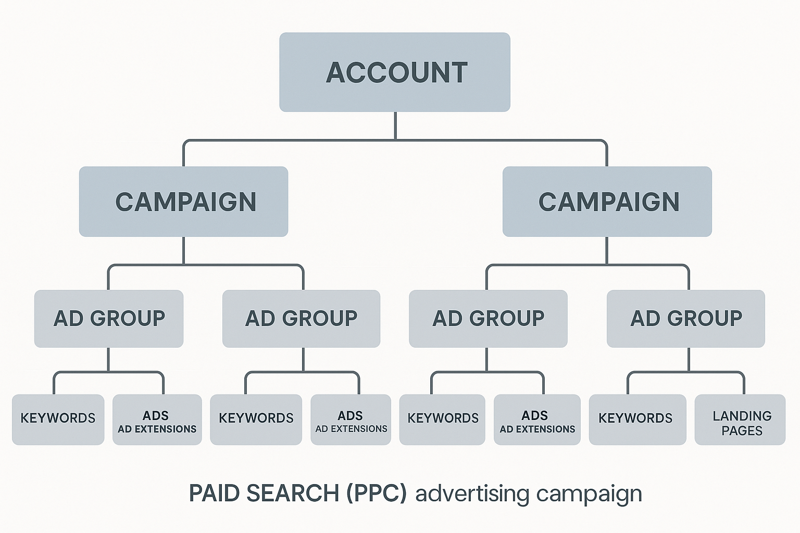
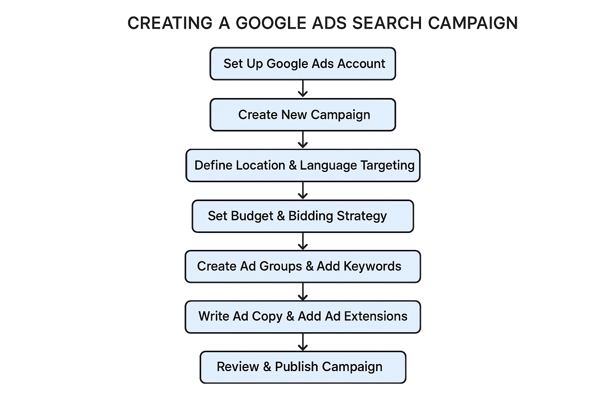
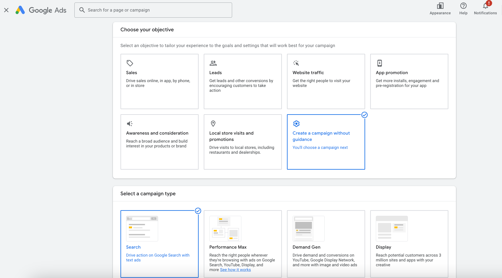
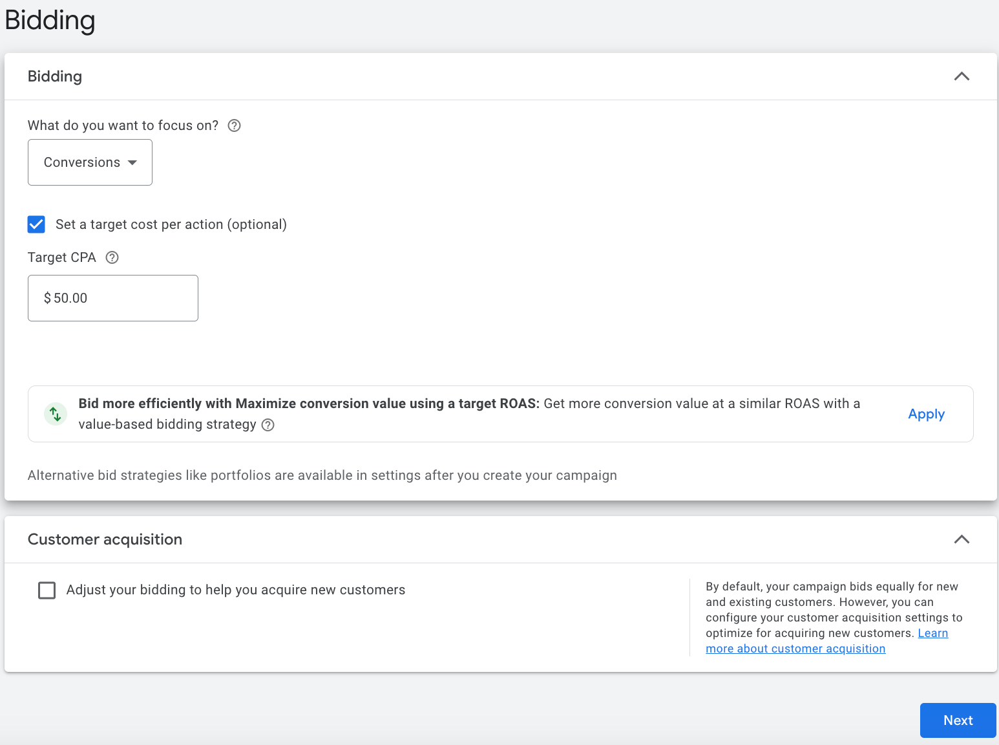
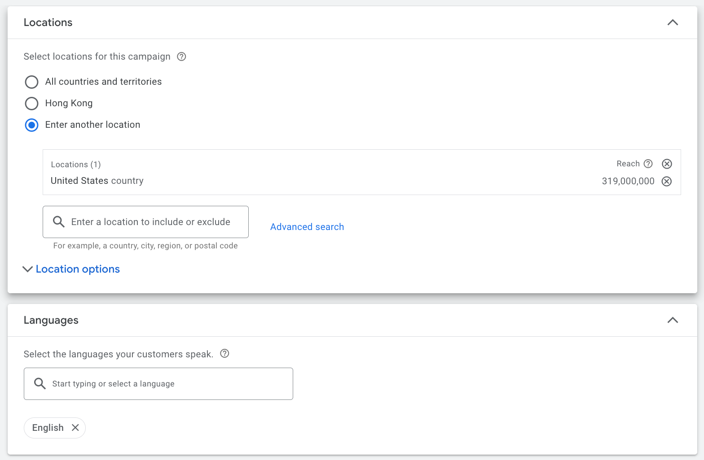
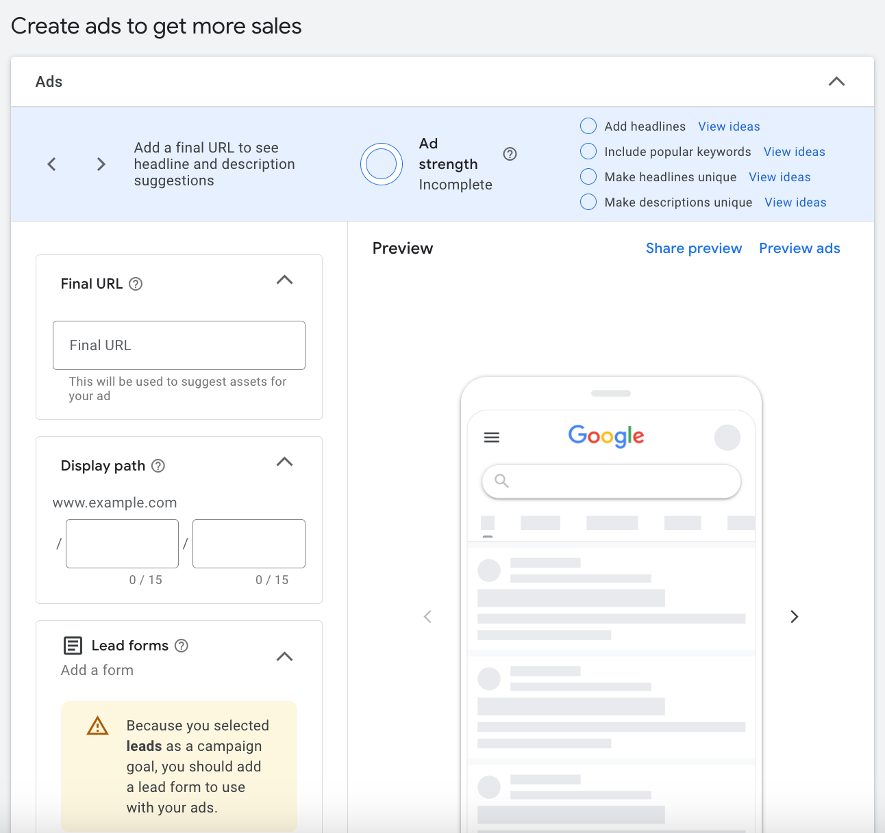
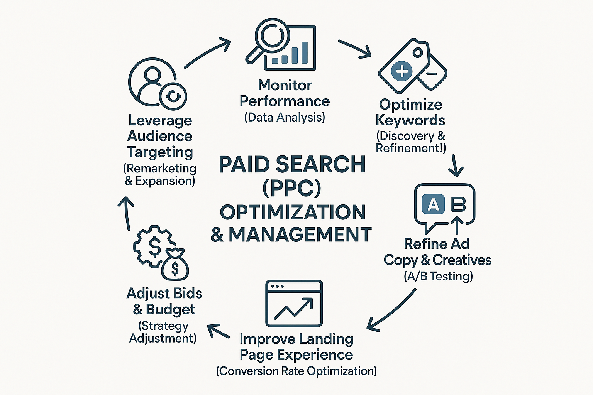

# The Ultimate Guide to Paid Search Advertising (PPC)

## What is Paid Search Advertising (PPC)?

In the world of digital marketing, if you want to quickly gain search engine attention, **Paid Search Advertising** is definitely your preferred strategy. It's often called **PPC (Pay-Per-Click)** advertising because, as the name suggests, you only pay when someone clicks on your ad.

Simply put, paid search advertising is a way to attract website traffic and potential customers by **purchasing ad placements on search engine results pages (SERPs)**. These ads appear in prominent positions in user search results, in the form of text, shopping listings, or videos, usually with a clear "Ad" or "Sponsored" label.

### How PPC Works: A Microsecond "Auction"

The operation of paid search advertising can be summarized as an efficient, real-time "auction" process that occurs every time a user searches:

1.  **User Search**: It all starts with the user's search behavior. When a potential customer types a **keyword** into a search engine like Google or Bing, they're signaling a clear demand.
2.  **Keyword Matching**: The search engine immediately scans all advertisers' campaigns to find keywords that **match** the user's search term. For example, if a user searches for "best running shoes," ads related to keywords like "running shoes" or "sports shoes" might be triggered.
3.  **Ad Auction**: After finding matching ads, the search engine initiates a **real-time bidding system**. All eligible ads compete based on their **bid** and **ad quality**. Note that a high bid isn't the only determining factor; the quality of the ad (e.g., relevance, landing page experience) is also crucial.
4.  **Ad Display**: Among the winning bids, higher-ranked ads are displayed to users at the top, bottom, or other prominent positions on the SERP. These ads will have clear "Ad" or "Sponsored" labels to distinguish them.
5.  **User Click**: When a user sees your ad and finds it valuable, they click through to your website. At this point, you only pay the advertising platform—this is where "pay-per-click" comes from.

### Main Platforms for Paid Search Advertising

Currently, the two dominant platforms in the paid search advertising market are **Google Ads** and **Microsoft Advertising**. Understanding their characteristics will help you choose the right platform based on your target audience and market.

  * **Google Ads** (formerly Google AdWords):

      * **Huge Market Share**: Dominates the global search engine market, meaning you can reach the vast majority of internet users on the Google Search Network and its extensive partner websites.
      * **Powerful and Comprehensive Features**: Offers the most complete ad types, targeting options, and data analysis tools, suitable for advertisers of all sizes and goals.
      * **Rich Ecosystem**: Not limited to search ads, it also includes the Display Network, YouTube video ads, app ads, etc., forming a comprehensive digital marketing ecosystem.
      * **Recommended Use Case**: If your goal is to reach the widest audience and requires granular ad control and optimization, Google Ads is the first choice.

  * **Microsoft Advertising** (formerly Bing Ads):

      * **Covers Microsoft Users**: Primarily displays ads on search engines like Bing, Yahoo\!, and AOL. Although its market share is smaller than Google, it can reach a loyal user base within the Microsoft ecosystem, for example, through Windows, Xbox, Microsoft Edge browser, etc.
      * **Unique User Demographics**: Studies suggest that Microsoft Advertising's user base may be slightly older, with relatively higher income and education levels, which can be more valuable for specific B2B or high-end product services.
      * **Relatively Less Competition, Potentially Lower Costs**: Due to lower competition than Google Ads, the **[Cost Per Click (CPC)](https://chloevolution.com/tools/cpc-calculator/)** for some keywords may be lower, which is an advantage for advertisers with limited budgets.
      * **Easy to Import Google Ads Data**: The Microsoft Advertising platform supports direct import of Google Ads campaigns, making cross-platform management convenient for advertisers.
      * **Recommended Use Case**: As a complement to Google Ads, helping you expand your reach, target specific user groups, and find more cost-effective traffic when your budget is limited.

Both platforms offer powerful tools to help advertisers manage and optimize their PPC campaigns. For most brands, **utilizing both platforms simultaneously** often leads to more comprehensive market coverage and better overall performance.

## Why Choose Paid Search Advertising?

In our **[SEM Basics Guide](https://chloevolution.com/zh-cn/posts/sem-basics/)**, we discussed how paid search advertising (PPC) works. Now, you might ask: with so many digital marketing strategies available, why should I prioritize paid search advertising?

### 1\. Instant Visibility and Precise Traffic: Quickly Reach High-Intent Customers

The biggest appeal of paid search advertising is its **immediacy**. Once your ad campaign is set up and approved, it can **immediately** appear at the top of the search engine results page (SERP). This means:

  * **Rapid Market Penetration:** Whether it's a new product launch, a short-term promotional event, or entering a new market, PPC can quickly get you exposure without long waits.
  * **Precisely Reach High-Intent Customers:** When users type keywords into a search engine, they have clear needs and intentions. Through in-depth **[keyword research and targeting](https://chloevolution.com/zh-cn/posts/keyword-research-and-targeting/)**, your ads can be directly presented to those actively looking for your product or service, ensuring **high-quality and highly relevant** traffic.

### 2\. High Controllability: Budget, Audience, Time, and Location All in Your Hands

Paid search advertising platforms (like [Google Ads](https://business.google.com/us/google-ads/)) offer strong **control**, allowing you to finely manage every aspect of your ad campaigns:

  * **Budget Control:** You can set daily or monthly budget caps to ensure ad spend doesn't exceed limits. You can flexibly adjust **[bidding strategies](https://chloevolution.com/zh-cn/posts/sem-bidding/)** to determine how much you pay per click. **For more detailed budget and bidding management, refer to our [ "Complete Guide to SEM Ad Costs"](https://chloevolution.com/zh-cn/posts/search-engine-marketing-cost/)**.
  * **Audience and Geo-targeting:** Ads can be targeted based on users' geographic location, language, device, and even demographic characteristics and interests, ensuring ads are only shown to the most relevant potential customers.
  * **Time Scheduling:** You can precisely schedule when your ads run, for example, only during your business hours or when your target customers are most active.
  * **Ad Copy and Creatives:** You have full control over ad headlines, descriptions, and ad extensions, allowing you to test and optimize them at any time to improve performance. **To learn how to write effective ad copy, read [ "Key Techniques for Writing High-Converting SEM Copy"](https://chloevolution.com/zh-cn/posts/create-sem-copy/)**.

This high level of control means you can maximize marketing efficiency, investing resources in areas most likely to generate returns.

### 3\. Measurability and Optimization Potential: Data-Driven Continuous Growth

Every aspect of paid search advertising is **traceable and measurable**. You can get detailed data reports to understand ad performance:

  * **Transparent Data Insights:** From impressions, clicks, **[Click-Through Rate (CTR)](https://chloevolution.com/tools/ctr-calculator/)** to **[Cost Per Click (CPC)](https://chloevolution.com/tools/cpc-calculator/)**, **[Conversion Rate (CVR)](https://chloevolution.com/tools/cvr-calculator/)**, and **Return On Ad Spend (ROAS)**, all key metrics are clearly visible.
  * **Data-Driven Optimization:** Based on this data, you can quickly identify underperforming ad elements, conduct A/B tests, and continuously optimize **[landing page experience](https://chloevolution.com/zh-cn/posts/landing-page-optimization/)** and bidding strategies. This iterative optimization capability is key to maximizing marketing investment returns.

Want to learn more about how to analyze this data? Please read our **[ "Complete Guide to SEM Data Analysis"](https://chloevolution.com/zh-cn/posts/sem-analytics/)** article.

### 4\. Compensating for SEO Shortcomings and Addressing AI Challenges: Dominating Search Heights

While SEO can bring valuable free organic traffic, it usually takes a long time to show results, and in some highly competitive keyword areas, achieving top rankings is very difficult. More importantly, with the increasing development of **AI large models and intelligent search**, search engine results pages may present more summaries, answers, and integrated content, which could **impact traditional SEO organic rankings**, making organic traffic acquisition more challenging.

Paid search advertising shows unique resilience and advantages in this context:

  * **Quickly Occupy Top Positions:** Even if your website doesn't have good organic rankings for a certain keyword, paid search can immediately place you at the top of the SERP. Regardless of how the search results page evolves, paid ad placements remain the **most direct and visible traffic entry point**, ensuring your brand always stays at the "commanding heights" of search.
  * **Testing and Validation:** You can quickly test the commercial value and user intent of different keywords through PPC, feeding this valuable data back into your SEO strategy, guiding content creation, and even providing direction for AI-generated content.
  * **Responding to Market Changes:** During holiday promotions or when popular trends emerge, PPC can respond quickly to seize fleeting market opportunities.

Combining paid search advertising with SEO can help your brand achieve more comprehensive coverage on search results pages, maximize your online visibility and market share, and still effectively reach target customers in a future AI-driven search environment.

## Paid Search Ad Campaign Structure: Building Your "Ad Skyscraper"

Imagine your paid search ad campaign as a carefully planned "ad skyscraper." If the foundation is unstable and the structure is chaotic, this skyscraper will be difficult to stand tall, let alone effectively attract target customers. A clear, logical account structure is key to efficiently managing and optimizing your ad campaigns and maximizing your Return on Investment (ROI). It ensures your ads precisely reach users and helps you better control your budget.

Generally, the structure of paid search ads can be divided into several levels, from the most macroscopic **Account** to the most microscopic **Keywords**, progressing layer by layer, interconnected.

### 1\. Account: Your Brand Headquarters

The **account** is the highest level of all your paid search activities, representing your brand or company. All ad campaigns, budgets, billing information, and management permissions belong to this account.

  * **Uniqueness**: Each advertiser usually has only one ad account (e.g., one Google Ads account), which is linked to your payment and business information.
  * **Permission Management**: You can set different user access permissions at the account level, such as giving administrative access to an agency and read-only access to an internal team.
  * **Global Settings**: Some global settings, such as time zone, payment currency, etc., are also configured at the account level.

### 2\. Campaign: Defining Your Marketing Goals

The **campaign** is the first level under the account, and it's where you organize your ads based on **different marketing goals, product categories, or geographic regions**. At the campaign level, you primarily set the following:

  * **Budget**: Each campaign has an independent daily or total budget, ensuring your spending is under control. You can allocate budgets based on the profitability or importance of different product lines. **For scientifically allocating budgets, refer to [ "Complete Guide to SEM Ad Costs"](https://chloevolution.com/zh-cn/posts/search-engine-marketing-cost/)**.
  * **Bidding Strategy**: This level determines whether to use manual bidding or allow the system to automatically optimize bids to achieve goals such as clicks or conversions.
  * **Geographic Location Targeting**: You can decide to display ads only in specific countries, regions, cities, or even within a certain radius. This is especially important for local service businesses.
  * **Ad Network Selection**: Choose whether to display ads on the Search Network (Google Search Network), Display Network (Google Display Network), or both.
  * **Other Settings**: Such as language, device type, ad scheduling, etc.

**Example**: If you are an **online course platform**, you could create separate campaigns for "Front-end Development Courses," "AI Programming Courses," and "Introduction to Data Analysis," each with independent budgets and target audience regions.

### 3\. Ad Group: Focusing Your Niche Topics

An **ad group** is the second level under a campaign, used to organize **a set of highly related keywords and corresponding ad copy/creatives**. An ad group should be built around a very specific **theme or product/service category**.

  * **Keywords**: Each ad group should contain a set of closely related keywords. Highly relevant keywords help improve Ad Quality Score, thereby reducing Cost Per Click (CPC) and improving ad ranking. **To learn how to conduct effective keyword research, please read [ "Keyword Research and Targeting in the AI Era"](https://chloevolution.com/zh-cn/posts/keyword-research-and-targeting/)**.
  * **Ad Copy & Creatives**: Each ad group should contain at least 2-3 ad copies that are highly relevant to the keywords in that group. Search engines will automatically test these copies and select the best-performing ones for display. **For writing compelling ad copy, refer to [ "Key Techniques for Writing High-Converting SEM Copy"](https://chloevolution.com/zh-cn/posts/create-sem-copy/)**.
  * **Landing Page**: All ads in an ad group should point to a landing page that is highly relevant to the keywords and ad copy. The relevance and user experience of the landing page are crucial for improving conversion rates. **To optimize your landing page, please check out [ "Ad Landing Page Optimization: Key to Improving Conversion Rates"](https://chloevolution.com/zh-cn/posts/landing-page-optimization/)**.

**Example**: Under the "Front-end Development Courses" campaign, you could create ad groups like "React Framework Course," "Vue.js Introduction," and "Advanced JavaScript." In the "React Framework Course" ad group, keywords could be "React training class," "React development tutorial," and the corresponding ad copy would emphasize practical projects, latest versions, and career prospects.

### 4\. Keywords: The "Search Lighthouses" Guiding Users

**Keywords** are the lowest level under an ad group, and they are your **"search lighthouses"** for connecting with potential customers. When your selected keywords match a user's search query, your ad has a chance to be displayed.

  * **Match Types**: Keywords are not just one form; they have different **Match Types** that control the degree to which your ad matches a user's search query.
      * **Broad Match**: The broadest coverage, can match related phrases, synonyms, and even misspellings.
      * **Phrase Match**: Matches searches that include your keyword phrase, but can have other words before or after.
      * **Exact Match**: Matches searches that are identical or very similar to your keyword.
      * **Negative Keywords**: Very important\! These words prevent your ads from showing for irrelevant searches, avoiding unnecessary clicks and wasted budget.

**Example**: For the keyword "React training class," if you use broad match, it might match "best front-end framework tutorial"; if you use phrase match, it might match "React training class online"; if you use exact match, it will only match "React training class" or "React offline training." And "free React resources" could be set as a negative keyword to avoid attracting non-paying users.

### 5\. Ad Copy & Extensions: Your "Marketing Voice"

**Ad copy** is the specific content users see on the search results page, and it's your "marketing voice" for conveying your value proposition and enticing clicks from potential customers.

  * **Headlines**: The most prominent part, usually containing keywords and core selling points.
  * **Descriptions**: Supplement the headlines, providing more details and persuasion.
  * **Display Path**: Beautifies your URL, giving users a more intuitive expectation of the page they will land on after clicking.
  * **Ad Extensions**: These are "extra benefits" for your ads that can provide more information, increase visibility, and click-through rates without increasing click costs. Common extensions include:
      * **Sitelink Extensions**: Links to specific pages within your website (e.g., Contact Us, Product Categories).
      * **Callout Extensions**: Short selling points or advantages (e.g., "Free Trial," "Experienced Instructors").
      * **Structured Snippet Extensions**: Highlights your product or service attributes (e.g., "Course Types: Hands-on, Theory, Project-based").
      * **Call Extensions**: Directly displays a phone number, making it easy for users to call with one click.
      * **Image Extensions**: Directly displays images related to the course in the ad (e.g., learning interface, certificates), making it more eye-catching.

**Example**: An ad copy for "React Training Class" might include a headline like "React Full-Stack Development | Real Project Driven | Enroll Now," supplemented by a description like "Experienced mentors guide you from beginner to expert, quickly mastering core technologies," and use sitelink extensions to directly link to "Course Details" and "Student Cases" pages.

## Creating Your First Google Ads Search Campaign

Now that you understand the principles and structure of paid search advertising, it's time to put theory into practice. Google Ads, as the world's largest search engine advertising platform, is your top choice for starting your paid search journey. Let's create your first Google Ads search campaign step by step to reach potential customers.

### 1\. Set Up Your Google Ads Account

If you don't have a Google Ads account yet, you'll need to create one first.

1.  **Visit the Google Ads Website**: Go to [Google Ads](https://ads.google.com/) and click "Start now" or "Sign in."
2.  **Choose Your Goal**: Google Ads will guide you to select an advertising goal (e.g., get more website sales/leads, get more store visits). For beginners, choosing "Get more sales or leads via website" is often the closest to the core purpose of search advertising.
3.  **Fill in Business Information**: Enter your company name, website URL, and other basic details.
4.  **Complete Account Setup**: Follow the prompts to fill in billing information (including country/region, currency, and payment method). **This is a very crucial step; without a valid payment method, your ads cannot run.**

### 2\. Create a New Campaign

After logging in and completing the basic settings, you can start creating your first campaign.

1.  **Go to the "Campaigns" Page**: In the left-hand navigation bar of the Google Ads interface, click "Campaigns."
2.  **Click "+ New campaign"**: There will usually be a plus icon in the upper left corner of the page.
3.  **Choose Your Campaign Goal**:
      * **Select a Goal**: Again, choose the option that best matches your business goal, such as "Sales," "Leads," or "Website traffic." Selecting a goal helps Google Ads recommend the most suitable campaign settings and bidding strategies for you.
      * **Choose Campaign Type**: For search ads, select **"Search."**
4.  **Select the goals you want to achieve**:
      * **Add website URL**: Enter your website's homepage or a specific landing page URL.
5.  **Name Your Campaign**: Give your campaign a clear, descriptive name for easy identification and management later (e.g., "Brand Term-Search-2025Q4," "ProductA-Search-Leads").
6.  **Select Ad Networks**:
      * **Google Search Network**: This option is checked by default, allowing your ads to appear on **Google search results pages** and **Google search partner websites**. For your first search campaign, **it's recommended to keep this option checked**. If you want more precise control over ad placement, you can choose to **only show ads on Google search results pages, excluding search partners**, in the "Settings" after the campaign is created.
      * **Google Display Network**: For your first search campaign, **it's recommended to uncheck "Google Display Network."** Search ads and display ads have very different audience intentions and performance, so managing them separately helps with more precise optimization.

### 3\. Set Budget and Bidding

This is the core step for controlling your ad spend.

1.  **Budget**:
      * **Set your average daily budget**: Enter the average amount you're willing to pay per day for this campaign. Google Ads may exceed this budget on some days but will ensure it doesn't exceed your monthly average budget (daily budget × 30.4) over the entire billing cycle.
      * **For budget allocation, refer to [ "Complete Guide to SEM Ad Costs"](https://chloevolution.com/zh-cn/posts/search-engine-marketing-cost/)**.
2.  **Bidding**:
      * **Choose a bidding strategy**:
          * **For beginners**: Start with **"Maximize Clicks."** This will help you get as many clicks as possible within your budget, allowing you to quickly gather data.
          * **Advanced users**: Once you've accumulated enough data (usually 15-30 conversions), consider switching to **"Maximize Conversions"** or **"Target CPA (Cost Per Acquisition),"** allowing Google Ads to automatically optimize for your conversion goals.
      * **Set a click bid limit (optional)**: If you've chosen "Maximize Clicks" and want to control the maximum cost per click, you can set a Max CPC bid limit.

### 4\. Geographic Location and Language Targeting

Precise targeting ensures your ads are only shown to the most relevant potential customers.

1.  **Geographic Location**:
      * Select your target countries, regions, cities, or even specific postal codes or radius. For example, if your business only serves customers in Beijing, only target Beijing.
      * **Advanced Options**: You can choose "Target" to include areas where users are located or frequently visit, or "Exclude" to avoid showing ads in irrelevant areas.
2.  **Language**: Choose the language(s) your target customers use. If your customers primarily use Chinese, select "Chinese."

### 5\. Create Ad Groups and Add Keywords

Ad groups are the core of organizing keywords and ad copy. An ad group should contain a set of highly relevant keywords and corresponding ads.

1.  **Name Your Ad Group**: Give your ad group a clear name that reflects its theme (e.g., "React Course - Exact Match," "Vue Intro - Broad Match").
2.  **Add Keywords**:
      * **Enter Keywords**: Paste the keywords you found through **[keyword research](https://chloevolution.com/zh-cn/posts/keyword-research-and-targeting/)**.
      * **Choose Match Types**: Select the appropriate match type (broad, phrase, or exact) for each keyword. **Beginners are advised to start with phrase and exact match to better control traffic and costs.**
      * **Add Negative Keywords**: Proactively add terms you don't want to trigger ads, avoiding unnecessary spending (e.g., "free," "used," "part-time").

### 6\. Write Ad Copy and Ad Extensions

This is crucial for attracting users to click on your ads. Google Ads now primarily uses **Responsive Search Ads (RSA)**.

1.  **Final URL**: This is the URL of the page users will land on after clicking your ad. Ensure it's highly relevant to the ad group's theme. **For landing page optimization, refer to [ "The Ultimate Guide to Landing Page Optimization"](https://chloevolution.com/zh-cn/posts/landing-page-optimization/)**.
2.  **Display Path (Optional)**: Customize a path that appears in the ad to make the URL more appealing.
3.  **Write Headlines**:
      * Provide 3-15 different headline options. Google Ads will automatically test and combine these headlines to show the best-performing ones.
      * Each headline can be up to 30 characters.
      * **Always include the ad group's core keywords in the headlines** and highlight your unique selling points.
4.  **Write Descriptions**:
      * Provide 2-4 different description options.
      * Each description can be up to 90 characters.
      * Supplement the headlines, providing more details, benefits, and calls to action.
5.  **Add Ad Extensions**:
      * Use sitelink extensions, callout extensions, call extensions, etc., to provide more information in your ads and improve visibility and click-through rates.
      * **For writing compelling ad copy and using extensions, please check out [ "Key Techniques for Writing High-Converting SEM Copy"](https://chloevolution.com/zh-cn/posts/create-sem-copy/)**.

### 7\. Review and Publish

After completing all settings, Google Ads will review your ads to ensure they comply with advertising policies.

1.  **Check Campaign Overview**: Before publishing, carefully review all settings, including budget, targeting, keywords, and ad copy, to ensure accuracy.
2.  **Wait for Review**: Ads typically complete review within a few hours. Once approved, your ads will start displaying.
3.  **Enable Campaign**: Make sure your campaign status is "Enabled."

Congratulations\! You've successfully created your first Google Ads search campaign. However, this is just the beginning. Continuous monitoring, analysis, and optimization are key to achieving advertising success. **Next, you'll need to regularly review data and optimize. For more details, see [ "The Complete Guide to SEM Data Analysis"](https://chloevolution.com/zh-cn/posts/sem-analytics/)**.

## Continuous Optimization and Management of Paid Search Advertising

Successfully launching your first Google Ads search campaign is just the beginning of your paid search journey. To truly maximize ad effectiveness and ensure continuous return on investment, **ongoing monitoring, analysis, and optimization** are indispensable. Paid search advertising is not a "set it and forget it" endeavor; it requires you to tend to it like a gardener tends to a garden, regularly watering, fertilizing, and pruning to yield abundant results.

### Why Continuous Optimization is Necessary

The search engine market environment is constantly changing:

  * **Competitor Dynamics**: New competitors enter the market, or existing competitors adjust their strategies and bids.
  * **User Search Habit Changes**: Users' search terms, behavior patterns, and needs may change with time, season, or hot topics.
  * **Platform Algorithm Updates**: The Google Ads platform continuously updates its algorithms and features, affecting ad display and performance.
  * **Business Goal Adjustments**: Your marketing goals might shift from brand exposure to lead generation, or from lead generation to direct sales.

Continuous optimization helps you adapt to these changes, ensuring your ad campaigns consistently perform at their best.

### Six Core Strategies for Optimization and Management

#### 1\. Monitor Key Metrics, Identify Issues

Regularly check your Google Ads account and focus on the trends and performance of the following **key metrics**. This data forms the basis for identifying problems and guiding optimization.

  * **Click-Through Rate (CTR)**: If ad impressions are high but CTR is low, it might mean your **ad copy** isn't engaging enough, or your **keywords** aren't relevant to the ad.
  * **Cost Per Click (CPC)**: A high CPC can quickly drain your budget. If a keyword's CPC is unusually high, you need to analyze its competition, Quality Score, or try adjusting bids.
  * **Conversion Rate (CVR)**: A low conversion rate might point to a **poor landing page experience**, **insufficient appeal of the product/service itself**, or ads reaching the wrong user group.
  * **Return On Ad Spend (ROAS)** or **Cost Per Acquisition (CPA)**: These metrics, which directly measure ad profitability, are the ultimate litmus test. **For a detailed explanation of these metrics, please read [ "The Complete Guide to SEM Data Analysis"](https://chloevolution.com/zh-cn/posts/sem-analytics/)**.

#### 2\. Precisely Optimize Keywords, Improve Relevance

Keywords are the core of paid search advertising, and continuous optimization can significantly improve ad performance.

  * **Expand New Keywords**: Regularly conduct **[keyword research](https://chloevolution.com/zh-cn/posts/keyword-research-and-targeting/)** to discover new high-intent, low-competition long-tail keywords. You can find terms users actually searched for and triggered your ads in Google Ads' "Search Terms Report" to uncover new opportunities.
  * **Add Negative Keywords**: This is a powerful tool to reduce wasted spending. Regularly review the search terms report and add irrelevant terms that triggered your ads (e.g., "free," "used," "part-time") to your negative keyword list.
  * **Adjust Match Types**: Fine-tune match types based on keyword performance. For broad match keywords with high spend but poor conversions, consider tightening to phrase or exact match; for well-performing exact match terms, you might broaden the match type to gain more traffic.
  * **Pause Ineffective Keywords**: Decisively pause or delete keywords that consume budget for a long time without generating any conversions or that have excessively high conversion costs.

#### 3\. Continuously Optimize Ad Copy and Creatives

Ad copy is the first line of defense for attracting user clicks. Even well-performing copy needs continuous testing and iteration.

  * **A/B Test Headlines and Descriptions**: Use Google Ads' Responsive Search Ads (RSA) feature to provide multiple headline and description options. The platform will automatically test different combinations and favor displaying the best performers. Regularly replace underperforming headlines and descriptions, introducing new selling points or CTAs.
  * **Update Ad Extensions**: Ensure your **[ad extensions](https://chloevolution.com/zh-cn/posts/create-sem-copy/)** (e.g., sitelink extensions, callout extensions, call extensions) are up-to-date and synchronized with promotions or new service highlights.
  * **Maintain Consistency with Landing Page**: Ensure that the content promised in the ad copy is delivered on the **[landing page](https://chloevolution.com/zh-cn/posts/landing-page-optimization/)**, improving user experience and conversion intent.

#### 4\. Optimize Landing Page Experience, Increase Conversion Rate

After a user clicks on an ad and lands on your landing page, the landing page becomes their "decision-making battlefield." An excellent landing page can efficiently convert traffic into sales or leads.

  * **Improve Loading Speed**: Use tools like Google PageSpeed Insights to detect and optimize your landing page's loading speed. Slow loading is one of the main reasons users abandon a page.
  * **Enhance Content Relevance**: Ensure that the content, images, and videos on your landing page highly match the ad copy and search intent that led the user there.
  * **Clear Call-to-Action (CTA)**: CTA buttons should be prominent and clearly worded, such as "Buy Now," "Sign Up for Free," "Get a Quote."
  * **Simplify Forms**: If your landing page includes forms, try to minimize the information required, shortening the conversion path.
  * **Mobile Optimization**: Ensure the landing page provides a smooth, friendly browsing experience on all devices (especially mobile phones).
  * **For in-depth landing page optimization, please check out [ "The Ultimate Guide to Landing Page Optimization"](https://chloevolution.com/zh-cn/posts/landing-page-optimization/)**, as well as industry-specific optimization articles like **[ "Secrets to High-Converting E-commerce Landing Pages"](https://chloevolution.com/zh-cn/posts/ecommerce-landing-page/)**, **[ "Analyzing the Core Structure of SaaS Landing Pages"](https://chloevolution.com/zh-cn/posts/saas-landing-page/)**, and **[ "The Secret Weapon of Localized Marketing: How to Create High-Converting Localized Landing Pages"](https://chloevolution.com/zh-cn/posts/creating-location-specific-landing-pages/)**.

#### 5\. Adjust Bidding and Budget Strategies

Flexibly adjust bids and budgets based on ad performance and business goals.

  * **Optimize Bidding Strategy**: If your conversion data is stable, you can switch from "Maximize Clicks" to smart bidding strategies like "Maximize Conversions" or "Target CPA" to let Google Ads automatically optimize for your conversions.
  * **Granular Bid Adjustments**: Make bid adjustments based on device, geographic location, time of day, or audience performance. For example, increase bids for devices or time slots with high conversion rates.
  * **Budget Allocation**: Shift budget towards better-performing campaigns and ad groups, and pause or cut budgets for underperforming sections. **For more on budget management, refer to [ "SEM Ad Cost Breakdown: Self-Managed vs. Agency, How to Choose?"](https://chloevolution.com/zh-cn/posts/search-engine-marketing-cost/)**.

#### 6\. Leverage Audience Targeting and Remarketing

In addition to keywords, audience targeting is also an important means of improving ad effectiveness.

  * **Audience Observation**: Add audience segments to your campaigns as "observations" to understand the performance of different audience groups, providing data for subsequent targeted optimization.
  * **Remarketing**: Show ads again to users who have visited your website but haven't converted. These individuals already have some familiarity with your brand, and their conversion intent is usually higher.
  * **Customer Match**: Upload your customer email list to show ads to these existing customers or prospects, or to find similar audiences.

Through the continuous optimization and management strategies mentioned above, you'll be able to ensure your paid search ad campaigns consistently run efficiently, continuously improve ROI, and bring stable, high-quality traffic and conversions to your business. Remember, data is your best friend; regular analysis and acting on it are key to success in the paid search arena.

## Frequently Asked Questions (FAQ)

### Q1: What's the difference between Paid Search Advertising (PPC) and Search Engine Optimization (SEO)? Which one should I choose?

**A1:** Paid Search Advertising (PPC) and Search Engine Optimization (SEO) are both part of Search Engine Marketing (SEM), but they acquire traffic differently.

  * **PPC (Paid Search Advertising)**: Uses **paid** ad placements, with ads labeled "Ad" or "Sponsored," gaining **instant** visibility and traffic, but requiring continuous budget investment.
  * **SEO (Search Engine Optimization)**: Achieves higher search rankings naturally by **optimizing website content and technical aspects**, providing "free" and **long-term stable** traffic, but typically takes longer to show results.

**Which to choose?** It's recommended to **use both in combination**. PPC can quickly gain market share and test keywords, compensating for SEO's slower results; while SEO can bring long-term, free, and highly trusted organic traffic. In a mature digital marketing strategy, they are complementary, not competing. **To learn more, please read the section on SEM vs. SEO comparison in [ "What is SEM? A Beginner's Guide"](https://chloevolution.com/zh-cn/posts/sem-basics/)**.

### Q2: Should I advertise on Google Ads or Microsoft Advertising?

**A2:** **It's recommended to advertise on both platforms, or at least start with Google Ads.**

  * **Google Ads** has the largest global search market share, a massive user base, and comprehensive, powerful features, making it the preferred choice for most advertisers.
  * **Microsoft Advertising** covers Microsoft users (Bing, Yahoo\!, etc.). Its user demographic may be slightly older and have higher income levels, and competition is relatively lower, sometimes offering traffic at a lower cost. It can serve as an effective complement to Google Ads, expanding your audience reach.

### Q3: What is Quality Score and why is it important?

**A3:** **Quality Score** is a diagnostic tool Google Ads uses to measure the relevance and quality of your ads, keywords, and landing pages, with a score ranging from 1-10. It's mainly influenced by three factors:

1.  **Expected Click-Through Rate (Expected CTR)**: Your ad's anticipated click performance for a given keyword.
2.  **Ad Relevance**: How closely your ad copy relates to your keywords.
3.  **Landing Page Experience**: The relevance of your landing page to your ad and keywords, user-friendliness, loading speed, etc.

**Why is it important?** A high Quality Score means your ad is more likely to get a **higher ad rank at a lower Cost Per Click (CPC)**. Simply put, it helps you get better ad positions for less money. Continuously optimizing your campaigns to improve Quality Score is key to boosting ROI. **For more details on Quality Score, refer to the article [ "The Complete Guide to SEM Data Analysis"](https://chloevolution.com/zh-cn/posts/sem-analytics/)**.

### Q4: How much budget should I set for my ad campaigns?

**A4:** Your ad campaign budget depends on your **business goals, the value of your product/service, the competitiveness of your target market**, and **your desired return on investment**.

  * **There is no "one-size-fits-all" number.** You can start with a small budget for testing and gradually adjust based on ad performance.
  * **Consider Cost Per Click (CPC)**: Use **[keyword research tools](https://chloevolution.com/zh-cn/posts/keyword-research-and-targeting/)** to estimate the average CPC for your target keywords, and combine this with your desired number of clicks to roughly estimate your daily budget.
  * **Focus on ROI**: The ultimate goal is to achieve a positive return on investment. Even with a limited budget, if it drives profitable conversions, it's an effective investment.

**To learn more about budget planning and management, read [ "SEM Ad Cost Breakdown: Self-Managed vs. Agency, How to Choose?"](https://chloevolution.com/zh-cn/posts/search-engine-marketing-cost/)**.

### Q5: Why is my ad's Click-Through Rate (CTR) high, but my Conversion Rate (CVR) is low?

**A5:** This situation usually indicates that your ad copy is **very appealing** (high CTR), successfully attracting users to click, but users **fail to complete the desired action** after visiting your website or landing page (low CVR). Possible reasons include:

  * **Poor landing page experience**: Slow loading speed, cluttered design, irrelevant information, unclear navigation, or not mobile-friendly.
  * **Ad copy and landing page mismatch**: The content promised in the ad does not align with the information provided on the landing page, leading users to feel misled.
  * **Insufficient product/service appeal**: The product or service displayed on the landing page fails to meet users' actual needs or provide sufficient value.
  * **Overly complex conversion path**: Long forms, cumbersome purchase processes, etc.

Solving this problem requires you to **focus on optimizing your [landing page](https://chloevolution.com/zh-cn/posts/landing-page-optimization/)**, ensuring it is highly relevant to the ad content and provides a smooth user experience and a clear conversion path.
