# Profound Review: The Enterprise-Grade Generative Engine Optimization (GEO) Platform in the AI Era

**[Profound](https://www.tryprofound.com/)** is a **GEO (Generative Engine Optimization)** tool built for **enterprise brands and marketers**, designed to help brands **monitor and optimize their visibility** within AI-driven search and chat environments such as **ChatGPT, Google AI Overviews, and Perplexity**.

## Product Slogan

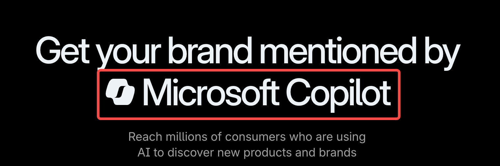

On the homepage, **Profound** highlights its core value through a dynamic slogan:

“Get your brand mentioned by” — followed by a rotating list of AI chat tools and icons like **ChatGPT, Perplexity, and Claude**.  
This slogan clearly conveys Profound’s core mission: to **help brands appear in AI-generated answers**.

## Key Features

**Profound** currently offers four main features that together form the foundation of its “read/write” AI optimization platform.

### [Answer Engine Insights](https://www.tryprofound.com/features/answer-engine-insights)

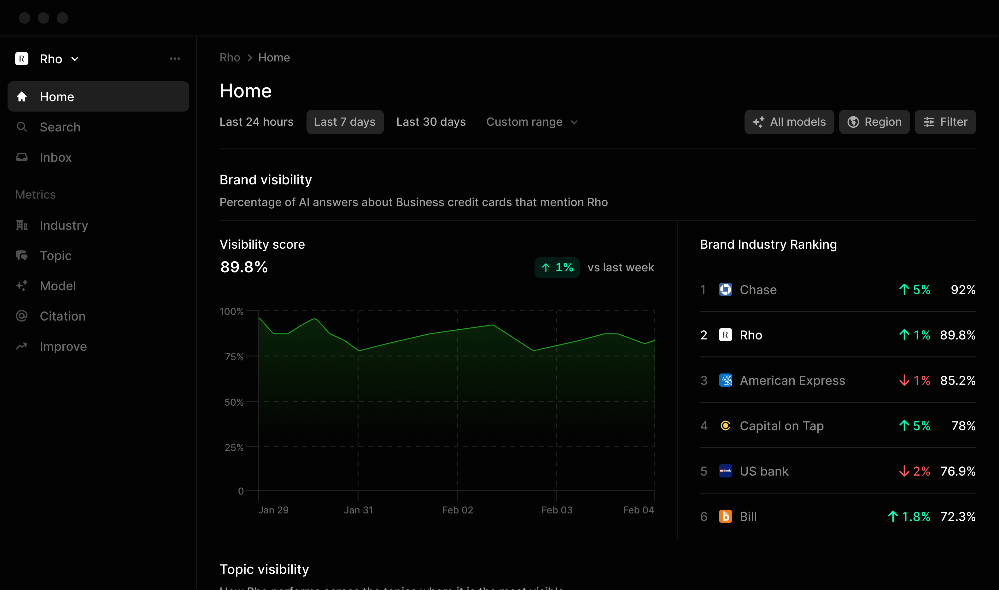

This feature provides deep insights to answer the key question:  
**“How do AI engines talk about your brand?”**

Core capabilities include:

  * See how often your **brand appears in AI-generated answers**.
  * Understand **how AI describes your brand and related topics**.
  * Identify which **websites influence AI-generated responses** about your brand.

It helps evaluate your brand’s **AI presence** through several key metrics:

  * **Visibility Scores:** Measure how often your brand is mentioned in AI responses, along with **Share of Voice (SOV)** indicators.
  * **Sentiment & Keyword Insights:** Analyze the tone and key topics AI uses when describing your brand.
  * **Citation Authority:** Identify which sites **influence AI-generated answers** and assess their authority.
  * **Platform Comparisons:** Compare your brand’s visibility, accuracy, and performance across major AI engines.

### [Agent Analytics](https://www.tryprofound.com/features/agent-analytics)

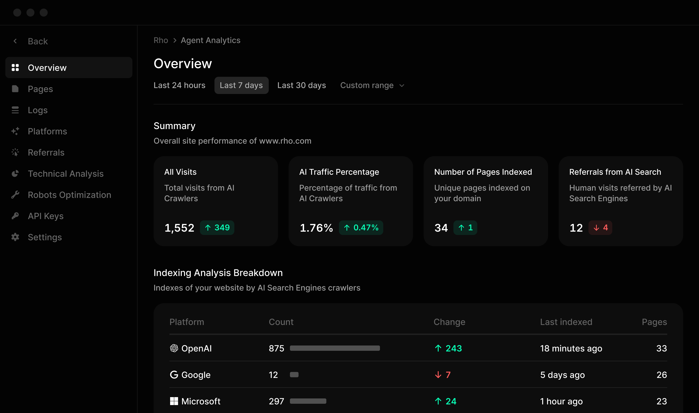

This feature focuses on the technical side—helping you understand **how AI crawlers (AI bots)** interact with your website and ensuring your content is properly indexed for AI-driven discovery.

Core functions include:

  * **AI Crawler Visibility:** Track when, how often, and which AI bots are visiting your content.
  * **Technical Analysis:** Ensure your site is optimized for **AI-based indexing and retrieval**.
  * **Attribution & Traffic Insights:** Measure how many **real users convert** via AI-driven search results.
  * **Content Performance Tracking:** See which pages are **most frequently cited by AI-generated answers**.

It even allows you to **submit new content directly to AI crawlers** for **faster discovery and indexing**.

### [Prompt Volumes](https://www.tryprofound.com/features/prompt-volumes)

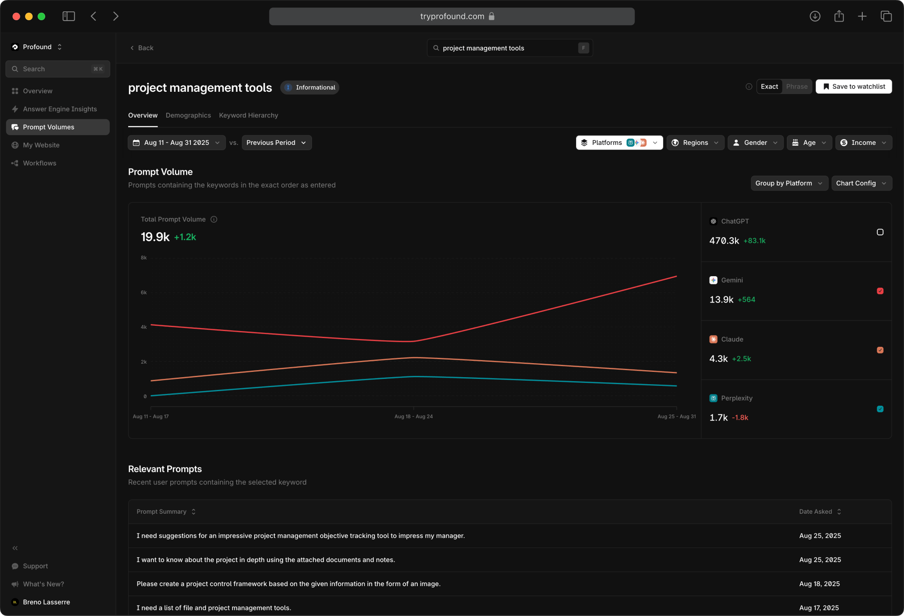

If tools like SEMrush or Ahrefs are for keyword research, then **Profound’s Prompt Volumes** is like a **prompt research tool**—it explores **query volumes for prompts and topics** within AI platforms.  
By understanding what users actually ask AI tools, brands can craft targeted content to increase their chances of being referenced in AI answers.

### [Shopping](https://www.google.com/search?q=)

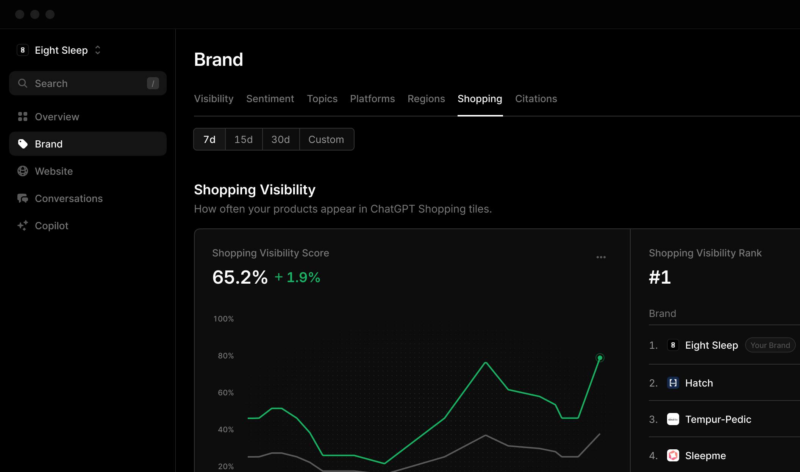

This feature is built for **ChatGPT Shopping**, enabling you to **see how your products appear within ChatGPT Shopping** and optimize their placement to **increase visibility, traffic, and conversions**.

Key features include:

  * **Shopping Visibility:** Optimize how your products are displayed in **ChatGPT Shopping** for broader reach.
  * **Shopping Triggers:** Identify and optimize keywords that **trigger ChatGPT to show shopping cards** in your category.
  * **Response Analysis:** Analyze **AI outputs mentioning your products** to refine your positioning.
  * **Product Analysis:** Track **visibility, retailers, and reviews** to uncover the factors driving performance.

## Conversion Paths

**Profound’s** conversion path combines classic enterprise SaaS UX patterns with an interactive product experience.

It includes three traditional conversion points and one unique interactive flow:

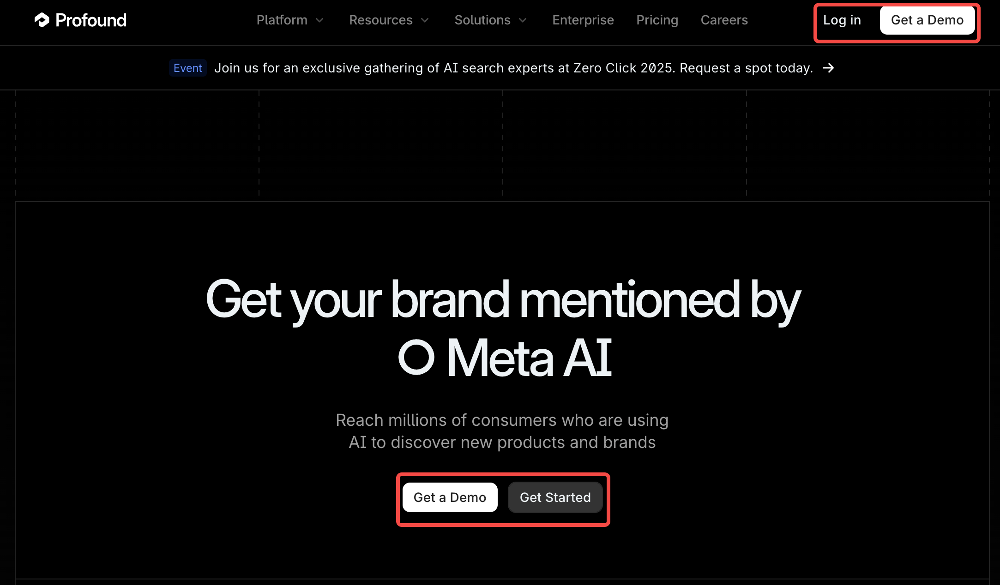

### Get a Demo

The “Get a Demo” button appears both in the top-right navigation and the hero section—clearly **Profound’s primary conversion entry point**.  
The white button stands out against a dark background, emphasizing its importance.

Clicking it opens a clean, professional form:

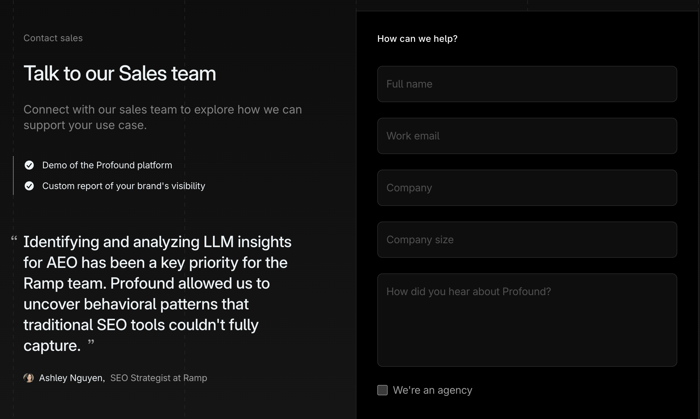

The left side includes:

  * A brief description of the form’s purpose
  * Demo content overview
  * Client testimonials

The right-side form requests: name, business email, company name, company size, source of referral, and an **“Are you an agency?”** checkbox.  
This aligns with standard **B2B lead qualification** practices, ensuring high-quality prospects.

### Get Started

Unlike the full demo form, clicking “Get Started” first prompts the user to **enter their work email**.

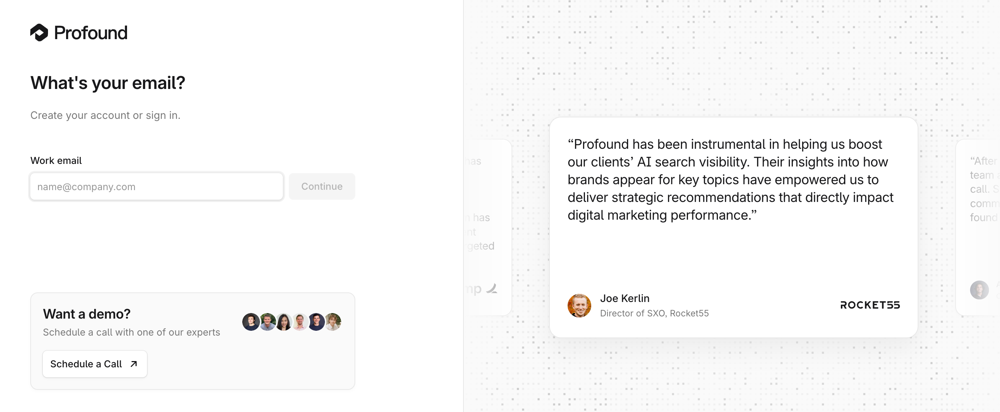

The right side features rotating client testimonials, plus a “Schedule a call” option for those interested in a live demo.

After entering an email, **Profound** asks for **company size** and whether the user is an **agency**.  
The progress bar indicates a **multi-step guided onboarding**—a design that encourages completion while collecting detailed user data.

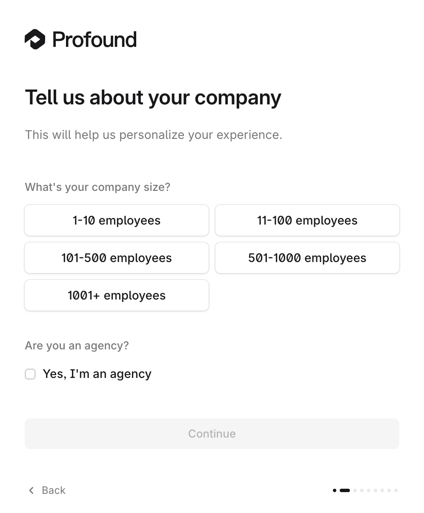

### Log in

Interestingly, the **Log in** interface is the same as the **Get Started** one.  
Profound uses logic-based detection to determine whether the email belongs to a **new or existing user**, streamlining access through a unified entry experience.

### Analyze

Beyond traditional entry points, Profound offers a unique **interactive module**.  
By entering a specific website and clicking “Analyze,” you can instantly check its **AI visibility**:

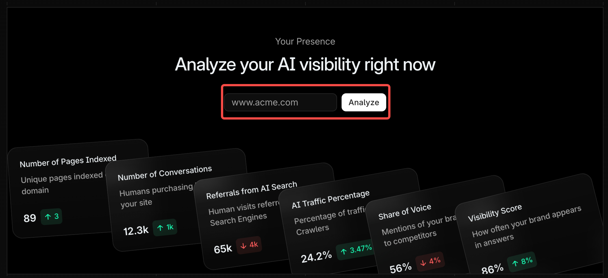

No ownership verification is required.  
For example, testing with Shopify yields a brief visibility summary and competitor snapshot:

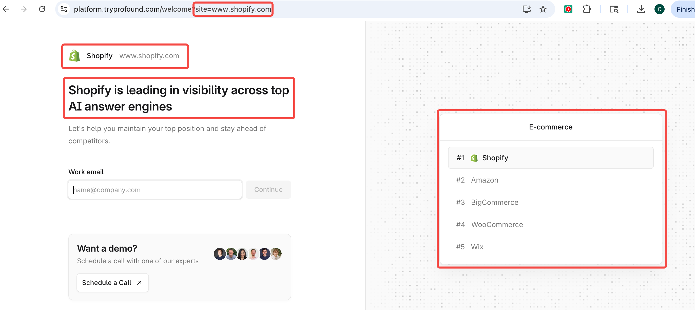

To see deeper data or take optimization actions, users must **enter a work email**—a smart way to offer a **free interactive preview** that demonstrates product value.

## Product Use Cases

**Profound** offers three tailored solutions for different enterprise teams, reflecting its deep understanding of marketing organization structures:

  * **AEO Teams:** Goal – **Increase AI visibility**.
  * **Content Teams:** Goal – **Create AI-optimized content**.
  * **PR & Brand Teams:** Goal – **Shape AI conversations**.

## [Pricing](https://www.tryprofound.com/pricing)

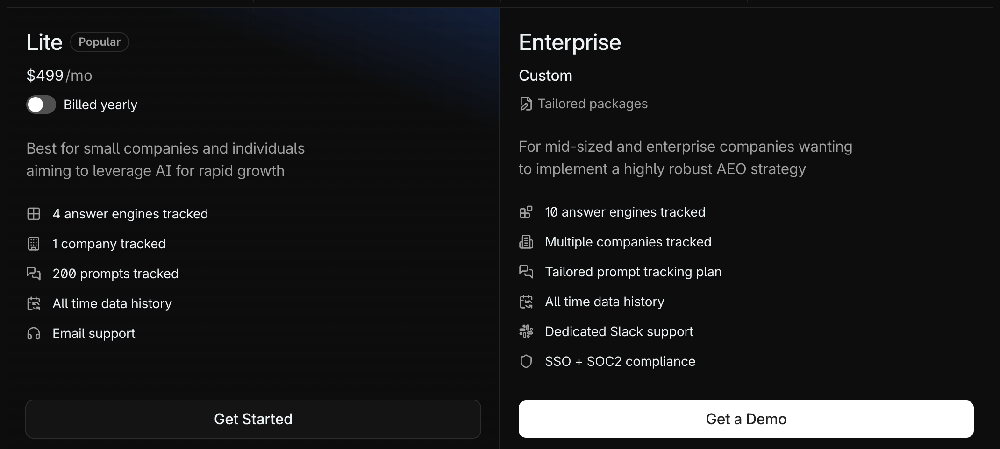

**Profound** offers two pricing plans, reinforcing its enterprise positioning:

  * **Lite:** **$499/month**, with a **15% annual discount**.
  * **Enterprise:** Custom quote available **upon request**.

Feature differences include:

  * Number of **answer engines tracked**
  * Number of **companies tracked**
  * Number of **prompts tracked**
  * Dedicated **Slack support**
  * Security features (**SSO, SOC2**, etc.)

## Traffic & Content Strategy

Beyond its main product pages, **Profound** drives inbound traffic through several specialized sections, effectively attracting its target audience and industry attention.

### [Resources → Guides](https://www.tryprofound.com/guides)

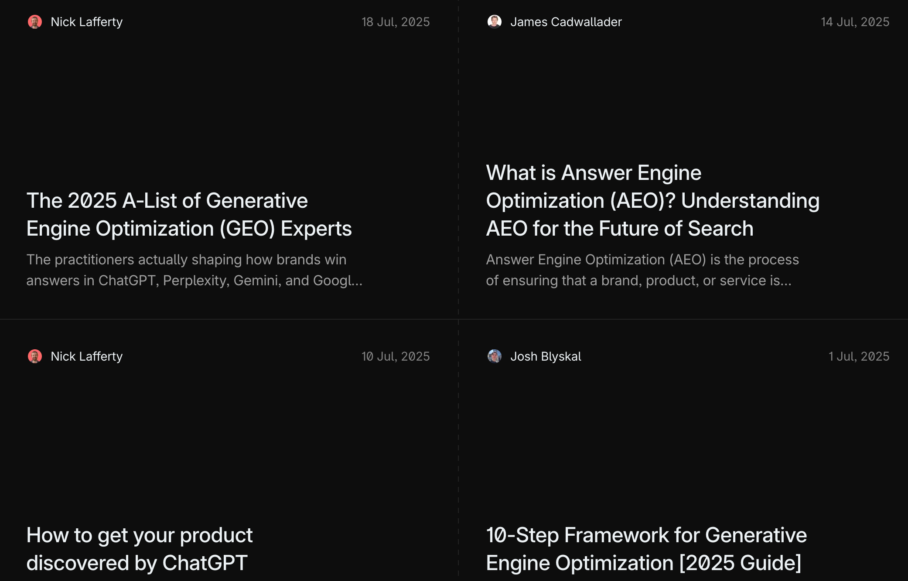

Unlike “Customers” (case studies) or “Blogs” (feature updates), the **Guides** section introduces **GEO** concepts and **AI-related trends and research insights**.  
This is a classic **content marketing** strategy—positioning Profound as a thought leader within the emerging GEO landscape.

### [AI Visibility Leaderboard](https://www.tryprofound.com/leaderboard)

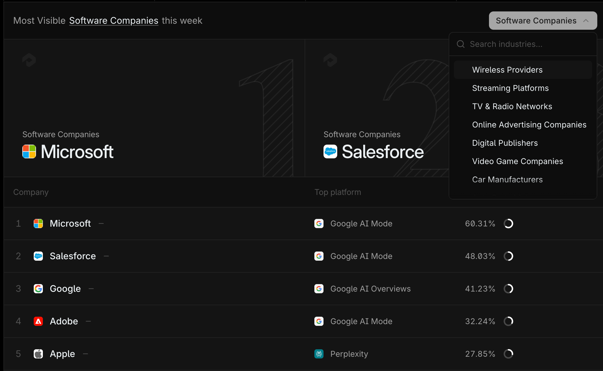

This leaderboard allows users to **view the top 100 most visible brands in AI search**, organized by industry and updated weekly.  
Its strength lies in the underlying data: powered by over **3 million prompts** that Profound sends daily to major answer engines.  
For instance, last week’s most **visible** software brand was **Microsoft**, followed by **Salesforce**.

### [Trending Searches](https://www.tryprofound.com/trending-searches)

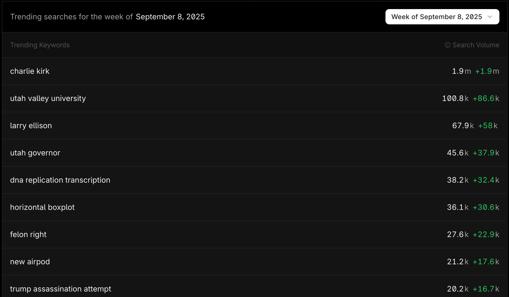

Here, users can explore **trending searches** from AI conversations in the past week—  
a clever showcase of the **Prompt Volumes** feature in action, allowing users to track the pulse of AI search in real time.

