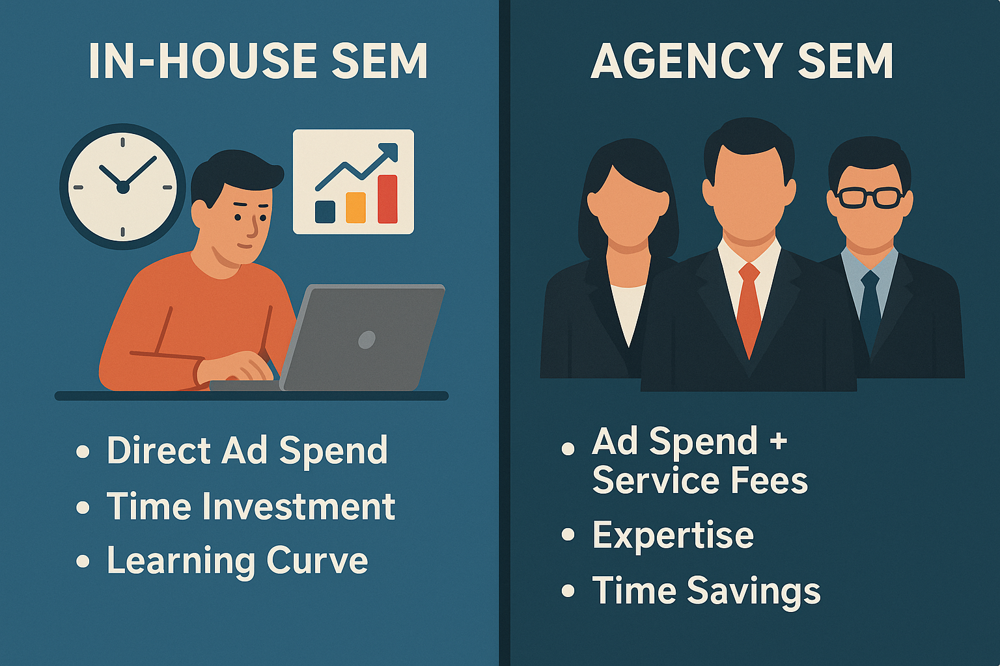
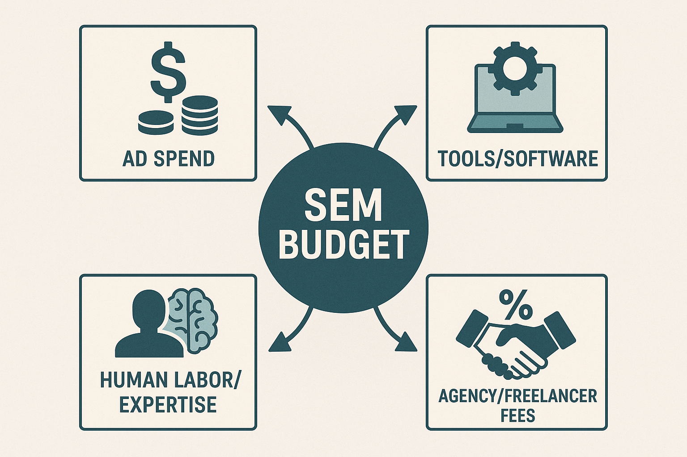

# SEM Advertising: Self-Managed vs. Hiring an Agency – How to Choose?

Are your **SEM advertising costs** being spent wisely? Most businesses invest budgets in Search Engine Marketing (SEM) without truly knowing where their money goes, or even doubting if it's worth the value. Imagine your target audience searching for information related to your products or services online, and your brand appears prominently in the search results – this would undoubtedly significantly increase the chances of users clicking on your website.

SEM primarily operates through search engine advertising platforms, such as [Google Ads](https://chloevolution.com/zh-cn/posts/how-to-do-google-ads-for-business/) or [Microsoft Advertising](https://ads.microsoft.com/locale/en-us/microsoft-advertising). Businesses bid on specific keywords to ensure their ads are displayed in relevant searches. When users search for these keywords, they see the ads you've bid on.

A common question businesses ask is: "How much budget do I need to prepare?" This question itself isn't wrong, but it often makes people overlook a crucial fact: **the actual investment in SEM advertising is far more complex than just "how much to spend per month."**



## How Much Does SEM Cost?

Before diving into the cost breakdown of Search Engine Marketing, let's look at average SEM costs based on third-party research.

According to research by [WebFX](https://www.webfx.com/digital-advertising/pricing/sem-pricing/), for 70% of businesses, the average monthly spend on SEM ranges from **$251 to $10,000**.

Of course, there are extreme cases: some companies spend less than $50 per month on SEM (likely barely running any ads), while others spend over $250,000 per month (common for large corporations).

## Running Ads In-House vs. Hiring an Agency

Before calculating SEM costs, you first need to decide which approach you want to take. Will you manage your ad account yourself? Or will you entrust it to a third-party agency?

These two models not only differ in operation but also have **completely different cost structures**.

### Running Ads In-House: Budget is More "Direct," but Time and Skills are Hidden Costs

  * All budget goes directly to the ads themselves; there are **no service fees**.
  * However, you need to personally handle keyword selection, bidding strategies, ad creative writing, data analysis, and other tasks.
  * If you want to use third-party tools to assist with optimization, you'll need to pay extra for subscriptions.
  * More importantly, **you'll need to invest a significant amount of time and effort in learning and trial-and-error.**

**Suitable for:** Small to medium-sized businesses with limited budgets, time to delve into advertising, or existing internal staff with ad management knowledge.

### Hiring an Agency: Paying More for Expertise, Saves Effort but Costs are More Complex

  * In addition to the ad budget, you'll also need to pay **service fees** (commonly 10%–20% of the ad budget, or a fixed monthly fee).
  * Some agencies may also charge **account setup fees, copy design fees, data reporting fees**, etc.
  * The **advantage** is that you gain professional support, including strategy development, data monitoring, creative production, etc., which usually leads to **faster results** and **improved ad efficiency**.
  * The **disadvantage** is higher costs and greater reliance on service quality, so **vetting reliable agencies is crucial**. You should examine their past cases, team experience, reporting transparency, and even consider a short-term collaboration or trial period.

**Suitable for:** Businesses lacking professional ad managers, unwilling to spend time on ad operations, or those with high demands for ad performance.

You can use the table below to make an initial assessment of your preferred and suitable approach:

| Feature           | Running Ads In-House        | Hiring an Agency              |
|-------------------|-----------------------------|-------------------------------|
| **Budget Control** | Autonomous and controllable | Relatively fixed or percentage-based fee |
| **Operational Complexity** | High (requires hands-on effort) | Low (handled by a professional team) |
| **Professional Expertise** | Depends on individual capability | Professional team support       |
| **Overall Cost Structure** | Ad spend + tools/labor     | Ad spend + service fees + others |
| **Suitable For** | Small/medium businesses with time and energy | Businesses seeking efficiency and results |

## Running Ads In-House: Don't Just Look at Ad Spend, Hidden Costs Can Be Significant

Choosing to manage your SEM ad account yourself means greater control and autonomy for your business. However, this doesn't necessarily mean lower costs. While there are no agency service fees, the **learning, execution, and optimization processes of ad placement often come with a series of hidden expenses**:

### 1\. Ad Budget: The Most Basic Investment

Regardless of the platform you use (e.g., Google Ads, Microsoft Advertising, etc.), you must pay for clicks. SEM typically operates on a pay-per-click (CPC) model.

  * The Cost Per Click (CPC) is influenced by keyword competition, industry type, geographic targeting, and other factors.
  * In the US market, CPC for general industry keywords is typically **$1–$3**, while highly competitive industries (like legal, insurance, B2B SaaS) can see CPCs as high as **$10–$50 per click**.
  * New accounts usually require a testing period before settling into a reasonable cost range.

Furthermore, the ad budget does not equal "conversion budget." If your [landing page](https://chloevolution.com/zh-cn/posts/landing-page-optimization/), ad creative, or goal settings are unclear, you might get many clicks but no effective conversions, leading to budget waste.

### 2\. Tool Costs: Expenses to Boost Efficiency and Decision-Making

Although ad platforms come with basic data dashboards, achieving true optimization often requires leveraging third-party tools to analyze keyword performance, competitor dynamics, user behavior, and more.

Common tool types include:

  * **Keyword Research & Competitor Analysis Tools** (e.g., Ahrefs, Semrush)
    Provide data such as keyword search volume, estimated CPC, difficulty scores.
    Price: Typically **$100–$200/month**.

  * **Ad Performance Monitoring & Automation Tools** (e.g., Optmyzr, Adalysis)
    Support bulk bid modifications, automated pausing of low-performing ads, and visual reporting.
    Price: Approximately **$50–$500/month**, billed based on features and account size.

  * **Landing Page or A/B Testing Platforms** (e.g., Unbounce, VWO)
    Help optimize the user conversion path, increasing the value of each click.
    Price: Generally **$80–$300/month**.

Using these tools is not mandatory, but in competitive industries, they can significantly improve ad efficiency and reduce trial-and-error costs.

### 3\. Labor and Execution Costs: The Most Underestimated Item

Even with ample ad budget, without professional personnel or the time to manage the account, it's difficult to achieve ideal ad results. Self-management means you or your team members are responsible for:

  * Setting up ad structure and deployment logic (campaigns, ad groups, match types, etc.).
  * Writing ad copy that matches keyword intent.
  * Daily/weekly data review, performance analysis, budget, and bid adjustments.
  * Deploying and testing conversion tracking codes.
  * Making strategic judgments: what to pause, what to boost, what to test.

If a business founder or marketing head personally manages operations, it means a significant amount of core time will be consumed, thereby **affecting investment in other core business activities**. If an internal employee is tasked with execution, there might be training or recruitment costs involved. Some companies also choose to hire part-time ad consultants to assist with account management, billed hourly or per project.

**Overall, managing SEM ads in-house is suitable for businesses that want to control their budget and possess a certain level of execution and analytical ability. However, this requires the business to be able to handle the pressure of learning, operating, and adjusting, and to be accountable for the final results. Lacking professional knowledge can easily lead to budget waste and the risk of poor performance.**

## Hiring an Agency: Service Models and Fee Structures

### Common Agency Pricing Models

| Model Name                      | Description                                   | Applicable Scenarios         | Pros & Cons                                      |
|---------------------------------|-----------------------------------------------|------------------------------|--------------------------------------------------|
| **Percentage of Ad Spend** | Most common, charges a percentage of your monthly ad budget (e.g., 15%) | Common for small/medium businesses | Simple and transparent, but costs can rise quickly with budget |
| **Percentage of Ad Revenue** | Charges a percentage of revenue generated by ads, e.g., 5% of e-commerce GMV | E-commerce ad accounts       | Results-driven, but "attribution is difficult" and "complex to confirm profit sharing ratio" |
| **Capped Percentage of Ad Spend** | Charges a percentage fee but with a cap (e.g., "15%, not exceeding $2,000/month") | Fairer when ad budgets fluctuate | Controls cost growth, beneficial for long-term partnerships |
| **Flat Project Rate** | Charges a fixed monthly amount (e.g., $1,000/month), regardless of budget | Stable budget or long-term projects | Easy to manage costs, but agency may lack incentive to improve performance |
| **Milestone-based Fee** | Project payments are phased, e.g., separate billing for account setup/testing/optimization phases | Strategic projects (e.g., account relaunch, quarterly strategy) | Better suited for one-off or highly customized ad needs |

### Beyond Service Fees: Other Potential "Additional Costs"

Some agencies bundle certain tasks into their service fees, while others quote them separately. Common "additional expenses" include:

| Additional Item        | Description                                       | Cost Range (Reference)    |
|------------------------|---------------------------------------------------|---------------------------|
| **Account Setup Fee** | Initial account structure design, keyword planning, conversion setup | $200 – $1,000 one-time    |
| **Creative & Asset Design** | Production of banner images, landing page graphics/text, videos, etc. | $300 – $2,000+            |
| **Landing Page Services** | Landing page creation or optimization             | $500 – $3,000             |
| **Analysis & Reporting Services** | Regular reports, strategy recommendations, review meetings, etc. | Included or charged separately |

These fees are sometimes not explicitly stated in the quote, so before partnering, **be sure to confirm the scope of services and project boundaries** to avoid "budget surprises." When choosing an agency, beyond costs, it's crucial to assess their **professional capability, past cases, team experience, and report transparency**.

## Hiring a Freelancer: A Flexible Option Between In-House and Agency

Besides the common approaches of doing it yourself (In-house) and hiring an advertising company (Agency), there's an increasingly popular option for small to medium-sized businesses, personal brands, and startups – **hiring a freelancer**.

This approach offers high flexibility and controllable costs, but it also demands higher requirements for the freelancer's professional ability and communication efficiency.

### What is a Freelancer's Role?

Freelancers are typically individuals with advertising experience, who might be:

  * SEM specialists who previously worked at large agencies or brand companies.
  * Marketing consultants or independent ad managers with professional skills.
  * Users providing services on freelance platforms (e.g., Upwork, Fiverr, ZBJ.com).

They provide customized services to **individual clients or multiple clients** on a "project-based" or "hourly billing" basis. They don't have the structure of a company but possess individual skills and experience.

### Common Services and Billing Methods

| Service Item      | Included?   | Description                                     |
|-------------------|-------------|-------------------------------------------------|
| Ad Account Setup  | Usually     | Creating structure, keyword configuration, conversion tracking setup, etc. |
| Daily Ad Optimization | Usually     | Data monitoring, bid adjustments, ad copy testing |
| Reporting & Review | Sometimes   | Simple weekly/monthly reports, in-depth analysis may require extra fees |
| Creative Asset Production | Not always | Few ad managers offer copywriting; images/videos often self-provided by client |

**Overview of Billing Methods:**

| Model           | Description                                        | Reference Price            |
|-----------------|----------------------------------------------------|----------------------------|
| Hourly Billing  | $25–$150/hour, depending on experience, country, and project difficulty | Common for temporary tasks |
| Monthly Package | $500–$2,000/month                                   | Suitable for ongoing campaigns |
| Project-Based Fee | One-time charge for account setup/restructuring/optimization, e.g., $800 one-time | Suitable for short-term projects or account overhauls |

### Freelancer Advantages and Risks

| Advantages                              | Risks and Challenges                               |
|-----------------------------------------|----------------------------------------------------|
| Flexible costs, lower than agencies           | Quality varies greatly, highly dependent on the chosen individual |
| High communication efficiency, fast response times | Lacks team support, can be slow to respond if workload is high |
| More willing to accommodate small client needs, accept small budgets | No service guarantee, need to proactively prevent risks of departure/disconnection |
| A good freelancer offers excellent value for money | Management difficulty is higher than with an agency, requires active collaboration and supervision |

**Risk Mitigation Tips:** When working with a freelancer, be sure to **sign a clear service agreement, defining the scope of work, deliverables, communication frequency, and payment terms**. Phased payments, regular reviews, and demanding transparent reports are effective methods for managing risk.

**Suitable for:**

  * Small to medium-sized businesses that need professional help but can't afford an agency.
  * Brands with a basic understanding of ad placement and willingness to communicate.
  * Clients with clear goals and timelines, who only need concentrated optimization for a specific phase.

## How to Choose the Right Ad Placement Method for You?

There's no single answer to SEM ad costs because it's essentially a combination of **strategy + technology + investment**. How much you ultimately spend and what results you achieve depends on the execution method you choose, the resources you have, and how quickly you expect results.

### You can use these three questions to determine which method is right for you:

1.  **What's your ad budget?**

      * Budget \< $1,000/month: Suggest doing it yourself or hiring a freelancer.
      * Budget between $2,000–$10,000/month: Consider an experienced freelancer or a small to medium-sized agency.
      * Budget \> $10,000/month: Recommend a mature agency, demanding comprehensive strategy and performance tracking.

2.  **Do you have internal resources to manage ads?**

      * Someone knowledgeable in ad operations: You can run ads yourself + purchase tools.
      * No relevant internal staff: A freelancer or agency is more suitable.

3.  **Do you prioritize "cost control" or "quick results"?**

      * Want to maintain control and explore gradually: Self-management or a freelancer offers more flexibility.
      * Want quick results and to save effort: An agency is more efficient but also costs more.

| Dimension           | Self-Managed (In-house) | Hire a Freelancer    | Hire an Agency         |
|---------------------|--------------------------|----------------------|------------------------|
| **Suitable Business Stage** | Startup, limited budget    | Startup/early growth, tight resources | Growth stage, expansion, stable budget |
| **Budget Flexibility** | High                     | Medium-High          | Low (most require a minimum budget threshold) |
| **Internal Resource Requirements** | High (needs ad knowledge or willingness to learn) | Medium (needs some communication/cooperation ability) | Low (expect agency to handle entirely after handover) |
| **Ad Performance Control** | High (all operations controlled by yourself) | Medium (can collaborate deeply) | Low (primarily relies on agency's professional judgment) |
| **Technical/Strategic Level** | Depends on self-learning ability | Depends on individual, varying capabilities | Relatively professional and stable, standardized processes |
| **Communication Cost** | Lowest                   | Medium (depends on individual) | High (involves liaison, reporting mechanisms) |
| **Scalability** | Bottlenecked (labor limits) | Limited (one person led) | Strong (can quickly cover multiple channels/services) |

**A final reminder:**

> **How well your ads perform isn't just about how much you spend, but whether you're spending it the right way.**

Regardless of the ad placement method you choose, it's recommended to prepare the following before starting:

  * **Clarify your goals** (exposure? leads? conversions?): This is the starting point for all strategies.
  * **Estimate your investment budget and duration**: Consider a testing budget and a formal deployment budget, and set a reasonable campaign period.
  * **Understand basic ad metrics and evaluation criteria**: Familiarize yourself with **[ "The Ultimate Guide to SEM Data Analysis"](https://chloevolution.com/zh-cn/posts/sem-analytics/)** to assess performance.
  * **Research and compare potential partners** (freelancer or agency), and **clearly define service boundaries in contracts** to avoid unnecessary misunderstandings and "budget surprises."
  * **Plan your data monitoring and reporting mechanisms**: Regardless of who runs the ads, transparent data feedback is crucial. You can refer to the content in **[ "The Ultimate Guide to SEM Data Analysis"](https://chloevolution.com/zh-cn/posts/sem-analytics/)**.
