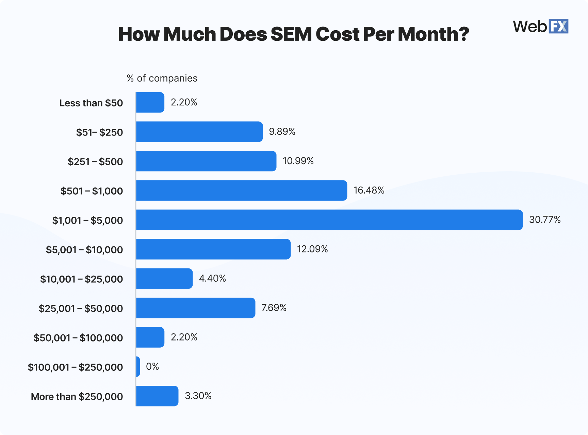

# SEM Advertising: Self-Managed vs. Hiring an Agency – How to Choose?

Search Engine Marketing (SEM) refers to strategies and tools that enhance a brand's visibility in search engine results, thereby attracting more traffic and potential customers. Imagine your target audience searching online for information related to your product or service, and your brand appears at the top of the search results—this significantly increases the chances of users clicking through to your website.  

SEM primarily relies on search engine advertising platforms like [Google Ads](https://chloevolution.com/zh-cn/posts/how-to-do-google-ads-for-business/) or Bing Ads. Businesses bid on specific keywords to ensure their ads appear in relevant searches. When users search for these keywords, they see the ads you’ve bid on.  

One of the most common questions businesses ask is, "How much budget do I need to prepare?" This question isn’t wrong, but it often overlooks a critical fact: **The actual investment in SEM advertising goes far beyond just 'how much to spend per month.'**  



## How Much Does SEM Cost?  

Before diving into the cost structure of SEM, let’s look at average SEM expenses based on third-party research.  

According to [WebFX](https://www.webfx.com/digital-advertising/pricing/sem-pricing/), 70% of businesses spend between **\$251 and \$10,000** per month on SEM.  
  

Of course, there are extremes: the lowest-spending companies allocate less than \$50 per month (likely barely running any ads), while the highest-spending companies exceed \$250,000 per month (common for large enterprises).  

## Self-Managed Ads vs. Hiring an Agency  
Before calculating SEM costs, you must first decide which approach to take: managing the ad account yourself or outsourcing it to a third-party agency.  

These two models differ not only in operation but also in **cost structure**.  

### Self-Managed Ads: Budget Spent More "Directly," but Time and Skills Are Hidden Costs  

* All budget goes directly to ads, **with no service fees**.  
* However, you’ll need to handle keyword selection, bidding strategies, ad copywriting, data analysis, etc.  
* If you use third-party tools for optimization, additional subscription costs apply.  
* Most importantly, **you’ll need to invest significant time and effort to learn and experiment**.  

**Best for:** Small and medium-sized businesses with limited budgets, time to learn, or in-house staff familiar with advertising.  

### Hiring an Agency: Pay More for Expertise, Save Effort but Face More Complex Costs  

* In addition to ad spend, you’ll pay **service fees** (typically 10%–20% of ad spend or a fixed monthly fee).  
* Some agencies also charge **account setup fees, copywriting/design fees, data reporting fees**, etc.  
* The upside is access to professional support, including strategy development, data monitoring, and creative production.  
* The downside is higher costs and greater reliance on service quality.  

**Best for:** Businesses lacking in-house expertise, unwilling to invest time, or with high performance expectations.  

You can start by using the table below to determine which approach suits your preferences and needs:  

| Item       | Self-Managed Ads    | Hiring an Agency     |  
| ---------- | ------------------- | -------------------- |  
| Budget Control | Full control        | Fixed or percentage-based fees |  
| Complexity    | High (hands-on)     | Low (handled by pros) |  
| Expertise     | Depends on skill    | Professional support  |  
| Cost Structure | Ad spend + tools/labor | Ad spend + service fees + extras |  
| Ideal For     | SMEs with time/resources | Businesses prioritizing convenience/results |  

## Self-Managed Ads: Don’t Just Look at Ad Spend—Hidden Costs Add Up  

Managing your own SEM account offers greater control and autonomy, but it doesn’t necessarily mean lower costs. While there are no agency fees, **the learning, execution, and optimization process often comes with hidden expenses**:  

### 1. Ad Budget: The Basic Investment  

Regardless of the platform (e.g., Google Ads, Microsoft Advertising), you pay per click. SEM follows a pay-per-click (CPC) model.  

* Cost-per-click (CPC) depends on keyword competition, industry, geographic targeting, etc.  
* In the U.S., average CPC ranges from **\$1–\$3**; competitive industries (e.g., law, insurance, B2B SaaS) can reach **\$10–\$50/click**.  
* New accounts often require a testing period to stabilize costs.  

Note: Ad budget ≠ conversion budget. Poor landing pages, ad creatives, or targeting can lead to clicks without conversions, wasting budget.  

### 2. Tool Costs: Expenses to Boost Efficiency and Decision-Making  

While ad platforms provide basic dashboards, third-party tools are often needed for deeper keyword, competitor, and user behavior analysis.  

Common tools include:  

* **Keyword & Competitor Research** (e.g., Ahrefs, Semrush)  
  Provides search volume, CPC estimates, difficulty scores, etc.  
  Cost: **\$100–\$200/month**  

* **Ad Monitoring & Automation** (e.g., Optmyzr, Adalysis)  
  Enables bulk bid adjustments, auto-pausing underperforming ads, visual reports.  
  Cost: **\$50–\$500/month** (varies by features/account size)  

* **Landing Page/A/B Testing** (e.g., Unbounce, VWO)  
  Optimizes conversion paths.  
  Cost: **\$80–\$300/month**  

These tools aren’t mandatory but can significantly improve efficiency in competitive industries.  

### 3. Labor & Execution Costs: The Most Underestimated Factor  

Even with ample budget, lack of expertise or time can hinder results. Self-management requires handling:  

* Ad structure and logic (campaigns, ad groups, match types, etc.)  
* Ad copy aligned with keyword intent  
* Daily/weekly data analysis and adjustments  
* Conversion tracking setup and testing  
* Strategic decisions: pausing, boosting, or testing elements  

Founders or marketers handling this themselves sacrifice core time; hiring staff adds training/recruitment costs. Some businesses opt for freelance consultants (hourly/project-based).  

**In summary, self-managed SEM suits businesses seeking budget control and with execution/analytical skills. However, it requires assuming responsibility for results and investing time in learning and optimization.**  

## Hiring an Agency: Service Models & Pricing  

### Common Agency Pricing Models  

| Model Name                          | Description                          | Ideal For           | Pros/Cons               |  
| ----------------------------------- | ------------------------------------ | ------------------- | ----------------------- |  
| **% of Ad Spend**                   | Service fee as % of monthly ad spend (e.g., 15%) | SMEs               | Simple, but costs rise with budget |  
| **% of Ad Revenue**                 | Fee as % of ad-driven revenue (e.g., 5% of GMV) | E-commerce         | Performance-based, but attribution is complex |  
| **Capped % of Ad Spend**            | % fee with a cap (e.g., "15%, max \$2,000/month") | Volatile budgets    | Limits cost growth, fosters long-term collaboration |  
| **Flat Project Rate**               | Fixed monthly fee (e.g., \$1,000), regardless of spend | Stable budgets/long-term | Easy cost management, but less incentive for performance |  
| **Milestone-based Fee**             | Phased payments (e.g., setup/testing/optimization) | Strategic projects  | Suits one-time/highly customized needs |  

### Additional Potential Fees  

Some agencies bundle services; others charge extra. Common add-ons:  

| Add-on           | Description                  | Price Range (Est.)      |  
| ---------------- | ---------------------------- | ----------------------- |  
| **Account Setup** | Initial structure, keywords, conversion setup | \$200 – \$1,000 (one-time) |  
| **Creative Design** | Banners, landing pages, videos, etc. | \$300 – \$2,000+       |  
| **Landing Page Services** | Page creation/optimization   | \$500 – \$3,000        |  
| **Analytics/Reporting** | Regular reports, strategy reviews | Included or extra      |  

**Tip:** Clarify service scope upfront to avoid surprises.  

## Hiring a Freelancer: A Flexible Middle Ground  

Beyond in-house or agency options, SMEs, startups, and personal brands increasingly turn to **freelancers** for SEM. This offers flexibility and cost control but demands careful selection for expertise and communication.  

### Who Are Freelancers?  

Freelancers are typically independent SEM experts, such as:  

* Former agency or in-house SEM specialists  
* Marketing consultants or freelance ad operators  
* Platform-based providers (e.g., Upwork, Fiverr)  

They offer project-based or hourly services, often at lower costs than agencies.  

### Common Services & Pricing  

| Service          | Included?   | Details                     |  
| ---------------- | ----------- | --------------------------- |  
| Account Setup    | Usually     | Structure, keywords, tracking, etc. |  
| Daily Optimization | Usually     | Monitoring, bid adjustments, A/B tests |  
| Reporting        | Sometimes   | Basic weekly/monthly reports; deep analysis may cost extra |  
| Creative Work    | Rarely      | Some offer copywriting; visuals often client-provided |  

**Pricing Models:**  

| Model         | Description                     | Price Range      |  
| ------------- | ------------------------------- | ---------------- |  
| Hourly        | \$25–\$150/hour (experience-dependent) | Ad-hoc tasks      |  
| Monthly Retainer | \$500–\$2,000/month            | Ongoing campaigns |  
| Project-Based | One-time fees (e.g., \$800 for setup) | Short-term projects |  

### Freelancer Pros & Risks  

| Pros                      | Risks & Challenges          |  
| ------------------------- | --------------------------- |  
| Lower cost than agencies   | Quality varies widely        |  
| Faster communication       | Limited bandwidth for large workloads |  
| Flexible for small budgets | No team backup; dependency risk |  
| High ROI with the right hire | Requires active management   |  

**Best for:**  

* SMEs needing expertise but unable to afford agencies  
* Brands with basic SEM knowledge willing to collaborate  
* Projects with clear goals/timelines  

## How to Choose the Right Approach?  

SEM costs aren’t one-size-fits-all—they depend on **strategy + skills + investment**. Your spending and results hinge on your chosen approach, resources, and timeline.  

### Ask These 3 Questions:  

1. **What’s your ad budget?**  
   * <\$1,000/month: Self-manage or hire a freelancer  
   * \$2,000–\$10,000/month: Freelancer or small agency  
   * &gt; \$10,000/month: Established agency with full-service support.

2. **Do you have in-house resources?**  
   * Existing expertise: Self-manage + tools  
   * No dedicated staff: Freelancer/agency  

3. **Prioritize cost control or speed?**  
   * Control + learning: Self-managed/freelancer  
   * Fast results + convenience: Agency (higher cost)  

| Dimension        | Self-Managed (In-house) | Freelancer       | Agency              |  
| ---------------- | ---------------------- | ---------------- | ------------------- |  
| **Business Stage**  | Startups/limited budget | Startups/growth   | Growth/scaling phase |  
| **Budget Flexibility** | High                  | Medium-high       | Low (minimum spends) |  
| **Internal Resources Needed** | High (skills/time) | Medium (collaboration) | Low (agency handles) |  
| **Control Over Results** | Full control         | Medium (collaborative) | Low (agency-driven) |  
| **Skill Level**     | Depends on learning    | Varies by freelancer | Professional/standardized |  
| **Communication Overhead** | Lowest              | Medium             | High (meetings/reports) |  
| **Scalability**     | Limited (by manpower)  | Limited (solo)     | High (multi-channel) |  

**Final Reminder:**  

> **SEM success isn’t just about spending—it’s about spending wisely.**  

Regardless of your choice, prepare by:  

* Defining goals (awareness? leads? conversions?)  
* Estimating budget and timeline  
* Learning key metrics and benchmarks  
* Vetting freelancers/agencies thoroughly; clarify service boundaries
