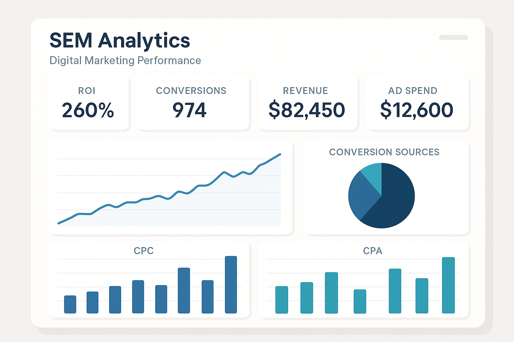
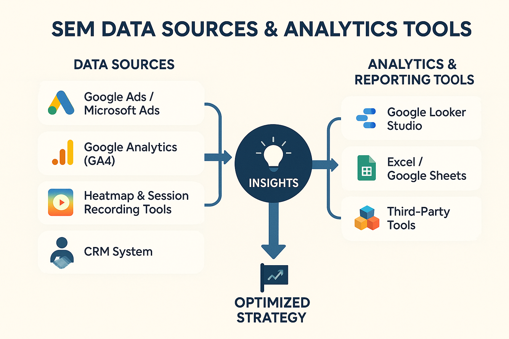

# The Ultimate Guide to SEM Data Analysis

## What is SEM Analysis?

In the battleground of Search Engine Marketing (SEM), running ads is only half the battle. What truly sets you apart and even helps you surpass competitors is **SEM analysis**. It acts as the "eyes" and "brain" of your ad strategy, helping you understand what happened, why it happened, and what you should do next.

Simply put, **SEM analysis is the systematic process of collecting, measuring, analyzing, and reporting data related to search engine marketing.** This data includes, but is not limited to: how many times your ads were seen (**impressions**), how many times they were clicked (**clicks**), how many conversions they generated (**conversions**), and how much you paid for them (**ad spend**). By digging deep into this data, you can comprehensively evaluate ad campaign performance, identify potential optimization opportunities, and provide solid data support for future marketing strategies.

Without SEM analysis, your ad campaigns are like walking in the dark. You wouldn't know which keywords are effective, which ad copies are appealing, which landing pages drive conversions, or if every penny spent is worthwhile. This not only means significant resource waste but also could lead you to miss market opportunities.

## Core Metrics for SEM Analysis: What Do You Need to Focus On?

You already know the importance of SEM analysis, but when faced with dense numbers in Google Ads reports, where do you even begin? Just as a doctor needs to monitor key vital signs to diagnose an illness, SEM analysis also has a set of **Key Performance Indicators (KPIs)**. Understanding and continuously tracking these **KPIs** is the foundation for effective analysis and optimization of ad performance.

These metrics can be divided into several categories:

### Traffic Metrics: Ad Visibility and Appeal

These metrics primarily reflect how many times your ads were seen and whether users were attracted to them and clicked.

  * **Impressions:**
    The **total number of times** your ad was displayed on search results pages or other Google networks. This metric measures your **ad visibility**. High impressions mean your ad has significant exposure, but it doesn't directly represent effectiveness. This metric is particularly important during **brand awareness campaigns** or when you need to **check if keywords have sufficient search volume**.

  * **Clicks:**
    The **total number of times** users actually clicked your ad. This indicates that users were interested in your ad content or product/service. In **any ad campaign**, especially those **aiming to acquire traffic**, clicks are a core metric.

  * **Click-Through Rate (CTR):**
    Formula: $$(\text{Clicks} / \text{Impressions}) \times 100\%$$
    **CTR** is a very important metric that measures your ad's **attractiveness and relevance** to users. A high CTR indicates that your ad copy, keyword targeting, and ad extensions are performing well, effectively attracting your target audience. Additionally, **CTR is one of the key factors influencing Ad Quality Score**. Continuously monitoring CTR is crucial because a **low CTR could mean poor ad copy, low keyword relevance, or imprecise ad targeting**. You can improve it by optimizing your **[ "Key Techniques for Writing High-Converting SEM Copy"](https://chloevolution.com/zh-cn/posts/create-sem-copy/)** and using relevant ad extensions.

### Cost Metrics: Budget Efficiency and Position Competition

These metrics help you understand your ad spend and your position performance in the auction.

  * **Cost Per Click (CPC):**
    Formula: $$\text{Total Cost} / \text{Clicks}$$
    The **average cost** you pay for each ad click. This is a core metric for measuring ad **cost efficiency**. A high CPC will directly consume your budget, reducing your return on investment. You need to continuously monitor CPC and check if you can lower it by improving your **Quality Score**, as mentioned in **[ "The Core Mechanism of SEM Bidding: Ad Rank and Quality Score"](https://chloevolution.com/zh-cn/posts/sem-bidding/)**, or by adjusting your bidding strategy.

  * **Total Cost:**
    The **total amount spent** on your ad campaigns within a specific period. This is the basis for **budget management**, and you need to monitor it daily, weekly, and monthly to ensure ad spend stays within budget.

  * **Average Position / Ranking Position (Avg. Position / Top of Page / Absolute Top):**

      * **Average Position:** This was an early Google Ads metric indicating the average position of an ad on the search results page.
      * **Impressions (Top) %:** The percentage of times your ad was displayed at the top of the search results page.
      * **Impressions (Abs. Top) %:** The percentage of times your ad was displayed in the very first position on the search results page.
        These metrics reflect your ad's **visibility and competitiveness** on the page. Higher positions usually mean higher CTR and more clicks, but they might also mean higher CPC. These metrics are crucial when you have **clear requirements for ad visibility and position**, such as in **brand awareness campaigns** or when **striving for an advantage in fierce competition**.

### Conversion Metrics: Core Measurement of Ad Effectiveness

These are the core metrics directly related to your business goals, reflecting the actual value brought by your ads.

  * **Conversions:**
    The number of times users complete your predefined **target actions**, such as purchasing a product, filling out a form, downloading a resource, making a phone call, etc. This is the most important metric for measuring the **business results** of your ad campaigns, and you **should always monitor** it, as it is the ultimate indicator of ad campaign success.

  * **Conversion Rate:**
    Formula: $$(\text{Conversions} / \text{Clicks}) \times 100\%$$
    **Conversion Rate** measures the efficiency with which your ads and **landing pages** convert clicking users into target customers. A high conversion rate means your ads attracted the right audience, and your landing page effectively guided them to convert. You need to continuously monitor conversion rate; a **low conversion rate might indicate that your ad message doesn't match your landing page, or that the landing page experience is poor**. Improving conversion rate is a core goal of **[ "The Ultimate Guide to Landing Page Optimization"](https://chloevolution.com/zh-cn/posts/landing-page-optimization/)**.

  * **Cost Per Acquisition/Action (CPA):**
    Formula: $$\text{Total Cost} / \text{Conversions}$$
    The **average cost required to acquire one conversion**. This is a key metric for evaluating the **profitability and efficiency** of your ad campaigns. An ideal CPA should be lower than the profit you gain from each conversion. You need to continuously monitor CPA to **ensure it stays within an acceptable range to maintain profitability**.

  * **Conversion Value:**
    The **total value generated by all conversions**. For **e-commerce** or businesses that can assign value to different conversion actions (e.g., a high-value product inquiry conversion is worth more than a resource download), this metric is crucial.

  * **Return On Ad Spend (ROAS):**
    Formula: $$(\text{Conversion Value} / \text{Total Cost}) \times 100\%$$
    **ROAS** measures how much conversion value is generated for every unit of ad spend. It directly reflects the **profitability and efficiency** of your ad investment. For example, a 200% ROAS means that for every $1 spent on advertising, $2 in sales revenue is generated. ROAS is one of the ultimate metrics for measuring overall effectiveness for **e-commerce and all profit-oriented ad campaigns**.

### Landing Page Performance Metrics: User Experience and Backend Engagement

These metrics reveal user behavior after clicking an ad and landing on your page, crucial for evaluating landing page quality and user experience.

  * **Average Session Duration:**
    The **average time** users spend on your landing page. Longer session durations usually indicate that users are interested in the page content and are interacting with it. You need to monitor this to **gauge content appeal and user engagement**. Too short a duration might mean the page content doesn't meet expectations or is difficult to understand.

  * **Bounce Rate:**
    The **percentage of users who visit only one page** of your landing page and then leave. A high bounce rate is usually a warning sign, possibly indicating that the landing page failed to meet user expectations or has usability issues. You need to continuously monitor bounce rate, **as it can severely impact conversion rates and Ad Quality Score**.

  * **Exit Rate:**
    The **percentage of users who leave the website from a specific page** after visiting your landing page (and possibly other pages). This metric can help you **identify breakpoints or end points in the user journey**, allowing you to optimize the user flow.

  * **Page Load Speed:**
    The time it takes for the landing page to fully load. **Load speed** is the foundation of user experience. Slow page loading leads to user abandonment, especially on mobile devices, and negatively affects **Ad Quality Score**. You need to continuously monitor page load speed and use tools like Google PageSpeed Insights to detect and optimize it. Improving page load speed is a crucial part of **[ "The Ultimate Guide to Landing Page Optimization"](https://chloevolution.com/zh-cn/posts/landing-page-optimization/)**.

### Quality Metrics: Leverage for Efficiency Improvement

While this metric isn't a direct business outcome, it has a significant indirect impact on your costs and rankings.

  * **Quality Score:**
    Google's **rating (1-10)** of the **overall relevance and quality of your keywords, ad copy, and landing page**. A high Quality Score means your ad system aligns better with Google's principle of providing a quality experience to users, so Google "rewards" you. **[ "The Ultimate Guide to SEM Bidding Strategies"](https://chloevolution.com/zh-cn/posts/sem-bidding/)** details how Quality Score helps you achieve better ad rankings at a lower CPC, thereby reducing costs and improving effectiveness. Therefore, continuously monitoring and **improving Quality Score is an important way to optimize ad efficiency**.

## SEM Data Sources and Analysis Tools

After clarifying the core metrics for SEM analysis, the next step is how to acquire and process this data. In SEM, data is the foundation for making informed decisions, and the right tools can help us transform this raw data into valuable insights, thereby optimizing ad performance.

### Primary Data Sources

Your SEM data is scattered across multiple platforms, and you need to view them holistically to understand user behavior and ad effectiveness.

  * **Google Ads / Microsoft Ads Platforms:**
    These are your **most direct and comprehensive** sources of ad data. The built-in reporting features of advertising platforms provide all core data about your campaigns, ad groups, keywords, ad copy, and bidding strategies.

      * **Data provided:** Impressions, clicks, cost, conversions, conversion rate, Cost Per Click (CPC), Cost Per Acquisition (CPA), ad rank, search term reports, audience data, etc.
      * **Importance:** This is where you set up ads, manage budgets, and choose bidding strategies. All ad execution-level data originates here.

  * **Google Analytics (GA4):**
    Google Analytics is a powerful **website behavior analysis tool** that provides in-depth data about **what users do on your website** that ad platforms cannot. By linking GA4 with Google Ads, you can see the complete user journey on your website after clicking an ad.

      * **Data provided:** User source, new vs. returning users, average session duration, bounce rate, exit rate, user browsing paths on internal pages, deep conversions completed (e.g., page scroll depth, specific button clicks), demographic information, interests, etc.
      * **Importance:** Helps you understand the quality of ad traffic. The landing page effectiveness data emphasized in **[ "The Ultimate Guide to Landing Page Optimization"](https://chloevolution.com/zh-cn/posts/landing-page-optimization/)** largely comes from GA4. Through GA4, you can see how ad clicks translate into actual website interactions and business value.

  * **Heatmap and User Session Recording Tools (e.g., Hotjar, Microsoft Clarity):**
    These tools provide **detailed user behavior on landing pages**, serving as important complements to qualitative analysis. They transform abstract data into intuitive visual feedback.

      * **Data provided:**
          * **Heatmaps:** Show where users click on the page, scroll depth, and mouse movement trajectories, revealing areas users focus on most and ignore.
          * **Session Recordings:** Record anonymous users' actual browsing processes, allowing you to observe, like watching a video, how users interact with the page, where they encounter difficulties, and where they hesitate.
      * **Importance:** They directly showcase the user experience on the landing page, as mentioned in **[ "The Ultimate Guide to Landing Page Optimization"](https://chloevolution.com/zh-cn/posts/landing-page-optimization/)**, helping you visually discover usability issues, content layout flaws, and conversion barriers.

  * **Customer Relationship Management (CRM) System:**
    If your business involves **offline sales, phone sales, or potential customers requiring long-term follow-up**, a CRM system is crucial for connecting online ad investment with ultimate business results.

      * **Data provided:** Customer Lifetime Value (LTV), sales stages, sales revenue, customer profiles, etc.
      * **Common CRM systems include:** Salesforce, HubSpot, Zoho CRM, etc.
      * **Importance:** Allows you to track **higher-value backend conversions**, such as converting leads into signed customers. By sending CRM data back to Google Ads (typically via offline conversion imports), you can provide more comprehensive optimization basis for AI Smart Bidding.

### Analysis and Reporting Tools

Simply having data isn't enough; you need tools to process, integrate, analyze, and visualize this data to extract valuable insights.

  * **Google Ads / Microsoft Ads Reporting Interface:**
    These platforms have powerful built-in reporting features, allowing you to directly **customize reports for various dimensions and metrics** within the interface. They are the most convenient tools for preliminary analysis.

      * **Advantages:** Real-time data, rich dimensions, direct filtering and comparison.
      * **Applicable Scenarios:** Daily monitoring, quick checks of campaign performance, keyword analysis, search term reports.

  * **Google Analytics Reports:**
    GA4's reporting interface allows you to **conduct full-funnel analysis by combining ad data**, from ad clicks to website behavior and final conversions. It helps you understand the quality of users brought by ads and their behavior patterns.

      * **Advantages:** Deep user behavior insights, multi-channel attribution, custom event tracking.
      * **Applicable Scenarios:** Analyzing traffic quality, user journey, landing page effectiveness, website conversion paths.

  * **Google Looker Studio (formerly Google Data Studio):**
    Google Looker Studio is a **free data visualization tool** that can integrate your various data sources (such as Google Ads, GA4, Sheets, CRM, etc.) into a single dashboard, **creating customized, automated, interactive reports**.

      * **Advantages:** Powerful data integration capabilities, flexible report customization, automated refresh, easy sharing.
      * **Applicable Scenarios:** Building comprehensive SEM performance reports, real-time monitoring dashboards, presenting data to clients or management.

  * **Excel / Google Sheets:**
    For deeper **data processing, calculations, and custom analysis**, traditional spreadsheet tools are still indispensable. You can export data from various platforms and perform pivot analysis, advanced filtering, custom formula calculations, etc., in spreadsheets.

      * **Advantages:** Extremely high flexibility and customization, suitable for complex data cleaning and modeling.
      * **Applicable Scenarios:** Offline data analysis, temporary data exploration, complex financial analysis, small-scale data integration.

  * **Third-Party Tools:**
    Many professional third-party tools on the market offer more powerful functionalities in specific areas.

      * **Data Connectors (e.g., Supermetrics, Funnel):** Help you automatically import data from various marketing platforms into Looker Studio, Excel, or other data warehouses, automating data integration.
      * **Competitor Analysis Tools (e.g., SEMrush, Ahrefs):** Provide intelligence on competitor keyword strategies, ad copy, budget estimates, etc., helping you conduct the competitor analysis mentioned in **[ "The Ultimate Guide to SEM Bidding Strategies"](https://chloevolution.com/zh-cn/posts/sem-bidding/)**.
      * **More Advanced BI Tools (e.g., Tableau, Power BI):** For businesses with large amounts of data and complex analysis needs, these tools offer more powerful data modeling and visualization capabilities.

-----

## How to Find Optimization Points from Data?

Having understood the core metrics and data sources for SEM analysis, the next crucial step is: **how to transform this raw data into actionable optimization strategies?** It's like having a treasure map and tools for treasure hunting; you need to know how to interpret the markings on the map to find the treasure.

### 1\. Keyword-Level Optimization: Improving Traffic Quality and Cost Efficiency

Keywords are the first bridge connecting ads and users, and an important entry point for data analysis and optimization.

  * **Identify High-Cost, Low-Conversion Keywords:**
    Analyze your keyword report in depth to find keywords that **have high spend but very few conversions or excessively high Cost Per Acquisition (CPA)**.
      * **Actionable Strategy:** For these keywords, you can choose to **pause them**, **lower bids**, or check if their ad copy and landing pages are sufficiently relevant.
  * **Identify Low Click-Through Rate (CTR) Keywords:**
    Pay attention to keywords with high impressions but CTR significantly below average. This might mean your ad copy isn't appealing enough for the search intent of these keywords, or relevance is insufficient.
      * **Actionable Strategy:** Try to **improve ad copy** to better match the keywords, or **move them to more relevant ad groups** for more targeted ads.
  * **Discover New High-Potential Keywords:**
    Check the **Search Term Report**. This shows what terms users actually searched for that triggered your ads. You might find unexpected but highly relevant and high-converting long-tail keywords.
      * **Actionable Strategy:** Add these valuable search terms as new **exact match keywords** and create dedicated ad groups and copy to capture this high-quality traffic. This is discussed in more detail in **[ "Keyword Research and Targeting in the AI Era"](https://chloevolution.com/zh-cn/posts/keyword-research-and-targeting/)**.
  * **Continuously Add Negative Keywords:**
    In the search term report, you'll also find some **irrelevant or unclear search terms**. For example, if you sell new products, users searching for "used [your product]" are unlikely to convert.
      * **Actionable Strategy:** Promptly add these terms as **negative keywords** to effectively prevent ads from showing in irrelevant searches, reducing unnecessary click waste, and thus improving ad relevance and **Quality Score**.

### 2\. Ad Copy and Ad Group Optimization: Enhancing Appeal and Relevance

Ad copy is the element that directly attracts user clicks, while ad group structure influences ad relevance.

  * **A/B Test Different Ad Copy:**
    Don't settle for the status quo; continuous testing is key to improving ad effectiveness.
      * **Actionable Strategy:** Create multiple versions of headlines, descriptions, and ad extensions. Through **A/B testing**, compare their Click-Through Rate (CTR), conversion rate, and CPA to find the best-performing creative. You can test different **Calls to Action (CTAs)**, **Unique Selling Propositions (USPs)**, or emotional appeals.
  * **Review Ad Performance Reports:**
    In the ad platform, you can usually view the specific performance of each ad.
      * **Actionable Strategy:** Identify ads with **high CTR and high conversion rates**, and pause ads that perform significantly below average. This ensures your ad budget is spent only on the most effective creatives.
  * **Ensure High Ad-to-Keyword Relevance:**
    Good ad copy should directly address the user's search intent.
      * **Actionable Strategy:** Check for a high semantic match between keywords within an ad group and the ad copy (especially headlines and descriptions). High relevance not only attracts the right users but also **improves Ad Quality Score**, thereby lowering your CPC. For more tips, refer to **[ "Key Techniques for Writing High-Converting SEM Copy"](https://chloevolution.com/zh-cn/posts/create-sem-copy/)**.

### 3\. Landing Page Optimization: The Final Stage of the Conversion Funnel

Even with a high ad click-through rate, users will drop off if the landing page experience is poor. The landing page is the ultimate place where conversions happen.

  * **Analyze Landing Page Conversion Rate:**
    This is the most direct metric. Identify landing pages with **below-average conversion rates**.
      * **Actionable Strategy:** Conduct an in-depth analysis of these pages to identify potential issues.
  * **Check Bounce Rate, Average Session Duration, and Page Load Speed:**
    These metrics reflect user interaction and experience on the landing page. **High bounce rates or short session durations** can signal that the landing page content doesn't meet expectations, navigation is unclear, or the user experience is poor. **Slow page load speed** severely impacts user patience.
      * **Actionable Strategy:** Use Google Analytics (GA4) to gain insights from this data, and use **heatmaps and user session recording tools** (e.g., Hotjar, Clarity) to visually understand user behavior. Find where users are getting stuck or confused.
  * **Conduct A/B Tests:**
    Test various elements of the landing page to find the version that best improves conversions.
      * **Actionable Strategy:** Optimize the landing page's **layout, copy, images, form design, Call to Action (CTA) button color and placement**, etc. For specific methods, you can refer to **[ "The Ultimate Guide to Landing Page Optimization"](https://chloevolution.com/zh-cn/posts/landing-page-optimization/)**.

### 4\. Bidding Strategy and Budget Optimization: Improving Efficiency and Controlling Costs

The right bidding strategy and reasonable budget allocation ensure your ads participate in the auction in the most optimal way.

  * **Evaluate Smart Bidding Effectiveness:**
    If you're using Smart Bidding, you need to regularly check if it's **meeting your target CPA or ROAS**.
      * **Actionable Strategy:** If performance is not up to par, you can **adjust the target values for Smart Bidding** (e.g., increase target CPA to get more conversions, or lower target ROAS to improve profitability), or check if there's sufficient conversion data to support AI learning.
  * **Analyze Device, Geographic, and Time Reports:**
    User behavior and conversion rates can vary significantly across different devices, geographic locations, or time periods.
      * **Actionable Strategy:** Identify these differences and set **Bid Adjustments**. For example, if mobile device conversion rates are higher and CPA is controllable, you can increase bid adjustments for mobile to acquire more mobile traffic. For more details on bid adjustments, refer to **[ "The Ultimate Guide to SEM Bidding Strategies"](https://chloevolution.com/zh-cn/posts/sem-bidding/)**.
  * **Budget Allocation:**
    Continuously monitor the **Return On Ad Spend (ROAS)** or **Cost Per Acquisition (CPA)** for different campaigns or ad groups.
      * **Actionable Strategy:** Dynamically adjust budget allocation based on performance. Allocate more budget to campaigns with **high ROI or low CPA**, and cut back on underperforming segments to maximize overall effectiveness.

### 5\. Competitor Analysis: Know Yourself, Know Your Enemy, and Win Every Battle

Your ad performance is not isolated; it is constantly influenced by the competitive environment.

  * **Utilize Auction Insights Report:**
    Google Ads' Auction Insights report allows you to understand competitor data such as **impression share, overlap rate, and ranking**.
      * **Actionable Strategy:** If a competitor's impression share significantly increases while yours decreases, you might need to consider **raising your bids** or improving your Ad Rank by optimizing **Quality Score**.
  * **Analyze Competitor Ad Creatives and Landing Pages:**
    By searching your target keywords, observe competitor ad copy, ad extensions, and landing pages.
      * **Actionable Strategy:** Learn from their strengths, identify their weaknesses, and then optimize your own ad creatives and user experience to find **differentiating advantages**. This analysis provides the competitive insights mentioned in **[ "The Ultimate Guide to SEM Bidding Strategies"](https://chloevolution.com/zh-cn/posts/sem-bidding/)**.

-----

## Frequently Asked Questions (FAQ)

### Q1: How do I know if my ad data is good or bad?

Judging whether ad data is good or bad isn't about looking at a single number; it requires a **holistic evaluation combining your business goals, industry benchmarks, and historical performance.**

  * **Align with Business Goals:** Is your campaign aimed at increasing brand awareness, acquiring leads, or driving sales?
      * If the goal is **brand awareness**, you'll likely focus more on **impressions and Click-Through Rate (CTR)**.
      * If the goal is **leads or sales**, then **conversions, conversion rate, Cost Per Acquisition (CPA), and Return On Ad Spend (ROAS)** are key. If your CPA is lower than your profit expectation and ROAS is well above your investment, the data is generally "good."
  * **Refer to Industry Benchmarks:** What are the average CTR, CPA, and ROAS in your industry? While every account is unique, industry averages provide a general reference range. You can find this through third-party reports or tools (like benchmark data provided by Google Ads). Additionally, you can use our **[calculator tools](https://chloevolution.com/tools/)** to quickly calculate and analyze your metrics, comparing them against industry averages.
  * **Compare with Historical Data:** Compare your ad data against previous weeks, months, or the same period last year to see if it's trending up or down. Consistent improvement is what truly defines "good."
  * **Compare with Other Campaigns:** If you're running multiple campaigns, compare their performance. Identify the best-performing ones and analyze their success factors; for the worst-performing ones, look for optimization points.

### Q2: How often should I analyze SEM data?

Analysis frequency depends on your **ad budget, campaign type, rate of change, and team resources.** There's no one-size-fits-all answer, but you can refer to these suggestions:

  * **Daily Monitoring:** Quickly check **core metric overviews** (e.g., cost, clicks, conversions, CPA) daily to ensure no unusual fluctuations (e.g., budget overspending, sudden drop in conversions). This helps identify issues promptly and take corrective action.
  * **Weekly In-Depth Analysis:** Conduct a more detailed analysis weekly, reviewing the performance of **keywords, ad groups, ad copy, and search term reports**. This is the best frequency for identifying optimization opportunities and making adjustments (e.g., adding negative keywords, testing new ads, adjusting bids).
  * **Monthly/Quarterly Strategic Review:** Conduct a macroscopic review monthly or quarterly to evaluate **overall ROI, the effectiveness of different campaigns, whether budget allocation is reasonable**, and adjust long-term strategies in conjunction with business goals. This is a good time to prepare comprehensive reports for management or clients.
  * **Leverage AI for Efficiency:** AI tools can help automate parts of monitoring and reporting, providing intelligent insights and anomaly alerts.

### Q3: What if Google Ads and Google Analytics data don't match?

Data discrepancies are common and usually result from different data collection and processing mechanisms. Here are some common reasons and troubleshooting methods:

  * **Different Attribution Models:** Google Ads defaults to a "last click" attribution model (unless you modify it), while Google Analytics typically uses a "data-driven" or "last non-direct click" attribution model. Different attribution models lead to differences in conversion counting.
  * **Data Latency:** Google Ads data usually updates faster, while Google Analytics data may have a few hours of delay.
  * **Time Zone Settings:** Ensure that the **time zone settings are consistent** across your Google Ads account and Google Analytics property.
  * **Conversion Counting Methods:**
      * Google Ads can record multiple conversions for the same user within a day, while Google Analytics by default only records one per session.
      * Check if the conversion event definitions are exactly the same on both platforms.
  * **Tracking Code Issues:** Ensure your website has **Google Ads conversion tracking code** and **Google Analytics (GA4) code** installed correctly, without duplication or errors. Check for code conflicts.
  * **Cross-Device/Cross-Domain Tracking:** If users convert on different devices, or jump across subdomains/different domains, improper tracking setup can lead to data loss.
  * **Troubleshooting Steps:**
    1.  **Check time zone and attribution model settings.**
    2.  **Verify conversion event definitions and code installation.** Use tools like Google Tag Assistant for debugging.
    3.  **Compare small data sets.** Choose data from one day or one week for detailed comparison, rather than long-term accumulated data, as this makes issues easier to spot.

### Q4: Which reports are essential for an SEM optimizer?

As an SEM optimizer, the following reports are indispensable for your daily work:

  * **Search Term Report:** One of the most important reports\! It tells you what actual terms users searched for that triggered your ads.
      * **Purpose:** Discover new high-potential keywords, add negative keywords, optimize ad copy.
  * **Keyword Report:** View clicks, impressions, conversions, costs, etc., for each keyword.
      * **Purpose:** Adjust keyword bids, pause underperforming keywords, adjust match types.
  * **Ads Report:** Compare the performance of different ad copies and ad extensions.
      * **Purpose:** Conduct A/B tests, pause underperforming ads, identify the best creatives.
  * **Ad Group Report:** Understand the overall performance of different ad groups.
      * **Purpose:** Evaluate account structure, identify ad groups needing optimization.
  * **Device Report:** Compare ad performance across different devices (mobile, desktop, tablet).
      * **Purpose:** Set device bid adjustments, optimize mobile landing pages.
  * **Auction Insights Report:** Understand your performance relative to competitors.
      * **Purpose:** Evaluate competitive landscape, adjust bidding strategies.

### Q5: How do I explain SEM reports to non-marketers?

When explaining SEM reports to non-marketers (such as management or clients), the key is to be **concise, intuitive, and focused on business outcomes and recommendations**, rather than marketing jargon.

  * **Focus on Business Goals:** Start the report by directly stating, "What is our goal? What is the current progress?" (e.g., "Sales increased by X% this month, and lead acquisition cost decreased by Y%").
  * **Use Easy-to-Understand Language:** Avoid acronyms like "CPC," "CPA," "ROAS." If you must use them, explain them clearly. For example, say "cost to acquire a customer" instead of "CPA."
  * **Highlight Key Metrics:** Only present 3-5 core metrics most directly related to business outcomes, such as **conversion volume, total cost, and return on investment**. Avoid cluttering with too many details.
  * **Visual Presentation:** Use **charts and graphs** to show trends and comparisons, rather than just numerical tables. For example, use a trend chart to show sales growth, and a pie chart to show the contribution of different product lines. **Google Looker Studio** is an excellent tool for creating clear, automated reports.
  * **Provide Insights and Recommendations:** Most importantly, don't just present data; explain what the data means and, based on these insights, **what you will do next**. For example: "We found that mobile conversion rates are higher, so next month we will increase our budget allocation for mobile."
