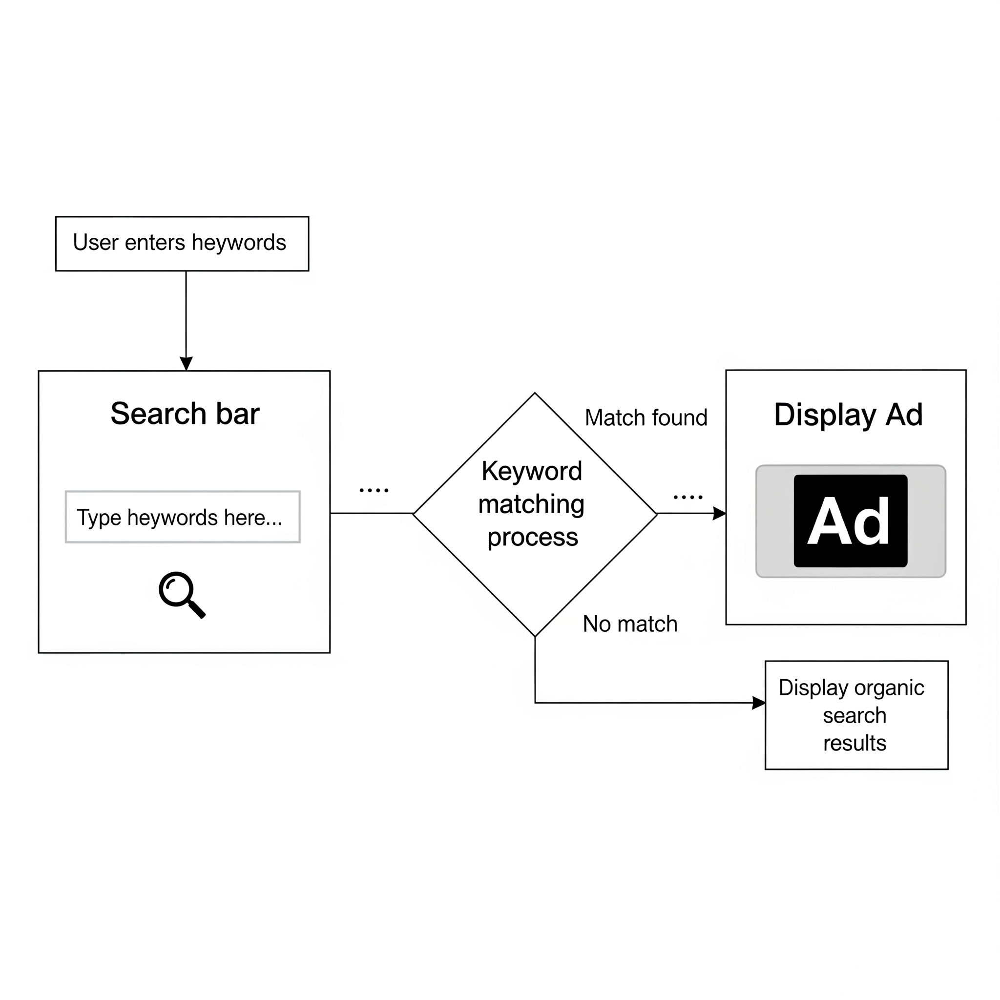
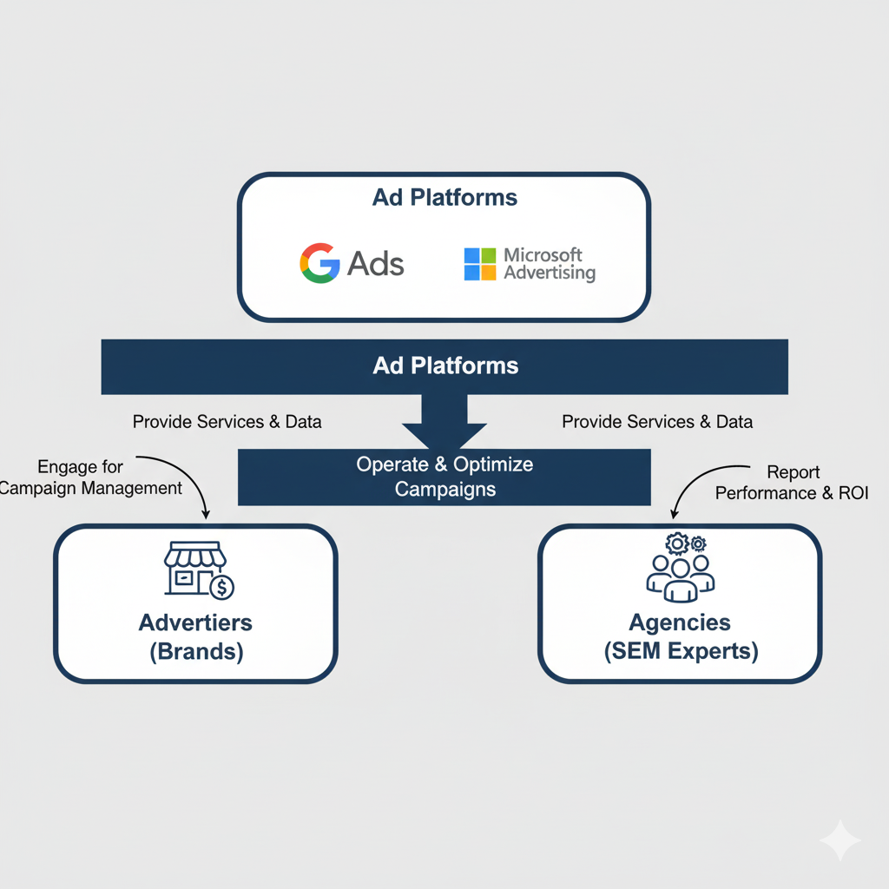
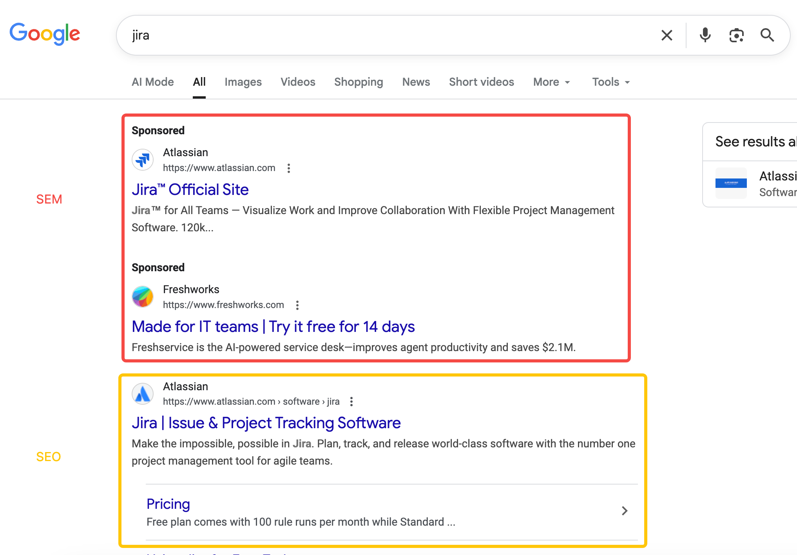
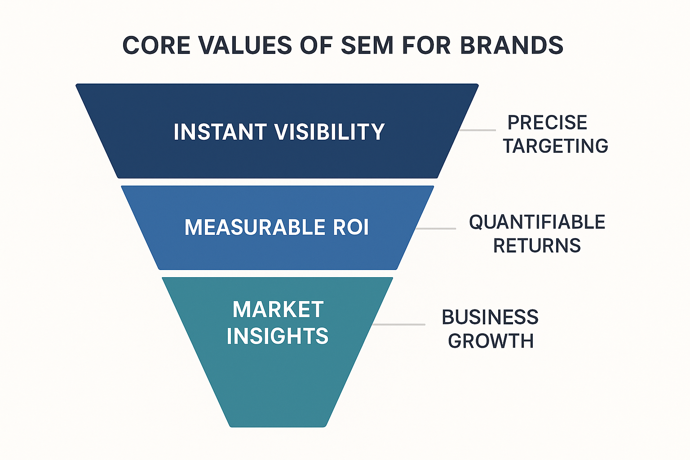
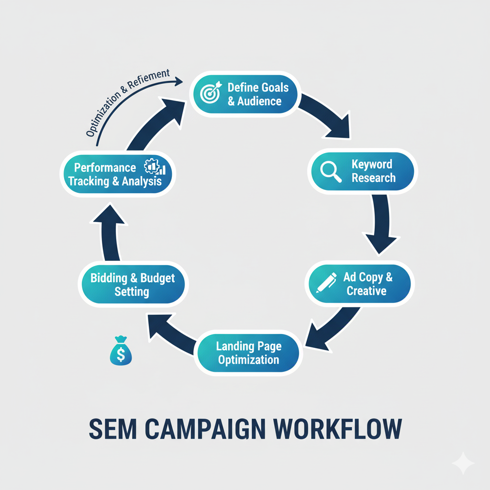
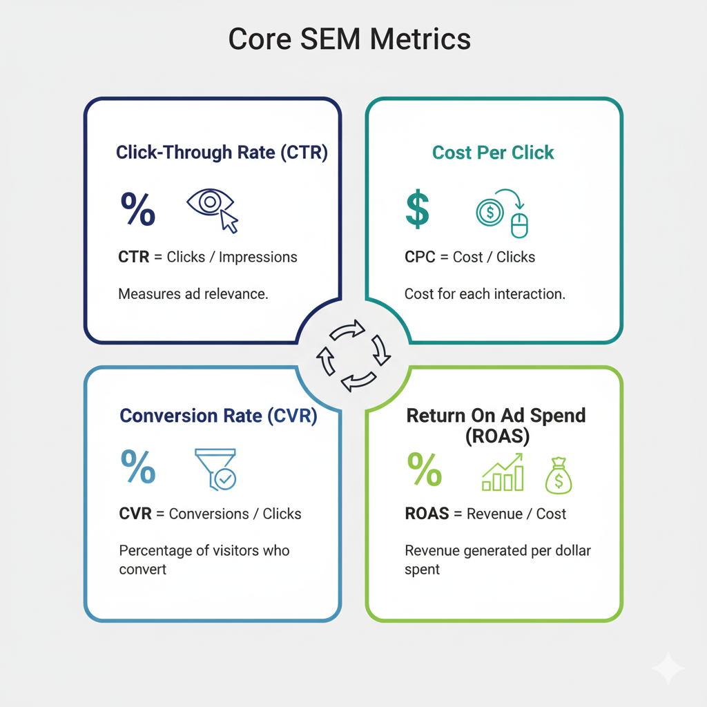

# What is SEM? A Beginner's Guide

## What is SEM?

If you've ever searched on search engines like Google or Bing, you've definitely seen links with **"Ad"** or **"Sponsored"** labels appearing above the organic results. These paid advertisements are the core of **Search Engine Marketing (SEM)**.

Simply put, SEM is a digital marketing strategy that gains traffic and visibility on search engine results pages (SERPs) through **paid methods**. Its ultimate goal is to increase your website's exposure on search engines, thereby attracting more potential customers.

### Core Components of SEM

SEM primarily consists of the following parts:

  * **Paid Search Advertising**: This is the most common form of SEM, often referred to as **PPC (Pay-Per-Click)**. When a user types a keyword into a search engine, your ad appears in a prominent position on the search results page. You only pay when a user clicks on your ad. In our **[Ultimate Guide to Paid Search Advertising (PPC)](https://chloevolution.com/zh-cn/posts/paid-search/)** article, we'll discuss in detail how to set up your first ad campaign.
  * **Display Advertising**: These ads do not appear on search results pages, but rather in the form of images, videos, or text, on websites related to your products or services, expanding brand exposure.

#### What's the Difference Between SEM, PPC, and Display Ads?

Many people often use these three terms interchangeably, but they are actually in a relationship of **inclusion and being included**.

  * **SEM** is an **umbrella term**. It covers all activities that increase visibility on search engines through paid methods.
  * **PPC** is a **billing model**, meaning "pay-per-click."
  * **Paid search** and **display advertising** are two types of **ad types**.

The most common point of confusion is PPC. While it literally refers to a billing method, in daily communication, people often use **PPC** to specifically refer to **paid search advertising**.

### Who Provides SEM Services?

There are three main roles in the SEM ecosystem:

  * **Ad Platforms**: Companies like **Google's** [Google Ads](https://business.google.com/us/google-ads/) and **Microsoft's** [Microsoft Advertising](https://ads.microsoft.com/) are platforms that provide SEM services. They are the infrastructure for advertisers to run campaigns, determining ad placement, bidding rules, and performance data.
  * **Advertisers (Demand Side)**: Any business, brand, or individual who wishes to promote their products or services through SEM is an advertiser.
  * **Agencies (Service Providers)**: SEM agencies or experts provide professional services to advertisers, including campaign management, optimization, and data analysis, helping advertisers achieve the best return on investment. If you lack sufficient internal resources, you typically choose to partner with them.

## SEM vs. SEO: Differences and Synergy

In the digital marketing landscape, **Search Engine Optimization (SEO)** and **Search Engine Marketing (SEM)** are two of the most frequently mentioned strategies. Both aim to improve a website's visibility in search engines, but their implementation, operational mechanisms, and short-term effects are vastly different. Understanding the distinctions between them, and how to make them work together, is key to developing an effective search marketing strategy.

### Core Differences and Pros & Cons Comparison

To more intuitively understand the differences between SEM and SEO, as well as their respective advantages and disadvantages, we can compare them using the following table:

| Feature           | Search Engine Marketing (SEM)                               | Search Engine Optimization (SEO)                                   |
| :---------------- | :---------------------------------------------------------- | :----------------------------------------------------------------- |
| **Traffic Acquisition Method** | **Paid Traffic**: Acquire clicks and impressions by purchasing ad placements | **Organic Traffic**: Naturally gain rankings by optimizing website content and structure |
| **Speed to Results** | **Fast**: Ads display and gain traffic immediately once launched and approved | **Slow**: Requires continuous optimization, ranking improvements usually take weeks to months |
| **Main Costs** | **Pay-per-click/impression**: Requires continuous ad budget investment | **Long-term Investment**: Primarily includes human resources, content creation, technical optimization costs |
| **Control** | **High**: Precise control over keywords, audience, budget, ad copy, etc. | **Lower**: Rankings are heavily influenced by search engine algorithms, results are not easily fully controlled |
| **Display Format** | Links with **"Ad"** or **"Sponsored"** labels                   | **Organic ranking** links without any labels                         |
| **Ranking Stability** | Maintained with sufficient budget, disappears once payment stops | **Relatively Stable**: Once gained, provides continuous and "free" traffic, but requires ongoing maintenance |
| **Advantages** | **Fast results**, precise targeting, transparent data, suitable for short-term promotions and testing | **Cost-effective** (long-term free traffic), high user trust, strong brand authority |
| **Disadvantages** | **Requires continuous budget investment**, ad blocking risk, users may be resistant to ads | **Longer time to results**, high uncertainty in outcomes, difficult to optimize in highly competitive environments |

### How to Distinguish Between SEM and SEO in Search Results?

When you search on search engines like Google or Bing, distinguishing between SEM ads and SEO organic results is actually very simple. Look for the following key indicators:

1.  **"Ad" or "Sponsored" Label**:
      * **SEM Ads**: The most obvious feature is that the result will have a clear **"Ad"**, **"Sponsored"**, or similar label next to it. These labels are usually located to the left or right of the title, and their color and font may differ slightly from regular text, but they are always clearly visible. Search engines set these labels to inform users that the result is a paid promotion.
      * **SEO Organic Results**: In contrast, organic search results obtained through SEO optimization **will not have any "Ad" labels**. These are pages that search engines consider most relevant and valuable to the user's query based on their algorithms.
2.  **Placement**:
      * **SEM Ads**: Typically appear at the **top (uppermost) and bottom (lowermost)** of the search results page. In some cases, they may also appear in the right sidebar. These are prime paid positions.
      * **SEO Organic Results**: Located below the ad results, usually in the middle section of the page. These rankings are naturally sorted by the algorithm, not obtained through payment.
3.  **URL Display**:
      * While not as direct as the "Ad" label, sometimes ad URLs may contain tracking parameters that differ slightly from the concise URLs of organic results. However, the **"Ad" label** remains the most reliable way to distinguish between the two.

### Synergistic Work of SEM and SEO: 1+1 \> 2

Although SEM and SEO have significant operational differences, they are not competing with each other but can **work together perfectly, achieving results far beyond a single strategy**. A mature digital marketing strategy often employs both methods simultaneously.

Here are some examples of how they can work together:

  * **Data Sharing, Strategy Optimization**:
      * **SEM Helps SEO**: You can quickly test the conversion effectiveness and user intent of different keywords through **[keyword research](https://chloevolution.com/zh-cn/posts/keyword-research-and-targeting/)**. Keywords that perform well in SEM are often also worth investing SEO resources to optimize their organic ranking content. At the same time, the performance of SEM's **[ad copy and creatives](https://chloevolution.com/zh-cn/posts/create-sem-copy/)** can also provide inspiration for SEO's title tags and meta descriptions.
      * **SEO Helps SEM**: A website with a good SEO foundation (e.g., fast website loading speed, friendly user experience) can usually also achieve a higher **ad quality score** in SEM. A higher quality score means you may get better ad rankings at a lower cost, thereby reducing the **[Cost Per Click (CPC)](https://chloevolution.com/tools/cpc-calculator/)**.
  * **Complementing Deficiencies, Comprehensive Coverage**:
      * **SEM Compensates for Long SEO Cycle**: For new product launches, short-term promotional activities, or highly competitive keywords, SEM can provide instant visibility, quickly capturing the market and compensating for the slow effectiveness of SEO.
      * **SEO Compensates for High SEM Costs**: Once stable organic rankings are obtained through SEO, you don't need to pay for every click. This brings you continuous, free traffic, which can effectively reduce overall marketing costs in the long run.
  * **Completely Dominate Search Results Pages**:
    When a brand has both paid ad placements and organic rankings on the search results page for a certain keyword, its **visibility on the SERP will greatly increase**. This not only boosts click-through rates but also enhances brand authority and user trust. This "double exposure" strategy can effectively squeeze out competitors' display space.

## The Core Value of SEM: Why Do Brands Need It?

After understanding the basic concepts of SEM and its differences from SEO, you might ask: Why should my brand invest in SEM? The answer lies in the unique and immediate value that SEM can bring to brands, which is difficult for many other marketing strategies to match. It not only helps you quickly reach target customers but also provides deep insights to optimize marketing investment.

### 1\. Instant Visibility: Quickly Capture the Market

Imagine you've just launched an innovative product or are running a limited-time promotional campaign. Traditional SEO optimization might take weeks or even months to see ranking improvements, while SEM can make your ads **appear at the top of the search engine results page (SERP) immediately** after launch. Similar effects apply to:

  * **New Product Launches**: Quickly present product information to potential customers.
  * **Short-term Promotions**: Maximize exposure and conversions during the event.
  * **Market Testing**: Quickly verify the effectiveness of keywords, ad copy, and product positioning.

SEM is like a fast pass, allowing your brand to quickly gain a foothold in a competitive market.

### 2\. Precise Targeting: Reach the Right Audience

SEM platforms (like Google Ads) offer powerful targeting features that allow you to precisely display ads to the most relevant potential customers. You can target based on:

  * **Keywords**: Your ads only appear when users search for specific products or services.
  * **Geographic Location**: Display ads only to customers in specific cities, regions, or even near your business.
  * **Audience Demographics**: Fine-tune targeting based on users' age, gender, interests, behavior patterns, etc.
  * **Remarketing**: Re-display ads to users who have already visited your website but have not yet converted.

This precision ensures that your marketing budget is spent effectively, avoiding inefficient ad placements and greatly improving your ad's return on investment.

### 3\. Quantifiable Returns: Every Penny Spent is Measurable

Unlike many traditional marketing methods, all inputs and outputs of SEM are **highly transparent and trackable**. You can clearly see:

  * How many people saw your ad (impressions).
  * How many people clicked on your ad (clicks).
  * What the cost per click was (**[CPC](https://chloevolution.com/tools/cpc-calculator/)**).
  * How many people completed a purchase, registration, or download (conversions).
  * How much it cost to complete each conversion (**[CPA](https://chloevolution.com/tools/cpa-calculator/)**).
  * How much sales and profit your ads generated (ROAS).

This detailed data allows you to deeply analyze ad performance, quickly identify problems, and optimize, ensuring that every marketing budget brings maximum value. We have dedicated articles discussing **[SEM cost breakdown](https://chloevolution.com/zh-cn/posts/search-engine-marketing-cost/)** and **[how to interpret data](https://chloevolution.com/zh-cn/posts/sem-analytics/)**.

### 4\. Market Insights: Deeply Understand Your Customers and Competitors

In addition to direct traffic and conversions, SEM can also provide valuable **market intelligence**:

  * **Keyword Trends**: Through **[keyword research tools](https://chloevolution.com/zh-cn/posts/keyword-research-and-targeting/)**, you can discover what users are searching for and understand their needs and pain points.
  * **Competitor Analysis**: You can see which keywords competitors are bidding on, what their ad copy and landing pages look like, thereby learning from and optimizing your own strategy.
  * **User Behavior Patterns**: Analyzing the performance of different ads and keywords can help you more deeply understand the preferences and purchase paths of your target audience.

These insights not only guide your SEM strategy but also provide valuable reference for your product development, content marketing, and overall business decisions.

## SEM Workflow: How to Create Your First Ad Campaign?

After understanding the value of SEM, you must be eager to know how to put theory into practice. Below, we will reveal the basic workflow of an SEM ad campaign from conception to launch. This is like building a house; you need to lay the foundation, build the framework, and decorate step by step. Mastering these core steps will help you efficiently create and manage your first SEM ad campaign.

### 1\. Define Goals and Audience: The Starting Point of Your SEM Strategy

Before you start, first clarify your marketing goals (increase brand awareness, acquire leads, or drive sales) and target audience. Clear goals and audience insights are the foundation for all subsequent ad decisions.

### 2\. Keyword Research: Find Your Target Customers' "Search Terms"

Keywords are the bridge connecting your ads to potential customers. You need to think from the customer's perspective: what words would they use to search for your products or services? This involves identifying core keywords, expanding long-tail keywords, analyzing competitors, and using professional tools to assist.

For more detailed keyword selection strategies, you can refer to our article **[ "Keyword Research and Targeting in the AI Era"](https://chloevolution.com/zh-cn/posts/keyword-research-and-targeting/)**.

### 3\. Ad Copywriting and Creative Production: The Key to Grabbing Attention

Once you have your keywords, the next step is to create compelling ad copy and creatives. This is crucial for getting potential customers to click on your ad rather than a competitor's. This includes writing engaging headlines, persuasive descriptions, clear calls-to-action (CTAs), and leveraging ad extensions.

To learn how to write high-converting ad copy, please check out our article **[ "Key Techniques for Writing High-Converting SEM Copy"](https://chloevolution.com/zh-cn/posts/create-sem-copy/)**.

### 4\. Landing Page Optimization: Capturing Traffic and Driving Conversions

When users click on your ad, the first page they land on is your landing page. The quality of the landing page directly impacts conversion effectiveness. A good landing page should be highly relevant to the ad content, provide a smooth user experience, and guide users to complete your predefined goal.

To learn more about tips for improving landing page conversion rates, please read our article **[ "The Ultimate Guide to Landing Page Optimization"](https://chloevolution.com/zh-cn/posts/landing-page-optimization/)**. We also provide in-depth analysis for specific industries:

  * **[ "Secrets to High-Converting E-commerce Landing Pages"](https://chloevolution.com/zh-cn/posts/ecommerce-landing-page/)**
  * **[ "Analyzing the Core Structure of SaaS Landing Pages"](https://chloevolution.com/zh-cn/posts/saas-landing-page/)**
  * **[ "The Secret Weapon of Localized Marketing: How to Create High-Converting Localized Landing Pages"](https://chloevolution.com/zh-cn/posts/creating-location-specific-landing-pages/)**

### 5\. Bidding Strategy and Budget Setting: Controlling Your Investment and Returns

On the ad platform, you need to set your bidding strategy and ad budget. This determines when, where, and at what cost your ads will be displayed. This includes setting an overall budget, choosing the right bidding strategy, and monitoring and adjusting based on performance.

For guidance on effectively managing your ad budget and choosing appropriate bidding methods, you can refer to our article **[ "SEM Ad Cost Breakdown: Self-Managed vs. Agency, How to Choose?"](https://chloevolution.com/zh-cn/posts/search-engine-marketing-cost/)**.

### 6\. Performance Tracking and Analysis: Continuous Optimization for Growth

Launching an ad isn't the end of the journey; continuous tracking and analysis are crucial for SEM success. You need to regularly review ad performance data and optimize based on feedback, including monitoring key metrics, identifying problems, conducting A/B tests, and continuously adjusting your strategy.

Detailed performance evaluation and optimization methods will be thoroughly discussed in our article **[ "The Complete Guide to SEM Data Analysis"](https://chloevolution.com/zh-cn/posts/sem-analytics/)**.

## Key Metrics to Focus on in SEM

Once your ad campaign is built and live, the next crucial step is to **monitor and analyze** its performance. One of the greatest appeals of SEM is its high traceability; every click, every conversion can be quantified. But with a vast amount of data, which metrics are truly worth our attention? Below are the most important core metrics in SEM marketing activities that will help you evaluate ad performance, optimize bidding strategies, and ensure every penny spent is worthwhile.

### 1\. Click-Through Rate (CTR): The Barometer of Ad Appeal

**Click-Through Rate (CTR)** is a fundamental metric for measuring ad **attractiveness** and **relevance**. It represents the percentage of users who saw your ad and clicked on it.

**Calculation:** CTR = Clicks / Impressions * 100%

**Why is it important?**

  * **Measures the effectiveness of ad copy and creatives**: A high CTR indicates that your ad copy, headlines, and creatives are appealing to your target audience.
  * **Influences Ad Quality Score**: On platforms like Google Ads, CTR is a significant component of the **[Ad Quality Score](https://chloevolution.com/zh-cn/posts/sem-analytics/)**. A higher Quality Score may allow you to achieve better ad rankings at a lower **[Cost Per Click (CPC)](https://chloevolution.com/tools/cpc-calculator/)**.

If your CTR is low, you might need to optimize your ad copy, conduct **[keyword research](https://chloevolution.com/zh-cn/posts/keyword-research-and-targeting/)** again, or adjust your ad's audience targeting.

### 2\. Cost Per Click (CPC): Controlling Your Marketing Spend

**Cost Per Click (CPC)** is the average fee you pay each time a user clicks on your ad.

**Calculation:** CPC = Total Cost / Clicks

**Why is it important?**

  * **Directly impacts budget consumption**: CPC directly determines how many clicks your ad budget can generate.
  * **Evaluates the efficiency of bidding strategies**: Understanding the CPC of different keywords or ad groups can help you optimize your **[budget and cost management strategy](https://chloevolution.com/zh-cn/posts/search-engine-marketing-cost/)**.

If you find that your CPC is too high, you might need to improve your Ad Quality Score, adjust your bidding strategy, or try more cost-effective keywords.

### 3\. Conversion Rate (CVR): Measuring the Ultimate Goal of Advertising

**Conversion Rate (CVR)** is a key metric for measuring the **actual effectiveness** of your ads. It represents the percentage of users who clicked on your ad, visited your **[landing page](https://chloevolution.com/zh-cn/posts/landing-page-optimization/)**, and completed your predefined goal behavior, such as making a purchase, filling out a form, downloading a resource, or signing up for a membership.

**Calculation:** CVR = Conversions / Clicks * 100%

**Why is it important?**

  * **Directly reflects marketing ROI**: A high CVR means your ad campaigns not only brought traffic but also actual business results.
  * **Evaluates the attractiveness of the landing page and product/service**: A low CVR might indicate a poor landing page user experience or insufficient appeal of the product/service itself.

If you want to improve CVR, in addition to optimizing your **[ad copy](https://chloevolution.com/zh-cn/posts/create-sem-copy/)**, it's even more important to optimize the content and user experience of your **[landing page](https://chloevolution.com/zh-cn/posts/landing-page-optimization/)**.

### 4\. Return On Ad Spend (ROAS): The "Profit and Loss Statement" of Ad Campaigns

**Return On Ad Spend (ROAS)** is an advanced and crucial metric that directly measures how much **revenue** your ad investment generated. In short, for every dollar you spend on advertising, how much money do you earn back?

**Calculation:** ROAS = Total Revenue from Ads / Total Ad Cost * 100\%

**Why is it important?**

  * **Directly evaluates ad profitability**: ROAS is the ultimate metric for assessing whether an ad campaign is profitable. A healthy ROAS typically indicates that your ad investment is worthwhile.
  * **Guides budget allocation**: By comparing the ROAS of different ad campaigns, ad groups, or even keywords, you can prioritize allocating your budget to ads that bring higher returns.

The level of ROAS directly affects whether your ad campaign can be sustained. Optimizing ROAS usually requires a comprehensive consideration of all metrics such as CTR, CPC, and CVR, and continuous **[data analysis](https://chloevolution.com/zh-cn/posts/sem-analytics/)**.

Mastering and regularly analyzing these core metrics will allow you to clearly understand the performance of your SEM ad campaigns, adjust your strategy promptly, and ultimately drive continuous growth for your brand. Remember, these metrics are interrelated and need to be evaluated comprehensively.
