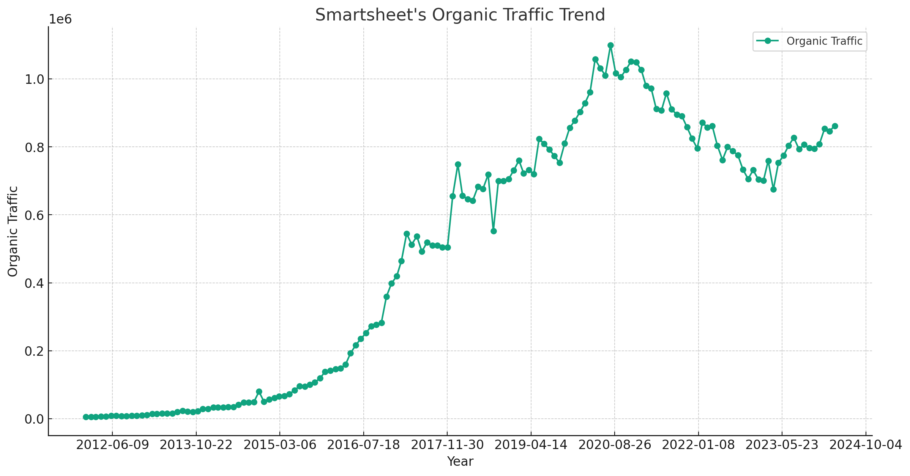

# Smartsheet SEO Strategy Analysis (2024)

Analyze the comprehensive analysis of Smartsheet's SEO strategy in 2024, focusing on trends, keyword effectiveness, and URL traffic distribution, highlighting significant growth and optimization strategies.

## Takeaways

- **SEO Trend**: The trend analysis shows a consistent increase in Smartsheet's organic traffic, culminating in a traffic peak of 862,037 visits in April 2024.
- **SEO Keyword Strategy**: Smartsheet's focus on product-related keywords significantly boosted their traffic, accounting for 60.01% of the total traffic by April 2023.
- **SEO URL Traffic Distribution**: The main website, `https://www.smartsheet.com/`, remained the top performer, garnering 36.52% of the total site traffic as of March 2024.

Note: The data used in this article is only for the desktop side in the US market. All data are taken from third-party platforms, this site does not guarantee the accuracy of the data.

Analysis of traffic trends for Smartsheet's "Organic Traffic" over the specified phases is organized in the table below, showing each phase, the average traffic, and the observed trend:

| Phase  | Specific Time        | Average Traffic | Trend      |
|--------|----------------------|-----------------|------------|
| Phase 1| 2012-01 to 2020-08   | 343,472         | Increasing |
| Phase 2| 2020-08 to 2023-04   | 869,788         | Decreasing |
| Phase 3| 2023-04 to 2024-03   | 794,256         | Increasing |

- **Phase 1 (2012-01 to 2020-08)**: There was a steady increase in organic traffic, averaging around 343,472. This indicates a period of growth leading up to 2020.
- **Phase 2 (2020-08 to 2023-04)**: During this period, there was a decrease in traffic despite starting from a higher base, with an average traffic of 869,788. This suggests some challenges or changes in strategy that might have impacted traffic negatively.
- **Phase 3 (2023-04 to 2024-03)**: The trend shows an increase again, with an average traffic of 794,256, suggesting a possible recovery or successful adjustments in their strategy.

See more about [Smartsheet's SEM strategy](https://chloevolution.com/posts/smartsheet-sem-strategy-analysis).

## Smartsheet's SEO Strategy (August 2020)

### Organic Keyword Strategy Analysis

| Keyword Topic     | Keyword Example               | Traffic | Traffic (%) |
|-------------------|-------------------------------|---------|-------------|
| Other             | Smart Goals                   | 399,093 | 37.53%      |
| Product-related   | Smartsheet                    | 339,887 | 31.96%      |
| Templates         | SWOT Analysis Template        | 295,027 | 27.74%      |
| Guides & How-to   | How to Make a Graph in Excel  | 29,238  | 2.75%       |
| Login-related     | Procore Login                 | 152     | 0.01%       |

**Classification Rules:**
1. **Product-related**: Includes any keyword containing the term "smartsheet", implying direct product relevance.
2. **Templates**: Keywords that include the term "template", reflecting content-specific resources.
3. **Login-related**: Keywords involving login aspects, suggesting user interaction with the service.
4. **Guides & How-to**: Keywords that suggest instructional content, such as "how to" or "guide".
5. **Other**: Keywords that do not fit the above categories or are less directly related to the product/services.

### URL Traffic Distribution

Here are the top 5 URLs by traffic for Smartsheet in August 2020:

| URL                                                    | Traffic | Traffic (%) |
|--------------------------------------------------------|---------|-------------|
| https://www.smartsheet.com/                            | 250,023 | 23.51%      |
| https://app.smartsheet.com/b/home                      | 34,916  | 3.28%       |
| https://www.smartsheet.com/blog/essential-guide-smart-goals | 21,706  | 2.04%       |
| https://www.smartsheet.com/14-free-swot-analysis-templates | 15,608  | 1.47%       |
| https://www.smartsheet.com/top-project-management-tips | 12,452  | 1.17%       |

### Summary of Smartsheet's SEO Strategy (August 2020)

1. **Focused on Brand and Product Keywords**: A significant portion of the traffic (31.96%) was driven by keywords directly related to the brand, indicating a strong brand recognition and SEO focus on promoting product awareness.

2. **Content Marketing**: With templates and guides contributing substantially to the overall traffic (27.74% and 2.75% respectively), content marketing via valuable resources like templates and how-to guides appears to be a key strategy.

3. **Major Traffic Concentration on Few URLs**: The primary website homepage received the highest single-URL traffic (23.51%), suggesting that efforts might be centralized around enhancing the landing page's SEO performance.

## Smartsheet's SEO Strategy (April 2023)

### Organic Keyword Strategy Analysis

| Keyword Topic         | Keyword Example               | Traffic | Traffic (%) |
|-----------------------|-------------------------------|---------|-------------|
| Product-related       | Smartsheet                    | 400,208 | 60.01%      |
| Other                 | Smart Goals                   | 154,917 | 23.23%      |
| Templates             | SWOT Analysis Template        | 106,154 | 15.92%      |
| Guides & How-to       | How to Write a Business Plan  | 4,965   | 0.74%       |
| Reviews & Comparisons | Design Review                 | 660     | 0.10%       |

### URL Traffic Distribution

The top 5 URLs by traffic for Smartsheet in April 2023 are:

| URL                                                      | Traffic | Traffic (%) |
|----------------------------------------------------------|---------|-------------|
| https://www.smartsheet.com/                              | 309,761 | 46.45%      |
| https://app.smartsheet.com/b/home                        | 29,493  | 4.42%       |
| https://www.smartsheet.com/top-excel-budget-templates    | 11,922  | 1.79%       |
| https://www.smartsheet.com/top-project-management-tips   | 7,756   | 1.16%       |
| https://www.smartsheet.com/blog/essential-guide-smart-goals | 6,155   | 0.92%       |

### Summary of Smartsheet's SEO Strategy (April 2023)

- **Dominant Brand-Focused Keyword Strategy**: Over 60% of traffic is attributed to product-related keywords (including common misspellings like "smart sheet"), indicating a robust SEO strategy that successfully capitalizes on brand recognition.

- **Significant Traffic Concentration on the Main Website**: The main homepage receives almost half of the total traffic (46.45%), underscoring its importance in Smartsheet’s digital strategy and the effectiveness of their SEO in driving traffic to key landing pages.

- **Targeted Content for Diverse User Needs**: The presence of template-related and educational content (like guides) shows a commitment to providing valuable resources to users, which not only aids in user retention but also attracts a broader audience.

- **Limited Influence from Reviews and Comparisons**: This category has minimal impact on overall traffic, suggesting that users are likely more interested in direct information about products and how-to content rather than comparative analyses.

## Smartsheet's SEO Strategy (March 2024)

### Organic Keyword Strategy Analysis

| Keyword Topic         | Keyword Example                   | Traffic | Traffic (%) |
|-----------------------|-----------------------------------|---------|-------------|
| Product-related       | Smartsheet                        | 357,672 | 43.42%      |
| Templates             | Business Plan Template            | 236,905 | 28.76%      |
| Other                 | Smart Goals                       | 203,146 | 24.66%      |
| Non-Product-related   | Gmail                             | 16,719  | 2.03%       |
| Guides & How-to       | How to Write a Business Plan      | 8,983   | 1.09%       |
| Reviews & Comparisons | Program Management Best Practices | 372     | 0.05%       |

### URL Traffic Distribution

Here are the top 5 URLs by traffic for Smartsheet in March 2024:

| URL                                                      | Traffic | Traffic (%) |
|----------------------------------------------------------|---------|-------------|
| https://www.smartsheet.com/                              | 300,846 | 36.52%      |
| https://help.smartsheet.com/articles/2476621-sign-in-smartsheet-gmail | 17,078  | 2.07%       |
| https://www.smartsheet.com/content/simple-business-plan-template | 10,966  | 1.33%       |
| https://www.smartsheet.com/free-google-calendar-templates | 9,964   | 1.21%       |
| https://www.smartsheet.com/top-excel-project-plan-templates | 9,540   | 1.16%       |

### Summary of Smartsheet's SEO Strategy (March 2024)

- **Product-Centric Keyword Focus**: A significant part of the traffic (43.42%) comes from keywords directly related to the product name, indicating strong brand recognition and targeted SEO strategies to capture searches specifically for Smartsheet.

- **Substantial Investment in Template-Related Content**: Almost a third of the traffic (28.76%) is driven by keywords related to templates, suggesting that Smartsheet heavily markets its template solutions, which likely appeal to a broad user base looking for project management and business planning tools.

- **Effective Use of Educational Content**: Guides and how-to content, although smaller in total traffic share, serve a crucial role in addressing specific user queries and enhancing the content's utility, thereby improving SEO performance.

- **Highly Optimized Landing Pages**: The main website page receives over a third of the overall traffic (36.52%), highlighting its optimization and the strategic placement of content to maximize visitor engagement and conversions.

## Summary

To provide a comparative analysis of Smartsheet's SEO strategy across the three periods (August 2020, April 2023, and March 2024), we'll look at the keyword topic distribution, URL traffic distribution, and some strategic focuses derived from the keyword intents and SERP features. Here's a breakdown of similarities and differences:

### Similarities

1. **Product-Centric Focus**: Across all periods, a significant proportion of the traffic consistently comes from keywords directly related to the product name ("Smartsheet" and variations like "smart sheet"). This shows a strong emphasis on brand-centric SEO.
   - August 2020: Product-related traffic at 31.96%.
   - April 2023: Product-related traffic jumped to over 60% after adjusting keyword classification.
   - March 2024: Product-related traffic at 43.42%.

2. **Primary URL Focus**: The main website (`https://www.smartsheet.com/`) remains the top traffic-receiving URL across all periods, underscoring its role as the central hub for organic search traffic.
   - Across all periods, the main URL consistently captures a large percentage of total traffic, ranging from 23.51% to 36.52%.

### Differences

1. **Content Strategy Focus**:
   - **2020**: Templates and educational content contributed significantly but less emphasis on comparisons and reviews.
   - **2023**: Increased focus on templates and maintained educational content with minimal input from reviews and comparisons.
   - **2024**: Stronger emphasis on templates, with noticeable traffic from other content types, including non-product-related keywords like "Gmail."

2. **Keyword Traffic Distribution**:
   - **2020**: Traffic was more evenly distributed among various keyword topics with a strong show from product-related and template keywords.
   - **2023**: Saw a significant consolidation under product-related keywords, highlighting a sharpened focus on brand strength.
   - **2024**: Continued strong emphasis on product-related keywords but with a higher diversity in secondary content categories like templates and educational materials.

3. **Tactical Use of SERP Features**:
   - **2020 and 2023 Data**: Showed use of diverse SERP features aimed at enhancing visibility and engagement, such as knowledge panels, sitelinks, and video carousels.
   - **2024 Data**: Continued leveraging of SERP features, with an introduction or increased appearance of specific features like reviews and related searches, indicating an evolving strategy to maximize SERP real estate and enhance user engagement.

