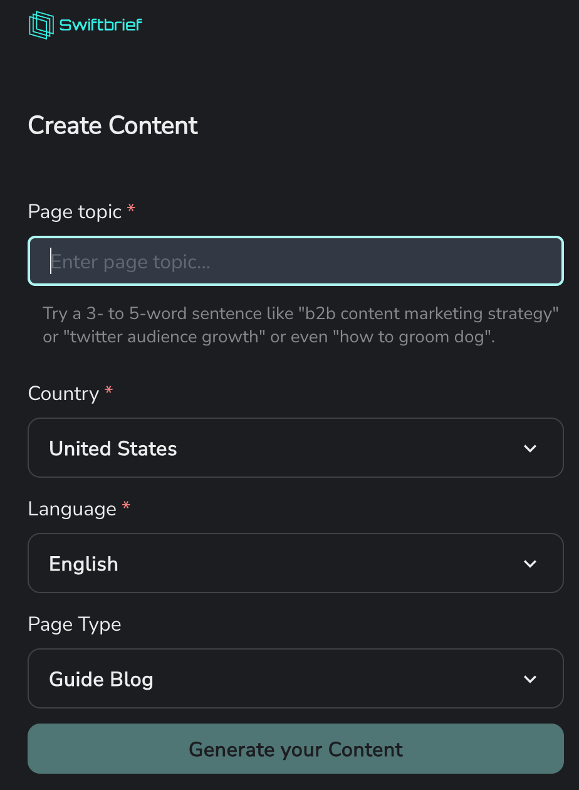
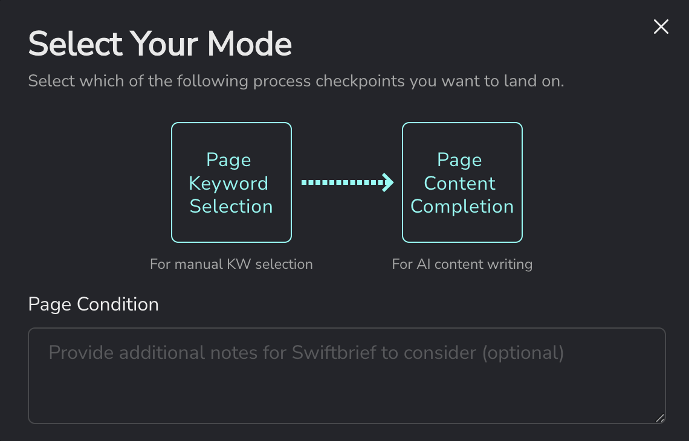
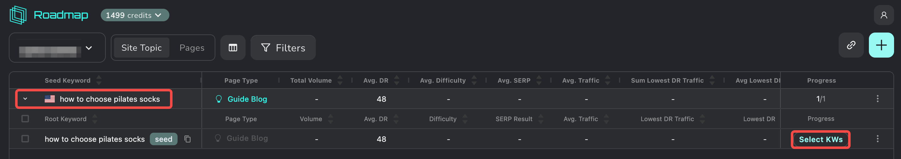
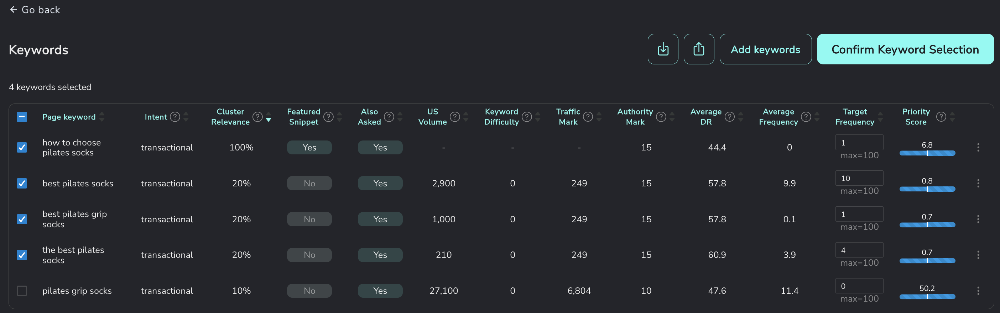
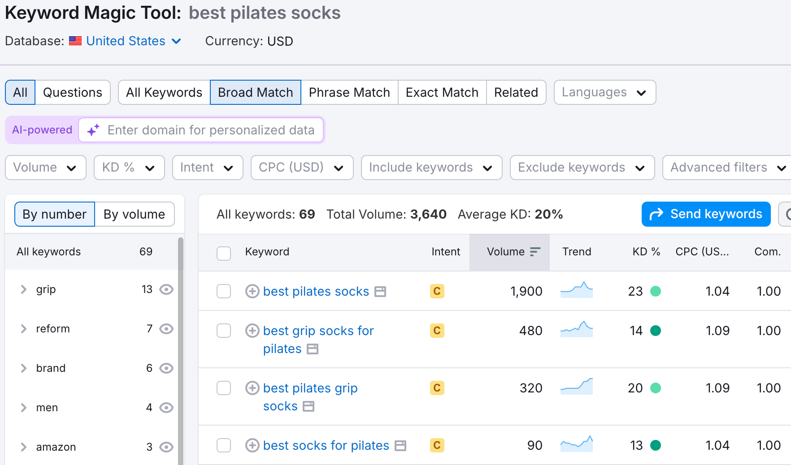
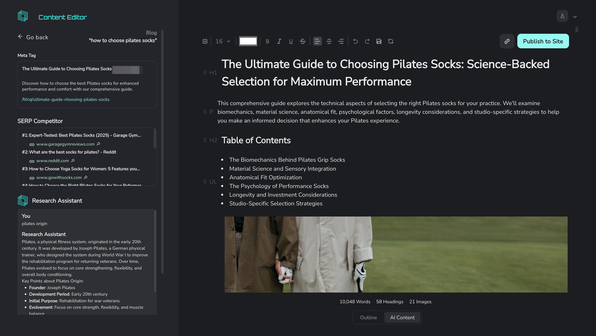
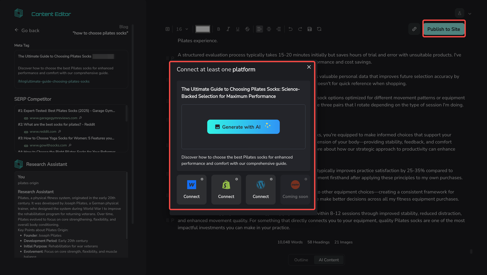

# Hands-On with Swiftbrief: How AI Simplifies SEO Content Creation

[Swiftbrief](https://www.swiftbrief.com/) is an AI-powered SEO platform designed to streamline the content creation process. Its core features include:

1. Automatically generating content outlines based on keyword and topic analysis
2. Keyword research and clustering
3. Integrating SEO data to improve content quality and performance

## Test Walkthrough

### Sign-Up & Onboarding

During registration, one minor inconvenience is the requirement to enter your website URL—it's a mandatory field:

Interestingly, the platform experiments with different onboarding methods, letting users choose their preferred learning style during sign-up:

Once registered, you're taken straight into the trial interface. There's no explanation of what feature you're in—it simply prompts you to start creating content.
To begin writing, you'll need to provide the following information:

* **Page Topic**
* **Target Country**
* **Target Language**
* **Page Type**:
  Options include: Guide Blog, Roundup Blog, Listicle Blog, VS Blog, Review Blog, Templates Blog, Solutions Page, Collection Page, Product Page

### Choosing Target Keywords

After entering the basic info, you can choose between two next steps: **Page Keyword Selection** or **Page Content Completion**.

If you opt to manually select keywords, Swiftbrief creates a project based on your earlier input topic. Once expanded, you can select from suggested keywords or manually add your own:

Each keyword is evaluated across several dimensions:

| Category                  | Metric Name            | Description                                                                      |
| ------------------------- | ---------------------- | -------------------------------------------------------------------------------- |
| Search Intent & Behavior  | **Intent**             | The user's core motivation when searching this keyword (e.g. research, purchase) |
|                           | **Also Asked**         | Google's "People also ask" queries tied to the keyword                           |
| Keyword Relevance         | **Cluster Relevance**  | Frequency of keyword across different SERPs, indicating topical relevance        |
|                           | **Featured Snippet**   | Whether a featured snippet appears for this keyword                              |
| Demand & Difficulty       | **US Volume**          | Monthly average search volume in the US                                          |
|                           | **Keyword Difficulty** | Ranking difficulty based on competitor SEO strength                              |
| Competition & Opportunity | **Traffic Mark**       | Estimated traffic for the second-to-last organic SERP result                     |
|                           | **Authority Mark**     | Domain Rating (DR) of the second-to-last result, reflecting competition          |
|                           | **Average DR**         | Average DR of the top 10 SERP domains                                            |
| Content Optimization      | **Average Frequency**  | Average keyword appearances on top 10 pages (helps with natural embedding)       |
| Priority Scoring          | **Priority Score**     | A composite score evaluating opportunity based on traffic & authority            |

Additionally, under **Target Frequency**, you can set how many times a keyword should be mentioned in the article (with system-generated suggestions and a max of 100). This helps manage keyword density.

However, one odd thing I noticed: all the keywords showed a difficulty score of 0, which clearly can't be right. I double-checked some of them in SEMrush and found that Swiftbrief's reported US search volumes were significantly higher than expected:

### Article Generation

After finalizing keywords, I had to wait nearly half an hour for the content to be generated. When it was ready, here's what I saw:

* The output is displayed in a text editor
* On the left: meta tags (title, description, URL), a list of SERP competitors, and a **Research Assistant** for on-the-fly concept lookup (e.g., I searched “origin of Pilates”)
* On the right: the article itself, with word count, heading count, and image count shown at the bottom
  

From a structural perspective, here are some quick observations (without evaluating content accuracy):

**Pros:**

* Smart internal linking: the tool embeds links to your existing site pages where relevant
* External sources are cited as well (though URLs appear as naked links; using anchor text would be better)
* Uses tables effectively when presenting comparisons or lists

**Cons:**

* Images are included, but mostly irrelevant to the content
* Paragraphs are extremely short—just 2-3 lines—making the content feel fragmented

If you're not happy with the generated content, you can edit it directly in the editor or share the link for collaborative editing. Once everything looks good, you can publish the article to your site—though you'll need to integrate your CMS first:

