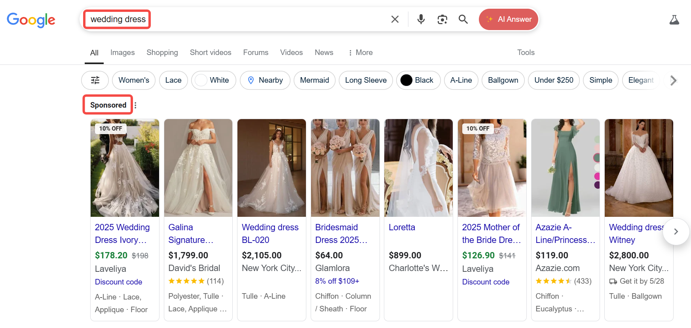
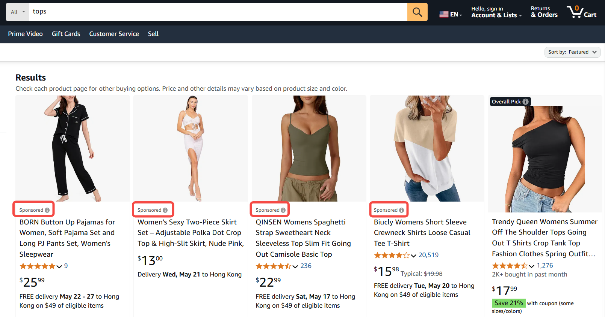

# Comprehensive Guide to Digital Advertising Types

Digital advertising reaches target audiences through diverse formats. This article introduces 11 mainstream advertising types using the **Definition→Targeting Methods→Format Breakdown→Main Platforms** structure.

## 1. Search Ads

Search ads are text or dynamic ads triggered by user search keywords on search engines (e.g., Google, Bing), typically appearing at the top, bottom, or sidebar of search engine results pages (SERPs). Their core logic is **capturing active search intent** by matching keywords to deliver relevant ads.  

### Targeting Methods
- **Keyword Matching Modes**:  
  - **Exact Match**: Triggers only when search terms exactly match keywords (e.g., keyword "sneakers" matches only "sneakers").  
  - **Broad Match**: Covers synonyms or related terms (e.g., "sneakers" may match "running shoes" or "men's sneakers").  
  - **Phrase Match**: Requires search terms to contain the complete keyword phrase (e.g., "blue sneakers" matches "2025 new blue sneakers").  
- **Search Intent Analysis**:  
  - Uses semantic analysis to distinguish user needs (e.g., **commercial intent** "buy Nike running shoes" vs. **informational intent** "how to choose running shoes").  

### Format Breakdown
| Type                | Features & Examples                                                                 |  
|---------------------|------------------------------------------------------------------------------------|  
| **Text Ads**         | - Standard format: 2-3 headlines + 1-2 descriptions + display URL. - **Example**: Google text ads dominate top SERP positions with "Ad" labels. - **Use Case**: Highlights promotions (e.g., "20% off") or product USPs. |  
| **Dynamic Search Ads (DSA)** | - Auto-generates ad titles/descriptions from website content without manual keywords. - **Advantage**: Quickly covers long-tail searches, ideal for e-commerce with dynamic SKUs. - **Example**: Automatically displays relevant product page ads for "waterproof Bluetooth earphones" searches. |  
| **Shopping Ads**     | - Displays product images, prices, and reviews (requires product feed submission). - **Example**: Google Shopping ads show product carousels at SERP tops, directing users to product pages. |  

### Main Platforms & Tools 
- **Google Ads**:  
  - The world's largest search ad platform, covering Google Search and partner sites.  
  - Supports [text ads](https://support.google.com/google-ads/answer/12437745?hl=en), [DSA](https://support.google.com/google-ads/answer/2471185?hl=en), and [shopping ads](https://support.google.com/google-ads/answer/2454022?hl=en), with tools like Keyword Planner and Smart Bidding.  
- **Microsoft Advertising (Bing Ads)**:  
  - Targets Windows and Edge browser users, often with lower CPC than Google.  
  - [Text ads](https://about.ads.microsoft.com/en/solutions/ad-products-formats/search) follow similar keyword logic to Google but with less competition.  
  - [Shopping ads](https://about.ads.microsoft.com/en/solutions/ad-products-formats/retail/shopping-campaigns) integrate Microsoft ecosystem data (e.g., LinkedIn professional targeting), ideal for B2B in North America/Europe.  
- **[Yahoo Native Ads](https://www.yahooinc.com/yahoo-ads)**:  
  - Dominates in Japan and Taiwan markets, focusing on mobile traffic with simplified keyword matching.  

## 2. Shopping Ads
Shopping ads visually showcase **product images, prices, and reviews**, primarily serving e-commerce scenarios. They are **conversion-driven**, typically redirecting users to product pages or carts upon click, like [Bing Shopping Ads](https://chloevolution.com/posts/bing-shopping-ads/).  

### Targeting Methods
- **Product Feed Matching**:  
  Requires structured product data feeds (title, price, inventory, image links). Platforms auto-match products to user searches/browsing behavior.  
  **Example**: Displays "black dresses" from feeds when users search the term.  
- **Shopping Intent Targeting**:  
  - **Active Search Intent**: Matches search terms on engines/e-commerce platforms (e.g., "Nike shoes discount").  
  - **Behavioral Retargeting**: Targets users who viewed products but didn't purchase (e.g., Facebook DPA).  

### Format Breakdown 
| Format                  | Features & Logic                                                                 |  
|-------------------------|---------------------------------------------------------------------------------|  
| **Product Carousel Ads (Google Shopping)** | - Grid-style multi-product displays atop SERPs. - **Logic**: Matches product feeds to search terms; allows manual prioritization (e.g., promoting sale items). |  
| **Dynamic Product Ads (DPA)** | - Auto-promotes personalized products based on user behavior (e.g., cart abandoners). - **Logic**: Uses website/app interaction data (requires pixel tracking). |  
| **E-commerce Platform Ads (Amazon Sponsored Products)** | - Displays in Amazon search results/product pages (PPC). - **Logic**: Matches user searches or similar product attributes (e.g., competitor targeting). |  

## 3. Display Ads  
Display ads use **visual elements** (images, animations, videos) on third-party websites, apps, or affiliate networks for brand awareness, remarketing, or click-throughs. Unlike search ads, they rely on proactive outreach rather than reactive search responses.  

### Targeting Methods  
- **Audience Targeting**:  
  - Demographic tags (age, gender, interests like "gamers aged 18-24").  
  - Cookie/device ID tracking (e.g., users who visited competitor sites).  
- **Contextual Targeting**:  
  - Matches ad content to webpage themes (e.g., sneaker ads on sports news sites).  
- **Geotargeting**:  
  - Targets users in specific areas (e.g., local restaurants target 5km radius).  

### Format Breakdown  
| Format                | Features & Use Cases                                                                 |  
|-----------------------|-------------------------------------------------------------------------------------|  
| **Banner Ads**         | - Static/GIF images in webpage headers/footers/sidebars. - **Targeting**: Contextual (e.g., hotel ads on travel sites). - **Example**: "Black Friday Sale" banners on news sites. |  
| **Interstitial Ads**   | - Full-screen ads during app transitions/game breaks. - **Targeting**: User behavior (app usage frequency) or device type. - **Example**: "Watch ad for extra lives" in mobile games. |  
| **Rich Media Ads**     | - Interactive elements (videos, forms, 3D views). - **Targeting**: High-value audiences (luxury brands target high-income users). - **Example**: Car ads with "360° view" features. |  

### Main Platforms  
1. **[Google Display Network (GDN)](https://support.google.com/google-ads/answer/2404190?hl=en)**  
   - **Coverage**: 2M+ global websites/apps including YouTube/Gmail.  
   - **Features**:  
     - Supports banners/rich media (HTML5 uploads).  
     - Targeting: Audience interests, custom lists (remarketing), content keywords (e.g., "outdoor sports").  
     - Dynamic remarketing: Auto-shows browsed products (requires Google Tag).  
   - **Use Case**: Mass brand exposure, e-commerce remarketing.  

2. **Programmatic Platforms**  
   - **[The Trade Desk](https://www.thetradedesk.com/)**:  
     - Focuses on RTB for open web (non-social media), supports banners/video/audio.  
     - Tech: Cross-device ID mapping, third-party data (e.g., credit card spending).  
     - Unique: Koa™ AI optimizes budget allocation for ROI.  
   - **[Criteo](https://www.criteo.com/)**:  
     - Specializes in dynamic product ads (DPA), auto-generates banners (e.g., "10% off viewed items").  
     - Logic: Cross-site browsing behavior (cookie-dependent, impacted by privacy policies).  

3. **Mobile Ad Platforms**  
   - **[AppLovin](https://www.applovin.com/)**:  
     - Mobile app focus: Interstitials, rewarded videos (users earn in-app rewards).  
     - Targeting: App category (games/social), user activity (weekly opens).  
     - Algorithm: Machine learning optimizes ad-audience matching.  
   - **[Unity Ads](https://unity.com/products/unity-ads)**:  
     - Gaming ecosystem: 2.8B+ monthly active users.  
     - Unique: Playable ads (game demos) for app installs.  
     - Targeting: Game genre (strategy/casual), player spending habits.  

## 4. Social Media Ads  
Social media ads appear in feeds, stories, or interactive modules on platforms like Facebook/Instagram/TikTok. They leverage user data for precise targeting, balancing brand exposure, engagement, and conversions.  

### Targeting Methods  
- **Demographics**: Age, gender, job title, education (e.g., LinkedIn targets "IT managers").  
- **Interest/Behavior Tags**: Followed accounts, content interactions, purchases (e.g., "beauty enthusiasts").  
- **Custom Audiences**: Upload customer emails/phone numbers for remarketing.  
- **Lookalike Audiences**: Expands reach based on seed audience traits.  

### Format Breakdown  
| Format                | Features & Platforms                                                                 |  
|-----------------------|-------------------------------------------------------------------------------------|  
| **Feed Ads**           | Blends with organic content (text/image/video carousels). Examples: Facebook Feed Ads, Twitter Promoted Tweets. |  
| **Story Ads**          | Full-screen vertical ads (≤15s), skippable via swipe. Examples: Instagram Stories Ads, Snapchat Ads. |  
| **Carousel Ads**       | Horizontal scroll for multi-image/video displays. Example: LinkedIn Carousel for multi-feature products. |  
| **Video Ads**          | Auto-play short videos (6-15s) for emotional appeal. Examples: TikTok In-Feed Ads, YouTube Shorts Ads. |  
| **Shopping Tags**      | Direct product tags with prices. Examples: Instagram Shopping Tags, Pinterest Product Pins. |  

### Main Platforms  
1. **[Meta Ads Manager](https://www.facebook.com/business/tools/ads-manager)**  
   - **Formats**: Feed, story, carousel, shopping ads.  
   - **Targeting**:  
     - Demographics (age/occupation).  
     - Interest tags ("pet supplies", "yoga lovers").  
     - Custom audiences (website/CRM data).  
   - **Unique**: Dynamic ads (auto-show browsed items), AR try-on ads.  

2. **[TikTok Ads](https://ads.tiktok.com/i18n/home)**  
   - **Formats**: In-feed videos, hashtag challenges, livestream shopping.  
   - **Targeting**:  
     - Music genres, influencer fan bases.  
     - App download history.  
   - **Unique**:  
     - Branded Missions: UGC contests with traffic rewards.  
     - TikTok Shop: Direct product links in videos.  

3. **[LinkedIn Ads](https://business.linkedin.com/marketing-solutions/ads)**  
   - **Formats**: Feed ads, carousels, text ads (sidebar), InMail.  
   - **Targeting**:  
     - Job title, company size, industry.  
     - Skills (programming languages, management experience).  
   - **Unique**: Lead Gen Forms for B2B lead capture.  

4. **[Pinterest Ads](https://ads.pinterest.com/)**  
   - **Formats**: Product Pins, carousels, videos.  
   - **Targeting**:  
     - Interests (home decor, wedding planning).  
     - Search keywords (e.g., "Scandinavian living room ideas").  
   - **Unique**:  
     - Shop the Look: Clickable product pins.  
     - Pinterest TV: Livestream DIY tutorials.  

## 5. Video Ads  
Video ads use **video content** on platforms like YouTube, TikTok, or CTV to engage users through sight and sound, ideal for storytelling, product demos, or interactive campaigns.  

### Targeting Methods  
- **Demographics**: Age, gender, location.  
- **Interest/Behavior**: Watched channels/video types (e.g., "makeup tutorials").  
- **Contextual**: Aligns with video content themes (e.g., cookware ads in cooking videos).  
- **Retargeting**: Re-engages video viewers who didn’t convert.  

### Format Breakdown  
| Format                | Features & Logic                                                                 |  
|-----------------------|---------------------------------------------------------------------------------|  
| **Pre-roll Ads**       | 5-30s unskippable ads before videos. Targets content themes (e.g., snack ads before movie trailers). |  
| **Skippable Ads**      | Skippable after 5s (e.g., YouTube TrueView). Requires strong hooks in first 5s. |  
| **In-Feed Video Ads**  | Blends into social feeds (TikTok/Facebook). Uses interest tags and engagement algorithms. |  
| **Playable Ads**       | Interactive game demos for app installs. Targets gaming enthusiasts. |  
| **Livestream Ads**     | Real-time promotions during streams (e.g., Twitch). Boosts impulse purchases. |  

### Main Platforms  
1. **YouTube Ads**  
   - **Formats**: Pre-roll, skippable, video discovery ads.  
   - **Targeting**:  
     - Keyword/audience/content-based.  
   - **Unique**:  
     - Bumper ads (6s unskippable).  
     - Video action ads (end-screen CTAs).  

2. **TikTok Ads**  
   - **Formats**: In-feed videos, TopView (first-screen ads).  
   - **Targeting**:  
     - Music/trending hashtags.  
     - Device/geo-targeting.  
   - **Unique**:  
     - Spark Ads: Promote organic UGC content.  
     - TikTok Shop integration.  

3. **Meta Video Ads**  
   - **Formats**: Feed videos, Reels, Stories.  
   - **Targeting**:  
     - Combines demographic and interest data.  
   - **Unique**:  
     - Dynamic creative optimization.  
     - AR video try-ons.  

4. **CTV Ads (Hulu/Roku)**  
   - **Formats**: 15-30s unskippable ads, pause ads.  
   - **Targeting**:  
     - Household income/location.  
     - Content preferences (TV genres).  
   - **Unique**:  
     - Incremental reach for cord-cutters.  
     - Device ID-based attribution.  

## 6. Native Ads  
Native ads seamlessly blend with **platform content formats and styles**, minimizing the "sales pitch" feel by mimicking organic content (articles, videos, feeds) to reduce user resistance, achieving "ad-as-content" dissemination.  

### Targeting Methods  
- **Contextual Matching**: Pushes relevant ads based on page/user browsing themes (e.g., headphone review ads in tech blogs).  
- **User Interest Tags**: Targets audiences with similar historical behaviors (reading/watching/searching).  
- **Device & Environment Adaptation**: Auto-adjusts ad formats for mobile/PC/app interfaces.  

### Format Breakdown  
| Format                | Features & Examples                                                                 |  
|-----------------------|-----------------------------------------------------------------------------------|  
| **In-Feed Native Ads** | Blends into social/feed content (e.g., Twitter Promoted Tweets, Facebook Feed Ads). |  
| **Content Recommendation Ads** | "Recommended reads" at article bottoms/sidebars (e.g., Outbrain/Taboola widgets). |  
| **Sponsored Articles/Videos** | Branded content labeled "Sponsored" (e.g., BuzzFeed stories, YouTube brand collabs). |  
| **Search Native Ads**  | SERP ads matching organic result styles (e.g., Google AMP ads, Amazon Sponsored Products). |  

### Main Platforms  
1. **Outbrain & Taboola**  
   - **Core Format**: Content recommendation widgets ("You May Like").  
   - **Logic**:  
     - Contextual analysis matches page themes to ads (e.g., luggage ads on travel blogs).  
     - Cross-platform user reading history tracking.  
   - **Unique**: Headline A/B testing, premium traffic prioritization.  

2. **Social Media Feed Ads**  
   - **Platforms**: Facebook Feed Ads, X (Twitter) Promoted Posts, LinkedIn Sponsored Content.  
   - **Logic**:  
     - Interest tags (e.g., "fitness enthusiasts").  
     - Professional attributes (LinkedIn industry/job targeting).  

3. **Google AMP Ads**  
   - **Core Format**: Responsive ads in Accelerated Mobile Pages (AMP), matching article layouts.  
   - **Logic**:  
     - Keyword/content theme alignment.  
     - User search history.  

4. **Pinterest Promoted Pins**  
   - **Core Format**: Pins styled like user-saved content, labeled "Promoted".  
   - **Logic**:  
     - Interest tags (home decor, wedding planning).  
     - Visual similarity to saved Pins.  
   - **CTA Path**: Direct links to brand e-commerce sites.  

## 7. Email Ads  
Email ads deliver marketing content via **email campaigns** to subscribers, using text/images/dynamic templates for promotions, updates, or customer retention, emphasizing high open rates and precision.  

### Targeting Methods  
- **List Segmentation**:  
  - User attributes (gender/location/membership tier).  
  - Behavioral data (purchase history/email click patterns).  
- **Triggered Automation**:  
  - Behavior-triggered emails (e.g., cart abandonment reminders).  
  - Time-based triggers (birthday offers/subscription anniversaries).  
- **Dynamic Content**:  
  - Personalizes products/copy based on user profiles (e.g., "Winter coats we picked for you").  

### Format Breakdown  
| Format                | Use Cases & Features                                                                 |  
|-----------------------|-------------------------------------------------------------------------------------|  
| **Promotional Emails** | Highlights discounts/limited offers (e.g., "Black Friday 50% off") with bold CTAs. |  
| **Newsletters**       | Regular brand updates/industry insights (e.g., weekly curated articles) for loyalty. |  
| **Remarketing Emails** | Targets incomplete purchasers (e.g., "Cart items almost sold out") with exclusive codes. |  
| **Transactional Emails** | Embeds product recommendations in service emails (e.g., "Your order shipped – add accessories"). |  

### Main Platforms  
1. **[Mailchimp](https://mailchimp.com/)**  
   - **Key Features**:  
     - Drag-and-drop templates, dynamic content.  
     - Automated workflows (welcome series/abandoned cart).  
   - **Tools**:  
     - User tagging (manual/auto).  
     - A/B testing (subject lines/send times).  
   - **Ideal For**: SMBs/e-commerce sites.  

2. **[HubSpot](https://www.hubspot.com/products/marketing/email)**  
   - **Key Features**:  
     - CRM integration for behavior-triggered emails.  
     - AI-driven product recommendations.  
   - **Tools**:  
     - Customer journey mapping.  
     - Funnel analytics (email engagement → conversions).  
   - **Ideal For**: B2B lead nurturing.  

3. **[Klaviyo](https://www.klaviyo.com/)**  
   - **Key Features**:  
     - E-commerce sync (Shopify/Magento orders).  
     - Predictive send-time optimization.  
   - **Tools**:  
     - RFM segmentation (recency/frequency/monetary value).  
     - Cart recovery automation.  
   - **Ideal For**: DTC brands/premium e-commerce.  

4. **[SendGrid](https://sendgrid.com/)**  
   - **Key Features**:  
     - High-volume sending for enterprises.  
     - API-driven tech integrations.  
   - **Tools**:  
     - Real-time analytics (bounce rates/spam complaints).  
     - IP reputation management.  
   - **Ideal For**: Tech-savvy teams/transactional emails.  

## 8. Affiliate Ads  
Affiliate ads operate on **performance-based payouts (CPS/CPA)**, where brands partner with third parties (bloggers/websites/influencers) to promote products, sharing risks and rewards.  

### Targeting Methods  
- **Partner Audience Alignment**: Select affiliates whose followers match brand targets (e.g., beauty bloggers for cosmetics).  
- **Content Relevance**: Embed ads in thematic content (e.g., protein powder ads on fitness blogs).  
- **Keyword/Product Matching**: Algorithmic link associations (e.g., Amazon affiliate product recommendations).  

### Format Breakdown  
| Format                | Use Cases & Mechanics                                                                 |  
|-----------------------|-------------------------------------------------------------------------------------|  
| **Product Reviews**   | Detailed usage experiences (text/video) with affiliate links (e.g., tech YouTubers). |  
| **Coupon Distribution** | Exclusive discount codes via partner sites (e.g., "Subscribe for 10% off"). |  
| **Tracked Link Ads**  | Short links/banners with click/conversion tracking (e.g., blog sidebar banners). |  
| **Affiliate Content Hubs** | Platform-aggregated promotions (e.g., Amazon Associates product widgets). |  

### Main Platforms  
1. **[Amazon Associates](https://affiliate-program.amazon.com/)**  
   - **Core Formats**: Product links, banners, custom widgets.  
   - **Logic**:  
     - Auto-matches user browsing/search history.  
     - Manual high-commission product selection (e.g., electronics 3-8%).  
   - **Ideal For**: E-commerce blogs/review sites.  

2. **[ShareASale](https://www.shareasale.com/)**  
   - **Core Formats**: Banners/text links/coupons.  
   - **Logic**:  
     - Choose from 2,000+ brands across categories.  
     - Category filters (home/beauty) for high-converting offers.  
   - **Unique**:  
     - Real-time reporting (clicks/sales/refunds).  
     - Sub-affiliate commissions.  

3. **[CJ Affiliate](https://www.cj.com/)**  
   - **Core Formats**: Dynamic ads/deep linking.  
   - **Logic**:  
     - Brand-provided audience tags (e.g., "luxury travelers").  
     - Retargeting for cart abandoners.  
   - **Ideal For**: Enterprise brands (Walmart/Microsoft).  

4. **[Shopify Affiliate](https://www.shopify.com/affiliates)**  
   - **Core Formats**: SaaS tool promos (themes/plugins)/tutorial integrations.  
   - **Logic**:  
     - Targets entrepreneurs/website owners.  
     - Up to $2,000 commission per referral.  
   - **Unique**: Brand asset kits (logos/templates) for creators.  

## 9. Audio Ads  
Audio ads deliver brand messages via **sound content** (music/podcasts/audiobooks) on streaming platforms or smart speakers, leveraging auditory immersion and contextual targeting.  

### Targeting Methods  
- **Listener Interest Tags**: Music genres/podcast topics (e.g., "tech"/"wellness").  
- **Playback Context**: Commuting/workout/home scenarios (e.g., morning coffee ads).  
- **Demographics**: Age/gender/location.  
- **Device Type**: Smart speakers (households) vs. mobile (personal).  

### Format Breakdown  
| Format                | Use Cases & Features                                                                 |  
|-----------------------|-------------------------------------------------------------------------------------|  
| **Inserted Audio Ads** | Fixed-length ads during music/podcasts (e.g., Spotify 15s ads every 30 mins). |  
| **Host-Read Ads**     | Custom scripts voiced by podcasters (e.g., "This episode is sponsored by..."). |  
| **Branded Audio Content** | Brand-produced podcasts/playlists (e.g., Red Bull extreme sports series). |  
| **Interactive Voice Ads** | Voice command engagement (e.g., "Alexa, learn more"). |  

### Main Platforms  
1. **[Spotify Ads](https://ads.spotify.com/)**  
   - **Core Formats**: Audio ads, video takeovers, playlist branding.  
   - **Targeting**:  
     - Music tastes (e.g., "pop listeners").  
     - Listening contexts (workouts/parties).  
   - **Unique**:  
     - Dynamic ad insertion based on real-time behavior.  
     - Free tier forced ads; skippable for premium users.  

2. **[Apple Podcasts](https://podcasters.apple.com/)**  
   - **Core Formats**: Host-read ads, subscription promos.  
   - **Targeting**:  
     - Podcast categories (business/education).  
     - Listener retention metrics.  
   - **Unique**:  
     - Geo/time-based dynamic ads (e.g., umbrella ads on rainy days).  
     - One-click redirects to brand sites.  

3. **[Amazon Alexa](https://developer.amazon.com/alexa)**  
   - **Core Formats**: Voice interactions, shopping triggers (e.g., "buy tissues" → brand recs).  
   - **Targeting**:  
     - Household profiles (families with kids).  
     - Purchase history (e.g., recurring supplies).  
   - **Unique**:  
     - Voice-activated purchases.  
     - Contextual responses (e.g., recipe queries → ingredient brands).  

## 10. Content Syndication  
Content syndication distributes **high-quality brand content** (articles/whitepapers/videos) to third-party platforms (niche media/industry sites) to amplify reach, commonly used for B2B lead gen or SEO.  

### Targeting Methods  
- **Platform Audience Alignment**: Partners with media overlapping brand targets (e.g., IT content on tech blogs).  
- **Content Theme Relevance**: Matches platform categories (e.g., healthcare reports on medical sites).  
- **User Behavior Data**: Targets based on reading/viewing history (e.g., "digital transformation" readers).  

### Format Breakdown  
| Format                | Use Cases & Mechanics                                                                 |  
|-----------------------|-------------------------------------------------------------------------------------|  
| **Article Syndication** | Repurposes in-depth content (e.g., industry trends) with brand credits. |  
| **Whitepaper Promotions** | Hosts PDF downloads on SlideShare for lead capture. |  
| **Multi-Platform Video Distribution** | Syncs videos to YouTube/Vimeo/industry channels for long-tail traffic. |  
| **Infographic Embeds** | Integrates data visuals into partner articles (e.g., data journalism collabs). |  

### Main Platforms  
1. **Outbrain & Taboola**  
   - **Core Format**: "Recommended for you" content widgets.  
   - **Logic**:  
     - Semantic alignment between page and ad content.  
     - Cross-platform reader behavior tracking.  
   - **Ideal For**: Low-cost B2C traffic.  

2. **[LinkedIn Sponsored Content](https://business.linkedin.com/marketing-solutions/ads)**  
   - **Core Format**: Brand articles/videos boosted to target feeds.  
   - **Logic**:  
     - Job titles/industries/company sizes.  
     - Skill tags (cloud computing/digital marketing).  
   - **Unique**: In-platform lead forms for B2B.  

3. **[SlideShare](https://www.slideshare.net/)**  
   - **Core Format**: Whitepapers/PPT reports.  
   - **Logic**:  
     - Keyword searches (e.g., "2025 marketing trends").  
     - Industry verticals (tech/finance).  
   - **Ideal For**: Executive-level lead gen.  

4. **[Medium Partner Program](https://medium.com/creators)**  
   - **Core Format**: Brand articles under topics (AI/startups).  
   - **Logic**:  
     - Reader interest tags.  
     - Content quality weighting (high engagement = more visibility).  
   - **Unique**:  
     - Read-through rate analytics.  
     - Paid wall collaborations.  

## 11. Influencer Ads  
Influencer ads leverage **KOLs/content creators** on social platforms (Instagram/YouTube/TikTok) to promote brands via trusted relationships, blending authenticity with precision.  

### Targeting Methods  
- **Follower Demographics**: Match KOL audiences to brand targets (age/gender/interests).  
- **Niche Focus**: Select creators by expertise (tech/beauty/fitness).  
- **Engagement Metrics**: Prioritize creators with high likes/completion rates/historical ROI.  

### Format Breakdown  
| Format                | Use Cases & Mechanics                                                                 |  
|-----------------------|-------------------------------------------------------------------------------------|  
| **Organic Integration** | Subtle product placements in日常content (e.g., fashion hauls). |  
| **Unboxing/Reviews**  | Detailed product testing (e.g., smartphone reviews) for complex/high-ticket items. |  
| **Hashtag Challenges** | UGC campaigns (e.g., #BrandChallenge) for viral spread. |  
| **Co-branded Content** | Creator-designed products/content (e.g., collab apparel). |  
| **Livestream Shopping** | Real-time demos/sales (e.g., Instagram Live). |  

### Main Platforms  
1. **[Instagram](https://creators.instagram.com/)**  
   - **Core Formats**: Posts, Stories, Reels, Live shopping.  
   - **Logic**:  
     - Interest tags (travel/beauty)/geofencing.  
     - Lifestyle verticals (fashion/food).  
   - **Unique**:  
     - Product tags for instant checkout.  
     - Meta Creator Marketplace for data-driven匹配.  

2. **[YouTube](https://www.youtube.com/creators/)**  
   - **Core Formats**: Video integrations, branded segments, description links.  
   - **Logic**:  
     - Viewer preferences (e.g., tech channel → gadgets).  
     - Video themes (e.g., makeup tutorials → cosmetics).  
   - **Tools**:  
     - Super Thanks fan monetization.  
     - Product shelves below videos.  

3. **[TikTok](https://www.tiktok.com/business/en/creator-marketplace)**  
   - **Core Formats**: Challenges, branded effects, livestreams.  
   - **Logic**:  
     - Viral potential (views/shares).  
     - Hashtag trends (e.g., #OOTD for fashion).  
   - **Unique**:  
     - Branded Missions for UGC contests.  
     - TikTok Shop in-video checkout.  

4. **[Twitch](https://www.twitch.tv/)**  
   - **Core Formats**: Stream sponsorships, in-game branding, subscriber perks.  
   - **Logic**:  
     - Gaming/esports niches (e.g., streamer gear promos).  
     - Chat interaction analysis (emote usage).  
   - **Unique**:  
     - Custom brand emotes.  
     - Mid-roll ad breaks during streams.  

5. **[Pinterest](https://business.pinterest.com/)**  
   - **Core Formats**: Idea Pins, Product Pins.  
   - **Logic**:  
     - Saved content themes (home decor/weddings).  
     - Visual style matching (minimalist brands → minimalist Pins).  
   - **Unique**:  
     - Pinterest TV shoppable livestreams.  
     - Shop the Look direct purchases.  
