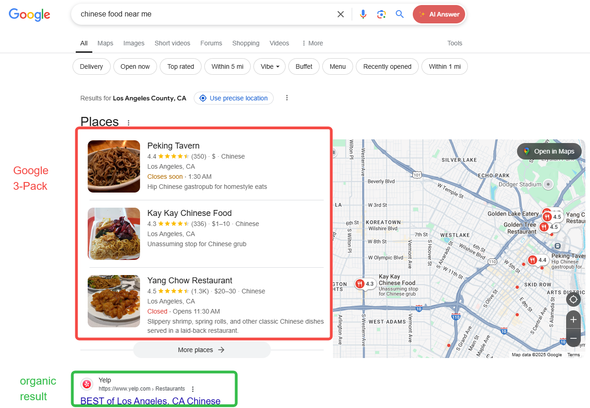
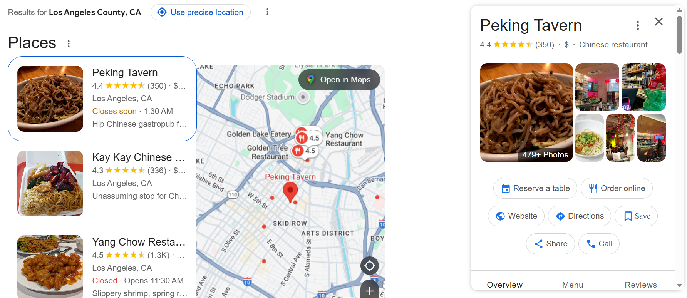
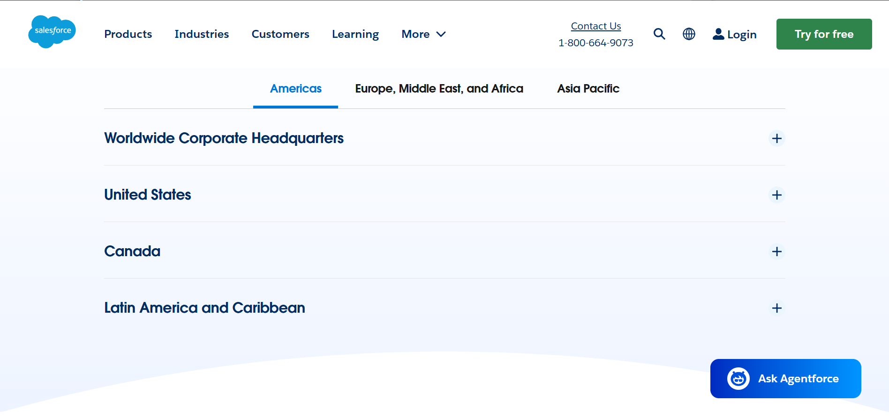
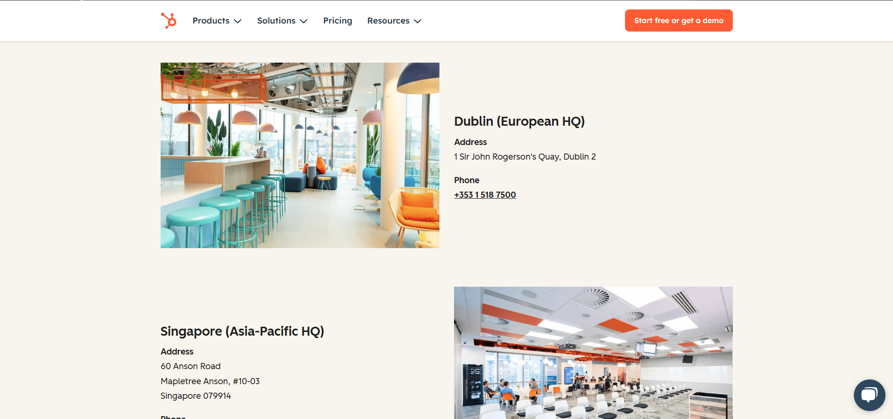
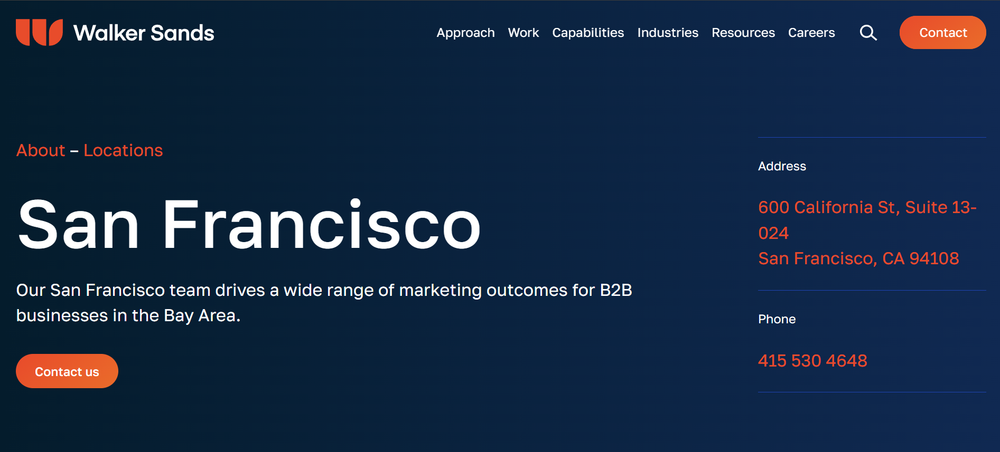
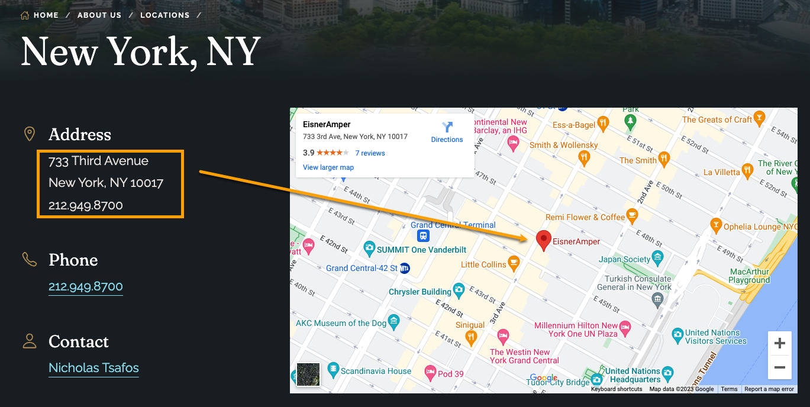

# 如何创建高效的特定地理位置落地页？

根据谷歌本身的算法机制，你在谷歌上获得的搜索结果会因为你所在的地理位置（或你的搜索词中表现出的地理偏好）而有所不同。对于拥有本地实体店或专门提供本地服务的商家，针对特定地理位置的落地页是必不可少的，一方面更有助于搜索引擎爬虫的爬取和理解，另一方面也可以帮助进入网站的顾客更快地理解在自己住所附近可以获得什么样的产品和服务。

## 搜索引擎爬虫如何处理“地理位置”相关的信息？
搜索引擎的核心目标是为用户提供最相关、本地化的搜索结果。爬虫可以从以下两个方面完成用户搜索意图和实际搜索结果之间的匹配：

### 用户搜索词
#### 关键词解析与意图识别
   - **地理实体识别**：通过自然语言处理（NLP）和命名实体识别（NER）技术，识别搜索词中的地名（如“北京”“曼哈顿”）、邮编或区域关键词（如“市中心”“东区”）。
   - **模糊地理意图**：处理模糊描述（如“附近的咖啡店”），需结合用户实时位置（通过IP地址或设备GPS）或搜索历史推断具体范围。
   - **多语言/多区域适配**：例如用户搜索“München”时，可能匹配德语用户或德国地区的需求，自动关联“慕尼黑”。

#### 地理定位与个性化排序
   - **IP地址与设备定位**：优先返回用户所在区域的本地结果（如搜索“天气”直接显示当前位置预报）。
   - **区域化排名策略**：同一搜索词在不同地区呈现不同结果（如“外卖平台”在纽约显示DoorDash，在东京显示出前館）。
   - **多地理位置意图**：用户可能显式指定非本地区域（如“上海旅游攻略”来自北京用户），需区分搜索意图。

### 网站页面内容
#### 页面内容的地理信号提取
   - **显式地理信息**：
     - 结构化数据（Schema标记的`LocalBusiness`、`GeoCoordinates`）。
     - 页面文本中的地址、电话区号、行政区划名称。
   - **隐式地理关联**：
     - 本地化内容（如“悉尼歌剧院周边交通指南”隐含悉尼相关）。
     - 区域性用语或文化参考（如“国庆黄金周”指向中国用户）。
   - **技术信号**：
     - 服务器地理位置（辅助参考，但CDN可能弱化此信号）。
     - 国家顶级域名（如`.de`、`.jp`）或子目录（`example.com/de/`）。

#### 地理相关性评估与索引
   - **区域化索引库**：将页面按地理相关性分类存储（如“日本旅游”页面存入亚洲索引分区）。
   - **本地SEO权重**：
     - Google My Business资料完整度、本地反向链接（如区域媒体引用）。
     - 页面内本地关键词密度（如“旧金山湾区装修公司”重复出现区域名称）。
   - **多区域目标处理**：
     - 使用`hreflang`标签区分语言/地区版本。
     - 分地区独立域名（如`example.co.uk`与`example.com.au`）。

## 特定地理位置落地页在搜索引擎中的曝光位置
你的落地页有可能出现在下图中的两个地方，一个是Google 3-Pack，另一个是自然搜索结果（位于Google 3-Pack下方）：

### Google 3-Pack
Google 3-Pack是谷歌在搜索结果显示页中针对本地化搜索（如“附近的餐厅”“修水管服务”等）推出的核心功能，它会直接展示三个最相关的本地商家或服务提供商，通常位于搜索结果顶部（地图下方）或中间位置。这是本地SEO优化中商家争夺曝光的关键战场。
它的基本形式如下：
- 商家名称、评分（星级）、评价数量。
- 地址、联系电话、营业时间（部分显示）。
- 距离用户当前位置的里程数或大致范围（如“距您1.2公里”）。
- 特色标签：例如“支持线上预订”“提供外卖服务”等。
- 商家图片或Google Maps街景缩略图。

点击具体的商家名称后，会自动在地图上定位到该商家位置，同时展示更多详细的信息，如预订入口、线上点单、电话等。你可以把网站地址设置为落地页的URL，这样你的落地页就有机会获得曝光和流量（但不是每个商家都有机会拿到这三个曝光位置中的一个）：

### 自然搜索结果
另外一个曝光位置就要差很多了，就是Google 3-Pack下方的自然搜索结果区域，基本相当于排名第五、第六甚至更加靠后的位置。如果在Google 3-Pack前面有付费搜索结果，那么排名还会进一步降低。能够呈现的信息密度也要低不少，以网页的标题和摘要为主。

## 特定地理位置落地页的种类
1. 全球维度
例如[Salesforce](https://www.salesforce.com/company/locations/)按照大洲（再细分为国家）列举其全球的办公室：

2. 国家/州/城市为维度
例如[Hubspot](https://www.hubspot.com/company/contact)列举其在不同国家/城市的办公室地址和联系方式：

3. 单个地理位置为维度
例如[Walker Sands](https://www.walkersands.com/about/locations/san-francisco/)为每个办公室都创建了单独的页面，并嵌入了地图来表示具体的地理位置：

## 创建有效的特定地理位置落地页的8个要素
### 使用本地化的URL结构
在正式创作内容之前，需要先想好特定地理位置落地页的数量，以及在整个网站中的定位和结构。
- 直接使用二级结构：
例如www.example.com/new-york-sightseeing-ticket这种网址，其层级仅比主页低一级。如果计划创建多个特定地理位置的落地页，不建议使用，因为会导致网站结构过于扁平，不利于用户浏览和爬虫爬取。
- 创建父页面和子页面（推荐）：
通过父页面对多个子页面进行汇总，是有利于用户和爬虫理解网站结构的方式。
如果是在不同国家地区开展相同的服务，可以将服务设置为父页面，地理位置设置为子页面，如：www.example.com/service/location 
如果业务范围广泛，不限于一种，可以将地理位置设置为父页面，不同的服务设置为单独的子页面，如：www.example.com/location/service  

### 撰写吸引用户的标题
关注HTML中的title和H1标签，它们是你的目标用户最先看到的你的落地页相关信息。建议使用如下的标签组合，帮助用户第一眼就理解你的品牌和业务范围：[品牌] | [城市或地区名称] + [产品或服务的主要关键字] 
例如：
- 芝加哥搬家服务 | 全程保险覆盖，损坏物品200%赔偿
- 圣莫尼卡离婚律师 | 海滨社区20年家事法实战经验
- 西雅图智能家居安装 | 亚马逊Alexa官方认证团队
- 费城垃圾清运 | 小型公寓$79/月全包价

### 回答客户最基本的问题
大多数访问本地页面的用户都会查找基本信息，包括店铺/办公室地址和营业时间。在介绍其它内容之前，这类基本信息需要在一开始就清楚明了地给到客户。有必要的话，也可以通过FAQ的方式汇总常见问题，并提供对应的答案。
例如关于交通方式，可以列举如何通过自驾、公交、地铁三种方式到达店铺或办公室。

### 在内容中整合本地关键词
不同国家、城市、地区的搜索趋势不同。通过Google trends等工具可以深入挖掘本地特有的热门关键词，从中筛选有明显购买或交易意愿的关键词加入到落地页的内容中。例如：
- 特定品牌（例如你的竞品）：我附近的Costco、我附近的星巴克、我附近的麦当劳
- 比较类：最受欢迎的西班牙餐厅、十大意大利面餐馆、风景最好的咖啡店
- 测评：日本餐厅测评、美式汉堡测评
- 具体的产品或服务：伦敦酒店、纽约一日游、东京景点门票
- 附近的场所：附近的中餐馆、附近的修车厂、附近的公园

### 和网站中的其它页面建立联系
众所周知，内链对于SEO优化至关重要。同时为了保证用户在浏览你的内容时能够方便地查看更多详细的内容，你可以通过内链的方式提供更丰富的信息，如：
- 产品链接：如某一特定产品页面、产品目录页等
- 促销页面：如特定节假日（圣诞节、感恩节、黑五等）期间的折扣活动页面
- 人才招聘页面：除了购买产品的客户外，有求职意向的人也可能会访问你的网站

### 提供丰富且独特的照片
为了更加直观地展示你的产品或服务，同时增加客户的信任感，可以在网站上展示多张真实独特的照片，包括但不限于：办公室或店铺的外观图片（最好突出你的品牌标志）、办公室或店铺的内部照片、现场工作的团队成员的照片、与服务相关的特写镜头，甚至是视频

### 提供地图
通过直接链接到Google地图或嵌入地图插件，添加带有图钉的地图来显示你的位置，帮助客户直观地理解你距离他们有多远。同时可以简单附上其它办公室/店铺的位置，说不定客户去其它某个地点更方便。

### 社会认同和评论
通过在落地页展示以下内容来增加网站的可信度：
- 来自第三方平台（如 Google Reviews、Producthunt 或 Yelp）的评分、认证、奖项等。
- 所在行业的认证和证明，如米其林评级。
- 政府颁发的评级或许可证，如 ISO 认证或行业特定许可证。
- 当地员工的详细信息，展示他们的行业经验和专业知识，并链接到对应的个人社交媒体。
- 成功客户案例、前后效果对比、白皮书等。

## 一些需要避免的误区
1. 创建大量特定地理位置的落地页，关注数量胜过质量
落地页的存在是为了帮助搜索相关内容的用户找到答案，创建大量低质量的页面并不能解答用户的问题，只会增加网站的运营成本。
2. 为尚未实际存在的地区创建落地页
即使有客户访问了落地页，如果你无法提供对应的产品或服务，也无法留住客户，甚至会收到投诉。
3. 页面内容重复，只替换地理位置
这种做法不是搜索引擎推荐的，大量重复内容的页面有可能导致页面无法收录，也就失去在搜索结果中的曝光机会。
