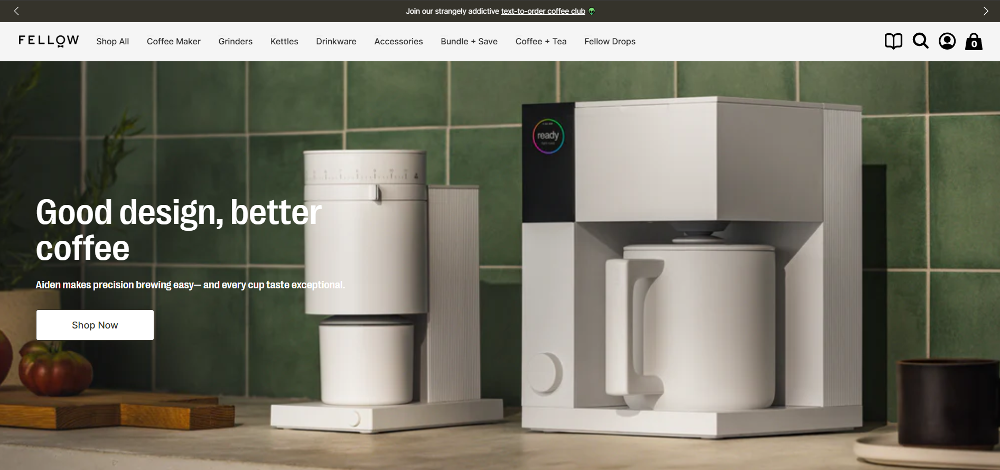
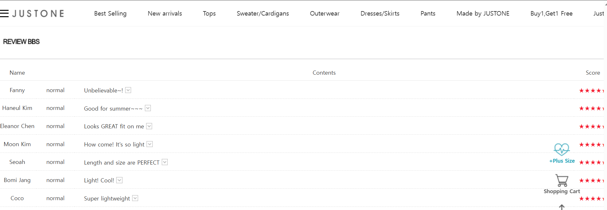
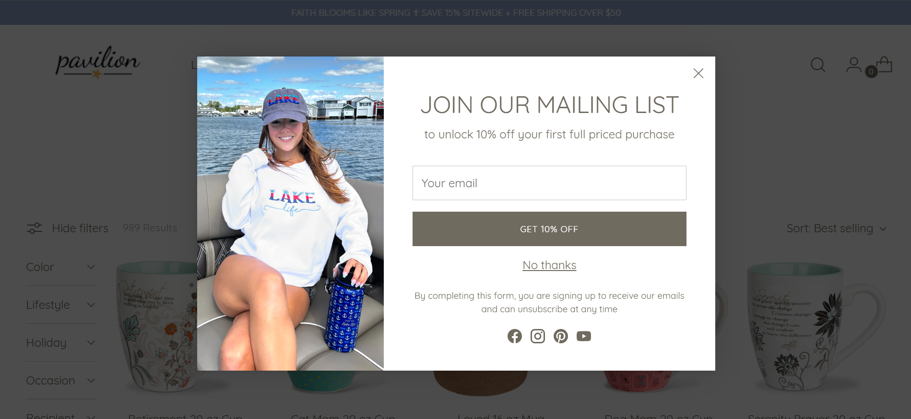

# 电商落地页高效转化秘诀

## 什么是电商落地页？
### 定义
**用户通过广告/外部链接直接访问的独立页面**
- **直达入口**：用户从广告、社交媒体链接、搜索结果页等外部渠道点击后，直接跳转至该页面，无需经过网站主页或其他中间页面。  
- **独立性**：页面内容完全围绕单一主题设计，与其他页面无导航关联。  

### 电商落地页的核心目标
**针对性解决用户需求，推动特定行动**
- **需求匹配**：根据用户点击前的兴趣点（如广告文案中的“女士牛仔裤限时特价”），落地页直接展示相关内容，避免信息错位。  
- **行动引导**：  
  - **直接转化**：如点击广告后立即下单购买。  
  - **间接推进**：如引导注册会员（后续再营销）或领取优惠券（促进未来下单）。  

## 电商落地页 vs 主页 vs 产品页
和品牌主页、产品页相比，电商落地页的核心功能与设计逻辑有其独特性：
### 主页：品牌的门面与导航中心
- **核心作用**  
  - 展示品牌形象、核心产品类别、促销活动概览。  
  - 引导用户跳转至其他页面（如产品分类页、活动专题页）。  
- **用户意图**  
  - 可能处于“随便逛逛”或“初步了解品牌”阶段。  
- **设计特点**  
  - 信息多元化：包含品牌故事、新品推荐、导航菜单等。  
  - 弱引导性：用户需自主选择下一步动作（如点击某个分类）。  
- **示例场景**  
  - 用户主动输入品牌官网地址进入，浏览后通过导航栏找到“女装专区”。  

### 产品页：单一商品详情页
- **核心作用**  
  - 展示单一商品的详细信息（参数、价格、库存、用户评价）。  
  - 直接推动用户购买该商品。  
- **用户意图**  
  - 已对商品产生兴趣，需要进一步了解细节以决定是否购买。  
- **设计特点**  
  - 内容垂直化：围绕单个商品展开（如多角度图片、规格对比）。  
  - 强购买引导：突出“立即购买”“加入购物车”按钮。  
- **示例场景**  
  - 用户从搜索结果页点击“某型号运动鞋”进入页面，查看尺码表后下单。  

### 落地页：高度聚焦用户需求的转化页面
- **核心作用**  
  - 针对用户从特定渠道（如广告、邮件）带来的明确需求，直接推动转化。  
  - 不展示无关信息，避免用户分心。  
- **用户意图**  
  - 已被广告/链接内容吸引，处于“需求明确但犹豫”阶段。  
- **设计特点**  
  - 目标单一化：整个页面围绕一个行动设计（如下单、领券）。  
  - 强场景匹配：内容与用户点击前的入口信息完全一致。  
- **示例场景**  
  - 用户点击“春季衬衫买一送一”广告，进入落地页后直接看到活动规则和衬衫款式，30秒内完成加购。  

### 三者的直观对比
| **对比维度**       | **主页**                 | **产品页**               | **落地页**               |  
|--------------------|--------------------------|--------------------------|--------------------------|  
| **入口来源**       | 用户主动输入网址/书签    | 站内搜索、分类页跳转     | 广告、外部链接直达       |  
| **用户状态**       | 无明确目标或初步探索     | 对某商品有初步兴趣       | 被广告吸引，需求明确     |  
| **核心内容**       | 品牌形象、全品类导航     | 单商品详情、购买选项     | 单一活动/商品+行动引导   |  
| **页面跳转逻辑**   | 引导用户探索其他页面     | 引导用户留在当前页下单   | 阻止用户跳转，专注当前目标 |  
| **典型元素**       | 导航栏、轮播图、分类入口 | 商品图片、参数表、评价区 | 倒计时、优惠券弹窗、行动按钮 |  

## 电商落地页的四种类型与适用场景
### Top of Funnel Landing Page（认知阶段落地页）
- **目标用户**：首次接触品牌的新用户（例如通过广告或社交媒体初次访问）。  
- **用户特征**：对品牌不了解，可能仅有模糊需求（如“想买保温杯，但不确定哪个品牌好”）。  
- **设计重点**：  
  - **传递核心价值**：用简单语言说明品牌优势（如“专注母婴用品10年”）。  
  - **降低认知门槛**：提供低成本体验方式（如免费试用、领取样品、知识科普）。  
- **典型策略**：  
  - 教育型内容：例如“如何选择适合宝宝的保温杯”。  
  - 低风险承诺：例如“免费领取试用装，满意后再购买”。  
- **示例**：[Fellow](https://fellowproducts.com/)使用网站首页作为品牌词的落地页。首屏简要说明品牌理念：Good design, better coffee：

设置了专门的教育板块，介绍咖啡相关的专业知识，如“咖啡的烘焙技术”，建立品牌的专业形象，同时也吸引咖啡爱好者频繁访问网站以获取最新的专业信息：

### Mid-Funnel Landing Page（兴趣阶段落地页）
- **目标用户**：与品牌有过初步互动（如浏览过商品、注册过账号），但尚未下单的潜在客户。  
- **用户特征**：对产品感兴趣，但存在疑虑（如担心质量、性价比）。  
- **设计重点**：  
  - **解决疑虑**：展示第三方认证、用户评价、对比数据。  
  - **强化信任**：突出售后服务（如“7天无理由退换”）。  
- **典型策略**：  
  - 用户评价专区：展示真实买家好评与照片。  
  - 对比指南：例如“A款与B款保温杯性能对比表”。  
- **示例**：[JUSTONE](https://justonekorea.kr/Product/Detail/view/pid/57502/cid/827)在产品详情页详细介绍了产品特征（快干、轻、吸水性好）、尺码对照表以及衣物护理相关的注意事项。同时，在页面底部展示了不同买家的真实评价：

### Bottom-Funnel Landing Page（决策阶段落地页） 
- **目标用户**：已加入购物车或多次浏览同一商品的高意向用户。  
- **用户特征**：基本确定购买意向，但需要最终推动（如犹豫价格、等待优惠）。  
- **设计重点**：  
  - **制造紧迫感**：限时折扣、库存告急提示（如“仅剩3件”）。  
  - **简化流程**：突出“一键下单”按钮，隐藏导航栏。  
- **典型策略**：  
  - 倒计时器：例如“距离优惠结束仅剩02:19:36”。  
  - 自动匹配优惠：用户进入页面后直接弹窗显示可用优惠券。  
- **示例**：[Pavilion](https://paviliongift.com/collections/mugs-cups)对于进入产品页面的用户直接展示折扣弹窗：对于首次购买产品的用户，只要留下邮箱即可享受10%的折扣：

### Already Purchased Landing Page（复购/留存落地页）
- **目标用户**：至少完成一次消费的老客户（如购买过护肤品的老用户）。  
- **用户特征**：已认可品牌，可能产生关联需求（如补购消耗品、升级装备）。  
- **设计重点**：  
  - **提升忠诚度**：会员等级特权说明（如“VIP用户专享折扣”）。  
  - **关联推荐**：基于历史购买记录推荐商品（如“买过面膜的客户常购精华液”）。  
- **典型策略**：  
  - 周期补货提醒：例如“您上次购买的洗发水预计30天后用完”。  
  - 老客专属活动：例如“会员日双倍积分，兑换限量赠品”。  

#### 电商落地页内容需要匹配用户状态
| **阶段**         | **用户状态**               | **落地页核心任务**               |  
|------------------|---------------------------|----------------------------------|  
| 认知阶段（ToF） | “这是什么品牌？有什么用？” | 建立初步认知，降低尝试成本       |  
| 兴趣阶段（MoF） | “这个产品真的好吗？”       | 提供证据，消除疑虑               |  
| 决策阶段（BoF） | “现在买划算吗？”           | 推动立即行动                     |  
| 复购阶段         | “下次什么时候再买？”       | 延长用户生命周期，提高消费频次   |  

## 用户分层与精准投放策略
### 划分用户群体的关键维度
#### 1. 行为数据（用户动态行为）
通过追踪用户与平台的实时互动，划分其需求阶段与意图强度。  
- **互动行为**  
  - **页面浏览**：访问页面类型（商品页/博客/帮助中心）、停留时长、跳出率。  
  - **点击热图**：高频点击区域（如视频播放、商品对比工具）。  
  - **滚动深度**：是否浏览至页面底部（判断内容吸引力）。  
- **购买行为**  
  - **加购未购**：商品加入购物车但未结算的次数与时间。  
  - **下单频率**：历史订单间隔（高频/低频消费者）。  
  - **退货率**：特定品类退货比例（如服装尺码问题）。  
- **内容偏好**  
  - **商品类型**：反复浏览的品类（如美妆/电子产品）。  
  - **内容形式**：倾向视频、图文或用户评价（UGC）。  
  - **促销敏感度**：是否点击折扣专区或使用优惠码。  

#### 2. 来源渠道（流量入口特性） 
根据用户进入落地页前的渠道特征，匹配内容与设计策略。  
- **广告平台**  
  - **搜索广告（Google Ads）**：用户需求明确（关键词驱动），需直接展示对应商品。  
  - **社交广告（Meta/TikTok Ads）**：用户受视觉内容吸引，落地页需强互动元素（如短视频）。  
  - **重定向广告（Criteo）**：针对流失用户，突出未完成动作（如加购商品降价）。  
- **自然流量**  
  - **搜索引擎（SEO流量）**：用户通过长尾词进入（如“best budget laptop”），需提供对比指南。  
  - **社交媒体自然流量**：用户通过KOL内容或话题标签进入，落地页需与源头内容强关联。  
- **直接访问**  
  - **品牌忠诚用户**：直接输入URL或通过书签访问，推送会员专属内容。  

#### 3. 用户属性（静态特征标签）
基于用户固有属性与长期特征，实现差异化触达。  
- **人口统计**  
  - **基础属性**：年龄、性别、职业、收入水平。  
  - **家庭角色**：父母、单身、宠物主人等。  
- **地理位置**  
  - **物理位置**：国家、城市、气候带（影响季节性需求）。  
  - **文化背景**：语言、节日习俗、消费禁忌（如宗教限制）。  
- **设备信息**  
  - **设备类型**：移动端（侧重简化流程） vs PC端（侧重信息密度）。  
  - **浏览器语言**：自动适配多语言版本落地页。  

#### 逻辑关联与应用原则
1. **交叉分析**：结合多维度标签（如“高客单价用户+社交广告来源+移动端”），设计高度定制化落地页。  
2. **动态更新**：根据用户行为变化实时调整分层（如从“新客”升级为“复购用户”后切换策略）。  
3. **优先级排序**：行为数据＞来源渠道＞用户属性（动态行为反映实时意图，优先级最高）。  

### 定向投放的落地页匹配方法
基于用户分层结果，将不同群体匹配至适配其需求的落地页类型，实现精准转化：
####  新用户 → 认知阶段落地页
**（目标：建立信任，降低尝试门槛）**  
- **识别方式**：  
  - 首次访问（Cookie/ID无历史记录）。  
  - 来源渠道为品牌广告或自然搜索（如Google品牌关键词）。  
- **落地页设计核心**：  
  - **信任符号**：媒体背书（如“Featured in Forbes”）、用户规模数据（如“服务全球100万用户”）。  
  - **低门槛行动**：  
    - 免费试用（如“Try 7-Day Free Trial”）。  
    - 无风险承诺（如“30天无理由退换”）。  
  - **简化路径**：隐藏导航栏，仅保留核心行动按钮（如“Get Started”）。  
- **投放渠道示例**：  
  - Google品牌广告、Meta品牌知名度广告、冷启动邮件（Welcome Email）。  

#### 多次访问用户 → 兴趣/决策阶段落地页
**（目标：推动用户向下一阶段转化）**  
- **分层细化与策略**：  
  - **兴趣阶段用户**（浏览≥3个商品页但未加购）：  
    - **落地页重点**：提供决策辅助内容（如产品对比表、第三方测评）。  
    - **转化钩子**：免费资源下载（如电子版选购指南）换取邮箱注册。  
  - **决策阶段用户**（加购未购、多次访问支付页）：  
    - **落地页重点**：制造紧迫感（限时折扣、库存提示）+简化支付流程。  
    - **转化钩子**：自动弹窗显示专属优惠码（如“CHECKOUT10”）。  
- **投放渠道示例**：  
  - 重定向广告（Meta动态广告、Google Display Network）。  
  - 行为触发邮件（如浏览后24小时未购的召回邮件）。  

#### 老用户 → 复购落地页 
**（目标：延长用户生命周期，提升客单价）**  
- **识别方式**：  
  - 历史订单≥1单，且处于活跃周期内（如美妆用户3个月内需复购）。  
  - 订阅会员或忠诚计划。  
- **落地页设计核心**：  
  - **关联推荐**：基于购买历史的智能搭配（如“Customers who bought A also bought B”）。  
  - **忠诚度激励**：  
    - 会员等级专属福利（如“Gold Member Exclusive: Free Shipping”）。  
    - 积分兑换入口（如“2000 Points = $20 Off”）。  
  - **周期提醒**：消耗品补货提示（如“您上次购买的蛋白粉预计剩余15%”）。  
- **投放渠道示例**：  
  - 忠诚计划邮件（Loyalty Program Email）。  
  - APP内推送通知（如“Your Personalized Deal is Ready”）。  

## 与整体营销体系的协同整合 
1. **跨渠道内容一致性**  
   - 广告文案与落地页承诺需完全匹配  
   - 用户路径连贯性（如社交媒体引流→落地页→后续邮件跟进）  

2. **数据互通与效果追踪**  
   - 落地页与CRM系统对接（记录用户行为）  
   - 通过UTM参数追踪不同广告版本的效果  

3. **长期用户旅程管理**  
   - 根据用户阶段动态调整落地页策略  
   - 示例：购买后自动跳转复购页，推荐配件商品  

### 跨渠道内容一致性
#### 广告与落地页的精准匹配  
- **文案与承诺对齐**：  
  - 广告中提及的核心利益点（如“限时7折”“免费送货”）必须在落地页首屏直接展示，避免用户产生被误导感。  
  - 示例：Facebook广告强调“夏季连衣裙买一送一”，落地页需直接跳转至该活动专属页面，而非通用促销页。  
- **视觉元素统一**：  
  - 广告配色、字体风格、模特形象与落地页保持一致，减少用户认知割裂。  
  - 工具支持：使用动态创意优化工具（如Google Responsive Display Ads）自动生成匹配素材。  

#### 用户路径连贯性设计  
- **跨渠道行为串联**：  
  - 用户从广告进入落地页后，未完成动作（如未注册、未购买）可通过其他渠道（邮件、短信）二次触达，并链接至适配页面。  
  - 示例流程：  
    1. 用户点击TikTok广告进入落地页浏览商品但未购买。  
    2. 通过Klaviyo自动发送召回邮件，内嵌决策阶段落地页链接（含专属优惠码）。  
    3. 用户通过邮件完成购买后，进入复购落地页推荐关联商品。  
- **多语言市场适配**：  
  - 针对不同语言用户（如西班牙语、德语），确保广告文案、落地页、后续邮件语言完全统一。  

### 数据互通与效果追踪  
#### 落地页与CRM系统对接 
- **用户行为记录**：  
  - 落地页集成CRM（如Salesforce、HubSpot），记录用户关键动作（浏览商品、加购、填写表单）。  
  - 数据应用：根据用户行为自动打标签（如“加购未购用户”“高兴趣新客”）。  
- **分层策略执行**：  
  - 示例：CRM识别用户为“高客单价老客”后，自动推送含高端商品推荐的复购落地页。  

#### UTM参数追踪与效果分析
- **参数设置规则**：  
  - 在广告链接中添加UTM参数标记来源（如 `utm_source=google_ads`、`utm_campaign=summer_sale`）。  
  - 落地页通过工具（如Google Analytics 4）解析参数，区分不同广告版本效果。  
- **数据驱动优化**：  
  - 对比不同UTM标记页面的转化率（如A/B测试广告文案），淘汰低效版本。  
  - 示例：发现 `utm_content=video_ad` 的落地页转化率比 `utm_content=image_ad` 高30%，则加大视频广告投放。  

### 长期用户旅程管理
#### 动态调整落地页策略 
- **用户阶段识别**：  
  - 根据CRM数据判断用户所处阶段（认知→兴趣→决策→复购），动态分配落地页。  
  - 示例：用户从认知阶段落地页注册后，下次访问自动跳转至兴趣阶段页面（如产品评测）。  
- **自动化工具支持**：  
  - 使用CDP（客户数据平台，如Segment）统一管理用户标签，实时更新落地页内容。  

#### 用户生命周期延续策略 
- **购买后即时跳转**：  
  - 用户完成支付后，自动跳转至复购落地页，推荐配件或补货商品（如“购买手机后推荐耳机”）。  
  - 设计逻辑：根据订单商品类别匹配关联品（如购买咖啡机→推荐咖啡豆订阅服务）。  
- **周期性召回机制**：  
  - 针对沉默用户（如30天未活跃），通过重定向广告推送含召回福利的落地页（如“老客回归专属折扣”）。  

