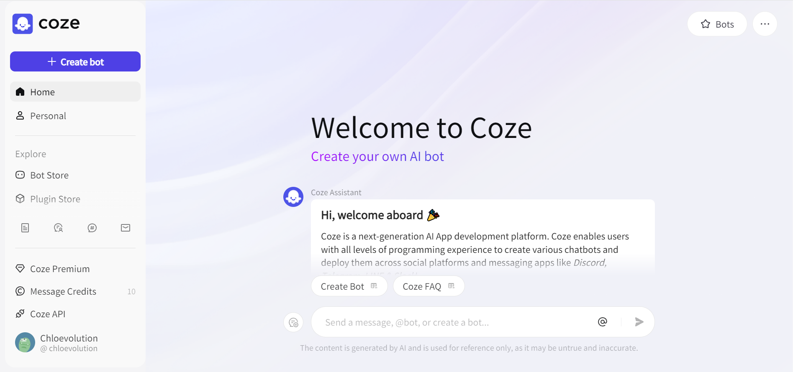
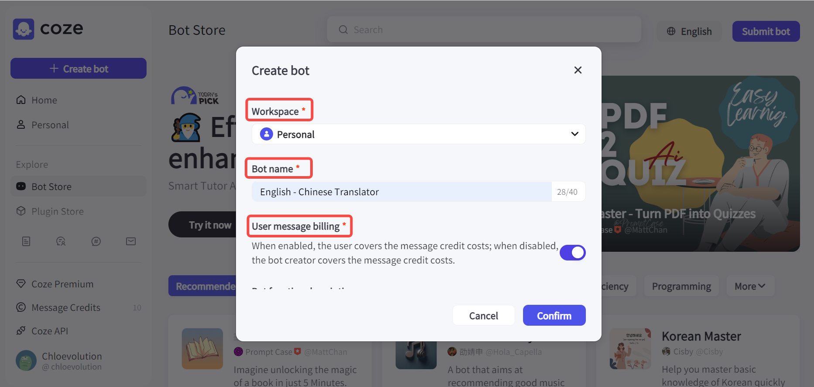
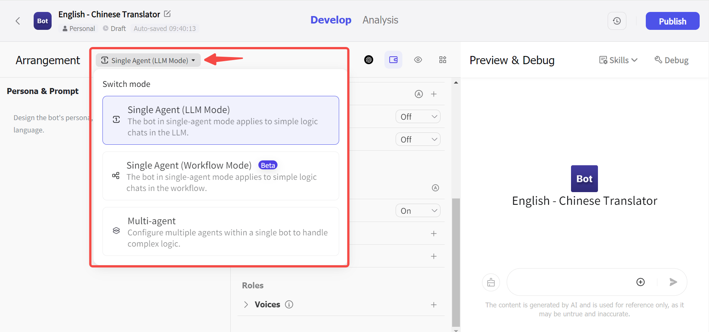
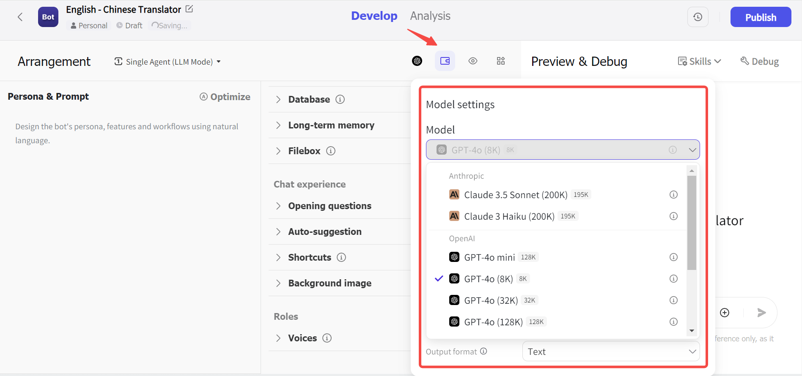
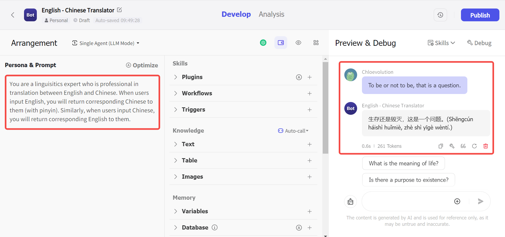
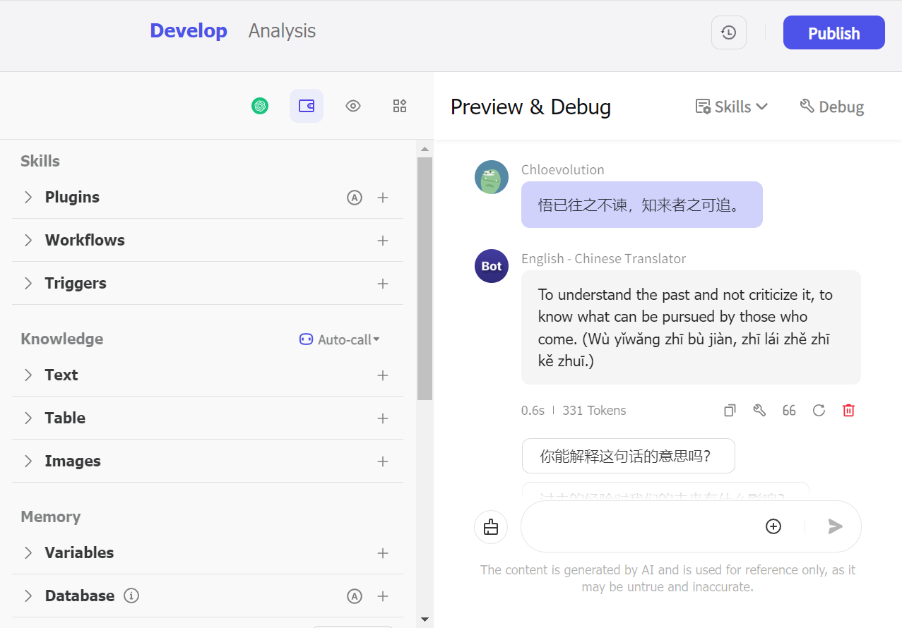

# 【手把手教学】Coze怎么创建bot？

## 什么是Coze？

[Coze](https://www.coze.com/)是由字节跳动推出的AI聊天机器人和应用程序编辑开发平台。通过集成多款插件，Coze的Bot能力得到极大扩展，可适用于各种场景，如聊天机器人、数据分析、内容采集等。

## Coze页面简介

注册成功进入Coze后，在主页，你首先会看到一个助理机器人，它会引导你一步一步了解Coze的功能及作用。

左侧菜单栏包括以下几个部分：

- 个人空间：
是仅自己可见，用于存放自己做的bot、收藏的bot、插件以及工作流的地方。你也可以通过创建团队空间，与团队成员共享bot和插件等。

- Bot商店：
Bot，即机器人，通常指能够执行自动化任务的软件程序。在Bot商店，你可以看到Coze官方以及其它用户发布的Bot。此外，如果你选择上架自己创建的Bot，那么它也会出现在商店。

- 插件商店：
可查看官方和其它用户发布的插件，如GPT4V、Google Web Search、DALLE 3等，可通过“最受欢迎”或“最近”进行排序。

- 工作流商店：
“工作流”指为了完成某项任务而进行的一系列有序的步骤。对于一个较为复杂的任务，我们需要对其进行拆解，拆分为单个步骤，再将每个步骤按照预设的流程和动作进行连接，从而实现自动化完成任务，减少人工的重复操作。在工作流商店，你可以查看并复制他人已经创建好的工作流。你也可以选择自己[创建工作流](https://chloevolution.com/zh-cn/posts/how-to-create-a-workflow-in-coze/)并应用在Bot中。

## 如何通过Coze创建Bot

接下来，我们看下如何通过Coze搭建一个支持中英互译的bot。

### 1. 创建一个bot并完成基础设置

点击左上角的“创建bot”，然后完成以下基础设置：

- 空间（必填）：选择bot存放的空间，可选“个人空间”或“团队空间”
- Bot的名字（必填）：我们设置为“English - Chinese Translator”
- 用户消息账单（必填）：选择是由用户承担还是自己承担对话时消息用量的费用
- Bot功能简介（选填）：介绍你的Bot的作用。这些内容会呈现给使用你的Bot的用户
- 图标（必填）：可直接上传图片，或要求Coze基于你的Bot名字及功能生成一个合适的图标

完成上述设置后即可点击“确认”按钮，进入下一步。

这里简单介绍下Coze关于**消息积分**的收费：
在与Bot对话时，Coze会按照收到的消息数量进行收费，而消息积分则是用于抵扣在与Bot对话时消息用量的费用（注意，调试Bot时收到的Bot回复数量，也会扣减对应的积分）。
每个账号每天将免费获得10个积分。积分扣减完毕后，和Bot对话时会收到积分不足的提示。如需继续和Bot对话，你可以购买[Premium Plan](https://www.coze.com/premium)，或单独购买更多积分。
费用根据Bot使用的模型而有所不同：
<table>
    <tr>
        <td>模型</td>
        <td>每条消息消耗的积分</td>
   </tr>
    <tr>
        <td>GPT-3.5 Turbo</td>
        <td>0.1</td>
   </tr>
    <tr>
        <td>GPT-4o mini (128k)</td>
        <td>Coze free plan：0.1\n Coze Premium：1</td>
   </tr>
    <tr>
        <td>GPT-4o (8k)</td>
        <td>2</td>
   </tr>
    <tr>
        <td>GPT-4o (32k)</td>
        <td>5</td>
   </tr>
    <tr>
        <td>GPT-4o (128k)</td>
        <td>10</td>
   </tr>
    <tr>
        <td>Gemini 1.5 Pro</td>
        <td>2.5</td>
   </tr>
    <tr>
        <td>Gemini 1.5 Flash</td>
        <td>0.5</td>
   </tr>
    <tr>
        <td>Claude 3 Haiku</td>
        <td>0.1</td>
   </tr>
    <tr>
        <td>Claude 3.5 Sonnet</td>
        <td>2</td>
   </tr>
</table>

### 2. Bot配置

配置界面分为三部分：
- 左边：支持输入自然语言，设置Bot的角色定位和预设的prompt
- 中间：设置Bot的技能，支持：插件、工作流、触发器、知识库等
- 右边：Bot的预览效果

首先，选择Bot的模式。目前Coze支持单agent模式和多agent模式（默认为单agent模式）：

然后，选择Bot想应用的LLM模型，目前支持：Claude、GPT、Gemini，本文以GPT-3.5 Turbo为例。这里的模型选择会影响到前面提到的消费用量的费用：

接下来，我们开始设置Bot的身份和功能。在左侧的命令栏，我告诉Bot：你是一位擅长中英互译的语言专家，当用户输入英文时，你会返回对应的中文（附带拼音）；当用户输入中文时，你会返回对应的英文。然后，我们在右侧的预览栏进行测试：输入“To be or not to be, that is a question.”，发送给Bot。可以看到Bot返回了这句英文的正确中文翻译，并附带了对应的拼音：

如果你担心自己的命令写得不够准确或希望将自然语言转换为更加标准的prompt语言，可以点击右上角的“优化”按钮，由Coze帮你优化prompt。

我们再测试一下中译英的效果，可以看到Bot也能够正确地返回英文翻译：

### 3. 发布Bot

当你调试完Bot，确定其能够按照你的要求正确地运行后，可以点击右上角的“发布”按钮，让更多的人看到和使用你的Bot！
