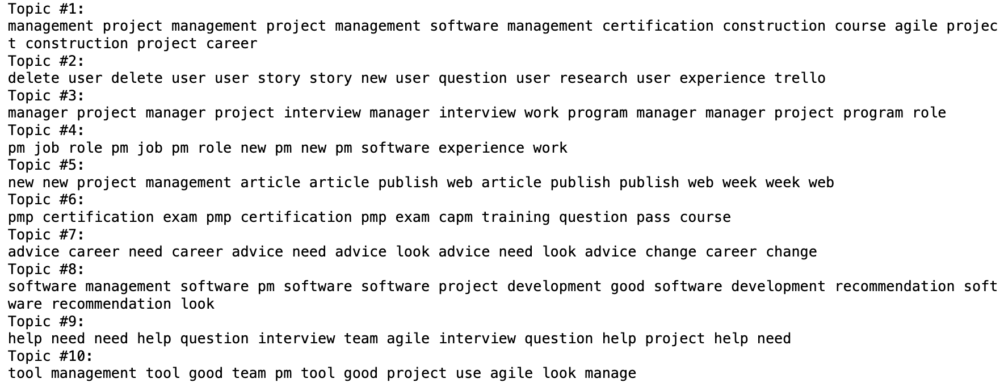

# 如何通过 Python 读取 ZST 文件


## 什么是 ZST 文件？

ZST 文件是使用 **Zstandard**（简称 **zstd**）压缩算法生成的压缩文件格式。这是一种由 Facebook 开发的现代压缩算法，可以把它看作是 `.zip` 或 `.gz` 的更高效、更灵活的“后起之秀”。`.zst` 文件最大的特点就是在**压缩率和速度之间做到了很好的平衡**——不仅压得快，解压更快，非常适合对性能有要求的场景。

Zstandard 还支持高度可调的压缩等级。你可以根据需求提高压缩等级来减小文件体积，或者降低等级以提升速度。这种灵活性让它在很多领域受到欢迎，比如 Linux 发行版的软件包压缩（像 Arch Linux、Fedora），甚至在游戏资源压缩中也能见到它的身影。

简而言之：如果你看到一个 `.zst` 文件，那它就是一个为速度和效率而生的压缩文件。


## 前提条件

要运行此代码，你需要 `pandas`、`zstandard`（`zstd`）和 `json` 库。如果尚未安装，你可以使用 pip 安装 `pandas` 和 `zstandard`：

```python
pip install pandas zstandard
```

`json` 是 Python 标准库的一部分，因此无需额外安装。

**注意**：以上内容假设 `.zst` 文件中的数据为 **换行符分隔的 JSON (NDJSON)** 格式。如果你的数据采用其他格式（例如 CSV、TSV），则应使用适当的 `pandas` 函数（如 `pd.read_csv()`）。

## 函数定义

设计一个名为 `decompress_zst_to_csv` 的 Python 函数，用于解压包含 JSON 对象的 `.zst`（Zstandard 压缩）文件，将这些对象转换为 pandas DataFrame，然后将此 DataFrame 导出到 CSV 文件。让我们分解一下函数的每个部分如何工作：

```python
def decompress_zst_to_csv(zst_file_path, output_csv_path):
```

此行定义了一个函数 `decompress_zst_to_csv`，它接受两个参数：`zst_file_path`（要解压的 `.zst` 文件的路径）和 `output_csv_path`（要保存生成的 CSV 文件的路径）。

### 创建 Zstandard 解压器

```python
dctx = zstd.ZstdDecompressor()
```

此处实例化 `zstd` 模块中的 `ZstdDecompressor` 对象。此对象用于解压使用 Zstandard (`.zst`) 压缩的数据。

### 初始化数据列表

```python
data_list = []
```

初始化一个空列表 `data_list`，用于存储解压后的 JSON 对象。

### 打开并解压 .zst 文件

```python
with open(zst_file_path, 'rb') as compressed:
with dctx.stream_reader(compressed) as reader:
text_stream = io.TextIOWrapper(reader, encoding='utf-8')
for line in text_stream:
data = json.loads(line)
data_list.append(data)
```

此块以二进制读取模式 (`'rb'`) 打开 `.zst` 文件。然后，它使用 `ZstdDecompressor` 的 `stream_reader` 方法动态解压文件内容。解压后的数据流被包装在 `TextIOWrapper` 中，以便逐行读取流作为文本（使用 UTF-8 编码）。每行应为一个 JSON 对象，使用 `json.loads` 将其解析为 Python 字典并附加到 `data_list`。

### 转换为 DataFrame 并导出到 CSV

```python
df = pd.DataFrame(data_list)
df.to_csv(output_csv_path, index=False)
```

在读取所有 JSON 对象并将其存储在 `data_list` 中后，此字典列表将转换为 pandas DataFrame。最后，将 DataFrame 导出到 `output_csv_path` 指定的 CSV 文件，并使用 `index=False` 以防止 pandas 将行索引写入 CSV 文件。

### 使用示例

```python
decompress_zst_to_csv('sample.zst', 'output.csv')
```

此行演示如何调用 `decompress_zst_to_csv` 函数，指定输入 `.zst` 文件的路径和所需的输出 CSV 文件。

## 文本数据处理和分析

以下代码用于使用 Python 库（例如 pandas、用于 NMF（非负矩阵分解）主题建模的 scikit-learn 和用于文本预处理的 spaCy）从文本数据集合（在本例中为 Reddit 提交标题）中提取和分析主题

### 导入库

```python
import pandas as pd
from sklearn.feature_extraction.text import TfidfVectorizer
from sklearn.decomposition import NMF
import spacy
```

此部分导入必要的 Python 库。 `pandas` 用于数据处理，`sklearn.feature_extraction.text` 中的 `TfidfVectorizer` 用于将文本转换为 TF-IDF 特征矩阵，`sklearn.decomposition` 中的 `NMF` 用于主题建模，`spacy` 用于高级文本预处理。

### spaCy 语言模型加载

```python
nlp = spacy.load("en_core_web_sm")
```

此处，英语语言模型 (`en_core_web_sm`) 加载到 `nlp` 中。此模型将用于从文本数据中标记、词形还原和删除停用词。

### 文本预处理函数

```python
def preprocess_title(title):
doc = nlp(title.lower())
return " ".join([token.lemma_ for token in doc if not token.is_stop and not token.is_punct and token.is_alpha])
```

函数 `preprocess_title` 接受一个文本字符串 (`title`)，使用 `nlp` 对象对其进行标记和词形还原，并删除停用词和标点符号。然后将处理后的标记重新合并为一个字符串。词形还原将单词转换为其基本形式或字典形式，这有助于标准化同一单词的变体。

### 加载和预处理数据集

```python
df = pd.read_csv('path_to_your_file.csv')
df['processed_titles'] = df['title'].apply(preprocess_title)
```

此块将 CSV 文件中的数据集加载到 pandas DataFrame `df` 中。它假设有一个名为 `'title'` 的列包含要分析的文本。然后使用先前定义的 `preprocess_title` 函数对每个标题进行预处理。

### TF-IDF 向量化

```python
vectorizer = TfidfVectorizer(max_df=0.85, min_df=3, stop_words='english', ngram_range=(1,2))
tfidf = vectorizer.fit_transform(df['processed_titles'])
```

配置并应用 `TfidfVectorizer` 将预处理后的标题转换为 TF-IDF 特征矩阵。设置 `max_df`、`min_df` 和 `ngram_range` 等参数以过滤掉过于常见或罕见的术语，并包括二元词组以获得更丰富的特征表示。

### 使用 NMF 进行主题建模

```python
nmf = NMF(n_components=10, random_state=42).fit(tfidf)
```

非负矩阵分解 (NMF) 应用于 TF-IDF 矩阵，以识别指定数量的主题 (`n_components=10`)。NMF 将高维 TF-IDF 矩阵分解为两个低维矩阵，揭示可以解释为主题的模式。

### 显示主题

```python
for topic_idx, topic in enumerate(nmf.components_):
print(f"Topic #{topic_idx+1}:")
print(" ".join([vectorizer.get_feature_names_out()[i] for i in topic.argsort()[:-10 - 1:-1]]))
```

对于 NMF 发现的每个主题，都会打印与该主题相关的顶级术语。这是通过按重要性降序对组件（主题）进行排序并选择顶级术语来描述每个主题来完成的。

但我认为分析结果不够好，也许以后可以尝试其他模型：


