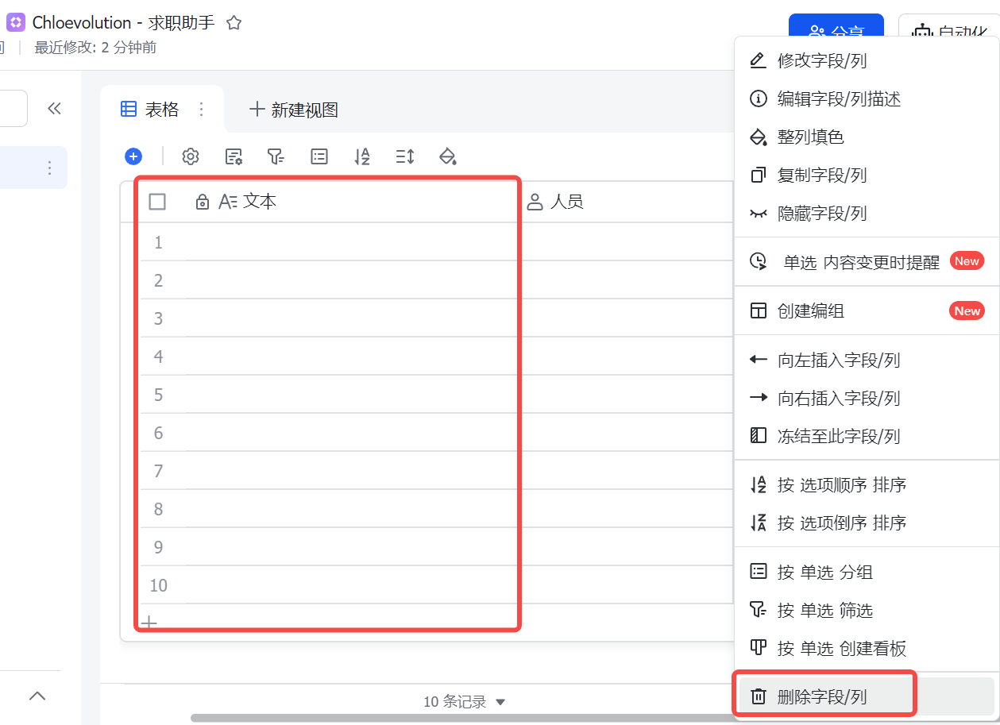
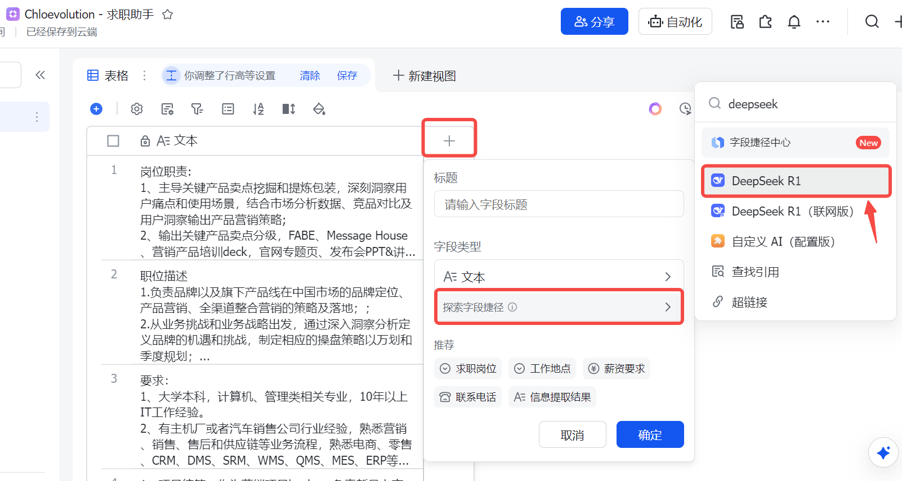
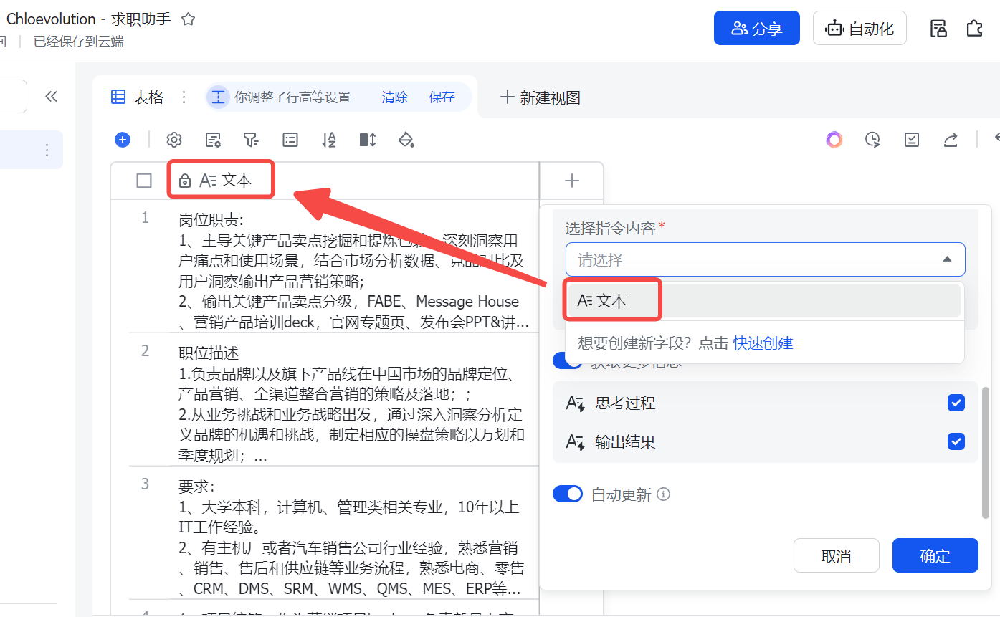
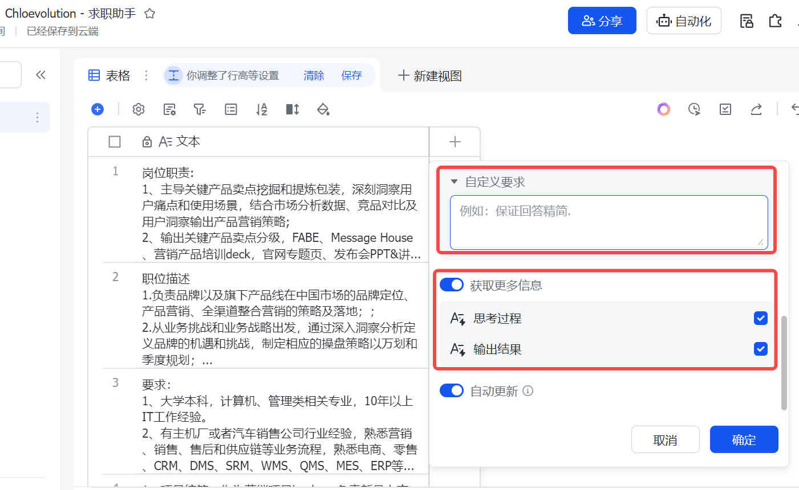
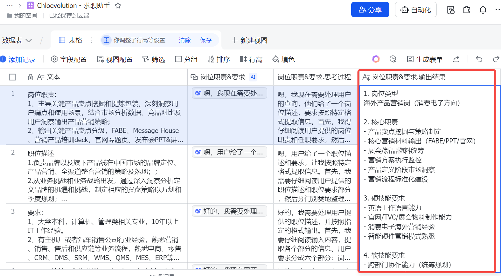
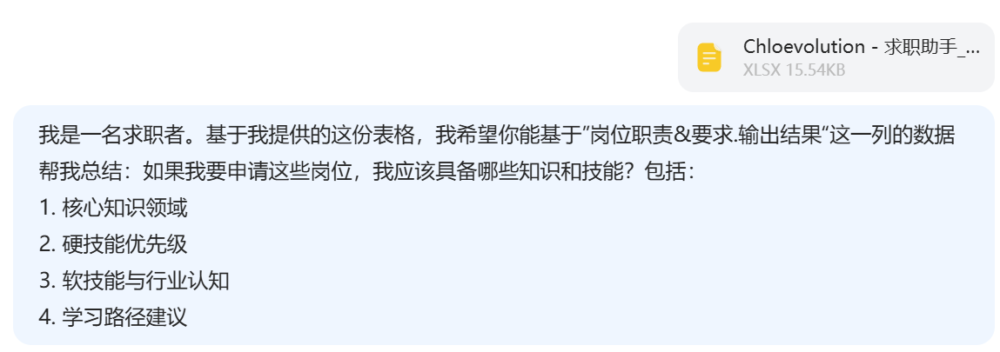

# 飞书多维表格+DeepSeek=私人定制求职助手


最近开始看市场中的新机会，筛选和收藏了一大批意向岗位，打算针对自己的经历和技能进行查漏补缺。刚好碰上飞书多维表格接入DeepSeek，可以用来批量处理岗位职责和要求信息，大大减轻了我自己处理信息的工作量。

## 1. 新建多维表格，输入岗位信息
在飞书云文档空间新建一个空白的多维表格，在第一列中输入意向岗位的职责和要求（从招聘网站直接复制），然后删除第一列之外的所有列：


## 2. 新建DeepSeek字段，设置提示词
点击“+”号，在“探索字段捷径”中输入“deepseek”，找到“DeepSeek R1”后点击：


“选择指令内容”：即选择需要DeepSeek处理的内容，我们这里选择的是第一列“文本”，即一开始输入的岗位信息。


“自定义要求”指的是你希望DeepSeek如何处理你所选择的指令内容。此外，你还可以选择是否展示DeepSeek的处理过程：


这里我们需要其把输入的岗位信息进行分类和标签化，所以提示词为：
```
从输入的内容中提取信息，按以下格式输出：  
1. 岗位类型
2. 核心职责（分点列出，每条不超过10字）  
3. 硬技能要求（工具、技术能力）  
4. 软技能要求（沟通、协作等）  
5. 经验/学历门槛
6. 特殊加分项
```


## 3. 查看输出效果
设置完后点击“确定”，查看输出效果：


在此基础上，如果希望能够汇总所有意向岗位的职责和要求，可以将表格导出后上传到DeepSeek，然后输入以下指令：


然后AI会帮助提炼需要的核心知识及技能，例如：
### 申请岗位所需知识与技能总结  
基于表格中 **"岗位职责&要求.输出结果"** 的共性提炼：  

---

#### **1. 核心知识领域**  
- **市场营销策略**：品牌定位、整合营销、用户洞察、竞品分析、FABE法则、Message House构建。  
- **产品全生命周期管理**：从产品定义、上市推广到退市的全流程策略设计。  
- **数字化营销与工具**：电商运营、CRM系统应用、数据追踪工具（Google Analytics等）、ERP/DMS等企业管理系统。  
- **行业专项知识**：  
  - 消费电子/智能硬件行业特性与海外市场规则；  
  - 汽车行业业务流程（营销/售后/供应链）；  
  - 新锐品牌增长逻辑与科技趋势洞察。  

---

#### **2. 硬技能优先级**  
**Top 1 核心能力**  
- **数据分析与工具**：Excel/Tableau/Power BI、ROI追踪、用户画像建模。  
- **英语工作能力**：流利听说读写（尤其海外岗需商务谈判级）。  

**Top 2 专项技能**  
- **营销材料制作**：PPT/Keynote高阶设计、KV/TVC创意输出、官网专题页搭建。  
- **项目管理工具**：Jira/Trello/Asana，预算分配与进度管理。  
- **系统操作**：CRM/DMS/SRM（汽车岗）、电商后台（天猫/Shopify）。  

**Top 3 加分技能**  
- **编程基础**：Python/SQL（数据分析岗优先）；  
- **设计软件**：Photoshop/Canva（物料制作岗）。  

---

#### **3. 软技能与行业认知**  
- **软技能**：  
  - 跨部门协作能力（资源整合、推动落地）；  
  - 抗压与快速学习能力（适应快节奏迭代）；  
  - 逻辑思维与商业敏感度（从数据到策略的转化）。  
- **行业认知**：  
  - 熟悉目标行业的核心痛点（如汽车行业“客户-车-店-厂”价值链）；  
  - 关注科技趋势（如智能硬件创新、AI营销工具）；  
  - 理解海外市场文化差异（本地化营销策略）。  

---

#### **4. 学习路径建议**  
**Step 1：基础能力搭建**  
- 课程：Coursera《Digital Marketing》/《Data Analysis with Python》；  
- 实践：用Excel/Tableau分析公开数据集（如Kaggle），输出洞察报告。  

**Step 2：行业专项提升**  
- 消费电子：研究Apple/Samsung海外Campaign案例；  
- 汽车行业：学习《汽车营销与后市场管理》书籍，熟悉OEM业务流程；  
- 新锐品牌：参与众筹平台（如Kickstarter）项目，分析增长路径。  

**Step 3：工具与认证**  
- 考取Google Analytics证书、PMP（项目管理）；  
- 学习HubSpot Academy免费课程（CRM/内容营销）。  

**Step 4：实战积累**  
- 参与企业实习/兼职项目，主导小型营销Campaign；  
- 在LinkedIn/行业论坛输出分析文章（如“智能硬件出海策略”），建立个人IP。  

--- 

**总结**：以“数据分析+英语能力”为底层支撑，结合目标行业知识深化，辅以项目管理与跨部门协作经验，可显著提升竞争力。
