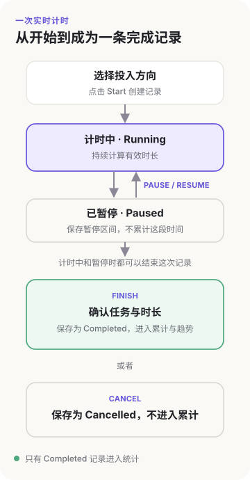
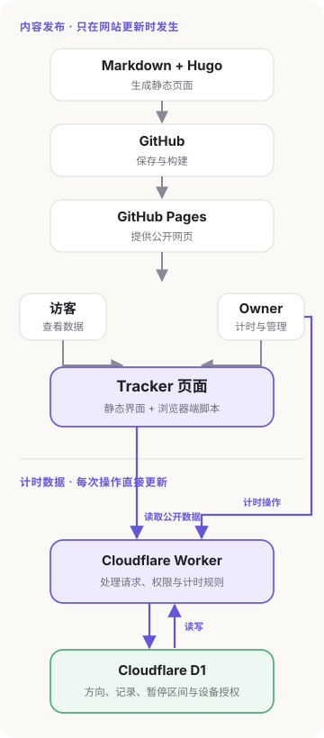
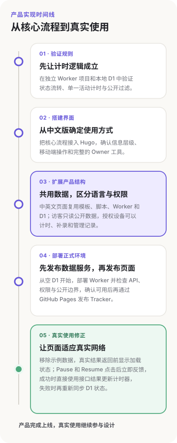
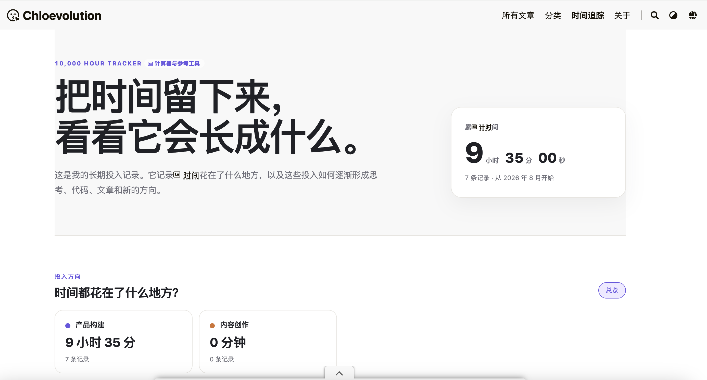

# 我如何把一万小时理论变成一个时间追踪器

10,000 Hour Tracker 的灵感，来自广为流传的“一万小时理论”。这个观点经常被简化成一句话：只要在一个领域投入一万小时，就能成为专家。

我一直知道这个理论。几周前在快速翻阅一本新书时，我又看到了它。接下来的一段时间，我总会时不时想起这件事。

那段时间，我正重新开始学习 SEO，已经不记得是第几次从头开始了，潜意识里难免对自己有些苛责：为什么一直在学习同一套东西？为什么好像始终只在表面徘徊？

我又想起了一万小时理论。既然总是觉得自己在努力但又忘了什么时候突然半途而废，下一次又因重蹈覆辙而懊恼，那这一次不如把时间量化：我究竟投入了多少时间，具体花在了哪里，又在学习过程中获得了什么。10,000 Hour Tracker 的想法就这样出现了。

## 先决定 Tracker 要记录什么

有了这个想法以后，我首先需要确定 Tracker 究竟要记录什么。每一段时间都需要和投入方向、具体任务以及后来形成的内容联系起来，才能为以后的回顾留下足够的信息。

所以一条完整记录最终包含以下内容：

| 内容 | 是否必需 | 定义与产生方式 |
| --- | --- | --- |
| 投入方向 | 必需 | 说明时间花在哪个长期方向，例如 SEO、产品构建或内容创作。开始计时或补录时选择。 |
| 记录日期 | 必需 | 这段投入所属的日期，用于记录列表和月度趋势。实时计时根据开始时间确定，补录时手动选择。 |
| 开始与结束时间 | 实时计时需要 | 记录一次计时的边界。开始时自动保存，完成时确定结束时间，之后可以修正。 |
| 暂停区间 | 可选 | 保存每次暂停和继续的时间，用于从总时间中扣除暂停部分。 |
| 有效时长 | 必需 | 最终进入累计时间和趋势的数据。实时计时由系统计算，补录时直接填写。 |
| 任务 | 可选 | 说明这段时间具体做了什么。公开记录分别保存中文和英文任务名称。 |
| 笔记 | 可选 | 保留任务名称无法容纳的背景、发现或补充说明。 |
| 相关文章 | 可选 | 将这段投入与后来形成的 Chloevolution 文章连接起来。 |
| 记录方式 | 系统确定 | 区分实时计时和手动补录。 |
| 状态 | 系统确定 | 记录当前处于运行、暂停、完成或取消。只有完成记录进入累计数据。 |
| 公开范围 | 必需 | 决定记录是否进入公开页面的累计时间、趋势和近期记录。 |

开始与结束时间和暂停区间确定时间边界，投入方向和任务解释时间花在哪里，笔记与相关文章则保留后来产生的内容。以后回看这些投入时，我可以知道自己读过什么、研究过什么问题，以及哪些内容真正进入了工作和写作。

这些字段确定了 Tracker 能够记录什么，也让我进一步明确了它不能回答什么。

小时数可以呈现投入规模，却无法按比例换算能力。[Ericsson、Krampe 与 Tesch-Römer 关于刻意练习的原始研究](https://doi.org/10.1037/0033-295X.100.3.363)没有把 10,000 小时定义为适用于所有人的能力门槛；[Macnamara、Hambrick 与 Oswald 的元分析](https://doi.org/10.1177/0956797614535810)也显示，练习对能力差异的解释程度会随领域改变。

因此，Tracker 会显示累计时间，但不显示类似 `126 / 10,000` 的完成进度和剩余小时，也不设置连续打卡或固定复盘节点。页面只呈现实际发生的投入。

## 设计一次计时怎样发生

字段确定了一条记录最终保存什么，接下来需要解决的是这条记录怎样产生。

一次实时记录从选择投入方向开始。点击 Start 后，记录进入运行状态，具体任务可以在计时过程中补充。Pause 打开一个暂停区间，Resume 关闭这段区间并继续累计。Finish 先进入确认界面，可以检查任务、时长和其他字段，保存后才成为完成记录。Cancel 会保留这次计时，但不把它计入累计数据。

最初其实存在两个需求：访客可以看到我的长期投入，而我自己需要一个方便使用的记录入口。在移动端线框设计过程中，这两个需求逐渐收敛到同一个 Tracker 页面。普通访客看到累计时间、投入方向、趋势和近期记录；经过授权的 Owner 设备可以在同一页面开始计时、补录和管理记录。

| 功能 | 普通访客 | Owner |
| --- | --- | --- |
| 查看累计时间、投入方向、趋势和近期记录 | 可以 | 可以 |
| 开始、暂停、继续、完成或取消计时 | — | 可以 |
| 补录、编辑和删除时间记录 | — | 可以 |
| 新建、编辑和归档投入方向 | — | 可以 |
| 查看和管理未公开记录 | — | 可以 |

但新的问题又出现了：
页面可能会被关闭，但计时不能因此中断。再次打开页面或换一台设备后，它应该能够恢复之前的运行或暂停状态。

## 为静态博客补上一层动态能力

Chloevolution 原本由 Hugo 生成页面，再通过 GitHub Pages 发布。它可以提供 Tracker 的界面，但无法直接保存一条仍在运行的记录。每次开始、暂停或结束计时都重新构建网站，也不适合日常使用。

所以我决定保留原来的静态网站，把变化频繁的部分放到独立的数据服务中。因为站点的域名已经由 Cloudflare 管理，Tracker 的个人使用量也很小，我最终选择了 Cloudflare Worker 和 D1。

Cloudflare Worker 是运行在 Cloudflare 网络上的轻量后端服务，不需要单独维护服务器；D1 是 Cloudflare 提供的关系型数据库。在 Tracker 中，Worker 负责接收页面请求、验证 Owner 设备和执行计时规则，D1 负责保存投入方向、时间记录、暂停区间和设备授权信息。

技术方案确定以后，一次计时的交互路径也随之明确。点击 Start 时，浏览器把投入方向和当前时区发送给 Worker；Worker 验证设备和当前计时状态，用服务端时间在 D1 中创建一条 `running` 记录，再把结果返回页面。数据库同时限制只能存在一条运行中或暂停中的记录，避免我在两台设备上误开两个计时器。

Pause 和 Resume 也会先经过 Worker。暂停时，D1 新增一个暂停区间并把记录改为 `paused`；继续时，再关闭这个区间并恢复为 `running`。页面根据 Worker 返回的开始时间和暂停记录显示当前有效时长。

点击 Finish 只会先打开确认界面。确认并保存后，Worker 才会计算有效时长，并把记录改为 `completed`。随后页面再次请求 Worker，刷新累计时间、方向汇总、月度趋势和近期记录。中文页和英文页读取同一条记录，共用时长、方向和状态，任务名称分别保存中文与英文版本。

浏览器负责显示和发送操作，Worker 负责规则，D1 保存真实状态。关闭页面不会结束计时；再次打开时，页面通过 Worker 读取 D1 中的开始时间和暂停记录，重新计算当前有效时长。

这里也形成了两条相互独立的数据流：
更新文章或页面时，Markdown 进入 GitHub，由 Hugo 构建后发布到 GitHub Pages。开始、暂停或完成计时时，浏览器直接请求 Worker，Worker 更新 D1，再把最新状态返回页面。每次计时都不需要提交 Git，也不需要重新部署网站。

这种拆分保留了静态博客原有的简单结构，也让计时数据可以持续更新。即使 Tracker 的动态服务暂时不可用，博客中的其他文章仍然可以正常访问。中英文页面共享同一份 D1 数据，切换语言只会改变界面和任务名称，不会产生两套累计时间。

## 从可以运行到真正可以使用

技术方案确定后，我先在独立的 Worker 项目中验证最核心的流程，再搭建完整页面。Start、Pause、Resume、Finish 和 Cancel 都需要正确改变记录状态；同时只能存在一条活动计时；完成记录才能进入累计，其他状态和非公开记录必须被过滤。确认这些规则能够在本地 D1 中稳定运行后，我才把它们接入 Hugo 页面。

界面先从中文版开始，用来确认信息层级和移动端操作。中文版跑通以后，英文版复用了同一套页面模板、浏览器脚本、Worker 和 D1。两个语言页面共享时间和状态，任务名称分别保存中文与英文版本。整个 Tracker 只有我可以写入数据，因此没有建立完整的注册和登录系统；设备使用 Owner Key 完成一次激活，之后由 Worker 识别已经授权的浏览器。普通访客始终只能读取公开数据。

正式环境从一个空的 D1 数据库开始。我先部署 Worker，确认 API、设备权限和公开数据边界能够正常工作，再通过原来的 GitHub Pages 流程发布 Tracker 页面。测试记录、测试设备和本地使用的密钥都没有进入生产环境。

页面能够访问以后，真实线上环境很快暴露了本地测试没有呈现的问题。最初的 HTML 中保留了线框阶段的示例数据，页面需要等到 API 返回后才替换成真实数字；网络稍慢时，访客会先看到一组并不存在的累计时间和记录。

Pause 和 Resume 最初也会连续发送两次请求：先修改状态，再重新读取完整记录。生产环境中一次请求可能需要约两秒，两次串行等待让一个简单操作显得迟钝。后来，按钮会在点击后立即显示处理状态，页面直接使用操作接口返回的记录更新计时器；只有请求失败时，才重新读取 D1 中的状态。

---

Tracker 上线时，里面最早的 7 条记录都来自它自己的构建：确定产品范围、画线框、验证 Worker 和 D1、接入中英文页面、部署，再修正上线后的问题，一共 9 小时 35 分。它先完整地记录了我怎样将自己脑海中的一个想法变成了真正的产品。

接下来，我会用它继续记录产品构建和内容创作等其它事项。我想看看哪些方向能够持续，哪些会渐渐消失；一次阅读或研究会停留在当时，还是在未来变成文章、代码、产品判断，或者一个新的问题。
这些变化也许需要几个月，甚至几年后才看得清。但至少当我再次觉得自己一直在重复同样的学习时，可以打开 [10,000 Hour Tracker](/zh-cn/10000-hour-tracker/)，看看那些投入是否真的发生过，又把我带到了哪里。

