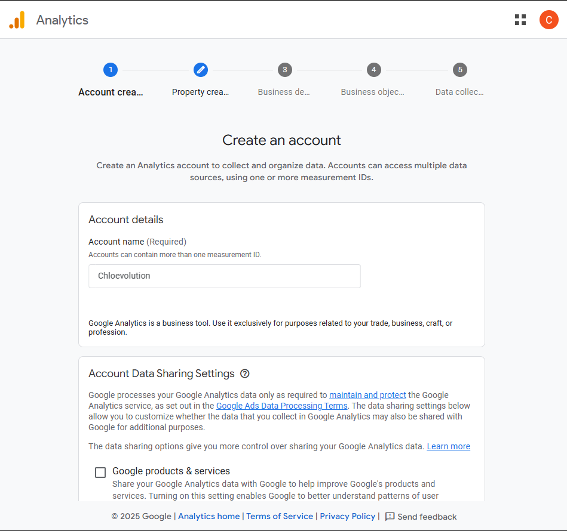
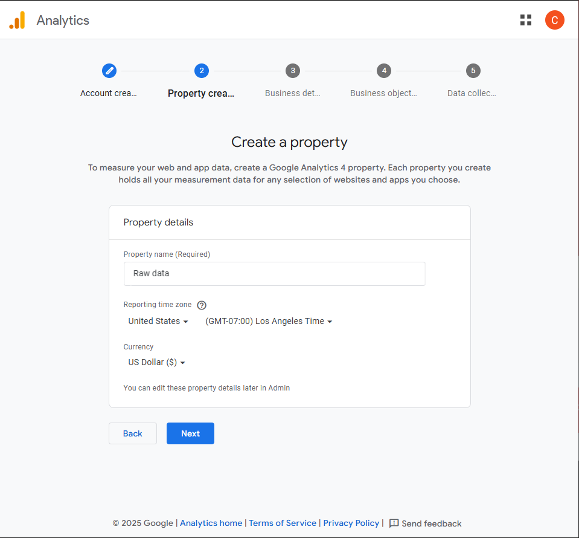
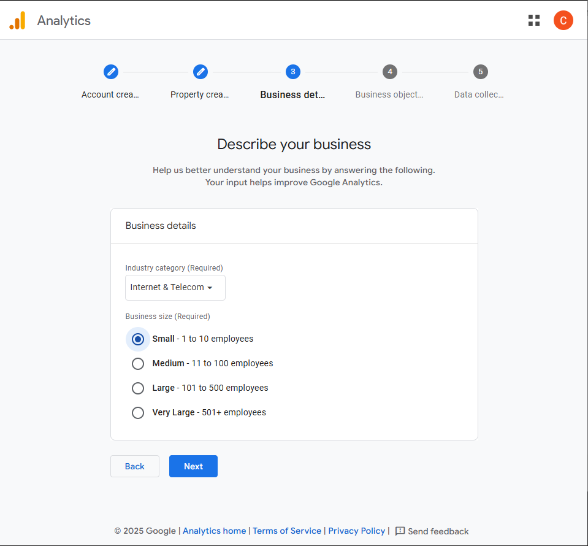
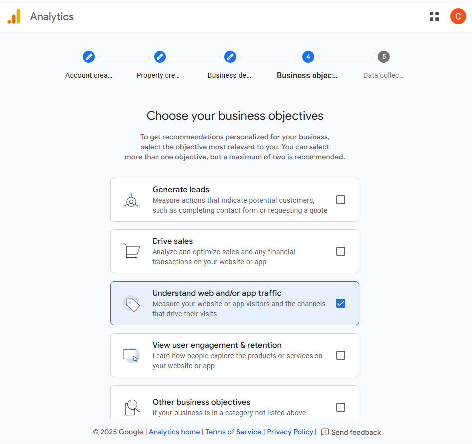
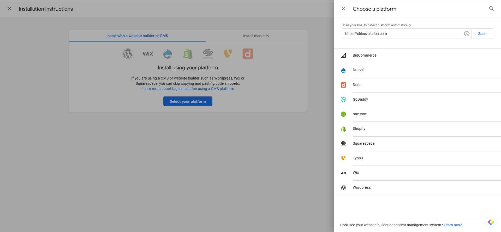
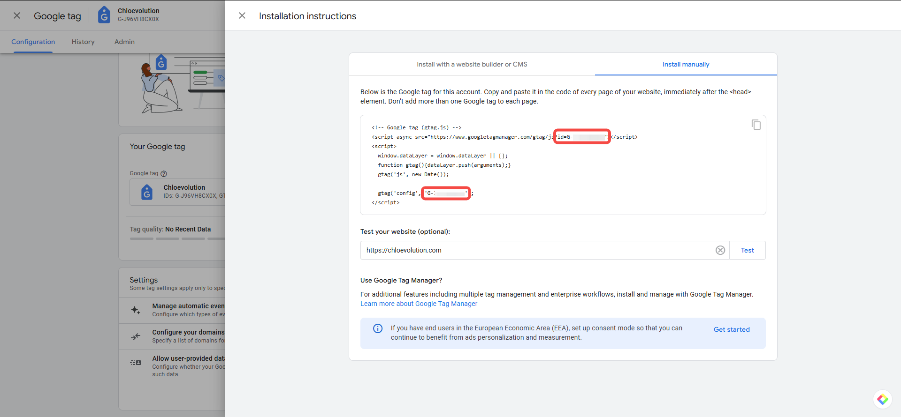
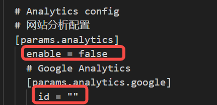

# Hugo + GitHub Pages站点配置GA4（附截图）


通过[Hugo和GitHub Pages](https://chloevolution.com/zh-cn/posts/hugo-github-pages/)搭建自己的博客站点后，可以通过集成Google Analytics来监控网站的SEO表现和具体流量数据。

## 具体设置步骤
### 1. 登录Google Analytics 4，创建新账户
在[官网](https://marketingplatform.google.com/about/analytics/)登录谷歌账号，创建新的Google Analytics 4账户
目前谷歌已全面启用Google Analytics 4 (GA4)，之前的Google Universal Analytics (UA) 已经弃用。


### 2. 在账户中设置新属性
包括新属性的名称、数据收集的时区、货币种类（如果你的网站上有销售商品或服务）


### 3. 提供基本的业务信息
可以帮助Google Analytics了解更多背景信息。


### 4. 选择“流量”作为业务目标
不同的业务关注不同的转化目标，你可以选择多个目标，但建议不超过两个。对于初期博客站点，更多地关注流量而不是销售。


### 5. 输入网站的URL来配置数据源
选择你希望收集数据的来源（网页、Android APP或iOS APP），然后输入网站链接以及数据流的名称，即可完成创建。

### 6. 将GA4代码安装到网站上
Google提供两种安装方式：
- 通过CMS或website builder安装：
如果你是通过主流的CMS或建站工具完成网站的搭建，如Wordpress、Shopify、Wix等，那么可以选择对应的平台直接完成代码配置


- 手动安装
但我的站点是通过Hugo和GitHub Pages搭建的，只能通过手动方式完成代码安装。每个站点会有一个专属的G开头的GA4 ID，需要将这部分代码复制到网站代码中。


对于我使用的[LoveIt模板](https://github.com/dillonzq/LoveIt)，具体的操作方式如下：
1. 修改基础配置
在<code>your_site/config.toml</code>文件中，找到<code> [params.analytics]</code>，将enable的参数从false改为true，同时在<code>[params.analytics.google]</code>中填入自己的Google Analytics ID：


2. 修改模板文件
找到<code>your_site/themes/LoveIt/layouts/partials/head/seo.html</code>文件，复制到<code>your_site/layouts/partials/head/</code>文件夹下。再在<code>your_site/layouts/partials/head/seo.html</code>文件中找到<meta name="google-site-verification" content="{{ . }}" />，在该代码后加上如下内容：
```
    <!-- Google tag (gtag.js) -->
    <script async src="https://www.googletagmanager.com/gtag/js?id={{ . }}"></script>
    <script>
        window.dataLayer = window.dataLayer || [];
        function gtag(){dataLayer.push(arguments);}
        gtag('js', new Date());

        gtag('config', '{{ . }}');
    </script>
```

之后重新推送博客到线上，等待Google Analytics收集数据。


## 验证是否配置成功
完成配置后，Google Analytics最多需要48小时才能开始处理数据。配置成功后你就可以看到网站的流量数据。


