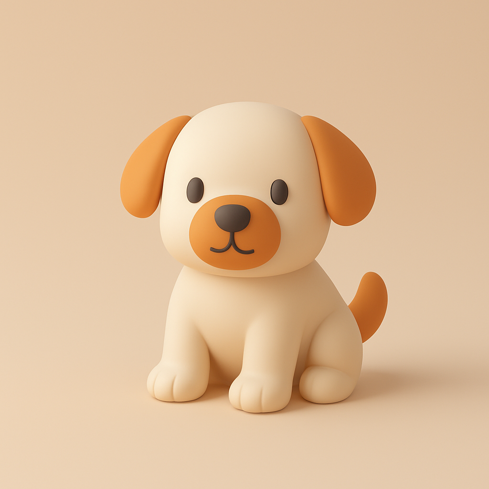

# 极简3D插画风格Prompt（附完整代码）


## 极简3D插画风格特点
- **基础几何形状**  
以简单几何体（球体、立方体、圆柱体）为基础，避免复杂结构，通过组合或变形形成视觉主体。

- **低细节处理**  
模型表面减少纹理与装饰性细节，仅保留必要轮廓特征，强调干净利落的整体形态。

- **柔和平稳的配色**  
多用低饱和度色调（如莫兰迪色系），明暗对比温和，避免高反差或荧光色带来的视觉冲击。

- **元素高度精简**  
画面仅保留核心视觉信息，剔除冗余背景或装饰元素，通过留白强化主体聚焦。

- **抽象化表达**  
物体形态弱化写实性，通过比例调整或符号化设计传递概念，例如用简化的云朵轮廓代替细节刻画。

- **轻量化质感**  
材质表现偏向哑光或半透明效果，避免复杂光影反射，金属、玻璃等元素仅用基础高光暗示。

- **扁平化空间感**  
弱化透视纵深，多采用平行视角或轻微轴测投影，减少场景层次堆砌感。

- **功能导向设计**  
服务于信息传达或界面交互需求，强调视觉符号的易读性与快速识别性，避免纯装饰性设计。

## 极简3D插画风格适用场景

极简3D插画风格的核心优势在于：
- **高效传达**：需快速传递核心信息的场景（如广告、教学）。
- **现代感需求**：科技、互联网、新兴消费品牌等追求年轻化视觉的领域。
- **轻量化要求**：对加载速度、多端适配有较高限制的数字媒介（如移动端、网页）。

通过平衡美学与功能性，极简3D插画在强调清晰、高效沟通的场景中具有广泛适用性。

其适用的场景主要包括以下领域：

### 数字界面设计（UI/UX）
- **界面图标/动效**：适合APP、网页的引导页、功能图标或交互动画，通过简洁的3D形态提升现代感，同时避免视觉干扰。
- **数据可视化**：用几何化图表简化复杂信息，如金融、健康类应用的统计模块。

### 品牌宣传与营销
- **品牌主视觉**：科技、生活方式类品牌常用此风格传递年轻化、轻量化的品牌调性（如电子产品宣传、社交媒体广告）。
- **IP形象设计**：通过抽象化角色降低设计复杂度，增强记忆点（如吉祥物、表情包）。

### 教育/科普内容
- **说明性插图**：用于课件、科普视频或手册，简化抽象概念（如人体结构、机械原理）。
- **信息图设计**：将流程、数据转化为易理解的3D图形，提升阅读效率。

### 动态媒体与广告
- **短视频/动效广告**：轻量化渲染适合快速传播的短视频平台（如抖音、Instagram），降低加载压力。
- **动态海报**：结合轻微动画增强视觉吸引力，但保持整体风格简洁。


### 产品演示与包装
- **电商视觉**：展示产品外观或使用场景时，弱化背景细节，聚焦主体（如3C产品、家居用品）。
- **包装设计**：通过扁平化3D元素传递环保、极简的产品理念。

### 出版物与杂志
- **书籍/杂志配图**：配合文字内容，用简约3D图形补充视觉信息，避免干扰阅读。
- **封面设计**：通过几何化构图传递主题，如科技、设计类书籍。

### 游戏与虚拟场景
- **轻度游戏设计**：休闲类游戏的角色或场景设计（如解谜、模拟经营类），降低视觉疲劳。
- **虚拟空间界面**：元宇宙或VR/AR场景中的导航元素，确保低延迟与易识别性。

## 极简3D插画风格完整Prompt

该Prompt适用JSON语言，适用于ChatGPT 4o等主流AI平台。把中括号内的参数替换为想要绘制的对象即可。我用这个prompt生成了一只3D小狗：



```JSON
Generate a [xx] with the following JSON profile: 

<pre style="caret-color: rgb(0, 0, 0); color: rgb(0, 0, 0); font-style: normal; font-variant-caps: normal; font-weight: 400; letter-spacing: normal; orphans: auto; text-align: start; text-indent: 0px; text-transform: none; widows: auto; word-spacing: 0px; -webkit-tap-highlight-color: rgba(26, 26, 26, 0.3); -webkit-text-size-adjust: auto; -webkit-text-stroke-width: 0px; text-decoration: none; overflow-wrap: break-word; white-space: pre-wrap;">{
  "art_style_profile": {
    "style_name": "Minimalist 3D Illustration",
    "visual_elements": {
      "shape_language": "Rounded edges, smooth and soft forms with simplified geometry",
      "colors": {
        "primary_palette": ["Soft beige, light gray, warm orange"],
        "accent_colors": ["Warm orange for focal elements"],
        "shading": "Soft gradients with smooth transitions, avoiding harsh shadows or highlights"
      },
      "lighting": {
        "type": "Soft, diffused lighting",
        "source_direction": "Above and slightly to the right",
        "shadow_style": "Subtle and diffused, no sharp or high-contrast shadows"
      },
      "materials": {
        "surface_texture": "Matte, smooth surfaces with subtle shading",
        "reflectivity": "Low to none, avoiding glossiness"
      },
      "composition": {
        "object_presentation": "Single, central object displayed in isolation with ample negative space",
        "perspective": "Slightly angled, giving a three-dimensional feel without extreme depth",
        "background": "Solid, muted color that complements the object without distraction"
      },
      "typography": {
        "font_style": "Minimalistic, sans-serif",
        "text_placement": "Bottom-left corner with small, subtle text",
        "color": "Gray, low-contrast against the background"
      },
      "rendering_style": {
        "technique": "3D render with simplified, low-poly aesthetics",
        "detail_level": "Medium detail, focusing on form and color over texture or intricacy"
      }
    },
    "purpose": "To create clean, aesthetically pleasing visuals that emphasize simplicity, approachability, and modernity."
  }
}</pre>
```

## 为什么使用JSON格式Prompt
**本质**：一种**结构化指令集**，将自然语言描述转化为机器可解析的**参数矩阵**  。
**与传统Prompt的区别**：  
| 类型 | 自由文本Prompt | JSON Prompt |  
|------|----------------|-------------|  
| 结构 | "画一个圆润的茶杯，用米白色..." | 分层参数控制（形状/颜色/材质独立配置） |  
| 精度 | 依赖模型理解能力 | 强制锁定关键参数 |  
| 适用场景 | 创意发散 | 工业化标准输出 |  

**典型应用场景**：  
- 企业品牌视觉规范（确保所有生成图风格统一）  
- 跨平台内容生成（用同一套JSON适配Midjourney/DALL·E/Stable Diffusion）  


## 极简3D插画风格Prompt解析
### 代码结构构成

#### 整体框架
这是一个 **标准JSON结构**，采用**三级嵌套层级**，核心围绕艺术风格配置文件构建：
```
Root
├─ art_style_profile (风格主容器)
   ├─ style_name (风格名称)
   ├─ visual_elements (视觉元素容器)
   │   ├─ 7个核心视觉模块
   │   └─ 嵌套多层属性
   └─ purpose (设计目标声明)
```

#### 层级特征
- **一级结构**：`art_style_profile` 作为根对象
- **二级结构**：`style_name` + `visual_elements` + `purpose` 三元体系
- **三级结构**：`visual_elements` 下分设：
  ```
  shape_language
  colors
  lighting
  materials
  composition
  typography
  rendering_style
  ```

### 关于 `<pre style...>` 的补充

#### 被忽略的HTML包装层
原代码块起始的：
```html
<pre style="caret-color:...; color:...; font-style:...;...">
```
是 **HTML展示层代码**，与JSON数据本身无关。其作用为：
- **视觉格式化**：定义代码块的显示样式
- **关键样式参数**：
  ```css
  caret-color: rgb(0, 0, 0)    /* 输入光标颜色 */
  white-space: pre-wrap        /* 保留换行但允许自动换行 */
  overflow-wrap: break-word    /* 长单词强制换行 */
  color: rgb(0, 0, 0)          /* 纯黑色文字 */
  ```

#### 技术定位
- **非数据内容**：此部分不属于JSON数据结构
- **展示层代码**：仅用于在网页/编辑器中呈现JSON时的可视化效果
- **实际开发中**：在真正的JSON配置文件中不应包含此类HTML标签

### Prompt逐行解读

```json
{
  "art_style_profile": {  // 艺术风格的整体配置容器
    "style_name": "Minimalist 3D Illustration",  // 风格名称标识
    "visual_elements": {  // 视觉元素配置容器
    
      // 形状语言配置
      "shape_language": "Rounded edges, smooth and soft forms with simplified geometry",  // 使用圆角+简化几何形状
      
      "colors": {  // 色彩配置
        "primary_palette": ["Soft beige, light gray, warm orange"],  // 主色：中性柔和色系
        "accent_colors": ["Warm orange for focal elements"],  // 强调色用于焦点元素
        "shading": "Soft gradients with smooth transitions"  // 柔和的渐变过渡
      },

      "lighting": {  // 光照配置
        "type": "Soft, diffused lighting",  // 漫射型柔光
        "source_direction": "Above and slightly to the right",  // 右上方光源
        "shadow_style": "Subtle and diffused"  // 模糊阴影效果
      },

      "materials": {  // 材质配置
        "surface_texture": "Matte, smooth surfaces",  // 哑光平滑表面
        "reflectivity": "Low to none"  // 无反射特性
      },

      "composition": {  // 构图配置
        "object_presentation": "Single, central object in isolation",  // 中心主体构图
        "perspective": "Slightly angled 3D feel",  // 轻微角度透视
        "background": "Solid, muted color"  // 纯色背景
      },

      "typography": {  // 排版配置（适用于含文字的插图）
        "font_style": "Minimalistic, sans-serif",  // 无衬线字体
        "text_placement": "Bottom-left corner",  // 左下角定位
        "color": "Gray, low-contrast"  // 低对比度文字
      },

      "rendering_style": {  // 渲染技术配置
        "technique": "3D render with low-poly aesthetics",  // 低多边形风格
        "detail_level": "Medium detail"  // 中等细节程度
      }
    },
    
    // 风格的核心设计目标
    "purpose": "To create clean, modern visuals emphasizing simplicity"
  }
}
```

**核心设计特征总结**：
1. **极简主义基调**：通过简化几何形状、有限色盘和负空间运用实现
2. **3D柔和表现**：低多边形建模配合柔光渐变，营造温暖现代感
3. **视觉聚焦策略**：中心构图+强调色引导，背景极简避免干扰
4. **材质统一性**：全场景哑光材质保持视觉一致性
5. **功能导向排版**：若包含文字，采用隐形设计保持画面纯净


