# 分析SaaS落地页的核心结构

## 首先需要考虑的问题：落地页在站点中的定位
考虑到不同的业务目标、营销成本和适用场景，落地页有两种存在形式，各有优劣：
1. 专门新建的落地页
- 特点：
  - 独立设计：针对特定营销活动（如广告、品牌活动、促销等）定制，与官网设计风格保持一致，但内容更精简聚焦
  - 无导航栏干扰：通常选择隐藏顶部的全局导航栏，只保留品牌logo和重要按钮，避免用户跳转到其它页面，期望集中引导用户完成目标转化动作（如注册、购买等）
- 优点：
  - 高转化率：以较小的版面尽可能多地呈现用户需要的信息，内容精准匹配用户需求，减少干扰，有助于提高转化率
  - 支持快速迭代：因为是定制页面，所以在内容和设计的调整上灵活性较高，不会影响到其它业务
  - 易于数据分析：页面整体的CTA逻辑基本一致、用户路径数量较少，且仅有少量渠道使用该页面，便于后续分析数据效果
- 缺点：
  - 需要额外的设计和开发成本
  - 品牌增信较弱：用户可能会希望了解网站中更多内容，但专用落地页一般不会提供明显的去到其它页面的入口

2. 官网已有页面
- 特点：
  - 复用现有内容：直接使用官网某个页面（如首页、产品页、文章页）作为落地页
  - 保留顶部导航栏：用户可以通过导航栏了解网站的大致结构，自由跳转到自己感兴趣的页面
- 优点：
  - 节约成本：不涉及额外的设计和开发
  - 强化品牌一致性：保证用户在官网的整体体验，同时有用户评论、第三方测评证明等页面作为品牌可信度的支撑
- 缺点：
  - 转化率相对较低：官网内容更偏品牌向，且信息不够聚焦，用户容易被导航栏、内链等其它内容分散注意力
  - 难以快速迭代且数据混杂：不同渠道都会使用官网页面，内容和设计的调整需要多方同意才有可能推进下去。用户在网站中的多条行为路径也增加了数据分析的难度。

至于哪一种形式或者说网站结构更好，还是取决于品牌方自己的侧重点和营销策略。以monday.com的落地页为例：不难发现monday.com使用官网首页（[https://monday.com/](https://monday.com/)）来承接搜索它的品牌词进来的用户，使用专用落地页（如[https://monday.com/ap/project-management](https://monday.com/ap/project-management)）来满足搜索其它关键词（这里我用的是project management）进来的用户。

## 基本页面结构
### 首屏主视觉区（Hero Section）
首屏是落地页中最重要的内容，是用户无需滚动即可看到区域，需要在最短的时间内让用户理解页面的主题并促使其进行下一步动作。
通常包含：标题（通常为品牌slogan或落地页主题语）、副标题（可选，通常是对标题的补充说明）、CTA按钮、视觉元素（如产品图、使用场景图、动态演示等）。

### 产品功能（Features/Benefits）
用于解答用户“我为什么要选择你”的疑问，将产品功能转述为实际的用户价值。
通常包含：功能点（清晰展示产品的核心功能）、用户收益（通过结果导向的实际使用场景说明产品功能可能带来的好处）、可视化设计（通过图片、视频等进行辅助说明）

### 增信模块（Social Proof）
用于展示增强用户信任的内容，通常包括：用户评价、成功案例、知名客户或合作伙伴的品牌Logo、媒体报道和行业奖项、数据背书（如用户数量、增长率等统计信息）。
通过第三方的信息支撑来降低用户的决策疑虑，进而提升转化率。

### 底部导航栏（Bottom Navigation）
如果用户在浏览完整个页面后仍有疑虑，可以通过底部导航栏快速访问其它感兴趣的内容，一键直达网站的主页面（如首页、功能详情页等）。

## 具体案例
通过Monday.com、ClickUp、Atlassian、Zendesk、Miro的广告落地页简单介绍下SaaS落地页的基本结构：
注：由于页面内容的更新，你实际访问页面时看到的内容可能和文章中的截图不一样。
### [Monday.com](https://monday.com/ap/project-management)
#### 首屏
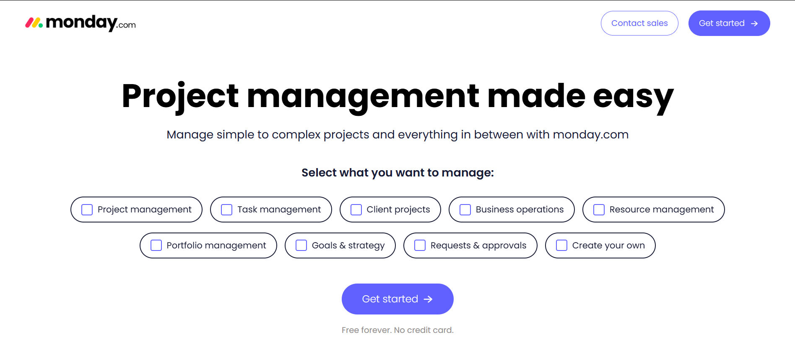
- 导航栏：未保留官网完整导航栏，只提供“联系销售”（跳转到表单页面）和“开始使用”（跳转到注册页面）按钮
- 标题：强调产品使“项目管理”变得容易
- 副标题：突出产品可同时管理简单和复杂的项目（使标题中的“容易”更具象化）
- 设计元素：背景空白，无图片，主要用于突出首屏中央“使用场景”相关的选项，吸引用户进行交互（按钮被勾选后，颜色会发生变化，表示已被选中）

#### 产品功能
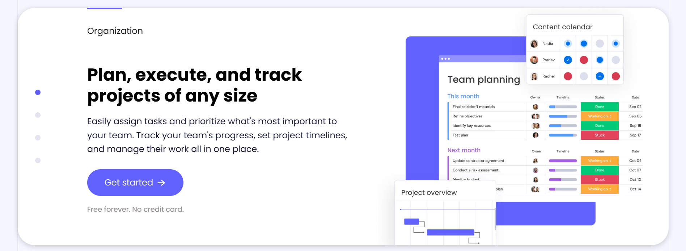
- 交互设计：通过卡片式的设计列举4个核心产品功能，使用分页指示器表示卡片总数量（4个点代表4张卡片）。用户向下滑动卡片时，小点的状态同步更新
- 内容排版：
    - 左右式结构：左侧为标题加具体描述，右侧为对应的产品UI图片
    - 标题上方的单词很重要（左上角为人类视觉的集中点），概述了卡片中产品功能的适用场景
    - 描述下方设置了统一的CTA，方便感兴趣的用户直接点击后注册
    - CTA下方以低饱和度灰色补充说明了产品的价格和付费要求，进一步打消用户可能的疑虑

#### 增信模块
整个页面共出现4次明显的增信模块，展现形式多样：
1. 客户logo banner（首屏下方）

2. 产品提升效率的统计数据，包括ROI、节省的小时数、减少的会议数、增加的净值（来自权威第三方FORRESTER）（产品功能介绍下方）
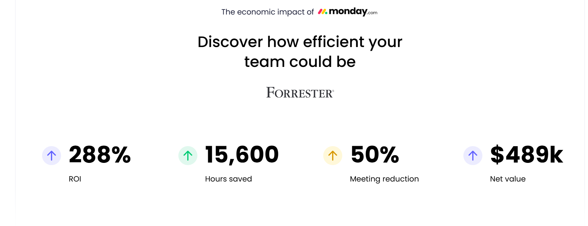

3. 客户证言（效率统计数据下方）
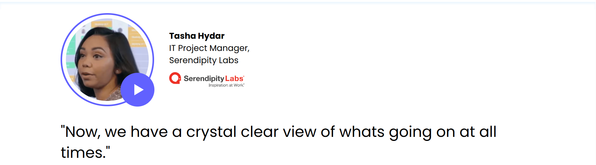

4. G2奖项，包括产品易用性、行业地位、用户体验等（客户证言下方）
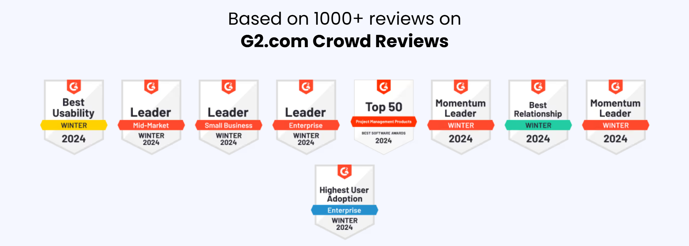

#### 底部导航栏
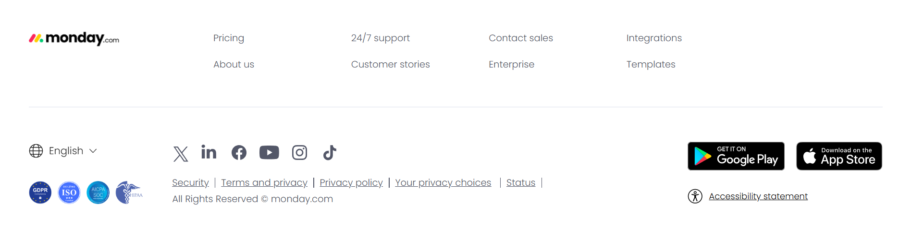
提供多个跳转到其它网站或页面的入口，主要作用是提升用户体验和增强品牌的可信度，包括：
- 网站其它重要页面，如定价页、客服支持页、公司介绍页、模板页等
- 官方社交媒体页面，如YouTube、LinkedIn、TikTok等
- 行业资质认证、服务条款、隐私政策
- 易用性功能：多语言选择按钮、应用商店下载入口

### [ClickUp](https://clickup.com/lp)
#### 首屏
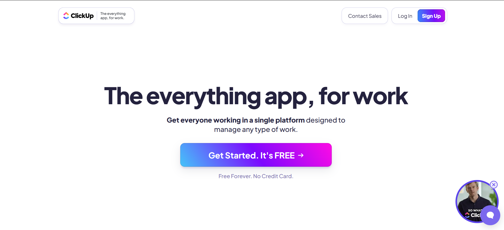
- 导航栏：仅保留4个重要按钮：品牌logo+slogan、联系销售、登录、注册。其中注册按钮使用明显的色彩突出展示
- 标题：强调使用场景（工作时）和适用范围（所有事情）
- 副标题：突出产品可同时满足所有人在一个共同的平台工作
- 设计元素：背景空白，最醒目的是屏幕中央的“开始使用”按钮，同时强调“免费”

#### 产品功能

- 交互设计：通过平铺的卡片形式（但每排的卡片数量不一定相同）列举核心产品功能
- 内容排版：每张卡片有固定的内容结构：标题、描述、对应的产品/概念图，基本没有CTA

#### 增信模块
1. 客户logo banner（首屏下方）
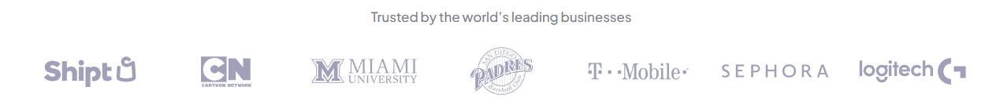

2. 产品使用人数和功能相关统计数据，包括：完成的任务数、创建的文档数、发送的消息数、创建的automation数，同时设置有CTA（该模块与产品功能介绍模块放在一起）
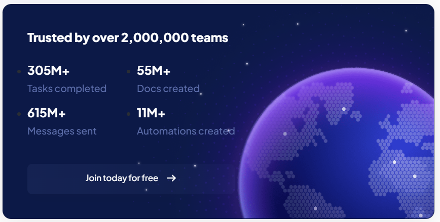

#### 底部导航栏
非常简洁，仅保留版权声明、隐私条款、使用条款等。

### [Atlassian](https://www.atlassian.com/software/jira?campaign=18442480203&adgroup=140479881486&targetid=kwd-855725830&matchtype=e&network=g&device=c&device_model=&creative=687972959756&keyword=jira&placement=&target=&ds_eid=700000001558501&ds_e1=GOOGLE&gad_source=1&gbraid=0AAAAAD_uzhDFBmyCDfEZwGlrdhTN56y_i&gclid=Cj0KCQjwqv2_BhC0ARIsAFb5Ac8l-8CF1SkxUNzUAO-hB0_Jkt0fSG2emVrYirWB6PFu16IscH4m9wMaAv0OEALw_wcB)
#### 首屏
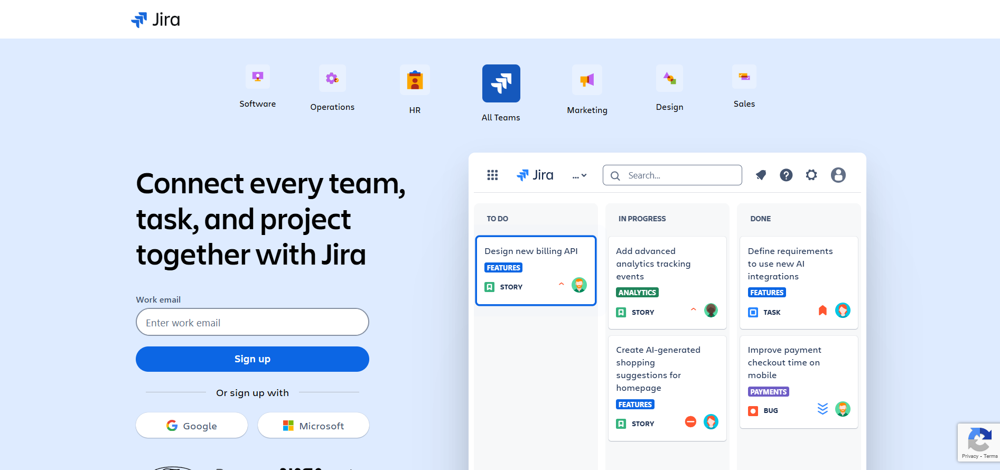
- 导航栏：仅保留品牌logo
- 标题：间接明了地说明产品的适用对象——团队、任务、项目。无副标题
- 设计元素：
  - 最上方列举6个常见团队类型
  - 整体呈左右结构，左侧为表单，用户可直接填写工作邮箱后完成注册，或选择Google、微软等第三方账号授权登录（但首屏

#### 产品功能
同时存在两种不同的内容交互设计：
1. 分Tab（标签页）的模块：
  - 每个核心功能有单独的tab，包括：boards、timeline、reports、automation
  - 每个tab下再进行详细的功能和使用场景介绍，如“Boards”下的scrum boards、kanban boards，同时右侧配有对应的产品截图
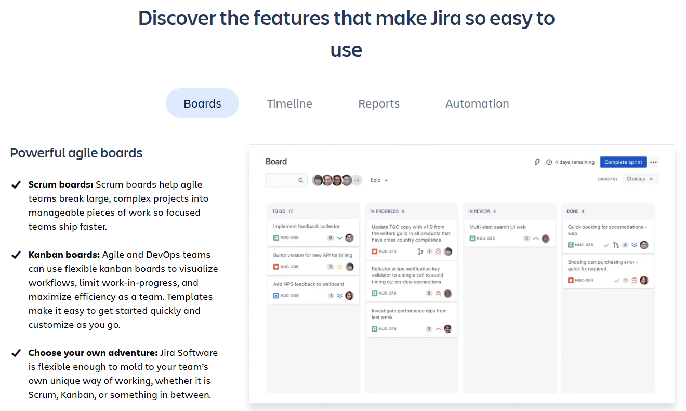

2. 左右平铺结构
  - 从上述tab中抽取某个单独的功能，简要介绍其在实际业务场景中的价值
  - 为避免视觉疲劳，文字和配图的位置交替顺序展示

#### 增信模块
1. 滚动的客户logo banner（注册表单下方）

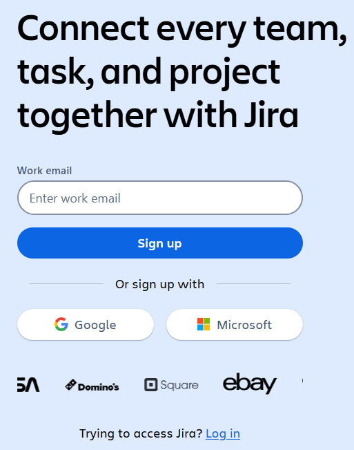

2. 静态的客户logo banner（靠近页尾）

#### 底部导航栏
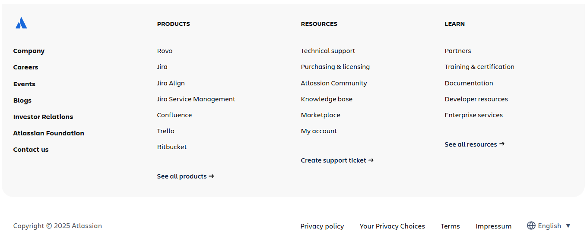
和官网的底部导航栏一致，可供用户跳转到网站的其它核心页面，包括：
- 各产品详情页
- 官方资源，如技术支持、定价页、社区、知识库等
- 开发者文档、企业服务、培训&证书等
- 其它核心页面，如公司介绍、招聘、近期活动、博客、基金会等

### [Zendesk](https://www.zendesk.com/lp/nb-support-join-the-champions)
#### 首屏
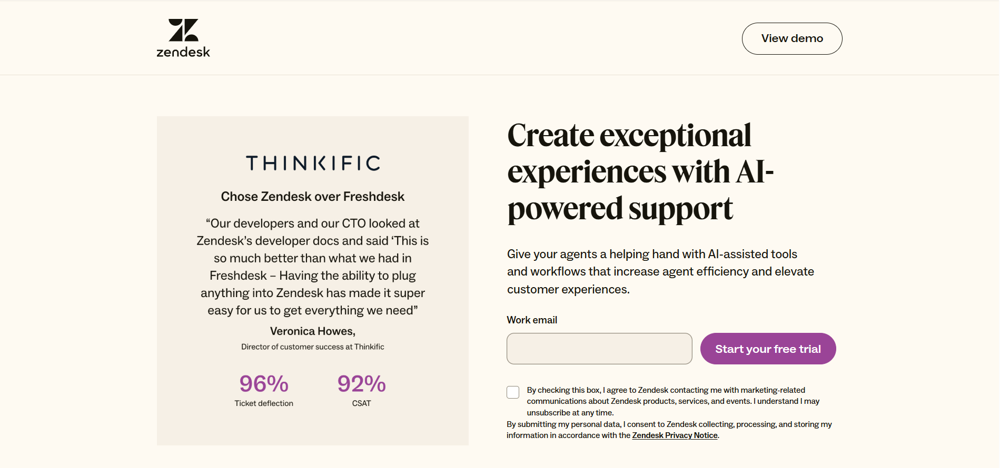
- 导航栏：未保留官网完整导航栏，只提供“联系销售”（跳转到表单页面）和“开始使用”（跳转到注册页面）按钮
- 标题：强调产品使“项目管理”变得容易
- 副标题：突出产品可同时管理简单和复杂的项目（使标题中的“容易”更具象化）
- 设计元素：背景空白，无图片，主要用于突出首屏中央“使用场景”相关的选项，吸引用户进行交互（按钮被勾选后，颜色会发生变化，表示已被选中）

#### 产品功能
- 通过表格的形式，对比Zendesk和其他竞品在关键功能上的差异
- 突出Zendesk在具体使用场景中的优势（如AI和机器学习），而竞品不支持
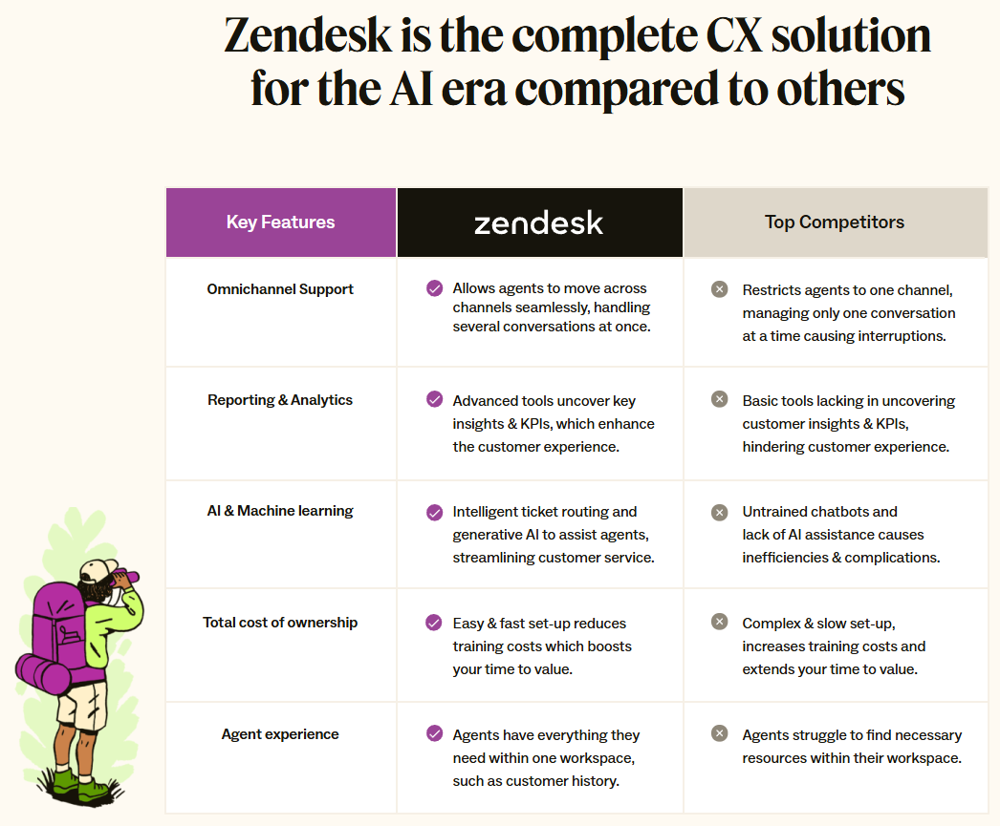

#### 增信模块
1. 客户logo banner + G2奖项（包括产品易用性、行业地位等）（位于首屏下方）

2. 产品提升效率的统计数据，包括support operations visibility、满意度、agent productivity（产品功能介绍下方）

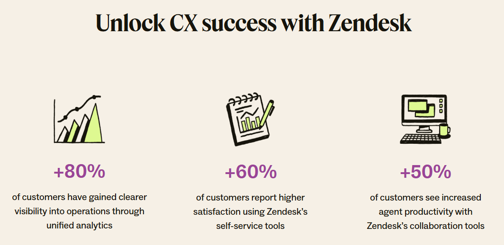

3. 行业奖项，如Capterra、TrustRadius等（效率统计数据下方）

#### 底部导航栏
仅保留版权声明、隐私条款、使用条款等。

### [Miro](https://miro.com/)
#### 首屏
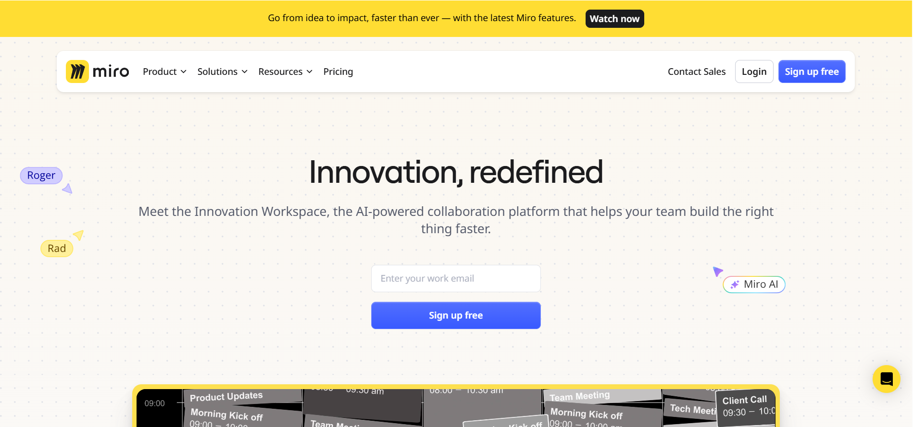
- 导航栏：未保留官网完整导航栏，只提供“联系销售”（跳转到表单页面）和“开始使用”（跳转到注册页面）按钮
- 标题：强调产品使“项目管理”变得容易
- 副标题：突出产品可同时管理简单和复杂的项目（使标题中的“容易”更具象化）
- 设计元素：背景空白，无图片，主要用于突出首屏中央“使用场景”相关的选项，吸引用户进行交互（按钮被勾选后，颜色会发生变化，表示已被选中）

#### 产品功能
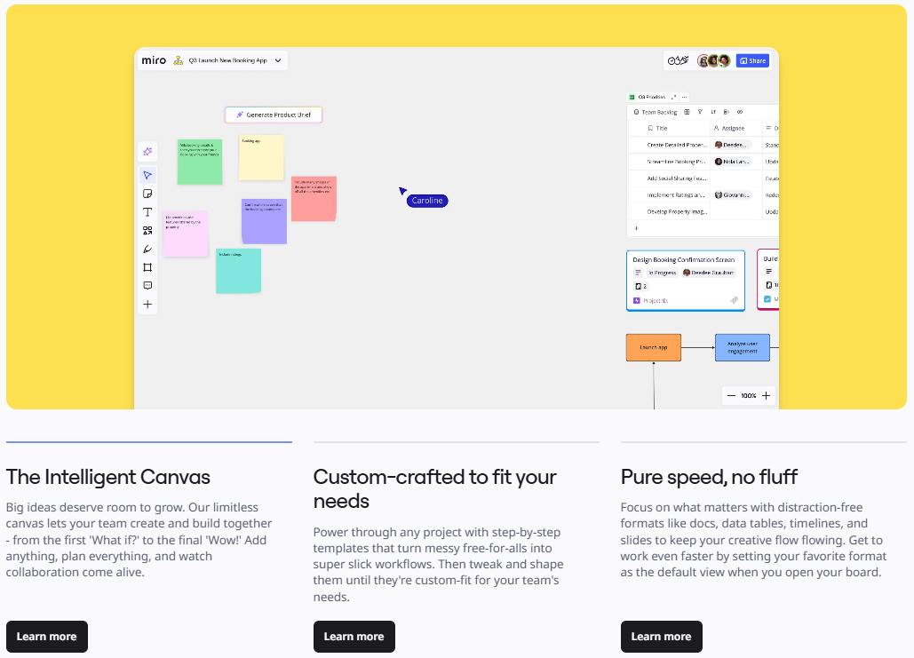
- 交互设计：整屏范围的动图搭配三个标签页，点击标签页展示对应的产品使用界面动图
- 内容排版：
  - 三个标签页并排
  - 每个标签页包含一个简短的标题和一段详细描述（约3-5行）

#### 增信模块
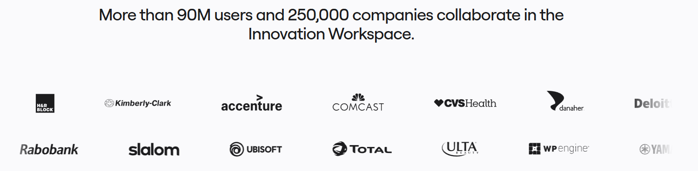
只有客户logo banner，位于首屏下方：
- 共两排，向两侧缓慢滑动
- 鼠标移动到上方会显示“Meet our customers”的字样，点击后跳转到客户案例页面

#### 底部导航栏
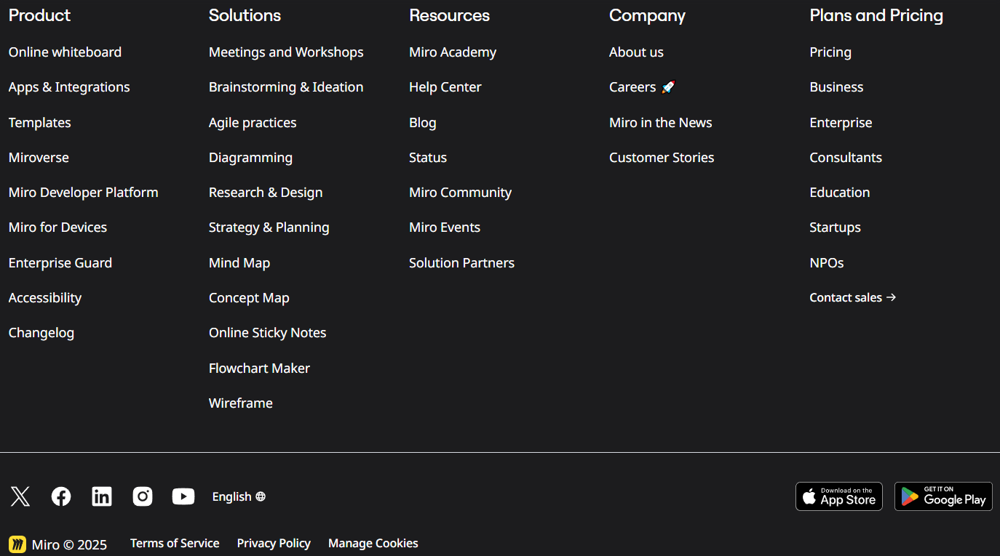
和Monday.com的底部结构逻辑类似，包含其它重要页面入口、官方社交媒体入口、语言切换按钮、app下载按钮等

## 元素细节
### CTA（Call to Action，行动号召）
是引导用户执行关键操作的交互元素，常见形式为按钮、链接。

#### 核心组成：
1. 文案：动词+结果（如“立即注册”、“免费下载”）
2. 视觉设计：颜色、形状、尺寸需与页面形成对比（如亮色按钮+白色/深色背景）
3. 位置：高频出现于关键决策点（如页面顶部、功能说明结尾等）

#### 常见类型：
1. 主CTA：核心转化目标（如“免费试用”、“立即购买”）。
2. 次CTA：辅助选项（如“观看演示”、“联系销售”）。
3. 文本CTA：超链接形式（如“点击查看案例”）。

### 导航栏的品牌logo
顶部和底部的品牌logo作用不同：
- 顶部导航栏的品牌logo：
  - 通常固定在页面左上角（遵循用户从左到右的阅读习惯）
  - 用户进入网站时最先注意到的视觉标识，是用户对品牌的第一印象
- 底部导航栏的品牌logo：
  - 通常位于页面最底部左下角，常靠近版权信息或联系方式
  - 便于用户浏览完页面后加深品牌记忆，实现品牌二次曝光

### 是否需要销售介入
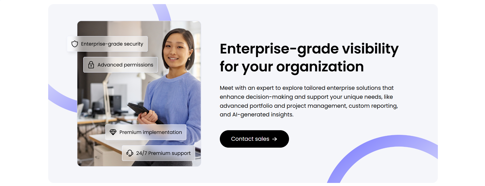
基于不同SaaS产品的特点和技术要求，个人用户可以在网站上直接注册，然后购买。但对于团队甚至企业级的客户，则需要专门的销售和技术顾问解答相关的问题。这时就需要专门的CTA或内容模块来引导这类客户完成注册或预约演示。

